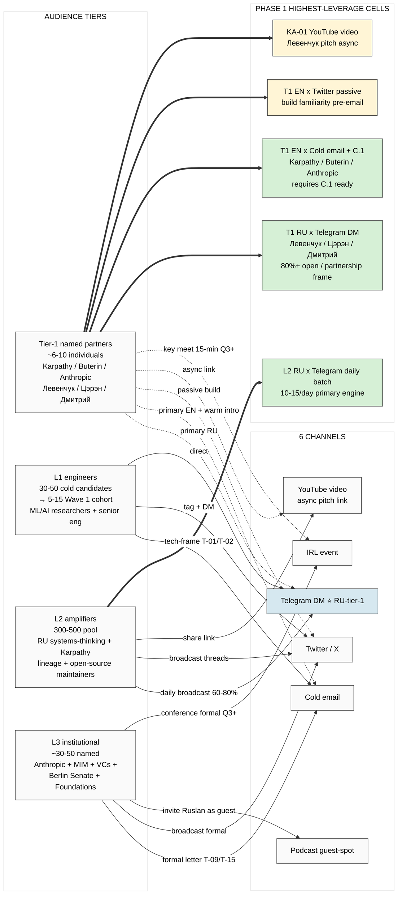

# Diagram 1 — Audience × Channel compatibility matrix

## Legend

- ⭐ = optimal primary channel
- Solid edge `→` = standard tactic
- Dashed edge `-.->` = preferred channel for tier
- Bold edge `==>` = highest-leverage Phase 1 cell

## Cross-link

Master doc §2 Audience × Channel matrix. Per-channel tactics: `02-channel-tactics-research.md`.
