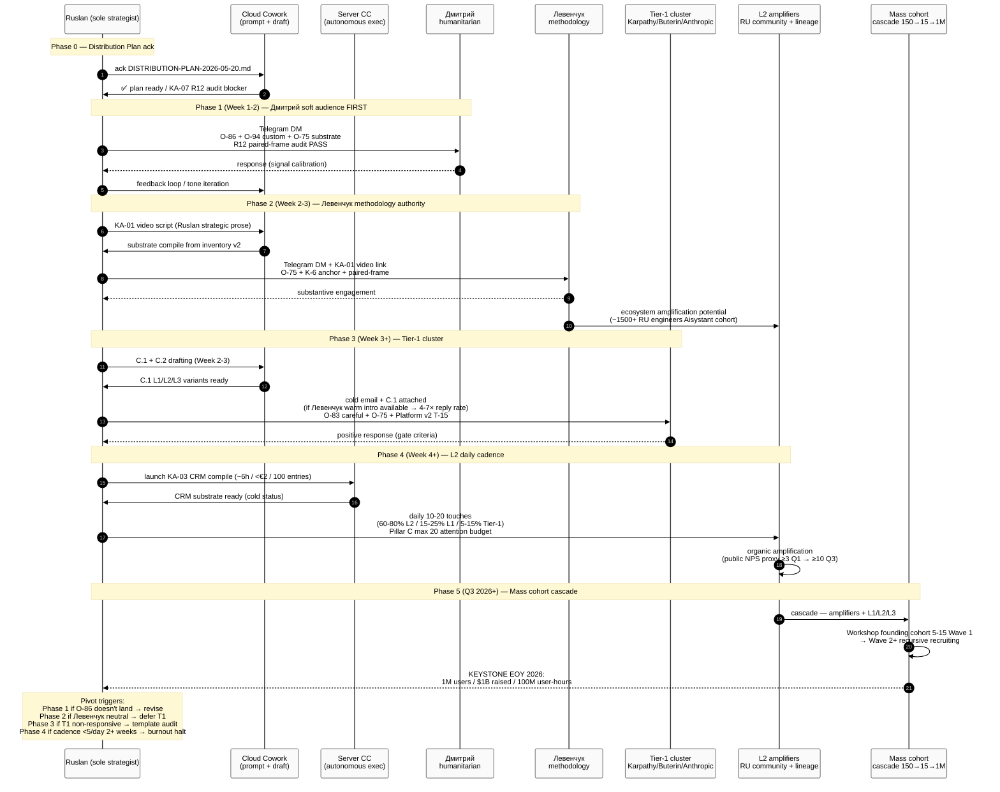

# Diagram 2 — Sequence cascade

```mermaid
%%{init: {'theme':'base', 'themeVariables': {'primaryTextColor':'#000000','textColor':'#000000','lineColor':'#333333','primaryBorderColor':'#333333','primaryColor':'#fafafa','noteTextColor':'#000000','noteBkgColor':'#fff8d5','actorTextColor':'#000000'}}}%%
sequenceDiagram
    autonumber
    participant R as Ruslan (sole strategist)
    participant CC as Cloud Cowork<br/>(prompt + draft)
    participant SCC as Server CC<br/>(autonomous exec)
    participant D as Дмитрий<br/>humanitarian
    participant L as Левенчук<br/>methodology
    participant T1 as Tier-1 cluster<br/>Karpathy/Buterin/Anthropic
    participant L2 as L2 amplifiers<br/>RU community + lineage
    participant M as Mass cohort<br/>cascade 150→15→1M

    Note over R: Phase 0 — Distribution Plan ack

    R->>CC: ack DISTRIBUTION-PLAN-2026-05-20.md
    CC->>R: ✅ plan ready / KA-07 R12 audit blocker

    Note over R,D: Phase 1 (Week 1-2) — Дмитрий soft audience FIRST

    R->>D: Telegram DM<br/>O-86 + O-94 custom + O-75 substrate<br/>R12 paired-frame audit PASS
    D-->>R: response (signal calibration)
    R->>CC: feedback loop / tone iteration

    Note over R,L: Phase 2 (Week 2-3) — Левенчук methodology authority

    R->>CC: KA-01 video script (Ruslan strategic prose)
    CC->>R: substrate compile from inventory v2
    R->>L: Telegram DM + KA-01 video link<br/>O-75 + K-6 anchor + paired-frame
    L-->>R: substantive engagement
    L->>L2: ecosystem amplification potential<br/>(~1500+ RU engineers Aisystant cohort)

    Note over R,T1: Phase 3 (Week 3+) — Tier-1 cluster

    R->>CC: C.1 + C.2 drafting (Week 2-3)
    CC->>R: C.1 L1/L2/L3 variants ready
    R->>T1: cold email + C.1 attached<br/>(if Левенчук warm intro available → 4-7× reply rate)<br/>O-83 careful + O-75 + Platform v2 T-15
    T1-->>R: positive response (gate criteria)

    Note over R,L2: Phase 4 (Week 4+) — L2 daily cadence

    R->>SCC: launch KA-03 CRM compile (~6h / <€2 / 100 entries)
    SCC->>R: CRM substrate ready (cold status)
    R->>L2: daily 10-20 touches<br/>(60-80% L2 / 15-25% L1 / 5-15% Tier-1)<br/>Pillar C max 20 attention budget
    L2->>L2: organic amplification<br/>(public NPS proxy ≥3 Q1 → ≥10 Q3)

    Note over R,M: Phase 5 (Q3 2026+) — Mass cohort cascade

    L2->>M: cascade — amplifiers + L1/L2/L3
    M->>M: Workshop founding cohort 5-15 Wave 1<br/>→ Wave 2+ recursive recruiting
    M-->>R: KEYSTONE EOY 2026:<br/>1M users / $1B raised / 100M user-hours

    Note over R: Pivot triggers:<br/>Phase 1 if O-86 doesn't land → revise<br/>Phase 2 if Левенчук neutral → defer T1<br/>Phase 3 if T1 non-responsive → template audit<br/>Phase 4 if cadence <5/day 2+ weeks → burnout halt
```

## Cross-link

Master doc §3 Sequence canonical. Literature distill: `01-outreach-sequencing-research.md`. Phase-gate criteria §3.3 + pivot triggers §3.4.
