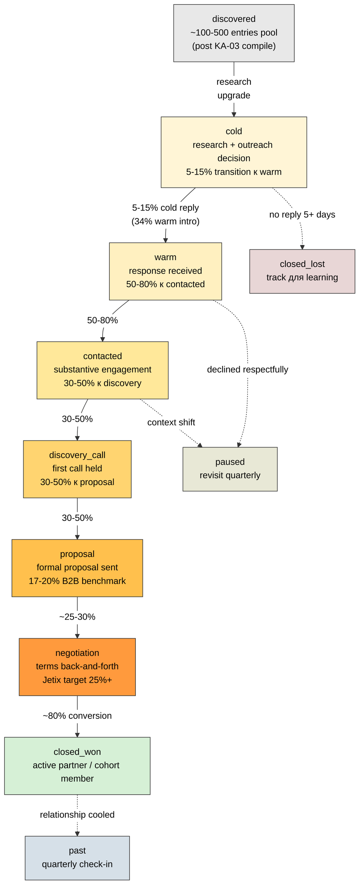

# Diagram 3 — Outreach funnel



## Per-stage targets

| Stage | Target conversion | Benchmark source |
|---|---|---|
| discovered → cold | 100% (research substrate filing) | operational |
| cold → warm | 5-15% (cold) / 30-50% (warm intro) | cold email 2026 literature |
| warm → contacted | 50-80% | CRM SaaS playbooks |
| contacted → discovery_call | 30-50% | B2B sales benchmarks |
| discovery → proposal | 30-50% | B2B SaaS benchmarks |
| proposal → closed_won | 17-20% B2B avg / 25%+ Jetix target | B2B benchmark 2026 |

## Pipeline velocity formula

```
Velocity = Opportunities × Avg Deal Value × Win Rate / Cycle Length

Target Jetix Q3 2026:
  Opps: 30-50 active
  Avg deal value: depends V1-V5 monetization variant
  Win rate target: 25%+
  Cycle target: ≤75 days (B2B SaaS optimal)
```

## Cross-link

Master doc §5 CRM integration + §7 Metrics framework. Literature: `03-metrics-frameworks-research.md`.
