# Diagram 4 — Weekly cadence calendar

```mermaid
%%{init: {'theme':'base', 'themeVariables': {'primaryTextColor':'#000000','textColor':'#000000','lineColor':'#333333','primaryBorderColor':'#333333','primaryColor':'#fafafa','noteTextColor':'#000000','noteBkgColor':'#fff8d5','sectionBkgColor':'#f5f5f5','altSectionBkgColor':'#fafafa','gridColor':'#cccccc','todayLineColor':'#ff6b6b','taskTextColor':'#000000','taskTextLightColor':'#000000','taskTextDarkColor':'#000000','taskTextOutsideColor':'#000000','taskTextClickableColor':'#000000','activeTaskBkgColor':'#d6f0d6','activeTaskBorderColor':'#333333','doneTaskBkgColor':'#e8e8e8','doneTaskBorderColor':'#333333','critBkgColor':'#fff5d6','critBorderColor':'#333333'}}}%%
gantt
    title Weekly cadence — sample week steady-state Week 4+ (15-20 touches/day)
    dateFormat HH:mm
    axisFormat %H:%M

    section Monday (17 touches)
    Inbox triage + CRM sync    :done, mon1, 09:00, 30m
    Tier-1 #1 (Левенчук DM)    :crit, mon2, 09:30, 45m
    Tier-1 #2 (Karpathy tweet) :crit, mon3, after mon2, 45m
    Break + walk                :mon4, after mon3, 30m
    L1 batch × 3 (cold email)  :active, mon5, after mon4, 45m
    L1 follow-up × 2            :active, mon6, after mon5, 45m
    Lunch + Workshop work       :mon7, 13:00, 90m
    L2 batch part 1 × 5         :active, mon8, after mon7, 60m
    L2 batch part 2 × 7         :active, mon9, after mon8, 75m
    CRM logging /crm-touch      :mon10, after mon9, 30m
    Day reflection              :mon11, after mon10, 15m

    section Tuesday (16 touches)
    Inbox + L1 × 3              :tue1, 09:00, 60m
    L2 batch × 12               :active, tue2, 10:30, 150m
    Lunch + substrate work      :tue3, 13:30, 90m
    L1 follow-up × 1            :tue4, 15:30, 15m
    CRM + reflection            :tue5, 16:30, 45m

    section Wednesday (16 touches)
    Tier-1 #1 + #2              :crit, wed1, 09:00, 90m
    L1 × 2 + L2 × 12            :active, wed2, 10:30, 180m
    Lunch + Workshop            :wed3, 14:00, 90m
    CRM + reflection            :wed4, 15:30, 30m

    section Thursday (14 touches)
    L2 batch × 10               :active, thu1, 09:00, 120m
    L1 batch × 4                :active, thu2, 11:00, 60m
    Lunch + substrate work      :thu3, 13:00, 120m
    CRM + reflection            :thu4, 15:00, 30m

    section Friday (7 touches + reflection ritual)
    Light L2 × 7                :active, fri1, 09:00, 120m
    /crm-weekly skill review    :crit, fri2, 11:00, 60m
    Lunch                       :fri3, 12:00, 120m
    Weekly metrics review       :crit, fri4, 14:00, 120m
    Pivot decisions             :crit, fri5, 16:00, 60m
    Next-week plan              :fri6, 17:00, 60m

    section Saturday (0-3)
    Reading only                :sat1, 10:00, 180m
    Family time                 :sat2, 13:00, 360m

    section Sunday (0-3)
    Тишина / family             :sun1, 10:00, 360m
    Sunday reflection           :sun2, 16:00, 60m
```

## Weekly summary

| Day | Tier-1 | L1 | L2 | Total |
|---|---|---|---|---|
| Monday | 2 | 5 | 10 | **17** |
| Tuesday | 0 | 4 | 12 | **16** |
| Wednesday | 2 | 2 | 12 | **16** |
| Thursday | 0 | 4 | 10 | **14** |
| Friday | 0 | 0 | 7 | **7** |
| Saturday | 0 | 0 | 0-3 | **0-3** |
| Sunday | 0 | 0 | 0-3 | **0-3** |
| **Week total** | **4** | **15** | **51-57** | **70-76** |

Per-tier ratio: Tier-1 ~5% / L1 ~20% / L2 ~75% ✅ (within 60-80% / 15-25% / 5-15% target band).

## Pillar C max 20 attention budget check

- Active outreach contacts (contacted / warm / discovery_call) ≤ 10 (50% of budget)
- Remainder = research / drafting / Workshop / Foundation / partner conversations
- Friday reflection ritual = compliance review

## Cross-link

Master doc §6 Daily cadence schedule. Sample week walkthrough: `05-cadence-schedule-sample-week.md`. Anti-burnout discipline §6.6.
