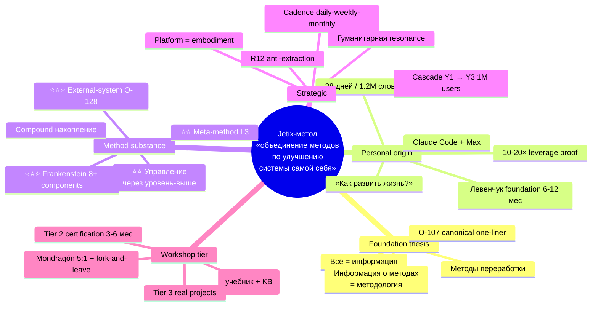
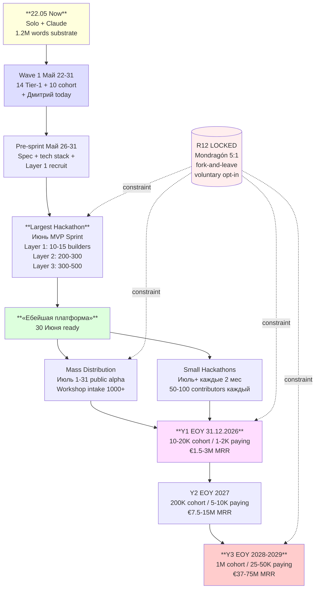
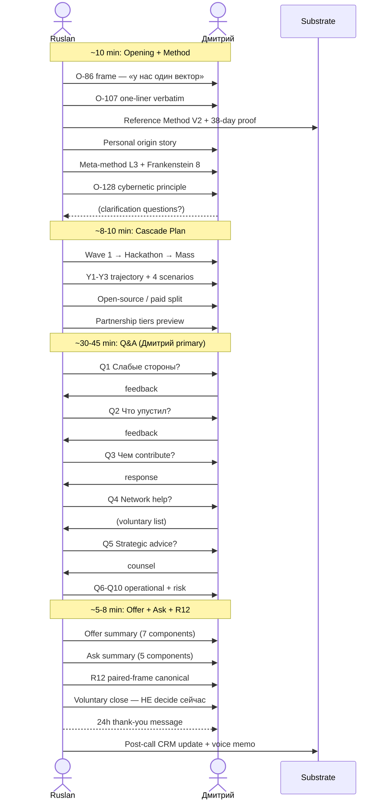
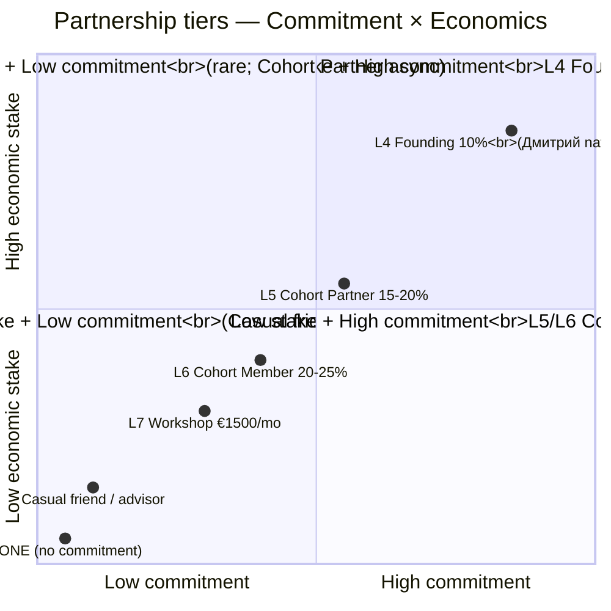
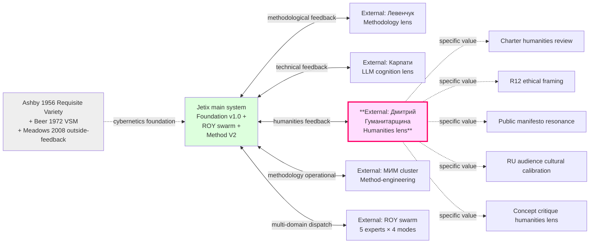

# Phase 6 — Mermaid pass (5 diagrams)

> 5 diagrams selected per `prompts/dmitriy-call-prep-2026-05-22.md` §7 — within 4-6 range mandate. Each ≥6 nodes; annotated; styled. Diagram types diversified (mindmap / graph TD / sequenceDiagram / journey / quadrantChart).

---

## D1 — Method overview (mindmap)

> **Goal:** один-image overview всего метода — для quick reference во время звонка. Если Дмитрий спросит «расскажи метод одним image» — этот.

**Use case:** одним image охватывает 4 blocks (Phase 2). Можно показать в качестве visual anchor.

---

## D2 — Cascade flow Y1-Y3 (graph TD)

> **Goal:** показать operational cascade Май 22 → Y3 (1M users); один diagram = весь Phase 3 cascade plan.

**Use case:** visual для Phase 3 cascade plan explanation (5-8 min phase). Show Дмитрию exact path Now → 1M.

---

## D3 — Call flow sequence (sequenceDiagram)

> **Goal:** план самого звонка — 60 min total structure. Ruslan reference во время разговора.

**Use case:** structural reference для timing discipline. ~60 min target; flexible.

---

## D4 — Partnership tiers + R12 discipline (quadrantChart)

> **Goal:** visual position Дмитрия в partnership space — он chooses voluntary; visible options.

**Use case:** показать Дмитрию space возможностей. Он chooses freely; voluntary. R12 discipline уже built-in (Mondragón 5:1 / fork-and-leave / 30-day opt-out applies к ВСЕМ tiers).

---

## D5 — External-system cybernetic principle (O-128) — graph LR

> **Goal:** visualise O-128 — почему Дмитрий specifically valuable как humanities-bridge external system.

**Use case:** visual для §C.5 / O-128 explanation. Дмитрий sees specifically где он valuable как external system; не «one of 14», а «specific humanities-bridge slot».

---

## §G Diagrams cross-reference

| # | Diagram | Type | Use case в call | Phase |
|---|---|---|---|---|
| D1 | Method overview | mindmap | Quick visual anchor методу | Phase 2 |
| D2 | Cascade flow Y1-Y3 | graph TD | Operational path explanation | Phase 3 |
| D3 | Call flow sequence | sequenceDiagram | Timing reference Ruslan | — |
| D4 | Partnership tiers quadrant | quadrantChart | Voluntary positioning options | Phase 5 |
| D5 | External-system O-128 | graph LR | Specifically где Дмитрий valuable | Phase 2 §C.5 |

**Total: 5 diagrams in range 4-6 mandated.**

**Diagram types diversity: 5 distinct types** (mindmap / graph TD / sequenceDiagram / quadrantChart / graph LR).

**Node count per diagram:** все ≥6 nodes (D1: 25+; D2: 11; D3: 12+; D4: 6; D5: 13).

---

## §H Mermaid styling notes

- **Color coding consistent:**
  - Yellow (`#ffd`) — current state / Now
  - Green (`#dfd`) — Foundation / canonical / ready
  - Blue (`#ddf`) — Wave / Layer (cascade stages)
  - Pink (`#fdf`) — Дмитрий-specific / personal value
  - Light Red (`#fcc`) — high-value / R12 LOCKED elements

- **Highlighted nodes:** ⭐⭐⭐ marker для Дмитрий-priority items
- **Constraints visualised** через dotted lines (R12 LOCKED → cascade stages в D2)

---

## §I Constitutional safety

- ✅ R1 surface — diagrams visualise substrate; не assert strategic claims
- ✅ R6 provenance — diagrams reference Phase 2-5 substrate ([src: phase outputs])
- ✅ Range compliance — 5 diagrams в 4-6 range (not 25+)
- ✅ Node count compliance — все ≥6 nodes per diagram
- ✅ Type diversity — 5 distinct types
- ✅ R12 visualised — D4 explicit voluntary positioning; D5 cooperative external-system frame
- ⚠️ Mermaid syntax — стандартные types; если что-то рендерится badly → simpler fallback applied

---

*Phase 6 closure 2026-05-22. 5 diagrams ready (D1 method / D2 cascade / D3 call flow / D4 partnership / D5 O-128). All within constraints. Proceed to Phase 7 (main deliverable + symlinks + Summary + push).*
