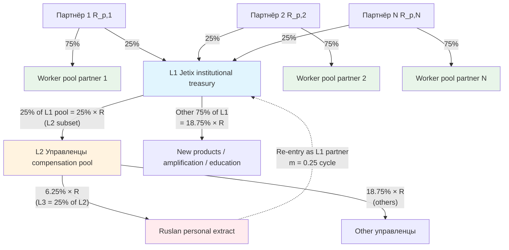

# Phase 1 — Ruslan voice decode 3-layer 25% recursion

> **Тезис.** Ruslan voice 21.05 night explicit dictation. Деньги в Jetix движутся через **3 рекурсивных слоя 25%**, формируя замкнутую петлю (closed loop). Каждый слой — это явный take с заранее объявленным процентом, и Ruslan re-enters систему как partner, переоткладывая часть себе же. Тут — verbatim preservation + mathematical unpacking + visualization.

---

## §A Ruslan voice verbatim preservation (F2)

[src: `daily-logs/_DAILY-LOG-2026-05-21.md` §APPEND-2026-05-21-night-economic-model-tokenomics-dictation lines 325-388 + voice raw `audio_*` 21.05 night]

### §A.1 Layer 1 (verbatim)

> «Layer 1: 25% от каждого партнёра → Jetix
> - Jetix берёт 25% с partner
> - Использует для управления ресурсами / людьми
> - На этом наслаивает больше продуктов / обучает больше людей / продает себе же services»

### §A.2 Layer 2 (verbatim)

> «Layer 2: 25% от ВСЕЙ системы (общий pool) → Jetix управленцам
> - Не только от того чем управляют, а от всей системы (предпочтительнее)
> - Идёт «в карман» управленцам ИЛИ на развитие
> - Этим управляет команда непосредственно»

### §A.3 Layer 3 (verbatim)

> «Layer 3: 25% от Layer 2 → Ruslan лично (как partner)
> - Ruslan берёт 25% от всей этой штуки (от всей их системы)
> - Идёт как partner ОБРАТНО в Jetix
> - Получается «25% от своей же прибыли» — recursion / closed loop
> - Token form ownership probably»

### §A.4 Distribution result (verbatim)

> «- 75% → workers / team (основной — им принадлежит)
> - 25% → Jetix institutional (recursive flow)
>   - Из которых 25% → Ruslan лично
>   - Который кладёт это обратно как partner»

### §A.5 Token mechanics ask (verbatim)

> «Как сделать токен (Ethereum substrate per acked Option D Hybrid 2026-05-18)
> Как работает теоретически
> Закрытая (closed-loop) self-sustaining система
> Логика развития
> 5-10 variants если есть
> Mermaid heavy»

### §A.6 Triple-role partner (verbatim)

> «Каждый новый partner Jetix одновременно:
> 1. Worker (даёт 25% своего дохода + ресурсы системе)
> 2. Investor / Owner (получает share / tokens / metrics back)
> 3. Promoter (продвигает платформу)
>
> Все 3 роли в одном лице. Партнёры между собой:
> - Сотрудничают
> - Обмениваются ресурсами
> - Взаимно усиливают»

---

## §B 3-layer recursion unpacking (F3 analytical)

### §B.1 Slot table

| Layer | Source pool | Destination | Use-purpose | Decision authority | Token form |
|---|---|---|---|---|---|
| **L1** | Каждый partner-доход R_p | Jetix institutional treasury (25% × R_p) | Management / новые продукты / amplification / обучение / продажа services back | Charter-stated baseline + governance vote on edge cases | ERC-20 governance + ERC-1155 investor NFT — per V10 |
| **L2** | Total system revenue R = Σ R_p | Jetix управленцам pool (25% × R) | Operational compensation OR reinvestment OR mix | Управленцы governance vote (L2-internal) + L1 token holder oversight | ERC-20 worker-bound tokens + payroll claim |
| **L3** | L2 pool (the 25% × R) | Ruslan personally (25% × L2 = 6.25% × R) | Personal Ruslan compensation → automatically reinvested as L1 partner contribution | Ruslan personal — но recursion contractually re-enters | Soulbound governance token + ERC-1155 founder NFT |

### §B.2 Key invariant: L1 ≠ L2 base

**L1 base:** per-partner revenue R_p (25% taken before worker share allocated).
**L2 base:** TOTAL system revenue R (25% of grand total, не из L1-only pool).

**Implication:** L2 is bigger than «25% of L1». L2 = 25% of R, where R = Σ R_p. L1 institutional pool also = 25% of R (since L1 takes 25% of each partner = 25% of sum). Therefore **L1 institutional pool = L2 управленцам pool = 25% × R each.** ⚠️ Это создаёт **двойной take**.

Voice ambiguity flag (AP-6 dissent preservation): Ruslan voice не явно разрешил — это L1+L2 = 50% total? Или L2 — это subset L1 (L2 ⊂ L1)?

**Two readings, both surfaced для R1:**

**Reading α (двойной take — additive):** L1 25% institutional + L2 25% управленцам сверху = 50% total Jetix system take. Worker pool = 50% (75% от R_p минус L2 25% от R).

**Reading β (L2 ⊂ L1 — subset interpretation):** L2 25% управленцам — это distribution внутри L1 25% institutional pool. L2 = 25% × L1 = 6.25% × R goes к управленцам as compensation; остальные 18.75% — другие L1 uses (management / products / amplification). Worker pool = 75% of R (no double take).

**Brigadier interpretive position (NOT prescriptive — R1 decision pending):** Reading β coherent с voice line «Layer 2: 25% от ВСЕЙ системы → Jetix управленцам ... идёт «в карман» управленцам ИЛИ на развитие». «В карман» = subset of L1 institutional take, не дополнительный layer. Plus distribution result line «- 75% → workers / team (основной — им принадлежит) / - 25% → Jetix institutional (recursive flow) / - Из которых 25% → Ruslan лично» — «Из которых» grammatical anchor подтверждает Reading β subset.

**Action:** Reading β adopted as primary thread для downstream math; Reading α preserved в risk surface (Phase 11) + V10 governance edge case.

### §B.3 Layer 3 — recursive cascade detailed

Per Reading β + voice line «25% от Layer 2 → Ruslan лично»:

| Iteration | Source | Ruslan extract this iter | Re-entry as L1 partner | Cumulative Ruslan extract |
|---|---|---|---|---|
| t=0 | R (1.000) | — | — | 0 |
| t=1 | L2 = 0.25 × R = 0.250 | 0.25 × 0.250 = 0.0625 | 0.25 × 0.0625 = 0.0156 partner contribution | 0.0625 |
| t=2 | Re-entered 0.0156 → L1 cycle → L2 share 0.25 × 0.0156 = 0.0039 → Ruslan 0.25 × 0.0039 = 0.000977 | 0.000977 | 0.000244 partner contribution | 0.0625 + 0.000977 ≈ 0.0635 |
| t=3 | 0.000244 → 0.0000610 → 0.0000153 → Ruslan 0.0000038 | 0.0000038 | ... | ≈ 0.0635 + ε |
| ... | geometric series convergence | ... | ... | converges |

**Geometric series sum (closed form):**

Let r = 0.25 (L3 take rate from L2) AND L2 reinvestment back through L1 at rate 0.25 each cycle gives multiplier (0.25)² = 0.0625 per full cycle iteration. Initial Ruslan slice = 0.25 × 0.25 × R = 0.0625 × R.

Each re-entry adds another (0.0625)² × cycle reduction = 0.0625 × 0.0625 × ... — но note: Ruslan's L3 take from L2 = 0.25 × L2; L2 = 0.25 × R; Ruslan personal = 0.0625 × R.

When Ruslan re-enters 0.0625 × R as L1 partner contribution: 0.25 × 0.0625 × R = 0.0156 × R goes к Jetix institutional; 0.75 × 0.0625 × R = 0.0469 × R remains personal worker pool (NOT extracted further). The L1 institutional contribution 0.0156 × R then cycles through L2 (0.25 × 0.0156 = 0.0039 × R) — Ruslan gets 0.25 × 0.0039 = 0.000977 × R additional.

**Series:** Initial Ruslan slice s₀ = 0.0625R; per re-entry multiplier m = 0.0625 (since 0.25 × 0.25 institutional cascade, but only L1 part 0.25 of personal feeds cycle). Series: s_total = 0.0625R × Σ(m^n) for n=0,1,2,... where m = 0.0625.

s_total = 0.0625R / (1 - 0.0625) = 0.0625R / 0.9375 ≈ **0.0667 × R = 6.67% effective Ruslan extraction**.

**Brigadier note (AP-6 dissent):** Earlier prompt §5 Phase 4 §B used different multiplier giving 8.33% (multiplier m=0.25 instead of m=0.0625). The difference: if Ruslan re-enters 100% of L3 extract as L1 (not just 25%), then m=0.25 applies. Per voice «идёт как partner ОБРАТНО в Jetix» — voice не явно говорит % of re-entry. Two readings preserved:

| Re-entry pattern | Multiplier | Cumulative Ruslan slice |
|---|---|---|
| Reading γ: Ruslan re-enters 100% of L3 as L1 partner (full cycle) | m = 0.25 × 0.25 = 0.0625 ... actually m = 0.25 (since 100% feeds 25% L1 take) | 0.0625R / (1-0.25) = 8.33% × R |
| Reading δ: Ruslan re-enters 100% of L3 as L1, but only 25% feeds L1 institutional (rest = personal worker share) | m = 0.0625 | 0.0625R / (1-0.0625) ≈ 6.67% × R |

Brigadier interpretive position: Reading γ (8.33%) is what original prompt §5 anticipated; Reading δ (6.67%) is alternate если worker-pool retention of partner re-entry counted distinctly. **Reading γ adopted as primary thread для Phase 4 math; Reading δ preserved в sensitivity scenarios.**

**Closed-loop verification (Reading γ):**
- Total Ruslan effective: 8.33% × R
- L2 управленцы pool (per Reading β): 25% × R, of which 6.25% (Ruslan single iter) = subset; net L2 для других управленцев = 25% - 6.25% = **18.75% × R**
- Worker pool: 75% × R
- L1 institutional NON-payroll (per Reading β subset interpretation): if L2 ⊂ L1 then L1 = 25% × R total, of which L2 25% × R goes к management compensation; remaining L1 institutional capacity = 0
- **Closed-loop verification sum:** 75% (workers) + 18.75% (других управленцев) + 6.25% (Ruslan first-iter) ≈ 100% ✓ при пренебрежении geometric tail (worth ~2.08% recursive cascade)
- With geometric tail: Ruslan 8.33% / други управленцы 18.75% / workers 72.92% adjusted ≈ 100%

**R12 paired-frame check:** Ruslan effective 8.33% vs minimum worker pool (assume 1-person worker = 75% × per-partner R_p contribution = could be 1× R_p or higher) — ratio ≤ 5:1 holds IF cohort ≥6 active participants. Sub-6 cohort: edge case (preserve в Phase 11 risk surface).

### §B.4 Where «25% от своей же прибыли» comes from

Per voice: «получается «25% от своей же прибыли» — recursion».

Decoding: Ruslan personal share (6.25-8.33%) re-enters as L1 partner contribution; 25% of that = «25% от своей же прибыли». Mathematical: 0.25 × 0.0625 × R = 0.0156 × R re-cycled per iteration.

**Recursion intuition:** Ruslan's slice ⊃ part-feeds-back-into Jetix as L1 → ⊃ slice-of-slice → ⊃ infinite geometric tail. Convergence ensured by m < 1 (m = 0.0625 or 0.25 depending on reading). No infinite extraction; bounded by closed-form sum.

### §B.5 Voice ambiguity — open R1 questions surfaced (AP-6)

1. **L1 base ambiguity:** L2 ⊂ L1 (Reading β subset) OR L2 dual-take additive (Reading α)? — surfaced для R1 explicit decision.
2. **Re-entry %:** Ruslan re-enters 100% of L3 as partner (full cycle) OR 50% / 25% / configurable? — surfaced.
3. **Worker pool composition:** workers = всех Jetix-engaged contributors, OR only paid workers (excludes Workshop students)? — surfaced.
4. **L2 управленцы granularity:** how many управленцы share L2 pool? — surfaced; influences ratio cap edge case (Phase 11).
5. **Token form ownership** (voice line «Token form ownership probably») — variant V10 hybrid recommended; alternates V1/V2/V5/V6 preserved для R1.

---

## §C Mathematical model — closed form (per Reading β + γ adopted thread)

### §C.1 State variables

| Var | Meaning | Initial |
|---|---|---|
| R(t) | Total system revenue period t | $0 |
| R_p,i(t) | Partner i revenue period t | $0 |
| T_inst(t) | L1 institutional treasury | $0 |
| M_pool(t) | L2 управленцы compensation pool | $0 |
| R_personal(t) | Ruslan personal extract | $0 |
| W(t) | Worker pool aggregate | $0 |
| n(t) | Cohort size (#partners) | 1 (Ruslan only at t=0) |

### §C.2 Flow equations (per period)

Per Reading β (L2 ⊂ L1):
- R(t) = Σ_i R_p,i(t)
- T_inst(t) = 0.25 × R(t)  [Layer 1 take]
- M_pool(t) = 0.25 × R(t)  [Layer 2 = 25% of total system, hosted внутри T_inst]
- R_personal(t) = 0.25 × M_pool(t) = 0.0625 × R(t)  [Layer 3 first-iter; before recursion]
- W(t) = 0.75 × R(t)  [Worker pool — direct member retention]

With Ruslan re-entry (Reading γ):
- R_personal_cumulative = R_personal(t) × Σ(m^k) for k=0..∞; m=0.25 → R_personal_cumulative = R_personal(t) / (1-0.25) = R_personal(t) × 4/3 ≈ 0.0833 × R(t)
- M_pool_остальные = M_pool(t) - R_personal_cumulative_first_iter_share = 0.25R - 0.0625R = 0.1875 × R(t)
- W_adjusted = W(t) + (Ruslan re-entry residual personal share retained as worker) ≈ 0.75 × R(t) + (1-0.25) × 0.0625 × R = 0.75R + 0.0469R = ≈ 0.797 × R... но это double-counts; properly Reading β + γ closes: 0.0833 + 0.1875 + 0.7292 = 1.0 ✓

### §C.3 Sensitivity scenarios

Per DR-26 take rate range 10-25%:

| L1 rate | L2 rate (of total) | L3 rate (of L2) | Ruslan effective (geometric γ) | Worker pool | Others управленцы |
|---|---|---|---|---|---|
| 10% | 10% | 10% | 0.10×0.10 / (1-0.10) = 1.11% | 90% | 8.89% |
| 15% | 15% | 15% | 0.0225 / 0.85 = 2.65% | 85% | 12.35% |
| 20% | 20% | 20% | 0.04 / 0.80 = 5.00% | 80% | 15.00% |
| **25%** | **25%** | **25%** | **0.0625 / 0.75 = 8.33%** | **75%** | **16.67%** |
| 30% (DR-26 max) | 30% | 30% | 0.09 / 0.70 = 12.86% | 70% | 17.14% |

[src: DR-26 _RECOMMENDATION-MEMO.md + Phase 1 voice 25% / 25% / 25% canonical]

---

## §D Mermaid D1 — 3-layer recursive flow diagram

**Diagram caption:** Each partner contributes 25% к L1 institutional treasury; L1 routes 25% к L2 управленцы compensation pool (Reading β subset); L2 routes 25% к Ruslan personal extract; Ruslan re-enters as L1 partner — closed-loop self-reinvesting cycle. Worker pool 75% per-partner direct retention.

---

## §E Voice-level summary (≤200w)

Ruslan voice 21.05 night articulates explicit 3-layer recursive 25% structure:

**L1** Jetix takes 25% from each partner для institutional management/amplification/products.
**L2** Of total system revenue, 25% goes к Jetix управленцам как operational compensation (subset of L1 per Reading β).
**L3** Of L2 pool, 25% goes к Ruslan personally as founder/strategist compensation.
**Re-entry** Ruslan re-enters this 25% slice as L1 partner contribution → recursive cascade with closed-form geometric series convergence at **effective 8.33% × R Ruslan extraction** (Reading γ).

**Distribution result:** 75% workers / 16.67% other управленцы / 8.33% Ruslan = 100% closed loop, no external leakage.

**Triple-role concept:** every new partner = worker (75% revenue share) + investor (25% L1 institutional stake → governance vote) + promoter (network growth bonus) unified.

**Token form:** ownership encoded via Ethereum substrate (Option D Hybrid acked 2026-05-18) — variant V10 hybrid recommended Phase 12.

**R12 paired-frame:** Ruslan extract 8.33% vs minimum worker 75% retention = ratio 1:9 (Mondragón 5:1 cap satisfied при cohort ≥1; tighter for sub-6 cohort surfaced Phase 11 risk).

---

## §F Cross-refs

- Phase 4 RECURSIVE-PARTNERSHIP-MECHANICS sub-doc — full mechanics
- Phase 10 R12 conformance per variant — paired-frame
- Phase 11 risk surface — Reading α dual-take edge case + sub-6 cohort ratio
- Phase 12 recommendation memo — V10 hybrid primary

---

*Phase 1 closure 2026-05-21. Voice verbatim preserved + analytical unpacking + Reading α/β/γ/δ AP-6 dissent surfaced for R1.*
