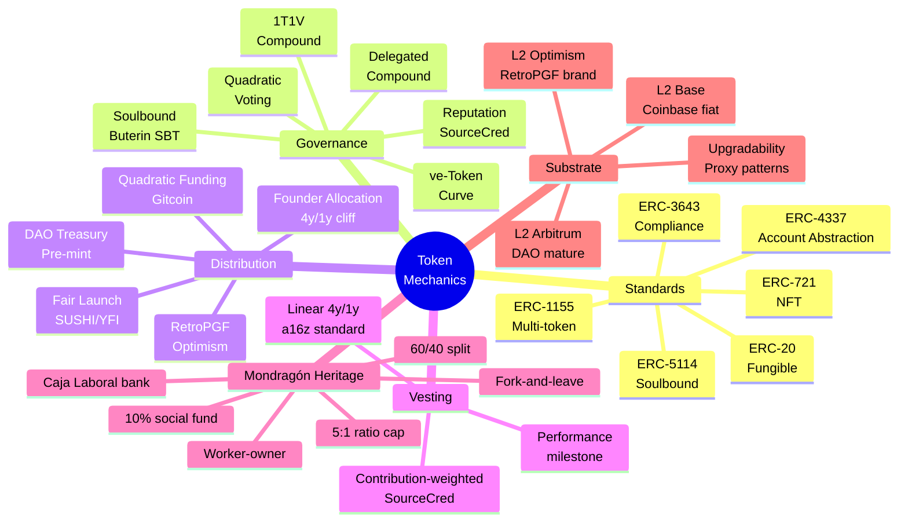
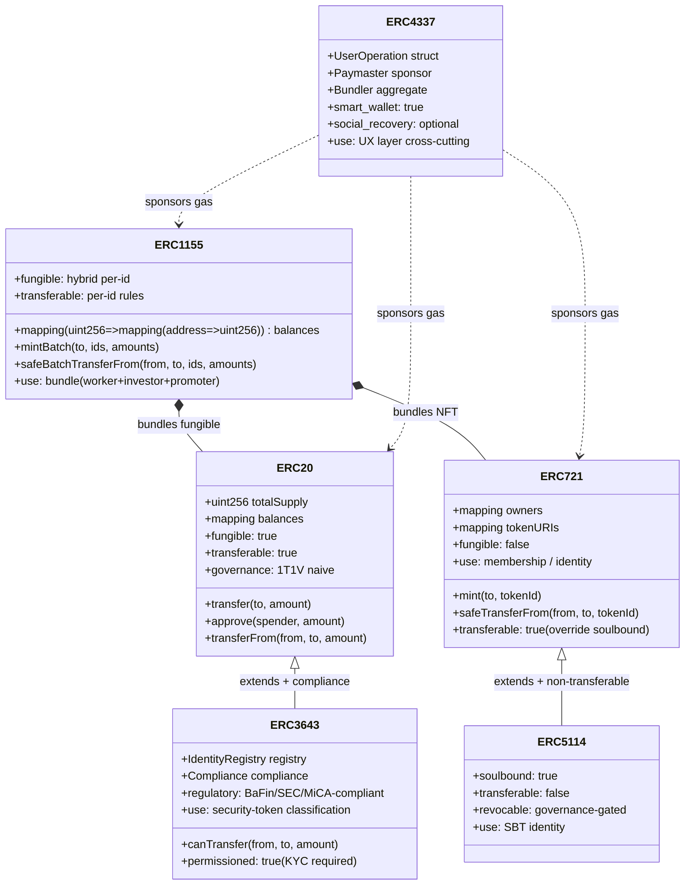

# Phase 2 — Token mechanics theoretical basis

> **Объект.** Theoretical substrate для Phase 3 10-variant comparison: Ethereum L2 substrate baseline (Option D Hybrid + H8 ack), 5 relevant ERC standards (20/721/1155/3643/4337), 6 governance models, 5 distribution mechanisms, 3 vesting patterns, Mondragón Tektology heritage translation к token form. Mermaid taxonomy D2 + ERC class-comparison D3.

---

## §A Ethereum substrate baseline (Option D Hybrid acked 2026-05-18)

[src: `swarm/awaiting-approval/r12-programmable-ethereum-2026-05-18.md` + `h8-ethereum-substrate-extension-2026-05-18.md`]

### §A.1 Why Ethereum (vs other chains)

Per Option D Hybrid Ruslan ack 2026-05-18:

- **Mature governance tooling** (Aragon / Snapshot / Tally / Compound Governor) — battle-tested 7+ years
- **R12 programmable enforcement** via smart contracts (Mondragón ratio cap, QF revenue distribution, fork-and-leave exit tokens) — encoded at substrate level
- **L2 substrate (Base / Optimism / Arbitrum)** — cheap gas (~$0.001 per tx) + Ethereum security inheritance
- **EVM ubiquity** — Solidity dev pool / audit firms / bug bounties / standard libraries (OpenZeppelin)
- **DAO ecosystem alignment** — Gitcoin / RaidGuild / Optimism RetroPGF substrate-compatible

[src: H8 Ethereum substrate extension ack §3 «Option A — Ethereum L2 alignment» chosen]

### §A.2 L2 choice trade-off

| L2 | Type | Sequencer | Pros для Jetix | Cons для Jetix |
|---|---|---|---|---|
| **Base** | Optimistic rollup | Coinbase (centralized сейчас) | Largest L2 TVL ~$13B; Coinbase fiat onramp built-in; consumer UX | Centralized sequencer phase; Coinbase regulatory exposure |
| **Optimism** | Optimistic rollup | OP Foundation (transitioning к Superchain) | RetroPGF history (5 rounds funded $200M+ public goods); Superchain alignment с Network State thesis | Smaller TVL than Base; 7-day withdrawal delay (mitigated by 3rd party bridges) |
| **Arbitrum** | Optimistic rollup | Offchain Labs (Arbitrum DAO governs) | Largest L2 dev ecosystem; ARB token governance precedent | Token has speculation history; less brand-aligned Jetix Mondragón-spirit |
| zkSync Era | ZK rollup | Matter Labs | Zk-proof finality fast | Newer; less mature audit base |

[src: L2BEAT.com TVL data + DeFiLlama L2 reports Q1 2026]

**Brigadier provisional position (R1 lock pending):** **Optimism preferred** для Jetix V10 hybrid — RetroPGF alignment + Superchain cooperative thesis + Buterin Public Goods rhetoric — match Jetix Mondragón-aspirational direction. Base fallback if fiat onramp UX priority Phase 1. Final L2 choice = Ruslan R1 decision.

### §A.3 Gas cost projections

L2 average per-action gas costs:

| Action | Optimism (USD) | Base (USD) | Comments |
|---|---|---|---|
| ERC-20 transfer | $0.0002 | $0.0003 | trivial |
| ERC-721 mint | $0.002 | $0.003 | per NFT |
| ERC-1155 mint batch | $0.005-0.01 | $0.005-0.01 | bundle |
| ERC-3643 compliant transfer | $0.005-0.02 | $0.005-0.02 | KYC check inline |
| Governance vote | $0.001-0.005 | $0.001-0.005 | Snapshot offchain = $0 |
| RageQuit exit | $0.01-0.05 | $0.01-0.05 | proportional treasury claim |

[src: L2BEAT gas usage 2025 + OpenZeppelin gas benchmarks]

**Implication для Jetix:** Sub-$0.10 per partner per month gas budget realistic at L2; mainnet would be 100-1000× higher.

### §A.4 Smart contract upgradability patterns

| Pattern | Pros | Cons | Jetix fit |
|---|---|---|---|
| **Immutable** (no upgrade) | Trust-minimized; no admin key risk | Bug = forever; cannot iterate | Phase 2+ когда model proven; NOT Phase 1 |
| **Transparent Proxy** (OpenZeppelin) | Battle-tested; clear admin separation | Storage layout discipline required | Phase 1 reasonable |
| **UUPS Proxy** (EIP-1822) | Cheaper deployment than Transparent; upgrade logic in impl | Single-slot vulnerability if misimplemented | Phase 1 alternative |
| **Diamond Standard** (EIP-2535) | Multi-facet modular; can add features w/o full upgrade | Complex; harder to audit | Phase 3+ если ecosystem matured |
| **Beacon Proxy** | Single beacon controls multiple proxies | Single point of failure | Multi-Clan future (Phase 2+) |

[src: OpenZeppelin upgradeability docs + EIP-1967/1822/2535]

**Brigadier position:** **Transparent Proxy** Phase 1 (battle-tested OpenZeppelin SDK) → Diamond Phase 2+ когда tooling matured. Admin key = Jetix multisig 3/5 (Ruslan + 2 управленцы + 2 advisors) — но R1 lock pending.

---

## §B ERC standards relevant к Jetix tokenomics

[src: EIP-20 / EIP-721 / EIP-1155 / EIP-3643 / EIP-4337 official specs + OpenZeppelin reference implementations]

### §B.1 ERC-20 (fungible)

**Specification:** EIP-20 (Vogelsteller & Buterin 2015). 6 mandatory methods: `totalSupply / balanceOf / transfer / transferFrom / approve / allowance`. Events `Transfer / Approval`.

**Use-cases для Jetix:** Governance token (1-token-1-vote naive) / utility token (services payment) / worker reward token / treasury-funded revenue share.

**Pros:** Battle-tested (used in 500K+ deployed contracts); wallet UX universal (MetaMask / Rabby / Frame); DEX liquidity native (Uniswap / Curve); decimal precision standard (18).

**Cons:** Fungibility = no role-distinction (every token identical); transferable = governance whale risk + speculation; no compliance built-in (KYC must be off-chain or via wrapper).

**Jetix fit:** Variant V1 (vanilla DAO governance), V3 (ve-token), V7 (reputation + revenue share hybrid 2-token), V8 (cooperative DAO RageQuit), V10 partial (treasury treasury currency).

### §B.2 ERC-721 (non-fungible / NFT)

**Specification:** EIP-721 (Entriken, Shirley, Evans, Sachs 2018). Identity tokens; each tokenId unique; metadata via tokenURI (off-chain JSON).

**Use-cases для Jetix:** Membership certificate (one NFT = one partner); soulbound (non-transferable per Buterin 2022) identity binding; promoter NFT for network growth bonus; achievement / contribution badges.

**Pros:** Identity-binding native; rich metadata (image + attributes + traits); marketplace ecosystem (OpenSea / LooksRare) — but soulbound versions skip marketplaces.

**Cons:** Gas higher per mint vs fungible; speculation history (PFP NFT bubble 2021-22 — Jetix discipline needed); transferable by default (soulbound = custom override).

**Jetix fit:** V2 (ERC-3643 + ERC-721 soulbound), V6 (triple-role bundle component), V9 (ENS-style domain ownership), V10 (membership + promoter NFT).

### §B.3 ERC-1155 (multi-token)

**Specification:** EIP-1155 (Radomski, Cooke, Castonguay, Therien, Bryner, Mehta 2018). Combined fungible + non-fungible; batch ops; per-token-id semantics.

**Use-cases для Jetix:** Triple-role NFT bundle (worker share + investor share + promoter NFT in single contract); per-tier membership bundles (L4 / L5 / L6 / L7 Workshop tiers); event tickets + access passes.

**Pros:** Batch ops gas-efficient; single contract supports multi-token-types; flexibility (fungible AND non-fungible mix); approval-by-collection (one approve for whole bundle).

**Cons:** Complex UX (wallet support varies); requires careful tokenID schema; less marketplace support than ERC-721.

**Jetix fit:** V6 (triple-role NFT bundle native), V10 (combined investor + promoter + worker share unified contract).

### §B.4 ERC-3643 (T-REX / security tokens compliance)

**Specification:** EIP-3643 (Tokeny Solutions T-REX protocol). Permissioned ERC-20 superset; KYC built-in via Identity Registry; on-chain compliance enforcement.

**Components:**
- **Identity Registry** (ONCHAINID linked) — KYC'd addresses pre-registered
- **Compliance contract** — programmable rules (max holders / per-jurisdiction caps / vesting / lock-up)
- **Token contract** — only transfers between KYC'd addresses allowed; non-compliant tx reverts

**Use-cases для Jetix:** Security-token classification jurisdictions (BaFin / SEC / MiCA EU framework) — Jetix L1 First Clan governance tokens могут be classified as securities → ERC-3643 native compliance.

**Pros:** Regulatory-friendly Phase 2+; KYC + AML inline; programmable compliance (e.g., Mondragón 5:1 ratio enforceable); audit-trail on-chain.

**Cons:** Permissioned (not pseudonymous like vanilla ERC-20); KYC overhead (3rd party providers Onfido / Sumsub / Persona — ~$5-15 per verified user); complex deployment; legal opinion needed per jurisdiction.

**Jetix fit:** V2 (compliance native variant), V10 partial (compliance wrapper для governance token). Phase 2+ likely; Phase 1 vanilla ERC-20 + off-chain Charter discipline simpler.

[src: Tokeny T-REX whitepaper + EIP-3643 spec + MiCA EU framework 2024]

### §B.5 ERC-4337 (account abstraction)

**Specification:** EIP-4337 (Buterin, Bezzu, Chow, Kennedy, Wang 2021). Smart contract wallets without protocol changes; UserOperations replace transactions; Paymasters can sponsor gas; Bundlers aggregate.

**Use-cases для Jetix:** Social recovery (lost-key recovery via guardians); gasless onboarding (sponsor first 10 ops); session keys (limited-permission temporary); batch ops (one signature multiple actions).

**Pros:** UX leap (no seed-phrase trauma for non-crypto-native partners); paymaster sponsorship (Jetix pays gas for Workshop students Phase 1); session keys (Workshop tier limited-action wallets).

**Cons:** Newer (deployed late 2023, ecosystem still maturing); wallet provider lock-in risk (Safe / Stackup / Pimlico); paymaster cost = ongoing Jetix expense; complex.

**Jetix fit:** Cross-cutting UX layer для ANY variant — particularly V10 hybrid (recommends paymaster for Workshop tier onboarding). Phase 1: nice-to-have; Phase 2+: likely critical.

[src: EIP-4337 spec + Safe{Wallet} adoption metrics 2025]

---

## §C Governance models comparable

[src: Buterin blog 2021-2024 + Vlad Zamfir governance papers + DAOstack / Aragon / Compound docs]

### §C.1 One-token-one-vote (1T1V)

**Mechanism:** Simple vote weight = balance. Compound / Uniswap default.

**Pros:** Simple; easy UX; gas-cheap; battle-tested.

**Cons:** Whale risk (top-10 holder coordination = majority); plutocracy criticism Buterin 2021 «Moving beyond coin voting»; vote-buying market vulnerability.

**Jetix fit:** Variant V1 only; NOT recommended for V10 (whale vulnerability в early stage с small holder count).

### §C.2 Quadratic Voting (QV)

[src: Buterin, Hitzig, Weyl 2018 «Liberal Radicalism» + Vitalik blog «Quadratic voting» 2019]

**Mechanism:** Vote cost = (votes)² per token holder. 1 vote = 1 credit; 2 votes = 4 credits; 10 votes = 100 credits.

**Pros:** Whale-resistant (diminishing returns on stake); intensity-of-preference signal; Buterin-acked.

**Cons:** Sybil-attack vulnerability (split identity = full quadratic restart per identity → need identity layer Worldcoin / Gitcoin Passport / BrightID); complex UX.

**Jetix fit:** V4 (QF + RetroPGF), V10 partial (QF matching pool component). Pairs naturally с soulbound NFT identity (V2 + V6 hybrid).

### §C.3 ve-Token (Curve veCRV pattern)

[src: Curve documentation + veCRV launch retrospective 2020 + Convex bribery dynamics]

**Mechanism:** Lock ERC-20 token for 1 week - 4 years; longer lock = more vote weight + revenue share % boost. Time-decaying vote weight.

**Pros:** Aligns long-term interest (4-year lock = max benefit); revenue share boost incentivizes commitment; Curve battle-tested 5+ years.

**Cons:** Capital lockup deterrent for new partners (4-year lock = liquidity cost); vote-bribery secondary market (Convex / Votium); complexity.

**Jetix fit:** V3 (ve-token variant). Pairs с Mondragón long-term commitment ethos. NOT recommended Phase 1 hybrid (too much lockup for small cohort) but Phase 2+ when cohort > 100 partners.

### §C.4 Delegated voting (Compound style)

**Mechanism:** Token holders delegate vote weight к delegate addresses (which can be other token holders OR pure-delegate addresses). Delegate signaling.

**Pros:** Active participation > passive holding rewarded; experts can delegate-collect for thoughtful voting; battle-tested Compound.

**Cons:** Delegation concentration risk (а16z holds ~5% Compound delegated → de-facto Compound steerer); voter apathy = delegation aggregation; whale-like concentration over time.

**Jetix fit:** V10 partial (delegate option for Workshop students who don't want active governance); standalone V1-extension.

### §C.5 Reputation-based (SourceCred / RaidGuild)

[src: SourceCred docs + RaidGuild Handbook + Coordinape / DeWork contribution tracking]

**Mechanism:** Vote weight earned by contribution (PRs / proposals / mentorship / tasks completed); non-transferable; can decay over time.

**Pros:** Aligns work с governance power; anti-speculation native (non-transferable); contribution-meritocratic.

**Cons:** Subjective contribution measurement (who scores PRs?); centralization risk if scorer is single human; reputation manipulation (Sybil + collusion).

**Jetix fit:** V7 (reputation + revenue share hybrid); V10 governance layer overlay (reputation gates QF matching multiplier).

### §C.6 Soulbound tokens (Buterin 2022 SBT)

[src: Buterin, Weyl, Ohlhaver 2022 «Decentralized Society: Finding Web3's Soul»]

**Mechanism:** Non-transferable ERC-721 / ERC-5114; identity-bound; cannot be sold/transferred; revocable (with explicit governance).

**Pros:** Speculation-resistant native; identity binding (one soul = one vote); reputation accumulation organic.

**Cons:** New standard (ERC-5114 less battle-tested); social-credit-system criticism if misused; revocation governance complex.

**Jetix fit:** V2 + V6 + V10 (membership + promoter NFT soulbound). Pairs с QF + reputation governance perfectly. Buterin-aligned Network State adjacent thesis.

---

## §D Distribution mechanisms

[src: Optimism RetroPGF rounds 1-5 reports + Gitcoin QF rounds + Compound/Uniswap airdrop retrospectives]

### §D.1 Fair launch (no pre-sale)

**Mechanism:** Token mined / earned by participation; no investor pre-allocation; Yearn / Tornado Cash / SUSHI examples.

**Pros:** Maximum perceived decentralization; community-aligned; no investor capture; regulatory-friendly (no securities offering).

**Cons:** Slow growth (no capital injection for ops); founders un-funded (work-for-free critique); no obligation to deliver.

**Jetix fit:** V8 (cooperative DAO native); V10 partial (no investor pre-sale; institutional treasury via revenue routing not equity sale).

### §D.2 Founder allocation с vesting

**Mechanism:** Pre-allocate 10-25% к founders + early team; vesting 4y linear с 1y cliff (a16z standard); rest community / treasury.

**Pros:** Founders aligned long-term (vesting); contribution recognized; investor expectation alignment.

**Cons:** Centralization at launch; Sybil potential ("founder" definition flexible); R12 paired-frame tension (extraction beyond agreed share?).

**Jetix fit:** Ruslan founder allocation IF chosen explicitly — but per R12 LOCK Ruslan personal slice already encoded via Layer 3 recursion (8.33% effective); separate founder allocation = potential R12 dual-extraction edge case. **Brigadier provisional: NOT recommended — Ruslan Layer 3 alone sufficient.**

### §D.3 DAO treasury fund

**Mechanism:** Pre-mint to DAO multisig / governance contract; community votes on dispersal (grants / partnerships / ops).

**Pros:** Decentralized treasury control; flexible dispersal; standard DAO pattern Compound/Uniswap.

**Cons:** Slow decision-making (gov vote per spend); whale risk (если 1T1V governance); coordination friction.

**Jetix fit:** V1, V4 (RetroPGF treasury), V10 (Jetix institutional treasury L1 take). Critical for V10 self-sustaining loop.

### §D.4 Quadratic Funding (QF) matching pool

[src: Buterin/Hitzig/Weyl 2018 «Liberal Radicalism» + Gitcoin QF rounds 14-20 data]

**Mechanism:** Public funds match contributor donations via QF formula: total = (Σ √(c_i))² where c_i = individual contributions. Many small donors > few large ones.

**Pros:** Aligns с public good preference; democratic intensity; Buterin-foundational; Gitcoin proven $40M+ matched.

**Cons:** Matching pool sustainability (Gitcoin uses external funders Coinbase / Polychain); Sybil-resistance critical (Gitcoin Passport / BrightID); complexity.

**Jetix fit:** V4 (QF + RetroPGF native), V10 (QF matching pool funded by 5-10% L1 institutional skim quarterly). Critical для V10 self-sustaining loop closure.

### §D.5 RetroPGF (Retroactive Public Goods Funding)

[src: Optimism RetroPGF rounds 1-5 reports $200M+ disbursed + Buterin blog «Why retroactive PGF» 2022]

**Mechanism:** Public goods rewarded **after** demonstrating impact (not pre-funded); voters distribute fixed pool based on retrospective value assessment.

**Pros:** Reward outcomes not promises; aligns с long-term value creation; Buterin-rec'd для public goods.

**Cons:** Voter coordination cost; retrospective value subjective; requires sustainable funding source (Optimism uses sequencer revenue ~$1M/month).

**Jetix fit:** V10 partial (RetroPGF rounds quarterly distributing к worker-contributors based on retrospective contribution score). Phase 2+ when contribution diversity ≥30 partners.

---

## §E Vesting / cliff patterns

### §E.1 Standard 4-year linear с 1-year cliff

**Mechanism:** 0% for first 12 months; then linear vest 1/36 per month over months 13-48. a16z standard.

**Pros:** Industry-norm; founder commitment signal; investor expectation.

**Cons:** Rigid; doesn't reward differential contribution.

### §E.2 Performance-based unlocks

**Mechanism:** Vesting milestones tied к KPIs (revenue / cohort growth / Workshop completion / Hypothesis tests passed).

**Pros:** Outcome-aligned; flexible per partner.

**Cons:** KPI definition complex; manipulation risk; legal opinion required if interpreted as conditional securities.

### §E.3 Contribution-weighted vesting (SourceCred / Coordinape)

**Mechanism:** Vest rate scales с contribution score; non-contributors vest slower or not at all.

**Pros:** Worker / contributor incentive aligned; Mondragón-spirit.

**Cons:** Scoring requires governance; gaming risk.

**Jetix fit:** V10 hybrid — performance-based for management compensation; contribution-weighted for worker tokens; standard 4y linear for any external investor allocation IF used (provisional: NOT recommended per Ruslan voice closed-loop = no external investor).

---

## §F Mondragón Tektology heritage translation к token form

[src: Whyte & Whyte «Making Mondragon» Cornell 1991 + MCC Annual Reports 2020-2024 + Hansmann «Ownership of Enterprise» 2000]

### §F.1 Mondragón structure recap

**Mondragón Cooperative Corporation (MCC)** — founded 1956 Basque Country Spain. 95 cooperatives + 80,000 workers (~2024). 68-year track record.

**Key structural features:**

1. **Worker-ownership:** every worker = owner; «one member one vote» governance (NOT proportional к capital contribution).
2. **60% / 40% split** of net surplus: 60% к cooperative reserves + collective fund; 40% к individual member accounts (paid out at retirement / exit / 20+ years).
3. **5:1 wage ratio cap** (was 3:1 historically; relaxed к 5:1 Eroski 1990s; some coops still 3:1) — highest-paid ≤ 5× lowest-paid в same coop.
4. **10% inter-coop social fund** — supports community development / education / new coop incubation (Caja Laboral founding capital pattern).
5. **Caja Laboral (cooperative bank)** — captures member savings; funds new coops; binds federation.
6. **Mondragón University** — workforce training; pedagogy alignment.
7. **Eroski (retail)** + **Fagor (appliances historically) + Orbea + Mondragón Assembly** etc — diversified.
8. **Exit:** can fork-and-leave; individual capital account returned (with delays); no penalty.

[src: Whyte&Whyte 1991 + MCC report 2023 + Carroll&Buchholtz 12th ed ch.6]

### §F.2 Translation к token form

| Mondragón feature | Token form translation | Jetix variant |
|---|---|---|
| Worker-ownership | ERC-721 / ERC-1155 soulbound membership NFT | V2 / V6 / V10 |
| 60/40 split | Smart contract pre-routes 60% к treasury + 40% к member accounts | V5 / V10 |
| 5:1 ratio cap | On-chain max-payout/min-payout ratio check (revert if exceed) | V5 / V6 / V10 (R12 programmable Option D Hybrid) |
| 10% social fund | Auto-allocate to QF matching pool from L1 institutional pool | V4 / V10 |
| Caja Laboral (coop bank) | DAO treasury + future Jetix-internal lending pool | V8 / V10 long-term |
| Mondragón Univ | Workshop tier substrate (already operational L4-L7) | All variants |
| Fork-and-leave | RageQuit smart contract (Moloch DAO pattern) | V8 / V10 |

### §F.3 Mondragón innovation gap that tokenomics fills

Mondragón uses traditional cooperative law + Basque regional jurisdiction. Token form adds:

1. **Cross-border scalability** — Mondragón ~Basque-bound; tokenomics global digital.
2. **Programmable enforcement** — 5:1 ratio cap rules in code = automated; Mondragón uses Charter discipline (works но slower).
3. **Liquid exit** — Mondragón individual capital account returns at retirement (delay); RageQuit immediate token-for-treasury exchange.
4. **Composability** — token can interop с QF / RetroPGF / DAO governance ecosystem; Mondragón ~standalone Federation.

[src: Hansmann 2000 §6 + Whyte&Whyte critique]

### §F.4 Mondragón gaps tokenomics inherits / amplifies

1. **Concentration tendency** — Mondragón Eroski + Fagor became dominant; mitigation = governance vote on member allocation. **Jetix risk:** L1 institutional pool can concentrate без QF + soulbound governance discipline.
2. **Innovation slow** — coop governance slow to adopt new tech. **Jetix mitigation:** smaller cohort + tighter feedback loops + sub-brigadier architecture for parallel decision.
3. **External market discipline weak** — Mondragón coops insulated from competitive pressure long periods → Fagor collapse 2013. **Jetix risk:** closed-loop self-sustaining can echo. **Mitigation:** Workshop tier external students = market signal; partnership pipeline = external benchmarking.

---

## §G Mermaid D2 — Token mechanics taxonomy (mindmap)

---

## §H Mermaid D3 — ERC standards comparison (classDiagram)

---

## §I Phase 2 closure summary

**Theoretical substrate ready для Phase 3 variant comparison.**

- ✅ Ethereum L2 substrate (Optimism preferred / Base / Arbitrum fallback) per Option D Hybrid + H8 ack
- ✅ 6 ERC standards inventoried (20 / 721 / 1155 / 3643 / 4337 + 5114 soulbound)
- ✅ 6 governance models (1T1V / QV / ve-Token / Delegated / Reputation / SBT)
- ✅ 5 distribution mechanisms (Fair Launch / Founder / Treasury / QF / RetroPGF)
- ✅ 3 vesting patterns (Linear / Performance / Contribution-weighted)
- ✅ Mondragón Tektology heritage translation table + innovation gap + risk inheritance
- ✅ Mermaid D2 taxonomy + D3 ERC class comparison

**Provisional brigadier positions (R1 lock pending):**
- L2: Optimism (RetroPGF brand alignment + cooperative thesis)
- Upgradability: Transparent Proxy Phase 1 → Diamond Phase 2+
- Vesting: NO founder allocation (Ruslan Layer 3 sufficient per R12 paired-frame)
- Governance: QF + soulbound SBT pair (V10 hybrid direction)
- Compliance: Phase 1 vanilla + off-chain Charter discipline; Phase 2+ migrate к ERC-3643

**Next: Phase 3 ⭐⭐ 10 variant deep-analyzed comparison.**

[src: All §A-§F substrate inline citations]

---

*Phase 2 closure 2026-05-21. Brigadier-scribe Cloud Cowork.*
