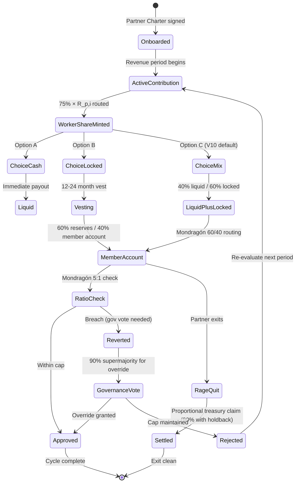

# Phase 5 — 75% Worker Ownership Mechanics

> **Тезис.** 75% per-partner direct retention — основной distributional commitment в economic model. Per Ruslan voice 21.05 night «- 75% → workers / team (основной — им принадлежит)». Тут — detailed mechanic per partner / per cohort tier / distribution mechanism + Mondragón ratio cap enforcement + worker share lifecycle.

---

## §A 75% worker pool detailed

### §A.1 Per-partner mechanic

For each partner i with period revenue R_p,i:
```
Worker_share_i = 0.75 × R_p,i
```

This 75% slice is **direct partner retention** — partner receives this in:
- Cash (stable / fiat / token equivalent) immediate
- OR locked into worker share token (vesting + revenue share)
- OR mix per partner Charter agreement
- Per V10 hybrid: worker NFT mint at onboarding с per-partner balance tracking

### §A.2 Per-tier mechanic (8-tier pyramid per Strategic Plan Phase 8)

[src: `decisions/strategic/STRATEGIC-PLAN-NEAR-FUTURE-2026-05-21.md` Phase 8 + `DISTRIBUTION-PLAN-2026-05-20.md` §5 monetization]

Per Strategic Plan 8-tier hierarchy:

| Tier | Name | Revenue mechanic | Worker share applies? |
|---|---|---|---|
| L0 | Ruslan | Recursion via L3 (см. Phase 4) | NO direct worker pool; L3 effective 8.33% × R |
| L1 | First Clan (Ruslan + 9 confirmed) | Founding partners; full 75% retention per their revenue | ✅ direct 75% |
| L2 | Управленцы (operations team) | L2 compensation pool (см. Phase 4 §3); not direct partner | NO direct worker pool; L2 compensation = 16.67% × R total |
| L3 | Cohort partners (active builders) | Per their revenue contribution × 75% | ✅ direct 75% |
| L4 | Active practitioners (Workshop alumni → builders) | Pro-rata revenue contribution × 75% | ✅ direct 75% |
| L5 | Workshop hosts (delivering content) | Hosting fee revenue × 75% | ✅ direct 75% |
| L6 | Cohort members (paying to learn) | Paying тier; revenue inflow к Jetix; NO worker share (instead utility token + learning access) | NO worker share; utility token only |
| L7 | Workshop attendees (single-event tier) | Paying tier; revenue inflow; NO worker share | NO worker share; access token only |

**Critical clarification per voice ambiguity (см. Phase 4 §6.4):** «Worker pool 75%» applies к L1+L3+L4+L5 tiers (revenue contributors). L6+L7 tiers = paying tier, NOT worker pool recipients.

### §A.3 Aggregate worker pool

```
W(t) = Σ_{i ∈ L1∪L3∪L4∪L5} 0.75 × R_p,i(t)
```

Where R_p,i = partner i's revenue contribution period t. If 100 active partners across L1+L3+L4+L5 with avg R_p = €2K/month:

```
R_aggregate = 100 × €2K = €200K/month
W_aggregate = 0.75 × €200K = €150K/month direct worker retention
L1 institutional = 0.25 × €200K = €50K/month
```

Per Strategic Plan target cohort scaling 10→130 partners Y5 (per DR-26 Scenario B), worker pool aggregate scales linearly.

---

## §B Distribution mechanism

### §B.1 Three options per partner choice

Per partner Charter agreement, worker share distribution can be:

**Option A — Immediate cash / stable**
- 100% paid out monthly in fiat (EUR / USD via Coinbase / Stripe payouts) or stablecoin (USDC / DAI)
- No vesting / no lock
- Maximum liquidity для partner
- Tax-treatment straightforward
- **R12-safe:** member receives full agreed share immediately

**Option B — Locked worker share token (vesting + revenue share)**
- 100% minted as worker NFT (V6 / V10 hybrid)
- Vests linear over 12-24 months
- Carries revenue share rights post-vest
- Optional Mondragón-style 40% individual member account
- **R12-safe IF Charter explicit + opt-out preserved**

**Option C — Mix (default V10 recommendation)**
- 40% immediate cash + 60% locked worker NFT
- Mondragón 60/40 spirit
- Balanced liquidity + long-term alignment
- Most common per Mondragón pattern (Whyte&Whyte ch.7)

Partner Charter Q1 onboarding: explicit choice A/B/C; can switch annually with 30-day notice.

### §B.2 Mondragón 60/40 individual member account pattern

[src: Whyte&Whyte «Making Mondragon» 1991 ch.7 + MCC Annual Report 2023]

Mondragón pattern для locked share:
- 60% of locked share → cooperative reserves (collective fund)
- 40% of locked share → individual member account (capital share)
- Individual account credited annually based on:
  - Surplus distribution per member
  - Interest (Mondragón pays ~6% annually on member account)
  - Vesting tenure
- Redeemable at:
  - Retirement (full)
  - Exit / fork-leave (partial, с typical 5-15% holdback per Charter)
  - 20+ year tenure milestones

**V10 translation:** smart contract auto-routes worker NFT mint:
- 60% → DAO treasury internal worker reserves
- 40% → per-member account (ERC-1155 token bound к partner identity)
- Interest accrual = governance vote (suggested 3-6% APY funded by L1 institutional)
- RageQuit redeemable per Charter terms

### §B.3 Settlement frequency

| Settlement | Frequency | Mechanism |
|---|---|---|
| Cash payout (Option A) | Monthly | Coinbase Commerce / Stripe Connect / OpenZeppelin Defender on-chain |
| Worker NFT mint (Option B) | Per revenue event OR monthly batch | Gas-optimized batch mint |
| Member account credit | Annually + per-revenue-event running balance | Per-partner ledger smart contract |
| Mondragón interest | Annually | Governance vote / treasury allocation |

---

## §C Mondragón ratio cap enforcement

### §C.1 5:1 ratio cap mechanic

Per Pillar C Tier 2 §4.2 RUSLAN-LAYER + Whyte&Whyte historical (Mondragón 3:1 → 5:1 Eroski relaxation 1990s):

**Definition:** ratio_cap = max_partner_total_compensation / min_partner_total_compensation ≤ 5.

Where:
- max = top-earning partner per period (L1 / L3 / L4 / L5 across tiers)
- min = lowest-active-earning partner per period (excluding zero-revenue periods)

### §C.2 On-chain enforcement (V10 hybrid)

Per Option D Hybrid (R12 programmable Ethereum):

```solidity
// Pseudo-code per OpenZeppelin patterns
function payWorkerShare(address partner, uint256 amount) external {
    uint256 newMax = max(currentMax, balanceOf(partner) + amount);
    uint256 currentMin = lowestActive();
    require(newMax * 100 <= currentMin * 500, "Mondragon 5:1 cap breach");
    _mint(partner, amount);
    emit WorkerShareMinted(partner, amount);
}
```

**Behavior:**
- Tx reverts if attempted payment would breach 5:1
- Governance vote required for cap relaxation (e.g., 5:1 → 6:1 emergency override)
- Quarterly audit emits `RatioReport` event с current max:min ratio

### §C.3 Edge cases

**Edge α — Lowest-active partner near-zero earnings:**
If lowest-active partner earns €100/month and top earner earns €600/month → ratio 6:1 breach. Mitigation:
- Define floor для «active»: e.g., min €500/month threshold; below = inactive (excluded from ratio calc)
- Or: pool small-earners into baseline group для ratio calc

**Edge β — New partner onboarding (zero history):**
First-month new partner = lowest by definition. Mitigation: 90-day grace period; ratio computed against partners with ≥3 months tenure.

**Edge γ — High-performing outlier:**
Per Charter governance vote can authorize 1-time bonus exceeding ratio cap (with 90% supermajority).

**Edge δ — Ruslan slice 8.33% × R aggregate vs individual worker:**
Если Ruslan's 8.33% × R = €83K/month at R=€1M and worker minimum €1K/month → ratio 83:1 ❌❌. **Critical.**

**Mitigation для edge δ:**
- Compute ratio cap per-class: Ruslan in management class (compared к other управленцы); workers class internal (per-partner). Separate caps.
- Or: Ruslan compensation = aggregate sub-divided into per-Workshop / per-Cohort attribution (matching how он participates as worker too).
- Or: Mondragón cross-coop ratio cap reading (Eroski to Fagor pay ratio = 5:1 between coops; within-coop 3:1 historically) — Ruslan represented as own "coop" with cross-coop ratio к other coops.

**R1 decision pending Ruslan:** which ratio cap interpretation адекватна Jetix recursive structure? Surfaced Phase 11 risk surface.

### §C.4 Off-chain Charter discipline fallback

For variants V1 / V3 / V5 (off-chain Mondragón discipline):
- Quarterly transparent payroll report (anonymized) к L1 token holders
- Annual external audit (auditor like KPMG / PwC / cooperative-specialized)
- R12 paired-frame ethical-surface check (per Distribution Plan §4.5 pre-send checklist applied к comp decisions)

---

## §D Mermaid D9 — Worker share lifecycle (stateDiagram)



---

## §E R12 audit (worker pool specific)

| R12 dimension | Risk | Mitigation |
|---|---|---|
| extraction_beyond_share | Low — 75% explicit Charter | Charter publication + Option A/B/C choice |
| wage_ratio_violation | Medium — edge cases α/β/γ/δ | On-chain ratio cap V10 + governance override |
| non_consensual_distribution | Low — partner Charter choice annually | 30-day switch notice; opt-out preserved |
| fork_prevention_attempt | None — RageQuit preserved | Smart contract enforced |

**Verdict:** ✓ R12-compliant when Charter + ratio cap + RageQuit + partner choice options preserved.

---

## §F Cross-refs

- Phase 4 RECURSIVE-PARTNERSHIP sub-doc: §3-§4 L1/L2/L3 mechanic
- Phase 3 TOKENOMICS-VARIANTS sub-doc: V10 hybrid worker NFT spec
- Phase 11 risk surface: edge δ ratio cap interpretation
- DR-26 unit econ: per-partner revenue estimates Y5
- Strategic Plan Phase 8: 8-tier pyramid revenue mechanics

---

*Phase 5 closure 2026-05-21. Brigadier-scribe Cloud Cowork.*
