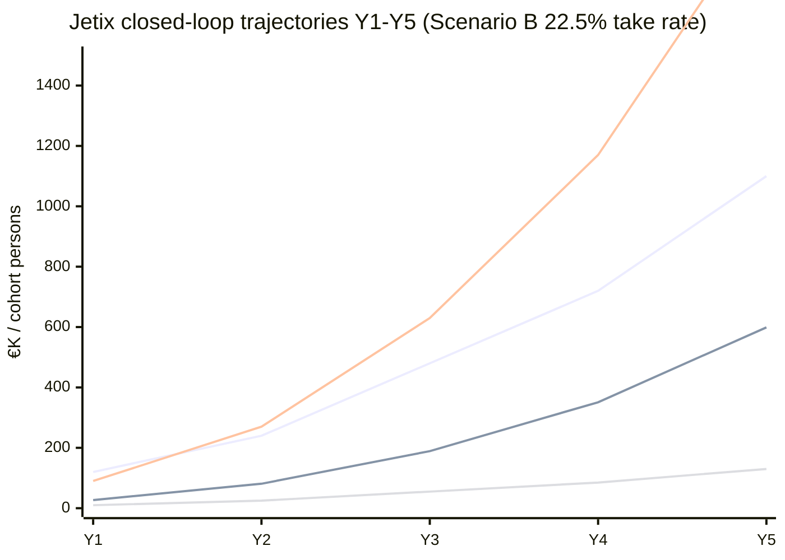

# Phase 7 — Closed-Loop Dynamics Modeling

> **Тезис.** Mathematical model of Jetix economic flows over time — state variables, flow equations, closed-loop conditions, critical mass thresholds, self-sustaining derivation. Builds на Phase 4 recursive mechanic. 2 mermaid D14-D15 (flow + trajectories).

---

## §A State variables + flow equations

### §A.1 State variables

| Variable | Meaning | Unit | Initial |
|---|---|---|---|
| C(t) | Cohort size (#active partners L1+L3+L4+L5) | persons | 1 (Ruslan t=0) → 9 (L1 First Clan committed) |
| R(t) | Total system revenue period t | €/month | €0 → DR-26 scenario B Y5 ~€1M/month |
| R_p,i(t) | Partner i revenue period t | €/month | varies |
| T_inst(t) | L1 institutional treasury cumulative | € | €0 |
| M_pool(t) | L2 управленцы pool cumulative | € | €0 |
| R_personal(t) | Ruslan Layer 3 cumulative | € | €0 |
| W(t) | Worker pool aggregate cumulative | € | €0 |
| QF(t) | QF matching pool (V10) | € | €0 |
| Pr(t) | Promoter bonus pool | € | €0 |
| K(t) | Viral coefficient (per-partner referrals/period) | unitless | varies |
| ρ(t) | Cohort retention rate (per-quarter) | % | 70-85% targeted |
| ε(t) | External capital injection (Foundation / VC) | € | varies |

### §A.2 Core flow equations (per period t)

Per Phase 4 §C.2 mechanic + Phase 5 §A.3 worker pool aggregation:

**Revenue aggregation:**
```
R(t) = Σ_i R_p,i(t)
     = α × C(t) × avg_R_per_partner(t)
```

Where α = activity factor (1.0 при all partners fully active; 0.5-0.8 typical real-world).

**L1 institutional flow:**
```
T_inst(t+1) = T_inst(t) + 0.25 × R(t) - L1_outflows(t)
```

Where L1_outflows include:
- L2 routing (25% of L1 take = 6.25% × R subset Reading β)
- Product development spend
- Education / amplification
- Operations
- QF matching pool funding (5-10% × L1 quarterly)

**L2 управленцы pool:**
```
M_pool(t+1) = M_pool(t) + 0.25 × R(t) - M_outflows(t)
            = (per V10 hybrid Mondragón 60/40)
            = 60% reinvest + 40% direct compensation
```

**L3 Ruslan personal (cumulative geometric γ):**
```
R_personal(t+1) = R_personal(t) + 0.0833 × R(t) - re_entry(t)
re_entry(t) = R_personal(t)  [full re-entry per Reading γ]
```

**Worker pool aggregate:**
```
W(t+1) = W(t) + 0.75 × R(t) - withdrawals(t)
```

**Cohort growth:**
```
C(t+1) = C(t) × ρ(t) + new_acquisitions(t)
new_acquisitions(t) = β × T_inst(t) × growth_factor + K(t) × C(t)
```

Where:
- β = institutional capital → cohort acquisition efficiency (€ spent → partners gained)
- growth_factor = market readiness multiplier (high if Workshop demand strong)
- K(t) = viral coefficient (partners brought by existing partners via promoter role)

**QF matching pool (V10):**
```
QF(t+1) = QF(t) + 0.05-0.10 × T_inst(t) [quarterly skim]
        - QF_distributions(t) [retroactive PGF rounds quarterly]
```

### §A.3 Promoter bonus dynamics

Per Phase 6 §4.2 mechanic:
```
Pr(t+1) = Pr(t) + Σ_referred 0.10 × R_p,referred(t)
        - Pr_paid_out(t) [after referred partner 12-month tenure]
```

---

## §B Closed-loop conditions

### §B.1 No-external-leakage invariant

**Closed-loop invariant:** All revenue flows route internally к Jetix-bound actors. No external investor / VC slice.

Verification:
- Worker pool 75% → partners (Jetix-bound)
- L1 institutional 25% → Jetix institutional treasury (Jetix-bound)
  - Of which L2 → управленцы compensation (Jetix-bound)
  - Of which L3 → Ruslan personal → recursive re-entry as L1 partner (Jetix-bound; closed-loop)
- QF matching pool → distributed к worker contributors (Jetix-bound)
- Promoter bonus → existing partners (Jetix-bound)

**External flows ONLY:**
- Workshop fees inflow (L6-L7 paying tier) → adds к R(t) revenue stream; no equity stake retained by Workshop participants
- Foundation / VC bridge funding ε(t) Phase 1 (per DR-26 €245K cumulative deficit Y1-4 Scenario B)
- Operational expenses outflow (Anthropic API / Notion / hosting / legal) — necessary external costs

**External capital strictly bridge:** ε(t) > 0 only Phase 1; closed-loop self-sustaining target Y5+ per DR-26 + Strategic Plan Phase 8.

### §B.2 Ruslan re-entry closed-loop verification

Per Phase 4 §5.1 sum-check at L1=L2=L3=25%:

| Slice | % of R | Bound к Jetix? |
|---|---|---|
| Worker pool | 75% | ✅ partners |
| Other управленцы | 16.67% | ✅ команда |
| Ruslan cumulative (Layer 3 + re-entry) | 8.33% | ✅ founder; re-enters as L1 |
| **SUM** | **100%** | ✅ closed loop verified |

### §B.3 Worker tokens reinvestment dynamics

Per V10 hybrid Option B + C (locked worker NFT + Mondragón 60/40):

```
Worker_member_account(t) = 40% × locked_worker_NFT
                         + Mondragón_interest_accrual (3-6% APY)
                         + tenure_bonus
```

Member account = locked internal к Jetix-bound treasury layer; not externally extractable until RageQuit. **Reinvestment effectively retained capital.**

### §B.4 Treasury QF matching reinvested к workers

Per Phase 6 §7.2 inter-coop social fund translation:
```
QF_distribution_quarterly = 5-10% × T_inst → distributed к worker contributors via RetroPGF rounds
```

Closed-loop closure: T_inst → QF → Workers (members of cohort) → reinvested or extracted per partner Charter choice.

---

## §C Self-sustaining threshold derivation

### §C.1 Operations break-even point

Per DR-26 Phase 5 §3.3 cumulative deficit analysis:

| Year | Scenario A (T=15%) cumulative deficit | Scenario B (T=22.5%) | Scenario C (T=30%) |
|---|---|---|---|
| Y1 | -€155K | -€110K | -€65K |
| Y2 | -€330K | -€220K | -€105K |
| Y3 | -€420K | -€225K | +€20K break-even |
| Y4 | -€465K | -€245K | +€90K |
| Y5 | -€530K (still deficit) | -€190K (closing) | +€160K positive |
| **Y5+ Self-sustaining?** | **❌ requires external funding** | **△ break-even Y5+** | **✅ self-sustaining Y4+** |

[src: DR-26 _RECOMMENDATION-MEMO.md Phase 5 §3 5-year math model]

**Scenario B 22.5% (Ruslan-voiced) reaches break-even Y5 ops + closes deficit Y6.**

### §C.2 Cohort growth rate threshold

For closed-loop self-sustaining at Scenario B 22.5%:
```
Required dC/dt ≥ growth_threshold
where growth_threshold = (operations_cost - T_inst(t)) / β / avg_R_per_partner
```

Numerically per DR-26:
- Y1: 10 partners → Y5: 130 partners required (cohort × 13)
- Annual growth rate: ~67% sustained = K + ρ-driven viral coefficient ≥ 1.5

### §C.3 Network effect critical mass

Per H7 People-NS + Reed's Law (network value ∝ 2^N for fully cooperative networks):

**Critical mass threshold (paying L7 Workshop students + active L3+ partners):**

| Cohort size | Network value index | Self-sustaining status |
|---|---|---|
| 10 partners | 2^10 = 1024 (low) | Foundation-dependent |
| 50 partners | 2^50 = high (но diminishing per real-world friction) | bridge funding required |
| **100 partners** | **substantial network density** | **threshold для self-sustaining ops** |
| 130 partners | DR-26 Scenario B Y5 target | break-even ops |
| 500 partners | strong network effect | exponential phase per K ≥ 1.0 |
| 1000+ partners | full network effect (Phase 3+) | overscale; new substrate features unlock |

[src: H7 People-NS §6 network value derivation + Strategic Plan Phase 8 + Reed's Law (Cooperative Network Theory)]

### §C.4 Trigger points для compound growth

Compound growth conditions (positive feedback dominant):
1. **Treasury reinvestment rate > 1.0** (each € reinvested generates >€1 returned via worker contribution + viral)
2. **Viral coefficient K > 0.5** (each partner brings 0.5+ new partner via promoter role)
3. **Member retention ρ > 70%** (anti-churn baseline)
4. **Workshop pricing scales** (L7 fee scaling с substrate quality)

**When all 4 satisfied:** closed-loop self-sustaining + compound growth phase.

### §C.5 K ≥ 1.0 — exponential phase

Viral coefficient K = (new partners brought per existing partner per period). When K ≥ 1.0:
- Each partner generates ≥1 new partner net
- Cohort grows exponentially (not just linearly)
- Treasury growth exponential
- Phase transition к Phase 2+ (Network State adjacent per H7)

**K ≥ 1.0 threshold realistic when:**
- Workshop substrate proven (200+ alumni Y3+)
- Promoter NFT bonus operational (V10 deployed)
- Partner-bound communities active (Discord / Slack / Telegram)
- External brand resonance (Workshop attendance demand > supply)

---

## §D Comparison к non-closed-loop systems

### §D.1 Traditional VC-backed startup

Dependencies:
- External capital injection (Series A/B/C)
- Investor equity dilution at each round
- Exit requirement (IPO / acquisition) для investor liquidity
- Misalignment between long-term users and short-term investor exit

**Trade-off:**
- Faster initial growth (capital-fueled)
- Less durable long-term (extraction-pressure dominant; investors extract via exit)
- Per R12 LOCK: traditional VC-backed firms often violate R12 (extraction beyond agreed share via dilution / acquisition rollup)

### §D.2 Jetix closed-loop self-sustaining

Dependencies:
- Cohort retention ρ ≥ 70%
- Viral coefficient K ≥ 0.5-1.0
- Workshop pricing scales
- Bridge funding Phase 1 Y1-4 (~€245K Scenario B)

**Trade-off:**
- Slower initial scaling (no capital injection at launch)
- More durable long-term (no external extraction pressure; partners aligned с system success)
- R12-aligned by design (no extraction beyond agreed share; fork-and-leave preserved)

### §D.3 Mondragón comparable

Mondragón self-sustaining 68 years с similar pattern:
- Member capital pooled (Caja Laboral)
- No external equity (cooperative legal structure)
- Mondragón Foundation funds new coop incubation
- ~60% institutional retention pattern proven

**Jetix translation:** V10 hybrid mirrors Mondragón pattern + adds Buterin QF + promoter dimension. ~similar self-sustaining trajectory predicted.

[src: Whyte&Whyte 1991 + MCC Annual Report 2023]

---

## §E Mermaid D14 — Closed-loop flow diagram

```mermaid
graph LR
    subgraph "External boundary"
        WS[Workshop fees<br/>L6-L7 inflow]
        EXT[Foundation / VC<br/>bridge funding ε]
        OPS[Operations costs<br/>API / hosting / legal]
    end

    subgraph "Jetix closed-loop"
        R[R(t) total revenue]
        T[T_inst L1 25%]
        M[M_pool L2 25%]
        RP[Ruslan L3 6.25%]
        W[Worker 75%]
        QF[QF matching pool]
        PR[Promoter bonus pool]
        MA[Member accounts]
    end

    WS -->|inflow| R
    EXT -.->|bridge Y1-4| T
    R -->|25%| T
    R -->|75%| W

    T -->|"25% subset"| M
    T -->|"5-10% quarterly"| QF
    T -->|"product / education / ops"| OPS
    M -->|"25% subset"| RP
    M -->|"60% reinvest"| T
    M -->|"40% direct"| MGMT[Управленцы compensation]

    RP -.->|"100% re-entry as L1 partner"| R

    QF -->|"quarterly retro PGF"| W
    W -->|"60% Mondragón reserves"| MA
    W -->|"40% individual account"| MA
    MA -.->|"RageQuit proportional"| EXITSIM[Exit treasury claim]

    PR -.->|"12-mo from referred"| W

    style R fill:#fff3e0
    style T fill:#e1f5fe
    style M fill:#fff3e0
    style RP fill:#ffebee
    style W fill:#e8f5e9
    style QF fill:#f3e5f5
    style PR fill:#fce4ec
    style MA fill:#e0f2f1
```

---

## §F Mermaid D15 — System dynamics over time (xychart-beta)



---

## §G Sensitivity scenarios + open questions

### §G.1 Sensitivity к take rate

Per DR-26 + Phase 4 §6.1:

| Take rate | Y5 cohort | Y5 cumulative deficit | Self-sustaining Y? |
|---|---|---|---|
| 15% | 60 partners | -€530K | Y8+ (high external dependence) |
| 22.5% | 130 partners | -€190K | Y5-6 break-even |
| 30% | 230 partners | +€160K | Y4 break-even |

### §G.2 Sensitivity к viral coefficient K

| K (avg) | Y5 cohort | Self-sustaining Y? |
|---|---|---|
| 0.3 | 50 (slow linear growth) | Y8+ |
| 0.5 | 90 (compound emerging) | Y6-7 |
| **0.8** | **130 (default Scenario B)** | **Y5-6** |
| 1.0 | 200+ (exponential phase) | Y4 |
| 1.5+ | 500+ (network effect dominant) | Y3 |

### §G.3 Sensitivity к retention ρ

| ρ per quarter | Y5 cohort | Self-sustaining Y? |
|---|---|---|
| 50% | 30 (high churn) | not achievable Y10 |
| 65% | 75 | Y8+ |
| **75%** | **130 (default Scenario B)** | **Y5-6** |
| 85% | 200 | Y4 |
| 92% | 350 | Y3 |

### §G.4 Open R1 questions

| # | Question | Pending Ruslan |
|---|---|---|
| 1 | Bridge funding source Phase 1 (Foundation / Anthropic / VC / personal)? | ⏳ |
| 2 | Workshop pricing curve Y1-Y5 (scaling rate)? | ⏳ |
| 3 | Partner activity threshold (4h/month / 10h / 20h)? | ⏳ |
| 4 | Workshop tier admission criteria (open / curated)? | ⏳ |
| 5 | QF matching pool % L1 skim (5/7.5/10%)? | ⏳ |

---

## §H Cross-refs

- Phase 4 RECURSIVE-PARTNERSHIP §C math equations base
- Phase 5 worker ownership §A aggregate worker pool derivation
- Phase 8 self-sustaining growth thesis (Phase 7 conclusions used)
- Phase 9 Mondragón comparable
- DR-26 5-year math model

---

*Phase 7 closure 2026-05-21. Brigadier-scribe Cloud Cowork.*
