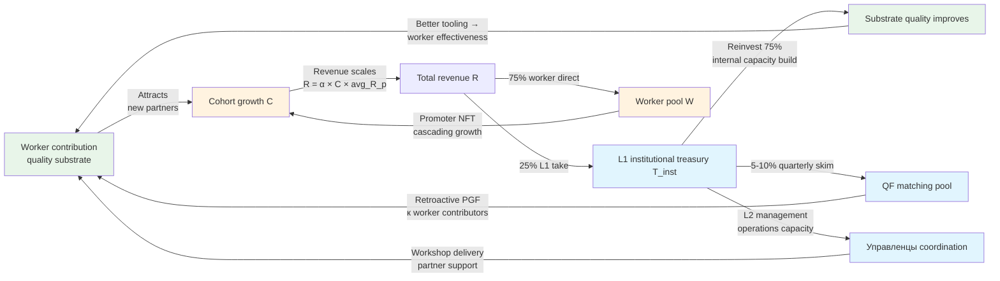

# Phase 8 — Self-Sustaining Growth Thesis

> **Тезис.** Jetix closed-loop self-sustaining trajectory: 4 compound growth conditions + 3 trigger points + comparison к VC-backed (slower initial / more durable long-term trade-off) + flywheel mermaid D16.

---

## §A Compound growth conditions

Per Phase 7 §C.4 + Network State substrate logic:

### §A.1 Condition 1 — Treasury reinvestment rate > 1.0

**Definition:** Each € reinvested via L1 institutional pool generates > €1 returned via:
- Worker contribution (new substrate features → more cohort revenue)
- Viral coefficient amplification (new partners brought by promoter network)
- Workshop pricing scaling (substrate quality justifies higher prices)

**Threshold:** Reinvestment ROI ≥ 1.0 quarterly.

**Verification approach:** Quarterly governance audit — measures € spent on substrate development vs incremental € revenue from substrate-enabled features. If ROI < 1.0 для 2 consecutive quarters → governance vote re-allocates L1 spend.

**Mondragón comparable:** Mondragón Caja Laboral funds new coop incubation with similar reinvestment logic; ~50-year track record positive ROI on Foundation reinvestment.

### §A.2 Condition 2 — Viral coefficient K > 0.5

**Definition:** К = (new partners brought by existing partners per period) / (existing partners). When K > 0.5, network effect emerges; K ≥ 1.0 = exponential phase.

**K threshold dependencies:**
- Workshop substrate quality (Workshop alumni → become builders → become referrers)
- Promoter NFT bonus operational (V10 deployed — explicit reward for network growth)
- Partner-bound communities active
- External brand resonance (Workshop demand > supply)

**Empirical K estimates (per Strategic Plan Phase 8 cohort scaling):**

| Phase | Time | Expected K |
|---|---|---|
| Y1 Phase 1 launch | 0-12 months | 0.2-0.4 (foundation-dependent) |
| Y2 Phase 1+ stabilization | 12-24 months | 0.4-0.7 |
| **Y3 Phase 2 transition** | **24-36 months** | **0.7-1.0 (threshold)** |
| Y4 Phase 2+ scaling | 36-48 months | 1.0-1.5 (exponential) |
| Y5+ Phase 3 network state | 48+ months | 1.5+ (Reed's Law applicable) |

### §A.3 Condition 3 — Member retention > 70%

**Definition:** Quarterly retention ρ ≥ 70% sustained across L1+L3+L4+L5 tiers.

**Why 70% threshold:**
- DR-26 Scenario B math model assumes ~75% quarterly retention
- Mondragón retention historically ~85-90% (cooperative discipline)
- Cohort-platform comparables (Maven / Coursera): 30-50% retention typical → Jetix targets significantly above

**Threshold dependencies:**
- Worker share Option A/B/C choice flexibility (per partner Charter)
- RageQuit fork-and-leave preserved (R12 — psychological safety knowing exit available)
- Mondragón-spirit cohort culture (peer support; cooperative identity)
- Reasonable workload expectations (not exploitative)

### §A.4 Condition 4 — Workshop pricing scales

**Definition:** L7 Workshop pricing demonstrably increases с substrate quality + reputation accumulation.

**Trajectory:**

| Year | Workshop L7 baseline | Workshop L6 cohort | Substrate justification |
|---|---|---|---|
| Y1 | €100-300/Workshop attendance | €500-1500/cohort cycle | Early MVP; founder credibility |
| Y2 | €200-500 | €1500-3000 | Workshop curriculum proven |
| Y3 | €400-800 | €3000-5000 | Substrate quality + alumni success stories |
| Y4 | €600-1200 | €5000-8000 | Network effect attribution |
| Y5+ | €1000-2500 | €8000-15000 | Premium cooperative-substrate signal |

[src: DR-26 Phase 5 Workshop pricing modeling + Distribution Plan §5]

---

## §B Trigger points

### §B.1 Critical mass — ~100 paying L7 users

Per Phase 7 §C.3 + H7 People-NS §6 network value derivation:

**Threshold:** ~100 paying L7 Workshop users + ~20 active L3+ partners + L1 First Clan (9 confirmed).

**At this threshold:**
- L1 institutional pool reaches €50-100K monthly (25% × €200-400K total system revenue)
- L2 управленцы pool €50-100K monthly enables FTE compensation для ~3-5 управленцы
- L3 Ruslan slice €12-25K monthly enables founder full-time
- Worker pool €150-300K monthly enables 10-30 active partner FTE-equivalent

**Pre-critical mass (Y1):**
- Bridge funding ε(t) > 0 needed (~€20-40K/month)
- Foundation / Anthropic / VC / personal capital source

### §B.2 Network effect K ≥ 1.0 — exponential phase

When K reaches 1.0 sustained, cohort growth shifts from linear к exponential:
```
C(t+1) = C(t) × (ρ + K)
With ρ=0.75 + K=1.0 → 1.75 growth multiplier per quarter (exponential)
```

**Estimated timing:** Y3-Y4 per Strategic Plan Phase 8.

### §B.3 Treasury self-fund — Y3+ scenario

When T_inst cumulative reaches ~€500-1M:
- Self-funded substrate development (no external bridge needed)
- QF matching pool quarterly sustainable
- Workshop tier scholarships (educational access expansion)
- Partner emergency fund (anti-churn)

**Estimated timing:** Y3-Y4 per DR-26 Scenario B.

---

## §C Comparison к non-closed-loop systems

### §C.1 Traditional VC-backed startup

**Dependencies:**
- External capital Series A/B/C (typically €1-10M рounds)
- Investor equity dilution (founder ownership 70% → 50% → 30% → 20% across 3 rounds)
- IPO / acquisition exit liquidity для investors (5-7 year horizon)

**R12 tension:**
- Investor extraction expectation (10-30× return required by VC math)
- Dilution = founder/early-team extraction beyond agreed share (changes ownership %)
- Acquisition exit = potential R12 violation (mass-extraction at exit; community/users not party к exit)

### §C.2 Cooperative DAO (RaidGuild / DXdao / Gitcoin)

**Dependencies:**
- Member-pledged contribution (initial Loot pool)
- Treasury growth via member work + grants
- No external equity sale (cooperative spirit)

**Sustainability track record:**
- RaidGuild — 5+ years sustainable; ~50 members
- Gitcoin — 5+ years; matching pool partially externally funded (Coinbase / Polychain)
- DXdao — sunset 2024 (sustainability failed; high ops overhead)

**Lessons applied к Jetix:**
- RaidGuild member-pledge + RageQuit = R12-exemplar; adopt в V10
- Gitcoin QF matching = strong для public goods; adopt в V10
- DXdao lessons: avoid overcomplex governance; keep ops lean

### §C.3 Mondragón cooperative federation

**Dependencies:**
- Member capital pool (Caja Laboral)
- Inter-coop social fund 10%
- No external equity (cooperative legal structure Basque)
- Government regional support (limited)

**Sustainability track record:**
- 68 years operational (founded 1956)
- ~80,000 workers / 95 coops / €11B annual revenue (2023)
- ~85-90% retention rate
- Self-sustaining через 2008/2013 crises (Fagor exception — overextension lesson)

**Lessons applied к Jetix:**
- 60/40 institutional/member split = adopt
- 5:1 ratio cap = adopt programmatic V10
- Inter-coop social fund = QF matching pool translation
- Mondragón University = Workshop tier already operational
- Avoid Mondragón Fagor over-extension lesson (concentration risk)

---

## §D Trade-off accepted

**Jetix closed-loop trade-off:**

| Dimension | VC-backed | Jetix closed-loop |
|---|---|---|
| Initial growth speed | Fast (capital-fueled) | Slower (no injection) |
| Long-term durability | Fragile (exit-pressure) | Stronger (no extraction-pressure) |
| Founder ownership | Diluted 70%→20% across rounds | Stable; recursive structure |
| Worker share | Stock options (volatile; often worthless on exit failure) | 75% direct retention + member account + worker NFT |
| Exit liquidity | IPO / acquisition (5-7y) | RageQuit any time (immediate) |
| R12 compliance | Low (extraction pressure structural) | High (designed-in) |
| Network effect dependency | Network effect optional | Network effect critical для self-sustaining |
| External capital risk | High (next round dependency) | Low (bridge funding Y1-4 only) |

**Jetix accepts:** slower Y1-2 + bridge funding Y1-4 dependency + network effect critical for Y5+ in exchange для long-term durability + R12 compliance + founder ownership stability + community alignment.

---

## §E Mermaid D16 — Self-sustaining growth flywheel



---

## §F R12 paired-frame check (self-sustaining specific)

| R12 dimension | Self-sustaining risk | Mitigation |
|---|---|---|
| extraction_beyond_share | None — closed loop = no external slice | Closed-loop invariant verified |
| wage_ratio_violation | Risk при cohort small (<6) — Mondragón 5:1 edge case | Cohort threshold gate + 90% supermajority override |
| non_consensual_distribution | Risk при L2 reinvestment vote concentration | Governance vote transparency + L1 token oversight |
| fork_prevention_attempt | None — RageQuit preserved + bridge funding optional (not lock-in) | RageQuit smart contract + bridge funding non-equity |

**Verdict:** ✓ Self-sustaining trajectory R12-compliant when V10 hybrid mechanisms operational + cohort threshold gate active.

---

## §G Cross-refs

- Phase 7 closed-loop dynamics §C self-sustaining threshold derivation
- Phase 9 Mondragón comparable §A 68-year track record
- DR-26 Phase 5 5-year math model
- Strategic Plan Phase 8 1M user trajectory
- H7 People-NS LOCK network effect substrate

---

*Phase 8 closure 2026-05-21. Brigadier-scribe Cloud Cowork.*
