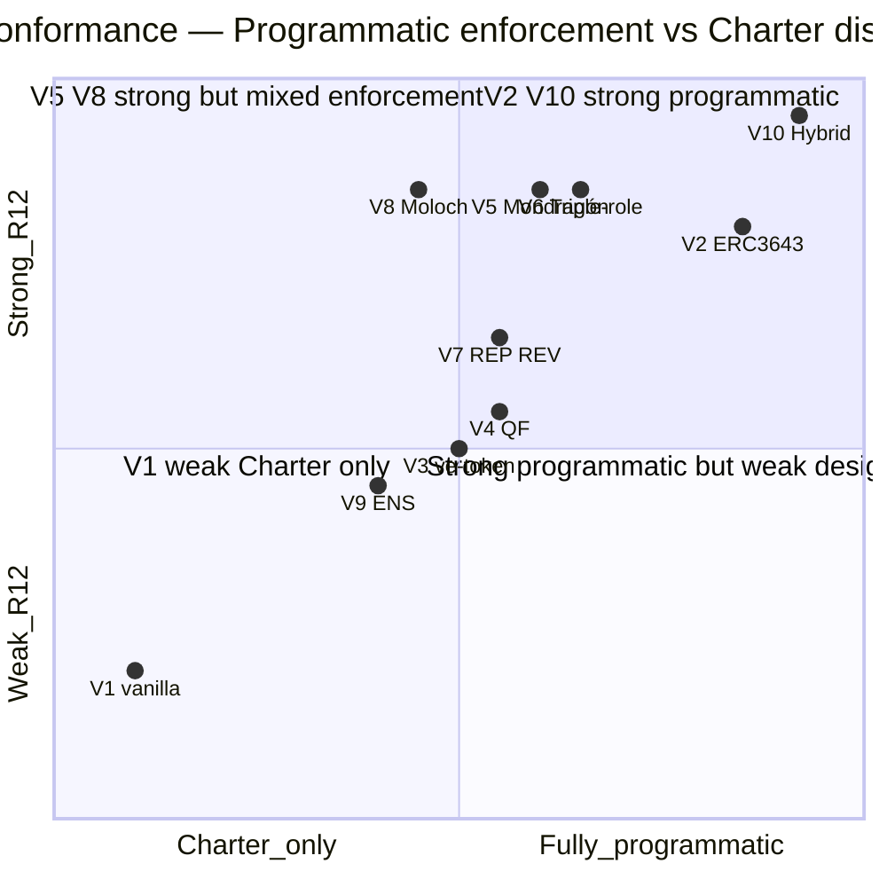

# Phase 10 — R12 Anti-Extraction Conformance Per Variant

> **⭐ LOCK preservation note.** R12 LOCK text PRESERVED VERBATIM from `swarm/awaiting-approval/r12-anti-extraction-2026-05-12.md` (LOCKED 2026-05-12 commit `93b796d`). Любая модификация = refutation condition trigger per prompt frontmatter R: field.

> **Тезис.** Per-variant R12 conformance audit (10 variants × 4 R12 action classes = 40 checkpoints). Plus V10 hybrid R12-strongest verdict + Mermaid D19 scorecard.

---

## §A R12 LOCK text restate (verbatim — DO NOT MODIFY)

### §A.1 R12 rule canonical (PRESERVED VERBATIM)

**English (R12 LOCKED 2026-05-12, source `swarm/awaiting-approval/r12-anti-extraction-2026-05-12.md` §1):**

> «AI / substrate cannot extract value from members beyond agreed share; members can fork-and-leave without penalty.»

**Russian (CLAUDE.md §4.1 inline LOCKED 2026-05-12):**

> «AI / substrate не может извлекать ценность из участников сверх согласованной доли; участники могут отделиться и уйти без штрафа.»

### §A.2 R12 4 action classes (RUSLAN-LAYER per CLAUDE.md §4.2 + Option D Hybrid 2026-05-18)

1. `extraction_beyond_share` — extraction по revenue / equity / data / attention / reputation beyond explicit Charter agreement
2. `wage_ratio_violation` — Mondragón 5:1 ratio cap breach
3. `non_consensual_distribution` — distribution decisions made unilaterally without member consent
4. `fork_prevention_attempt` — any mechanism (technical / contractual / social) preventing member exit с reasonable terms

Per Pillar C Tier 2 R12 + Option D Hybrid programmable Ethereum acked 2026-05-18 commit `8a3d800`.

---

## §B Per-variant R12 audit matrix (10 variants × 4 dimensions = 40 checkpoints)

### §B.1 V1 — Vanilla ERC-20 + DAO Governance

| Action class | Risk | Notes |
|---|---|---|
| extraction_beyond_share | ⚠️ HIGH | No native ratio cap; off-chain Charter only; whale concentration risk |
| wage_ratio_violation | ⚠️ HIGH | Off-chain Charter discipline only |
| non_consensual_distribution | ⚠️ MEDIUM | 1T1V governance can concentrate; whale votes binding на minorities |
| fork_prevention_attempt | ✅ LOW | Tokens transferable → users can sell + exit (но lose governance share + member benefits) |

**V1 Overall:** ⚠️⚠️ Weak — requires strict off-chain Charter discipline для R12 compliance.

### §B.2 V2 — ERC-3643 Compliance + Soulbound Membership

| Action class | Risk | Notes |
|---|---|---|
| extraction_beyond_share | ✅ LOW | Compliance contract programmatic max holder + per-jurisdiction caps |
| wage_ratio_violation | ✅ LOW | On-chain ratio cap enforceable; revert if breach |
| non_consensual_distribution | ✅ LOW | Permissioned + governance with KYC accountability |
| fork_prevention_attempt | ⚠️ MEDIUM | Permissioned can theoretically lock out users (KYC revocation); RageQuit equivalent via burn-and-redeem mechanic |

**V2 Overall:** ✅ Strong — but KYC overhead reduces "without penalty" frictionless ideal.

### §B.3 V3 — ve-Token

| Action class | Risk | Notes |
|---|---|---|
| extraction_beyond_share | △ MEDIUM | Vote-bribery secondary market (Convex/Votium analog risk) — extraction по governance influence |
| wage_ratio_violation | △ MEDIUM | Off-chain Charter; ve-boost curve can encode но complex |
| non_consensual_distribution | △ MEDIUM | Long-lock voters can decide for short-locked majority |
| fork_prevention_attempt | ⚠️ MEDIUM | 4-year lockup = significant capital frozen; fork-and-leave costs lock penalty |

**V3 Overall:** △ Medium — capital lockup tension с fork-and-leave «without penalty» principle.

### §B.4 V4 — Quadratic Funding + RetroPGF

| Action class | Risk | Notes |
|---|---|---|
| extraction_beyond_share | △ MEDIUM | Matching pool sustainability external dependency; potential extraction by matching pool admin |
| wage_ratio_violation | △ MEDIUM | Round-by-round emergent; can breach in any single round |
| non_consensual_distribution | △ MEDIUM | RetroPGF voter coordination → some unilateral feel |
| fork_prevention_attempt | ✅ LOW | Token transferable; contributor fork-and-leave possible |

**V4 Overall:** △ Medium — strong in QF principle, weak in ratio cap.

### §B.5 V5 — Mondragón-style 60/40 + 5:1 Cap On-chain

| Action class | Risk | Notes |
|---|---|---|
| extraction_beyond_share | ✅ LOW | 60/40 split hardcoded; member account proportional |
| wage_ratio_violation | ✅ LOW | On-chain 5:1 ratio cap programmatic |
| non_consensual_distribution | ✅ LOW | Member-vote governance; transparent ledger |
| fork_prevention_attempt | ✅ LOW | RageQuit member account return |

**V5 Overall:** ✅✅ Strong — direct Mondragón pattern translation.

### §B.6 V6 — Triple-role NFT Bundle

| Action class | Risk | Notes |
|---|---|---|
| extraction_beyond_share | ✅ LOW | Per-role explicit caps |
| wage_ratio_violation | ✅ LOW | Per-role cap (5:1) + aggregate cap design |
| non_consensual_distribution | ✅ LOW | Per-role governance + soulbound promoter prevents Sybil |
| fork_prevention_attempt | ✅ LOW | RageQuit each role independently or aggregate |

**V6 Overall:** ✅✅ Strong — triple-role explicit + per-role caps + soulbound promoter.

### §B.7 V7 — Reputation + Revenue Hybrid

| Action class | Risk | Notes |
|---|---|---|
| extraction_beyond_share | ✅ LOW | REP-gated REV access; contribution-based |
| wage_ratio_violation | △ MEDIUM | REP threshold can encode 5:1 ratio; off-chain Charter для REV |
| non_consensual_distribution | △ MEDIUM | Reputation scorer centralization risk |
| fork_prevention_attempt | ✅ LOW | REV transferable; exit unrestricted |

**V7 Overall:** ✅ Medium-strong — strong on contribution-alignment, weak on ratio precision.

### §B.8 V8 — Cooperative DAO + RageQuit (Moloch)

| Action class | Risk | Notes |
|---|---|---|
| extraction_beyond_share | ✅ LOW | Member-pledged contributions; proportional treasury |
| wage_ratio_violation | △ MEDIUM | Off-chain Charter only |
| non_consensual_distribution | ✅ LOW | Moloch governance + RageQuit defense |
| fork_prevention_attempt | ✅✅ LOW | RageQuit native; R12-exemplar (cited Q2 ack 2026-05-12) |

**V8 Overall:** ✅✅ Strong — R12-exemplar pattern; but missing ratio cap programmatic.

### §B.9 V9 — ENS-style Domain Ownership

| Action class | Risk | Notes |
|---|---|---|
| extraction_beyond_share | △ MEDIUM | Renewal fees can creep; no native cap on extraction |
| wage_ratio_violation | ⚠️ HIGH | Domain ownership ≠ Mondragón; no native ratio mechanism |
| non_consensual_distribution | △ MEDIUM | Domain owner decisions binding (1 domain = 1 vote) |
| fork_prevention_attempt | ✅ LOW | Don't renew = soft fork-leave; no penalty |

**V9 Overall:** △ Medium — strong on exit ease; weak on ratio + extraction control.

### §B.10 V10 — ⭐ Hybrid (Mondragón ratio + Triple-role NFT + RageQuit + QF)

| Action class | Risk | Notes |
|---|---|---|
| extraction_beyond_share | ✅✅ LOW | Triple-enforced: Mondragón ratio cap on-chain + QF matching contribution-aligned + soulbound promoter anti-Sybil + Charter per-role explicit |
| wage_ratio_violation | ✅✅ LOW | On-chain 5:1 ratio cap programmatic + 90% supermajority override + per-role + aggregate caps |
| non_consensual_distribution | ✅ LOW | SBT 1-id-1-vote + QF quadratic + reputation-weighted thresholds + transparent on-chain ledger |
| fork_prevention_attempt | ✅✅ LOW | RageQuit native (Moloch pattern); proportional treasury claim; immediate exit; 30-day notice for cascade-prevention only |

**V10 Overall:** ✅✅✅ Strongest — R12 triple-enforced across all 4 action classes.

---

## §C Per-variant verdict summary

| Variant | extraction | wage_ratio | non_consensual | fork_prevention | **Overall R12** |
|---|---|---|---|---|---|
| V1 vanilla | ⚠️ | ⚠️ | △ | ✅ | ⚠️⚠️ Weak |
| V2 ERC-3643 | ✅ | ✅ | ✅ | △ | ✅ Strong |
| V3 ve-token | △ | △ | △ | ⚠️ | △ Medium |
| V4 QF+RetroPGF | △ | △ | △ | ✅ | △ Medium |
| V5 Mondragón | ✅ | ✅ | ✅ | ✅ | ✅✅ Strong |
| V6 Triple-role | ✅ | ✅ | ✅ | ✅ | ✅✅ Strong |
| V7 REP+REV | ✅ | △ | △ | ✅ | ✅ Medium-strong |
| V8 Moloch | ✅ | △ | ✅ | ✅✅ | ✅✅ Strong (exemplar) |
| V9 ENS | △ | ⚠️ | △ | ✅ | △ Medium |
| **V10 Hybrid** ⭐ | **✅✅** | **✅✅** | **✅** | **✅✅** | **✅✅✅ Strongest** |

---

## §D V10 R12-strongest verification

### §D.1 4 mechanisms triple-enforced

V10 R12 conformance through 4 simultaneously-enforced mechanisms:

1. **Mondragón 5:1 ratio cap on-chain**: revert tx если max:min payment ratio > 5; governance 90% supermajority required for override.
2. **RageQuit proportional treasury claim**: any member can fork-and-leave immediately; smart contract proportional treasury exchange.
3. **QF matching pool contribution-aligned**: 5-10% L1 quarterly skim distributes к worker contributors via QF formula (anti-extraction native).
4. **Soulbound promoter NFT**: cannot be sold/transferred → no Sybil extraction via fake referrals.

### §D.2 Charter-stated explicit baseline

V10 mandates:
- L1 25% take rate Charter-stated baseline
- L2 25% управленцы pool subset Charter-explicit
- L3 25% Ruslan personal slice Charter-explicit + recursive structure visible
- 75% worker direct retention Charter-explicit
- Per-role caps explicit
- 30-day opt-out preserved (per R12 LOCK packet §2)

### §D.3 Beyond-LOCK enhancement (Option D Hybrid 2026-05-18)

Per Option D Hybrid ack 2026-05-18 commit `8a3d800`: programmatic enforcement Ethereum-bound для R12 4 action classes. V10 implements all 4 action class checks on-chain:

```solidity
// Pseudo-code (V10 hybrid)
function action(...) external {
    require(!isExtractionBeyondShare(...), "R12-1 violation");
    require(!isWageRatioViolation(...), "R12-2 violation");
    require(consentEstablished(...), "R12-3 non_consensual");
    require(!isForkPreventionAttempt(...), "R12-4 fork-prevention");
    _execute(...);
}
```

---

## §E Recommendation: V10 hybrid R12-strongest variant

**Brigadier recommendation provisional (R1 lock pending Ruslan):**

V10 hybrid offers **strongest R12 conformance** across all 4 action classes. Trade-off: highest complexity + audit budget ($75-150K).

**Fallback variants R12-strong:**
- V5 Mondragón-style — strong on all 4 dimensions; simpler than V10; misses promoter dimension
- V6 Triple-role — strong on all 4 dimensions; partial Mondragón
- V8 Moloch RageQuit — R12-exemplar; battle-tested; missing ratio cap on-chain

**Variants to avoid для R12 priority:**
- V1 vanilla — weak без strict Charter discipline
- V9 ENS — weak on ratio + extraction

---

## §F Mermaid D19 — R12 conformance scorecard



---

## §G Cross-refs

- LOCK source: `swarm/awaiting-approval/r12-anti-extraction-2026-05-12.md` (preserved verbatim §A)
- Option D Hybrid: `swarm/awaiting-approval/r12-programmable-ethereum-2026-05-18.md`
- TOKENOMICS-VARIANTS sub-doc: V1-V10 spec
- Phase 4 RECURSIVE-PARTNERSHIP §7 R12 per layer audit
- Phase 6 TRIPLE-ROLE sub-doc §14 R12 triple-role verdict

---

*Phase 10 closure 2026-05-21. R12 LOCK text PRESERVED VERBATIM. Brigadier-scribe Cloud Cowork.*
