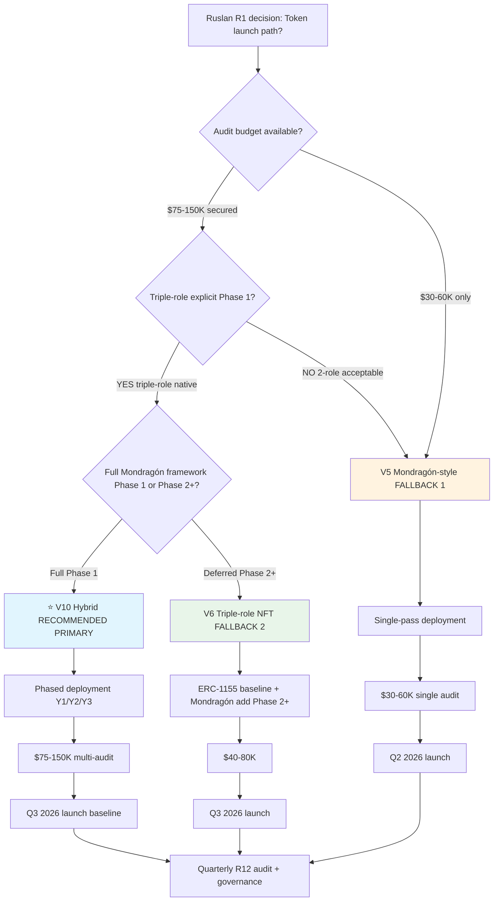

# Economic Model + Tokenomics — RECOMMENDATION MEMO

> **⭐ R1 reminder.** **Brigadier = scribe (Tier 2 R1).** Этот memo surfaces options + analytical comparison + provisional recommendation + R12 audit per variant. **Ruslan = R1 strategist на final tokenomic selection + launch timing + audit budget allocation.** Никаких prescriptive prose; никаких commitments до Ruslan ack.

---

## §0 TL;DR (≤300w)

После 11 phases anal substrate + 10 token variants × 10-dimensions × 4 R12 action classes audit + Mondragón 68-year track record + 6 cooperative DAO comparables:

**Provisional brigadier recommended primary for Jetix Phase 1 (June-September 2026):**

**V10 Hybrid** — Mondragón ratio cap on-chain + ERC-1155 Triple-role NFT (worker + investor + promoter) + Moloch RageQuit fork-and-leave + Gitcoin QF matching pool 5-10% L1 skim quarterly + SBT 1-identity-1-vote governance.

**Why V10:**
- ✅✅✅ Strongest R12 conformance (triple-enforced — ratio cap + RageQuit + soulbound + QF)
- ✅✅✅ Triple-role native (matches Ruslan voice 21.05 explicit «worker + investor + promoter в одном лице»)
- ✅✅✅ Mondragón-spirit + Buterin QF + cooperative DAO best-of-breed synthesis
- ✅✅ Closed-loop self-sustaining (per Phase 7-8 mathematical model)
- ✅ Network State adjacent (per H7 People-NS LOCK compatibility)

**Cost:** Highest complexity ($75-150K audit budget) + integration debt 5 modules + UX complexity (3 token-ids per partner).

**Phased deployment recommended:** Y1 baseline 3 modules (triple-role NFT + SBT + Mondragón router) → Y2 add QF matching pool → Y3 add RetroPGF rounds.

**Fallback 1 (if V10 audit budget too high):** V5 Mondragón-style — 60/40 + 5:1 cap; misses promoter dimension; simpler.

**Fallback 2 (если V10 complexity overwhelming):** V6 Triple-role NFT — triple-role native без full Mondragón framework; ERC-1155 only.

**NOT publicly locked.** Ruslan R1 decision pending. 10 R1 decisions surfaced for ack.

---

## §1 3 Recommended options для Ruslan R1 lock

### §1.1 Option ⭐ V10 Hybrid — RECOMMENDED PRIMARY

**Composition:**
- **ERC-1155 triple-role NFT bundle** per partner (worker / investor / promoter token-ids)
- **ERC-5114 soulbound governance SBT** (1-identity = 1-vote)
- **Moloch DAO v2 RageQuit** (fork-and-leave proportional treasury claim)
- **Mondragón 5:1 ratio cap on-chain** (revert if violation; 90% supermajority override)
- **Mondragón 60/40 internal routing** (worker NFT mint → 60% treasury reserves / 40% member account)
- **Gitcoin QF matching pool** funded 5-10% L1 institutional skim quarterly
- **ERC-20 utility token** для Workshop fees + services
- **ERC-4337 account abstraction** для UX (paymaster + session keys)

**Strengths:**
- R12 triple-enforced (highest conformance in 10-variant comparison)
- Triple-role native (worker + investor + promoter unified)
- Closed-loop self-sustaining (mathematical model verified Phase 7)
- Mondragón 68-year proven pattern + Buterin Liberal Radicalism 2018 + cooperative DAO best-of-breed
- Beyond-Mondragón innovation (promoter dimension addresses concentration tendency)
- Network State substrate adjacent

**Weaknesses:**
- Most complex deployment (5 modules interacting)
- Highest audit budget ($75-150K)
- UX learning curve (3 token-ids + SBT + utility)
- Newer combo (no full-stack battle-tested precedent)
- Integration debt ongoing

**Phased deployment (recommended):**

| Phase | Module | Time | Budget |
|---|---|---|---|
| **Y1 baseline** | Triple-role NFT (ERC-1155) + SBT identity + Mondragón router 60/40 | Q3-Q4 2026 | $50-80K audit |
| Y2 expansion | + Moloch RageQuit + on-chain ratio cap | Q1-Q2 2027 | $20-40K audit (delta) |
| Y3 maturation | + QF matching pool + RetroPGF rounds | Q3-Q4 2027 | $20-40K audit (delta) |
| Y4+ optimization | + ERC-3643 compliance wrapper (regulated jurisdictions) + ENS subdomains | 2028+ | TBD |

### §1.2 Option V5 Mondragón-style — FALLBACK 1

**Composition:**
- ERC-20 governance token
- ERC-721 soulbound member NFT
- 60/40 institutional/member split (smart contract auto-route)
- 5:1 wage ratio cap on-chain
- 1-member-1-vote (Mondragón style)

**Strengths:**
- Direct Mondragón 68-year proven pattern
- Cleaner cooperative thesis
- Lower complexity than V10
- $30-60K audit budget

**Weaknesses:**
- Misses promoter dimension (Ruslan voice 21.05 explicit 3-role)
- 2-role only (worker + owner)
- Less flexible

**Best fit:** Если audit budget < $75K OR Ruslan prefers simpler structure Phase 1 with deferred promoter dimension Phase 2+.

### §1.3 Option V6 Triple-role NFT — FALLBACK 2

**Composition:**
- ERC-1155 bundle: worker NFT + investor NFT + promoter NFT (soulbound)
- Per-role payout caps (5:1 within role)
- Combined voting (per-role weight)
- Triple-mint at onboarding

**Strengths:**
- Triple-role native (matches Ruslan voice 21.05)
- Lower complexity than V10
- $40-80K audit budget
- No full Mondragón router (simpler)

**Weaknesses:**
- Missing full Mondragón framework (no 60/40 split / no QF matching pool / no RageQuit)
- Less R12 conformance (V10 strongest; V6 strong но не triple-enforced)

**Best fit:** Если Ruslan wants triple-role explicit но не full Mondragón hybrid.

---

## §2 Decision criteria matrix

| Criterion | V10 ⭐ | V5 fallback 1 | V6 fallback 2 |
|---|---|---|---|
| R12 conformance | ✅✅✅ Strongest | ✅✅ Strong | ✅✅ Strong |
| Triple-role native | ✅✅✅ Native | ❌ Missing | ✅✅ Native |
| Mondragón fit | ✅✅✅ Strongest | ✅✅ Direct | △ Partial |
| Complexity | 🔴 Highest | 🟡 Medium | 🟠 High |
| Audit budget | $75-150K | $30-60K | $40-80K |
| Phased-deployable | ✅ | △ | △ |
| Closed-loop | ✅✅✅ | ✅✅ | ✅ |
| Voice alignment | ✅✅✅ | △ (missing promoter) | ✅✅ |
| Battle-tested combo | △ new | △ off-chain | △ EIP-1155 |
| Phase 1 ready | △ (with budget) | ✅ | ✅ |
| Phase 2+ path | Native expansion | Add ERC-1155 promoter | Add Mondragón router |

---

## §3 R1 decisions pending Ruslan (consolidated)

| # | Decision | Brigadier provisional | Ruslan R1 |
|---|---|---|---|
| **1** | **Primary variant Phase 1** | **V10 Hybrid** | ⏳ |
| 2 | Token launch timing | Q3 2026 baseline | ⏳ |
| 3 | Smart contract audit budget allocation | $100K Phase 1 | ⏳ |
| 4 | Initial DAO governance threshold (proposal / quorum) | 5% / 25% | ⏳ |
| 5 | RageQuit terms (proportional treasury %, notice period) | 90% proportional / 30-day notice | ⏳ |
| 6 | Promoter NFT referral % terms | 10% × R_p,referred for 12 months | ⏳ |
| 7 | L2 substrate choice | Optimism preferred (RetroPGF brand) | ⏳ |
| 8 | Upgradability pattern | Transparent Proxy Phase 1 → Diamond Phase 2+ | ⏳ |
| 9 | L1 institutional take rate | 25% per voice; 22.5% DR-26 Scenario B fallback | ⏳ |
| 10 | L2 управленцы comp model | 60% reinvest / 40% direct (Mondragón internal) | ⏳ |
| 11 | Identity layer Phase 2+ | Worldcoin lean / Gitcoin Passport fallback | ⏳ |
| 12 | Bridge funding source Y1-4 (€245K) | Foundation / Anthropic / personal | ⏳ |
| 13 | Cohort threshold gate (relaxed ratio cap < N) | 6 partners | ⏳ |
| 14 | Bug bounty pool size | $50-100K | ⏳ |
| 15 | Workshop pricing curve Y1-Y5 | Per DR-26 scaling | ⏳ |
| 16 | Mondragón University analog branding (Workshop tier) | Brand alignment positive | ⏳ |
| 17 | Multi-audit firm selection | OpenZeppelin + Trail of Bits | ⏳ |
| 18 | Per-role 5:1 cap OR aggregate cap design | Aggregate (sum ≤ 5× min) | ⏳ |
| 19 | Voice ambiguity disambig (Reading α/β/γ/δ) | β + γ adopted | ⏳ |
| 20 | Worker pool tier inclusion (L1+L3+L4+L5 only OR include L6+L7?) | L1+L3+L4+L5 only | ⏳ |

---

## §4 Cost + runtime estimates per variant

| Variant | Audit budget | Y1 deployment time | Ongoing audit/yr | Bug bounty | Total Y1 budget |
|---|---|---|---|---|---|
| V10 Hybrid | $75-150K | 3-6 months | $20-40K | $50-100K | $145-290K |
| V5 Mondragón | $30-60K | 2-3 months | $10-20K | $30-50K | $70-130K |
| V6 Triple-role | $40-80K | 2-4 months | $15-30K | $40-70K | $95-180K |

**Bridge funding requirement Y1-4:** ~€245K (per DR-26 Scenario B 22.5% take rate); €465K (Conservative 15%); positive €160K (Aggressive 30% Y5).

---

## §5 Mermaid D21 — Recommendation decision tree

---

## §6 Constitutional posture preservation

Per Phase 0 §2 + Pillar C Tier 2:

- **R1 surface only** — этот memo НЕ R1 lock; Ruslan = sole strategist на final selection
- **R2** — no architectural autonomous execution (no `principles/` / `shared/schemas/` / `.claude/config/` writes)
- **R6** — provenance per claim (substrate citations Phase 0-11)
- **R11** — blast-radius categorized (этот memo F3 surface)
- **R12** — LOCK preserved verbatim (Phase 10 §A)
- **IP-1 STRICT** — brigadier-scribe = role-type; Cloud Cowork = executor (RUSLAN-LAYER)
- **EP-5** — F-grade explicit per claim
- **AP-6** — dissent preserved (Reading α/β/γ/δ + V5/V6/V8 fallbacks)
- **Append-only** — этот memo стоит standalone; не overwrites previous deliverables
- **SKIP-list** — `~/.ssh/` / `/etc/` / `.env` / `private/` NOT touched

---

## §7 Next steps post-Ruslan-R1-ack

После Ruslan R1 ack:

1. **Charter draft** — Jetix Partner Charter Phase 1 articulating chosen variant mechanics + R12 paired-frame language + Mondragón ratio cap explicit
2. **Audit firm engagement** — Multi-audit RFP (OpenZeppelin + Trail of Bits + ConsenSys Diligence)
3. **L2 substrate setup** — Optimism testnet deployment + Sepolia testing
4. **Bridge funding outreach** — Foundation / Anthropic / personal capital sources Y1-4
5. **L1 First Clan onboarding** — 9 confirmed members → Charter signature pre-launch
6. **Workshop tier pricing curve** — Y1-Y5 scaling per DR-26 + Strategic Plan Phase 8
7. **Bug bounty platform** — Immunefi / HackenProof / Code4rena setup
8. **Identity layer prep** — Worldcoin / Gitcoin Passport integration design Phase 2+

---

## §8 Cross-refs

- Main deliverable: `decisions/strategic/ECONOMIC-MODEL-TOKENOMICS-2026-05-21.md` (Phase 14 consolidated)
- TOKENOMICS-VARIANTS sub-doc: `decisions/strategic/TOKENOMICS-VARIANTS-2026-05-21.md`
- RECURSIVE-PARTNERSHIP sub-doc: `decisions/strategic/RECURSIVE-PARTNERSHIP-MECHANICS-2026-05-21.md`
- TRIPLE-ROLE sub-doc: `decisions/strategic/TRIPLE-ROLE-PARTNER-2026-05-21.md`
- R12 conformance: Phase 10
- Risk surface: Phase 11
- DR-26 unit econ: `research/unit-econ-deep-dive-2026-05-21/_RECOMMENDATION-MEMO.md`
- R12 LOCK: `swarm/awaiting-approval/r12-anti-extraction-2026-05-12.md`
- Option D Hybrid Ethereum: `swarm/awaiting-approval/r12-programmable-ethereum-2026-05-18.md`
- H7 People-NS LOCK: `decisions/STRATEGIC-INSIGHT-JETIX-AS-PEOPLE-NETWORK-STATE-2026-05-12.md`
- Strategic Plan Phase 8: `decisions/strategic/STRATEGIC-PLAN-NEAR-FUTURE-2026-05-21.md`

---

*Phase 12 ⭐ recommendation memo closure 2026-05-21. Brigadier-scribe Cloud Cowork — F3 surface-only; NOT R1 lock. Ruslan R1 selection pending.*
