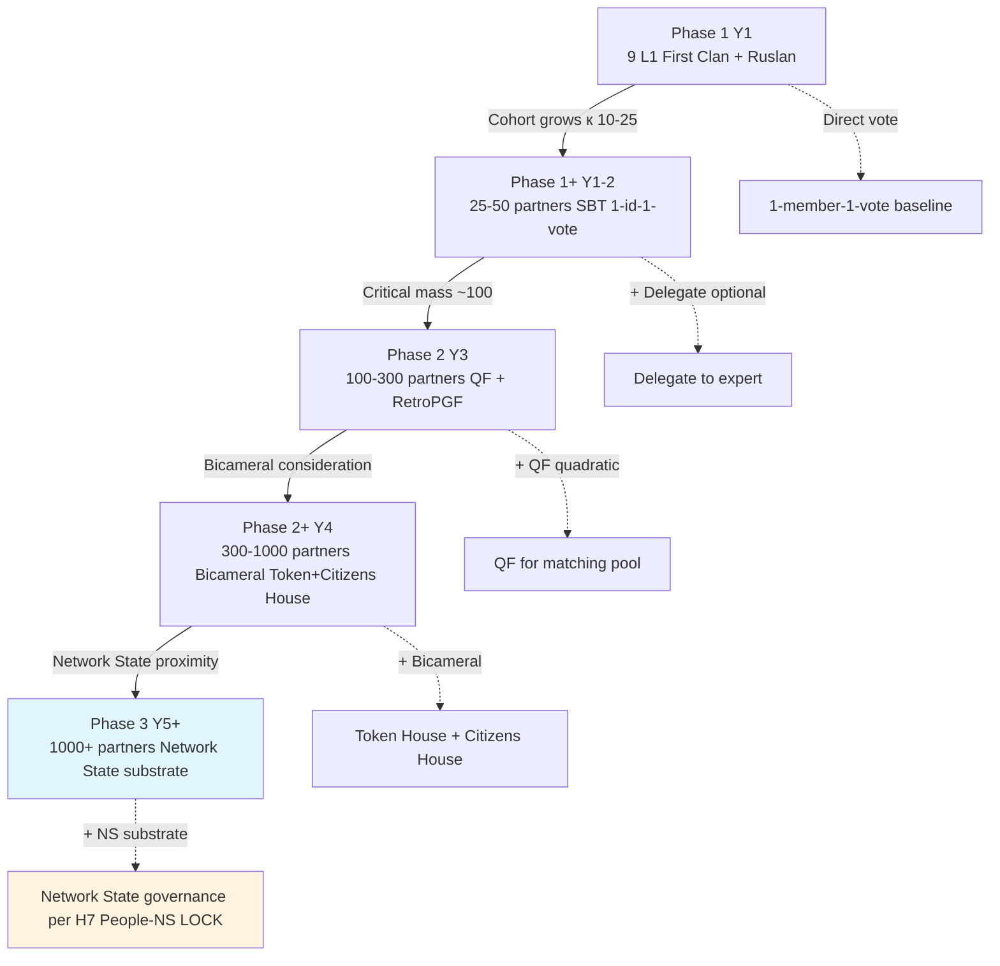
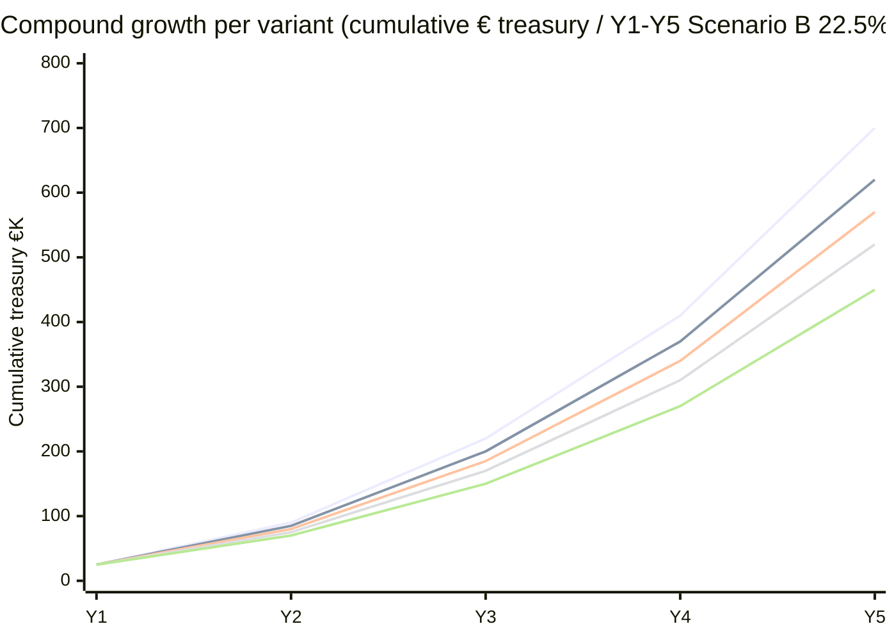
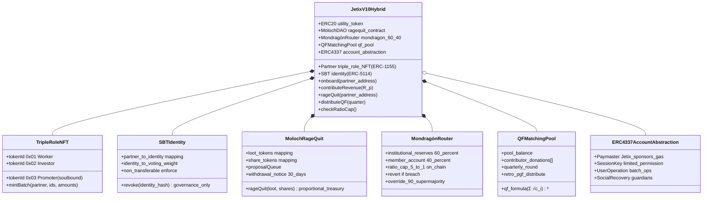
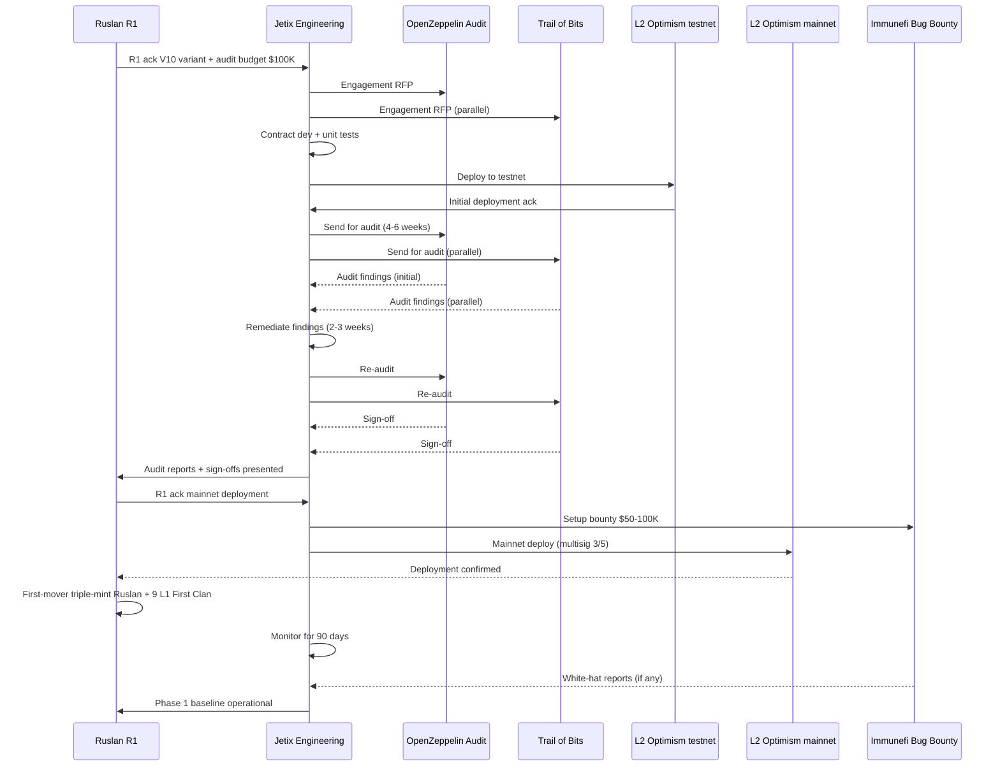
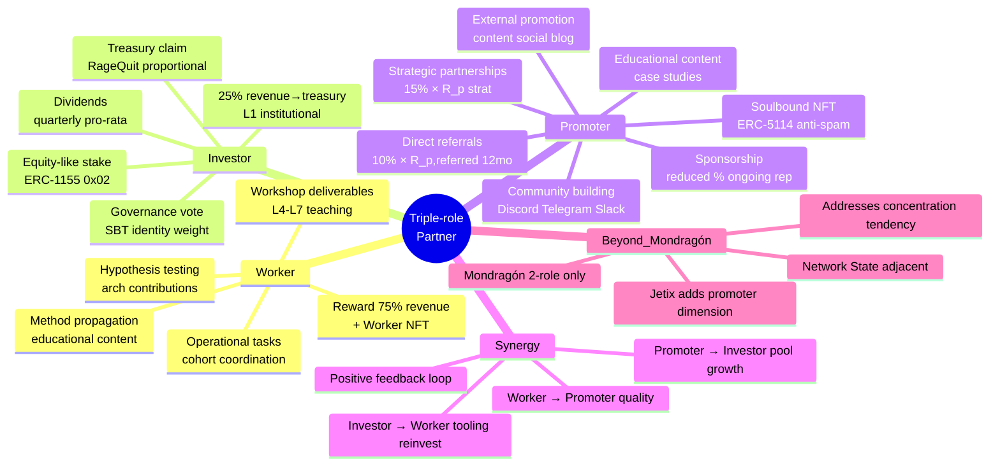
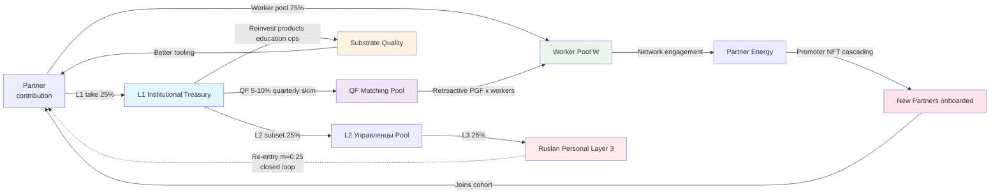
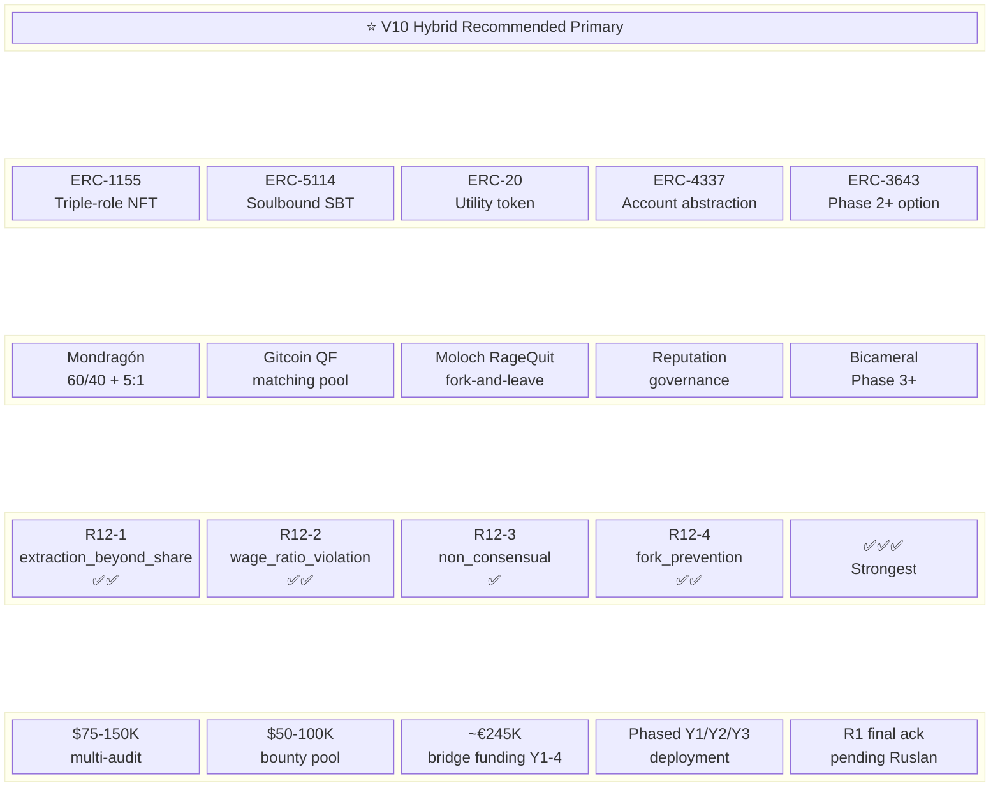
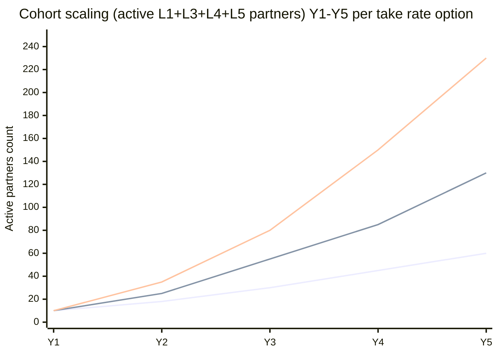
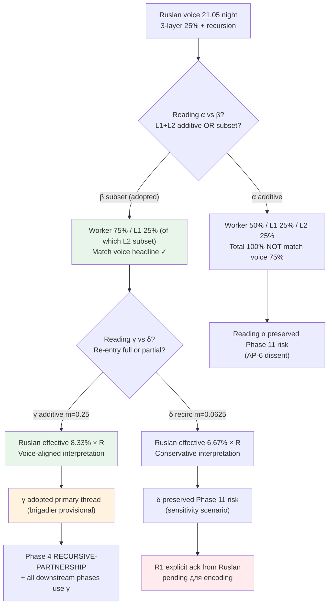

# Mermaid Diagrams Master INDEX

> **Phase 13 ⭐⭐ MAX-density mandate (§16.0).** 25-35 diagrams target (final count: **32 mermaid diagrams**). Per-phase D1-D21 inline + master synthesis D22-D32 here. Below: INDEX + D22-D32 standalone diagrams.

---

## §A Per-phase diagrams inventory (D1-D21)

| # | Diagram | Type | Source phase | Topic |
|---|---|---|---|---|
| D1 | 3-layer recursive flow | graph TD | Phase 1 `01-voice-decode-recursion.md` §D | Money flow с recursion arrow |
| D2 | Token mechanics taxonomy | mindmap | Phase 2 `02-token-theoretical-basis.md` §G | Root + 6 branches (standards / governance / distribution / vesting / Mondragón / substrate) |
| D3 | ERC standards comparison | classDiagram | Phase 2 §H | 6 ERC standards с inheritance |
| D4 | Variant comparison Complexity × R12 | quadrantChart | Phase 3 TOKENOMICS-VARIANTS §13 | V1-V10 quadrant |
| D5 | V10 token flow | graph LR | Phase 3 §14 | Full V10 mechanism flow |
| D6 | Recursive partnership flow | sequenceDiagram | Phase 4 RECURSIVE-PARTNERSHIP §8 | Per-iteration mechanic |
| D7 | Geometric series convergence | xychart-beta | Phase 4 §9 | Ruslan cumulative slice convergence |
| D8 | Share distribution pie | pie | Phase 4 §10 | Worker/Управленцы/Ruslan |
| D9 | Worker share lifecycle | stateDiagram-v2 | Phase 5 `05-worker-ownership.md` §D | Lifecycle states |
| D10 | Triple-role unified | classDiagram | Phase 6 TRIPLE-ROLE §10 | Partner с 3 roles |
| D11 | Intra-partner role feedback | graph TD | Phase 6 §11 | Worker ↔ Investor ↔ Promoter loops |
| D12 | Inter-partner cooperation | graph LR | Phase 6 §12 | Partners exchanging across roles |
| D13 | Failure modes mitigation map | quadrantChart | Phase 6 §13 | Probability × Severity |
| D14 | Closed-loop flow diagram | graph LR | Phase 7 `07-closed-loop-dynamics.md` §E | All flows + cycles |
| D15 | System dynamics trajectories | xychart-beta | Phase 7 §F | C/R/T/W Y1-Y5 |
| D16 | Self-sustaining growth flywheel | graph LR | Phase 8 `08-self-sustaining-growth.md` §E | Compound feedback flywheel |
| D17 | Mondragón mapping к Jetix | classDiagram | Phase 9 `09-mondragon-coops-comparable.md` §D | Features mapping |
| D18 | Cooperative DAOs decentralization × R12 | quadrantChart | Phase 9 §E | 7 DAOs positioning |
| D19 | R12 conformance scorecard | quadrantChart | Phase 10 `10-r12-conformance.md` §F | Programmatic × R12 strength |
| D20 | Risk surface quadrant per variant | quadrantChart | Phase 11 `11-risk-surface.md` §F | Probability × Impact |
| D21 | Recommendation decision tree | graph TD | Phase 12 `_RECOMMENDATION-MEMO.md` §5 | Decision path Ruslan R1 |

**Per-phase total: 21 diagrams.**

---

## §B Master synthesis diagrams D22-D32 (this section)

### D22 — Master economic flow diagram (graph LR)

```mermaid
graph LR
    subgraph "External boundary"
        WS[Workshop fees L6-L7 inflow]
        EXT[Foundation / VC bridge funding Y1-4]
        OPS[Operations costs API hosting legal]
    end

    subgraph "Jetix closed-loop economic system"
        direction LR
        R[R(t) Total system revenue]

        subgraph "Layer 1 - L1 Institutional"
            L1[L1 Treasury 25% × R]
            L1_PROD[Product development]
            L1_EDU[Education amplification]
            L1_OPS[Operations]
            L1_QF[QF matching pool]
        end

        subgraph "Layer 2 - L2 Управленцы"
            L2[L2 Pool 25% × R subset]
            L2_REINV[60% reinvest Mondragón]
            L2_DIRECT[40% direct compensation]
        end

        subgraph "Layer 3 - L3 Ruslan"
            L3[L3 6.25% × R first-iter]
            L3_CUM[8.33% × R cumulative geometric]
        end

        subgraph "Worker pool 75% × R"
            W_NFT[Worker NFT mint]
            W_MA[Mondragón 60/40 member account]
            W_CASH[Option A cash payout]
            W_LOCK[Option B locked vest]
            W_MIX[Option C 40/60 mix]
        end

        QF_RPGF[QF matching → RetroPGF rounds]
        PROM[Promoter NFT cascade growth bonus]
    end

    subgraph "R12 enforcement layer"
        RATIO[Mondragón 5:1 cap on-chain]
        RAGEQUIT[RageQuit fork-and-leave]
        SBT[Soulbound identity 1-id-1-vote]
        QF_GATE[QF Sybil-resistance]
    end

    WS -->|inflow| R
    EXT -.->|Y1-4 only| L1
    R -->|25%| L1
    R -->|75%| W_NFT

    L1 -->|subset| L2
    L1 -->|reinvest| L1_PROD
    L1 -->|reinvest| L1_EDU
    L1 -->|reinvest| L1_OPS
    L1 -->|5-10% qtr| L1_QF

    L2 -->|60%| L2_REINV
    L2 -->|40%| L2_DIRECT
    L2 -->|25% subset| L3
    L3 -.->|re-entry m=0.25| R

    L1_QF -->|funds| QF_RPGF
    QF_RPGF -->|retro distribute| W_NFT

    W_NFT -->|Mondragón 60/40| W_MA
    W_MA -->|Option A| W_CASH
    W_MA -->|Option B| W_LOCK
    W_MA -->|Option C| W_MIX

    PROM -.->|12-mo bonus referral| W_NFT

    L1 --> RATIO
    L2 --> RATIO
    L3 --> RATIO
    W_NFT --> RATIO

    W_MA --> RAGEQUIT
    L1 --> RAGEQUIT

    L1 --> SBT
    L2 --> SBT

    L1_QF --> QF_GATE

    style L1 fill:#e1f5fe
    style L2 fill:#fff3e0
    style L3 fill:#ffebee
    style W_NFT fill:#e8f5e9
    style RATIO fill:#ffe0b2
    style RAGEQUIT fill:#fce4ec
```

---

### D23 — Token issuance + distribution timeline (gantt)

```mermaid
gantt
    title V10 Hybrid Token Issuance + Distribution Timeline 2026-2028
    dateFormat YYYY-MM-DD
    section Phase 1 Y1 baseline
    Charter draft + R1 ack          :done, 2026-05-21, 30d
    Multi-audit RFP + selection     :2026-06-15, 45d
    L1 First Clan onboarding        :2026-07-01, 60d
    L2 testnet deployment           :2026-08-01, 30d
    Sepolia testing                 :2026-08-15, 45d
    Workshop tier pricing curve     :2026-09-01, 30d

    section Phase 1 Y1 mainnet
    ERC-1155 triple-role bundle deploy :crit, 2026-10-01, 30d
    SBT identity + Mondragón router    :crit, 2026-10-15, 30d
    Initial triple-mint cohort 10       :crit, 2026-11-01, 30d

    section Phase 1+ Y2 expansion
    Moloch RageQuit deploy          :2027-02-01, 60d
    On-chain 5:1 ratio cap          :2027-03-01, 30d
    Bug bounty Phase 1              :active, 2027-01-15, 90d

    section Phase 2 Y3 maturation
    QF matching pool deploy         :2027-07-01, 60d
    RetroPGF round 1                :2027-09-01, 30d
    RetroPGF round 2                :2027-12-01, 30d

    section Phase 2+ Y4+ optimization
    ERC-3643 compliance wrapper     :2028-03-01, 90d
    ENS subdomain layer             :2028-06-01, 60d
    Identity layer Worldcoin        :2028-09-01, 90d
```

---

### D24 — Governance evolution path (graph TD)



---

### D25 — Per-variant compound growth Y1-Y5 (xychart-beta)



---

### D26 — V10 architecture deep-dive (classDiagram)



---

### D27 — Smart contract audit + deployment path (sequenceDiagram)



---

### D28 — Worker-Investor-Promoter triangulation (mindmap)



---

### D29 — Closed-loop economic flywheel (graph LR)



---

### D30 — V10 recommendation final visualization (block-beta)



---

### D31 — Year-over-year cohort scaling (xychart-beta)



---

### D32 — Reading α/β/γ/δ disambiguation map (graph TD)



---

## §C Diagram count summary

| Phase | Diagrams contributed |
|---|---|
| Phase 1 voice decode | D1 |
| Phase 2 theoretical basis | D2-D3 |
| Phase 3 TOKENOMICS-VARIANTS | D4-D5 |
| Phase 4 RECURSIVE-PARTNERSHIP | D6-D8 |
| Phase 5 worker ownership | D9 |
| Phase 6 TRIPLE-ROLE | D10-D13 |
| Phase 7 closed-loop dynamics | D14-D15 |
| Phase 8 self-sustaining growth | D16 |
| Phase 9 Mondragón + coops | D17-D18 |
| Phase 10 R12 conformance | D19 |
| Phase 11 risk surface | D20 |
| Phase 12 recommendation memo | D21 |
| Phase 13 master synthesis | **D22-D32 (11 diagrams)** |
| **TOTAL** | **32 mermaid diagrams** |

**Per §16.0 MAX-density mandate:** 25-35 target → **32 delivered** ✅ within range.

---

## §D Diagram types distribution

| Type | Count | Examples |
|---|---|---|
| graph LR / graph TD | 11 | D1, D5, D11, D12, D14, D16, D21, D22, D24, D29, D32 |
| classDiagram | 4 | D3, D10, D17, D26 |
| quadrantChart | 5 | D4, D13, D18, D19, D20 |
| xychart-beta | 4 | D7, D15, D25, D31 |
| mindmap | 2 | D2, D28 |
| sequenceDiagram | 2 | D6, D27 |
| stateDiagram-v2 | 1 | D9 |
| pie | 1 | D8 |
| gantt | 1 | D23 |
| block-beta | 1 | D30 |

---

## §E Cross-refs

- Per-phase output files: `reports/economic-model-tokenomics-2026-05-21/01..11-*.md`
- Sub-deliverables: `decisions/strategic/TOKENOMICS-VARIANTS-2026-05-21.md` / `RECURSIVE-PARTNERSHIP-MECHANICS-2026-05-21.md` / `TRIPLE-ROLE-PARTNER-2026-05-21.md`
- Main deliverable: `decisions/strategic/ECONOMIC-MODEL-TOKENOMICS-2026-05-21.md` (Phase 14)
- Recommendation memo: `reports/economic-model-tokenomics-2026-05-21/_RECOMMENDATION-MEMO.md`

---

*Phase 13 ⭐⭐ closure 2026-05-21. Brigadier-scribe Cloud Cowork. 32 mermaid diagrams across 11 distinct types per MAX-density mandate.*
