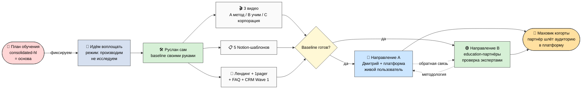
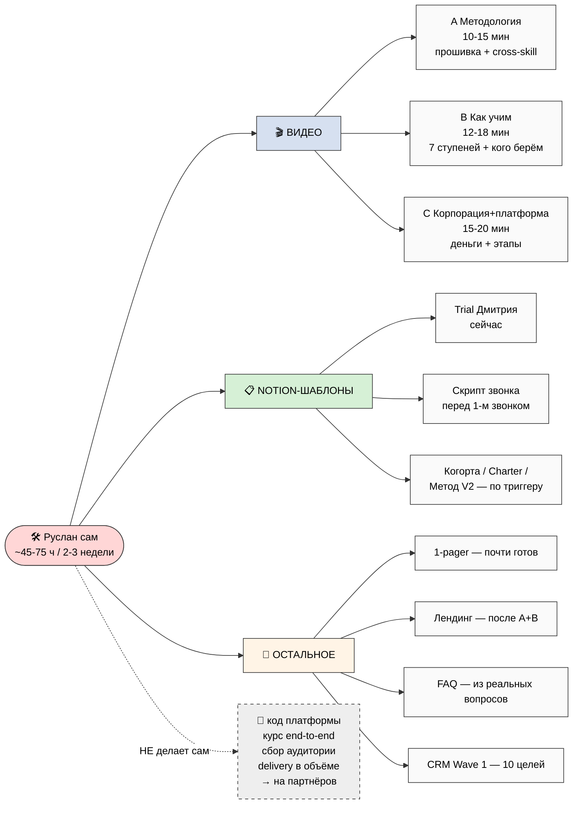
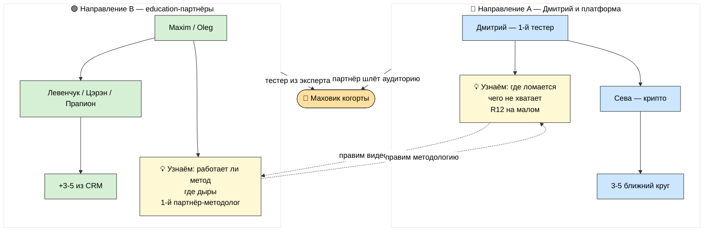
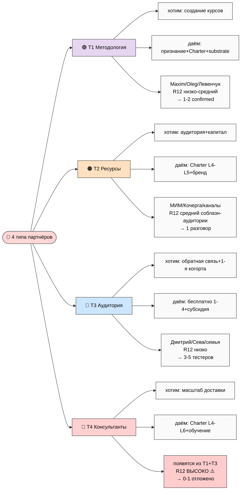
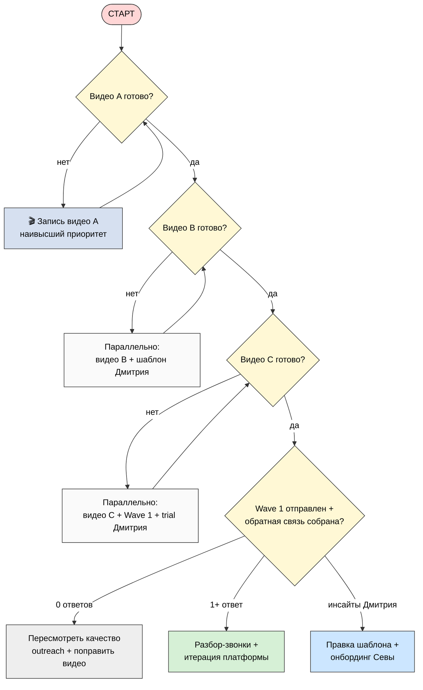
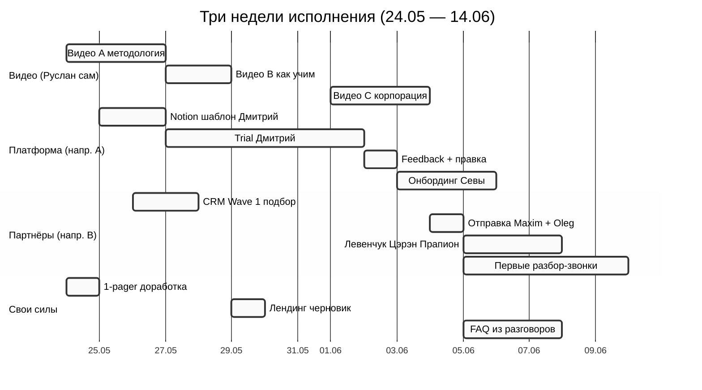

# 🎨 Шесть схем — план исполнения с одного взгляда

> Все схемы — мягкие цвета, читаются без расширений, 8-20 узлов, без жаргона в подписях.
> Стиль продолжает HL-1..HL-5 из consolidated-hl.

---

## EX-1 — Вся картина исполнения (от baseline до двух направлений)

---

## EX-2 — Что Руслан делает сам (3 видео + 5 шаблонов + остальное)

---

## EX-3 — Два направления и как они подпитывают друг друга

---

## EX-4 — Четыре типа партнёров (что хотим × что даём × риск)

---

## EX-5 — Дерево решений (порядок исполнения)

---

## EX-6 — Таймлайн трёх недель (по дням и типам)

---

*Phase 6 mermaid готов. 6 схем: EX-1 вся картина / EX-2 Руслан сам / EX-3 два направления /
EX-4 4 типа партнёров / EX-5 дерево решений / EX-6 таймлайн. Мягкие цвета, без жаргона,
читаются без расширений. Каталог: `diagrams/_INDEX.md`.*
