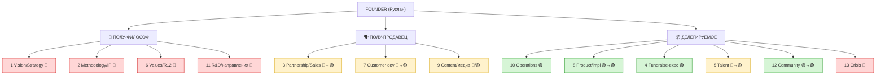
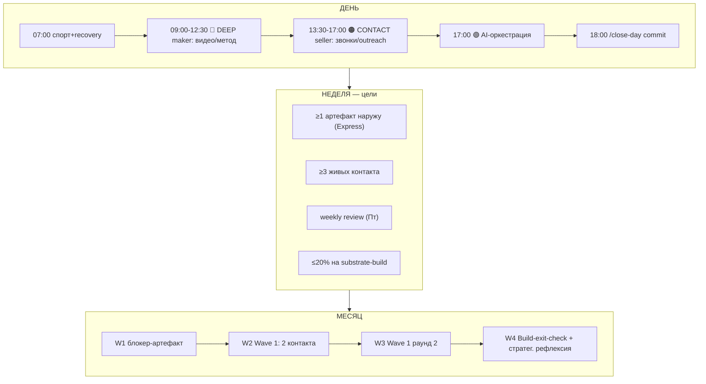
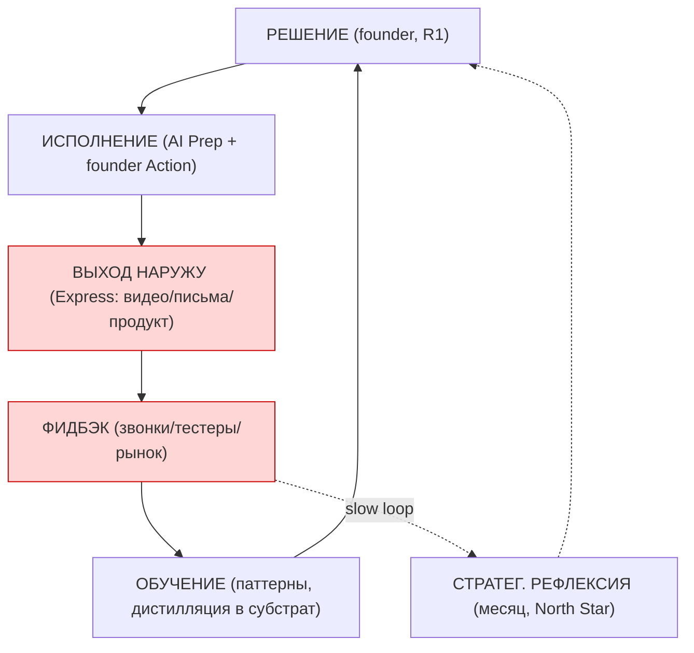
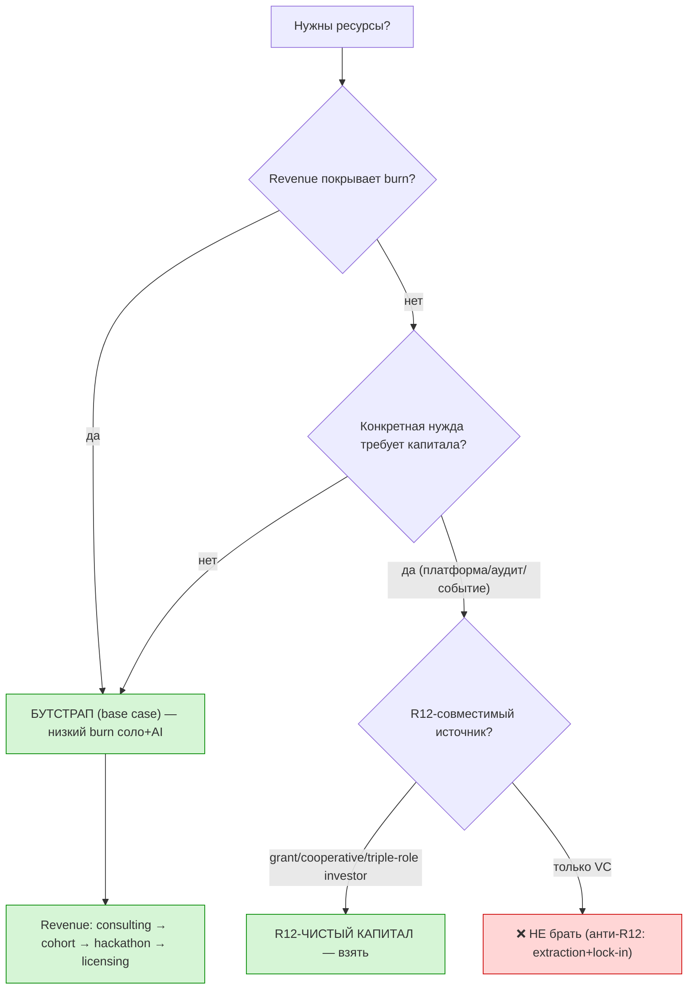
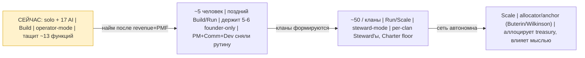

# Phase 8 — Mermaid suite FR-1..FR-7 + синтез

> 7 диаграмм, кодирующих ключевые модели research'а. Каждая + краткий синтез
> того, что она схватывает. Все 7 переносятся в Main (§8).

## FR-1 — Founder: 13 функций (декомпозиция по зонам делегирования)

**Синтез:** founder-only ядро = 5-6 функций (vision/метод/ценности/R&D/discovery/
crisis). Всё остальное → делегировать. Сейчас Руслан тащит ~все 13 — отсюда вопрос
«чем заниматься». Ответ: сбросить 7, держать 5-6.

## FR-2 — AI-делегирование (heatmap по слоям Preparation/Action/Transition)

```mermaid
graph LR
    subgraph PREP["PREPARATION — AI heavy ~80%"]
        P1["research / drafts"]
        P2["unit-econ / модели"]
        P3["impl кода/Notion"]
        P4["структура фидбэка"]
        P5["R12 audit / checklist"]
    end
    subgraph ACT["ACTION — human only"]
        A1["звонок / переговоры"]
        A2["выступление / медиа-лицо"]
        A3["авторинг vision/метода"]
    end
    subgraph TRANS["TRANSITION — human judgment"]
        T1["выбор опции"]
        T2["ценностное решение"]
        T3["куда дальше / когда стоп"]
    end
    PREP -->|"AI готовит"| ACT
    ACT -->|"founder делает"| TRANS
    TRANS -->|"founder решает"| PREP

    classDef ai fill:#d6e8ff,stroke:#06c
    classDef human fill:#ffd6d6,stroke:#c00
    class P1,P2,P3,P4,P5 ai
    class A1,A2,A3,T1,T2,T3 human
```

**Синтез:** AI снимает Preparation во ВСЕХ функциях (~80%), founder держит Action
(моменты мастерства) + Transition (суждение). Граница священна: отдать AI
Preparation — да; момент мастерства или ценностный выбор — нет (Mastery-эрозия).

## FR-3 — Solo operating model: дневной/недельный/месячный ритм

**Синтез:** maker утром, contact днём (PG maker/seller), 50% наружу. Месяц
синхронизирован с Execution Plan sequencing. Express-метрика = главный
анти-accumulation предохранитель.

## FR-4 — Очередь усиления команды (приоритет × время × стоимость)

```mermaid
graph LR
    H0["#0 СЕЙЧАС: Advisor + Steuerberater | cost~0 | ToI быстрый"]
    H1["#1 PM/Ops/CoS | снять operations | после денежного потока"]
    H2["#2 Communicator/EA | усиление общения | после своих звонков"]
    H3["#3 Developer | платформа | при потолке AI+PMF"]
    H5["#5 Editor + Sales-Lead | после Video доказал контент"]
    H10["#10 Community+Researcher+Marketing+Finance | Run-стадия"]
    H0 --> H1 --> H2 --> H3 --> H5 --> H10

    classDef now fill:#d6f5d6,stroke:#080
    classDef soon fill:#fff2cc,stroke:#d6a000
    classDef later fill:#e8e8e8,stroke:#888
    class H0 now
    class H1,H2 soon
    class H3,H5,H10 later
```

**Синтез:** очередь = Руслан-запрос (PM → коммуникатор → разработчик) + R12 +
«не нанимать до денежного потока». Advisor — высший ROI при ~0 cost. Co-founder =
особое необратимое решение, вне линейной очереди.

## FR-5 — Founder cybernetic cycle (петля обучения)

**Синтез:** founder-петля закрывается ТОЛЬКО через выход наружу + фидбэк
(красные узлы). Без Express петля разомкнута — субстрат копится без обучения от
рынка (O-163). Медленная петля = месячная стратегическая рефлексия.

## FR-6 — Resources / fundraising decision tree (R12-фильтр)

**Синтез:** кооператив структурно несовместим с VC. Base case = бутстрап (низкий
burn). R12-чистый капитал (grant/cooperative/triple-role) — точечно под конкретную
нужду. «Не нанимать до денежного потока» = главный рычаг runway.

## FR-7 — Founder development arc (solo → 5 → 50 → scale)

**Синтез:** роль founder'а эволюционирует operator → steward → allocator/anchor.
Founder-only ядро (vision/метод/ценности) остаётся на всех стадиях; делегируемое
расширяется. Телос = Buterin-mode (anchor R12-сети). Сейчас — operator, не
форсировать поздние модальности (нечего аллоцировать = преждевременно).

---

## §8.X Per-phase синтез (что дала каждая фаза)

- **Phase 0:** Руслан НЕ на старте — в редкой точке O-160 (фундамент готов,
  переход в promotion). Research поддерживает переход, не саботирует «допили».
- **Phase 1:** 7 кросс-паттернов успешных solo/mало-команд. Главный пробел
  Руслана: недоиспользует permissionless leverage (медиа+продукт) и застрял в
  Capture вместо Express (Forte).
- **Phase 2:** 13 функций → founder-only ядро 5-6, остальное делегировать.
  «Полу-философ полу-продавец» = свёртка функций.
- **Phase 3:** конкретный operating model — maker утром/contact днём, 50%
  наружу, Express-метрика, weekly review, правило 3 дней.
- **Phase 4:** очередь усиления Advisor→PM→Comm→Dev, R12 STRICT (найм =
  приглашение в со-собственники, не покупка времени), не нанимать до revenue.
- **Phase 5:** AI = Preparation во всех функциях (~80%), founder = Action+
  Transition. Рычаг команды за стоимость подписки.
- **Phase 6:** кооператив ≠ VC; base case бутстрап; revenue-портфель;
  «Китай»-паттерн как founder-сканер рынков-ресурсов (ресурс + анти-урок).
- **Phase 7:** 10 ловушек; топ-3 риска СЕЙЧАС (accumulation/maker-прятки/
  premature-optimization) = все про «не сделать переход O-160».

**Главный синтез research'а одной фразой:** *роль Руслана сейчас = сделать
переход из development в promotion — сбросить 7 делегируемых функций на AI+
будущую команду, сфокусироваться на 5-6 founder-only (полу-философ + полу-
продавец), и главное — начать выпускать наружу (Express) и говорить с людьми,
а не копить субстрат.*

**Следующая фаза:** Main consolidated + SUMMARY + R1 queue (final push).
