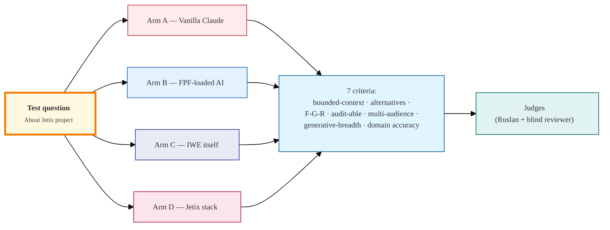

# SUMMARY — Phase A Левенчуковский corpus study

> 2026-05-17 deep autonomous study triggered by Левенчуковским сообщение в TG того же дня.
> 6 этапов: inventory → collection → 6 distillation reports → 12 mermaid → self-audit → this.
> All artifacts в `raw/external/levenchuk-corpus-2026-05-17/` + `reports/fpf-iwe-distillation-2026-05-17/`.
> 6 git commits per stage; ready для push origin main.

---

## §1 Что нашли (top-line)

**FPF = «operating system for thought for engineering, research, and mixed human/AI teams»** (Levenchuk's own canonical self-description per Readme L9 + Spec L674 + L738). Это pattern language с 300+ patterns, организованный как kernel (Part A) + reasoning (Part B) + extensions (Part C) + ethics (D) + constitution (E) + unification (F) + SoTA kit (G). Не методология (Agile/Waterfall), не encyclopedia, не tool stack — **архитектура для коллективного рассуждения**.

**Левенчуковский claim C2 verified:** FPF действительно содержит «открытые описания о принципах мышления и интеллекта, которые положены в основу» — Spec L197-208 enumerate 7 core ideas (local meaning / many aligned outputs / strict distinction systems-roles-methods-plans-work / structured trust / cross-scale composition / wide search before selection / first-principles when categories break). Plus Eleven Pillars (E.2) + Guard-Rails (E.5.*).

**Intelligence amplification mechanism — 10 steps** (surfaced в `01-fpf-on-human-language.md §6 + diagram 02`): bounded-context map → role-method-signature → past-participle alpha-state-graph → abductive loop (alternatives portfolio) → explore-exploit governor → F-G-R per claim → UTS → DRR → MVPK → bridges. Это НЕ память + автоматизация — это **generative architecture making error-classes structurally hard to commit** (Spec L499).

**Корпус Левенчуковский по объёму:**
- Open + free: 1 doc (FPF-Spec 62K lines) + 1 Readme + 5000+ LJ posts + ~580 YouTube videos (metadata only — transcripts IP-blocked) + 2 arXiv papers + 16-transdisc page + МИМ events page
- Paid: aisystant subscription (~8 courses + IWE), 10 Ridero books, residencies R0/R1/R2
- Closed: МИМ internal mentor materials, IWE session histories
- Tseren TG corpus 618 posts + YT 127 videos already extracted

**IWE = production-applied FPF** per Левенчуковский C5. Эмпирический IWE experience pending Ruslan subscription session. Conceptual map clear: AI guide loaded с FPF spec + ШСМ corpus, tracking learner alpha-states past-participle, recommending route through 16 transdisciplines per current role.

---

## §2 Что НЕ нашли / Blockers (для Ruslan decisions)

7 explicit blockers в `raw/external/levenchuk-corpus-2026-05-17/blockers.md`:

**Critical (Phase B blocked without):**
1. **Aisystant subscription credential handoff** — server CC не имеет credentials; option C chosen (Phase A работает only с public layer)
2. **IWE empirical sessions** — нужны 5-10 sessions Ruslan-run для C4 benchmark Arm C
3. **Residency R0 application + cohort start** — next R0 cohort start TBD (likely Oct 2026)

**Clarification needed:**
4. **«Инженерия интеллекта»** (prompt §1.2.5) — не найдено в R-A bibliography; возможно (a) future title, (b) misnamed «Инженерия личности», (c) IWE itself, (d) blog series — **Ruslan clarification needed**
5. **«Системный фитнес»** — resolved: НЕ Левенчуковский book; PRACTICE (Leontiev's MIM 10th conf 2026 talk)

**Infrastructure-blocked (degrade gracefully):**
6. **YouTube transcripts** — 579 videos blocked at IP level per 2026-04-28 analysis; metadata-only fidelity for Phase A
7. **`@ailev_blog` Telegram** — handle existence not confirmed (Levenchuk likely uses only LJ + ШСМ channel, not personal TG)

**Cost cap:** €0 spent Phase A (all WebFetch + curl + GitHub API — built-in tools).

---

## §3 Top-10 Левенчуковских формулировок (verbatim)

> Самые мощные quotes которые меняют наше понимание.

1. **«FPF is an operating system for thought»** `[Readme L9; Spec L738]` — canonical self-description
2. **«FPF turns raw intelligence into work that is easier to align, review, evolve, and delegate»** `[Readme L132]` — плoclear value prop
3. **«FPF is a generative architecture for thought. Its primary purpose is not to diagnose errors, but to provide a structural scaffold that makes entire classes of errors difficult or impossible to commit in the first place»** `[Spec L499]` — key intelligence-amplification claim
4. **«Coordination, not raw generation, becomes the bottleneck»** `[Readme L165]` — почему FPF когда LLM сильны
5. **«Альфа = предмет метода… позволяет управлять вниманием создателя»** `[R-B §2.1 L162]` — alpha definition
6. **«Метод выбора метода — стратегирование»** `[R-B §4.1 L442]` — strategizing definition
7. **«AI agents do NOT strategize» — no identity/commitment (session-fresh), no skin-in-the-game (Taleb)** `[R-B §4.3 L510-524]` — critical AI constraint
8. **«Без внешнего по отношению к LLM контуру обработки текста — никак, LLM всегда обманет»** `[R-B §5.5 L690 — Левенчуковский]` — writing-as-thinking AI constraint
9. **«Definition: as a Coffin for a Dead Think»** `[Levenchuk via psybertron]` — anti-essentialism
10. **«У Церена IWE… внутри там интеллект опирается на тот же FPF — и понятно, за счёт чего его IWE умнее конкурентов»** `[inbox/levenchuk-tg-2026-05-17.md C5]` — IWE = production FPF

Plus key meta-quote (Spec L674): **«FPF does not seek to invent the fundamental ingredients of rigorous thought… [its mission is] transdisciplinary architectural synthesis transforming them from disconnected heuristics into a coherent, interoperable, and fully-governed operating system for thought.»**

---

## §4 Top-5 mermaid диаграмм (inline)

> Full 12 диаграмм в `reports/fpf-iwe-distillation-2026-05-17/diagrams/`. Inline here only 1.

### §4.1 The C4 benchmark design (Phase B execution artifact)

**Other 4 critical diagrams** (по reference; full files в `diagrams/`):
- `02-intelligence-amplification-workflow.md` — vanilla AI vs FPF-loaded, 10-step mechanism
- `06-shsm-5-primitives-holon.md` — verbatim R-B §6.1 graph
- `08-levenchuk-corpus-map.md` — paid/free/closed/open/blocked-infra split
- `09-fpf-mechanisms-jetix-presence.md` — 4 direct adoptions / 8 partial / 4 not (Phase B audit prep)

---

## §5 Honest self-audit top-line

> Full table в `06-honest-self-audit.md`. Here aggregate only.

- **~15 memory-dominant** components (Foundation Parts 1,3,5,9,11 + Wiki substrate + Toggl + CRM storage + monetization bank + voice transcripts)
- **~12 automation-dominant** (Parts 2,7,8 + Wiki skills + AutoResearch ops + voice/CRM ops + Halt-Log-Alert + Default-Deny enforcement)
- **~5 intelligence amplification (partial)** (Strategic Insights Hexagon + `/ask` + Pillar C 12 rules + Provenance Officer + Hexagon 1A/1B multi-view)
- **~7 FPF-derivative direct adoptions** (F-G-R schema + IP-1 Role≠Executor + Default-Deny + Pillar C + Guard-Rail analog + AWAITING-APPROVAL + executor-binding)
- **1 heavy derivative archived** (JETIX-FPF.md 3762 lines archived 2026-05-06 — Левенчуковский C1 critique partial-hit)

### §5.1 Левенчуковский C3 honest answer

> «Не очень верю, что у вас усиление интеллекта будет как-то больше, чем у vanilla AI-агента.»

- C3 = «mostly right» (bulk = substrate; project mgmt + monetization + community substrate)
- C3 = «not fully right» (~12 intelligence/FPF-derivative present; F-G-R + IP-1 + Pillar C real)
- **Gap to Левенчуковский bar:** abductive loop NOT formally implemented; multi-view publication informal; UTS не formal; A.6.B Claim Register absent; F.9 Bridges informal
- **NOT vanilla AI**: F-G-R discipline + Default-Deny + Halt-Log-Alert + provenance enforcement = architectural intelligence support
- **Not yet FPF-grade**: derivative attempt (JETIX-FPF.md archived) shows overreach + retreat; current state = lighter FPF-aligned mechanisms applied tactically WITHOUT full FPF-Spec loaded as agent context

### §5.2 Что UNIQUELY ours (NOT FPF-derived)

5 mechanisms: Strategic Insights Hexagon cadence + **R12 anti-extraction** (constitutional candidate rule 12 — additive 2026-05-12) + 5-layer per-agent memory (Karpathy + Claude Code influenced) + B2 mini-swarm с de-morph reversibility + F2-F8 6-level Formality grade scale operational encoding.

R12 is the most distinctively NOT-in-FPF — anti-extraction principle на уровне constitutional rule.

---

## §6 Что готово для Phase B

After your ack of this summary, Phase B can begin:

1. **C4 benchmark execution** — 4 arms (vanilla / FPF-loaded / IWE / Jetix-stack) × 5 test questions × 7 criteria = output `reports/c4-benchmark-2026-MM-DD.md` ([design](diagrams/10-c4-benchmark-design.md))
2. **Integration plan FPF → Jetix** — convert ~5 partial intelligence-amplification components → formal U.UTS / A.6.B / F.9 / U.EpistemeSlotGraph / MVPK; AWAITING-APPROVAL packets per Foundation path writes (Tier 2 R2)
3. **Audit всех LOCKED документов на FPF/IWE/Episteme presence** — sweep ~110 canonical docs per CANONICAL-WALKTHROUGH; document table in `reports/jetix-fpf-presence-audit-2026-MM-DD.md`
4. **Draft Ruslan-authored response to Левенчук** — AI = structurer only; Ruslan = prose author (per Tier 2 R1)

---

## §7 Open questions для Ruslan

1. **«Инженерия интеллекта»** (blockers.md B4) — какая интерпретация: (a) future title, (b) misnamed «Инженерия личности», (c) IWE itself, (d) blog series, (e) future curriculum module?

2. **Aisystant handoff method** (B1) — какой option preferred:
   - Option A (recommended): Ruslan downloads course PDFs in browser → puts in `04-books-outlines/` → server CC processes
   - Option B: session cookies / token (if API supports)
   - Option C: stay with public + extracted material — Phase B works с current corpus + IWE sessions

3. **IWE sessions** (B2) — есть ли capacity для 5-10 sessions с IWE в ближайшее время для C4 Arm C empirical? Или: defer Arm C to later, run C4 Arms A+B+D first?

4. **Residency R0 timing** — applying now per §0.0 ack, but next cohort start TBD (likely Oct 2026). Wait for cohort, or pursue masters-tier engagement directly given Phase A surface-level FPF understanding?

5. **R12 anti-extraction status** — это truly unique Jetix contribution (per §5.2). Worth surfacing к Левенчуку in response draft as «one mechanism we have that's NOT in FPF»? Or premature?

6. **JETIX-FPF.md archived doc** — keep archived as-is (per current state) или formally deprecate с rationale in DRR entry per FPF E.9 discipline?

7. **Phase B response к Левенчуку** — what tone? Options:
   - (a) Quietly run C4 benchmark; share results когда есть substance
   - (b) Acknowledge critique direct + send brief one-pager «vot что мы делаем + invite к specific dialogue if interested»
   - (c) Wait until Ruslan completes R0 residency (3 months+) — then engage from inside vocabulary

---

## §8 Что НЕ делали (per prompt §11 + §8 constraints)

- НЕ начали Phase B (C4 benchmark execution / integration plan / response draft)
- НЕ touched Foundation paths (R2 — would require AWAITING-APPROVAL packet)
- НЕ создавали «§РЕКОМЕНДАЦИИ» / «следует» / «лучше» — surface'инг only
- НЕ оценивали «Левенчук прав / неправ» — surface facts
- НЕ обходили paywalls — paid materials waiting Ruslan handoff
- НЕ удаляли старые derivative docs (archive/design/JETIX-FPF.md kept as-is per append-only)
- НЕ перфекционили mermaid — beta quality прайс density>beauty per prompt §8

---

## §9 File map

**Inventory & collection:**
- `raw/external/levenchuk-corpus-2026-05-17/00-INVENTORY.md` — 10 source categories, ~50 sources
- `raw/external/levenchuk-corpus-2026-05-17/01-github/freshness-check-2026-05-17.md` — FPF upstream HEAD c86eabd 2026-05-16
- `raw/external/levenchuk-corpus-2026-05-17/02-livejournal/key-posts-captured-2026-05-17.md` — 9 items captured Tier 1
- `raw/external/levenchuk-corpus-2026-05-17/blockers.md` — 10 blockers explicit для Ruslan
- `raw/external/levenchuk-corpus-2026-05-17/MANIFEST.md` — collection summary

**Distillation reports:**
- `reports/fpf-iwe-distillation-2026-05-17/01-fpf-on-human-language.md` — definitions + 5+ primitives + 7 mechanisms + intelligence amplification step-by-step (~10K words)
- `reports/fpf-iwe-distillation-2026-05-17/02-u-episteme-and-iwe.md` — U.Episteme structure + IWE conceptual mapping
- `reports/fpf-iwe-distillation-2026-05-17/03-intellect-stack-and-transdisciplines.md` — 16 trans-discs + FPF 5-layer stack + ШСМ↔FPF synthesis mapping
- `reports/fpf-iwe-distillation-2026-05-17/04-methodology-lineage.md` — 3-gen framing + SEMAT + СМД + Austrian + Peirce + Active Inference + arXiv papers
- `reports/fpf-iwe-distillation-2026-05-17/05-residencies-format.md` — R0/R1/R2 + разборы + IWE integration + cohort schedules
- `reports/fpf-iwe-distillation-2026-05-17/06-honest-self-audit.md` — Jetix vs Левенчуковский bar (this section §5)
- `reports/fpf-iwe-distillation-2026-05-17/99-glossary-levenchuk-terms.md` — ~60 terms alphabetical RU-first
- `reports/fpf-iwe-distillation-2026-05-17/diagrams/01-12-*.md` — 12 mermaid diagrams cool blues palette

**Total volume:** ~5K lines new content + 12 mermaid diagrams; corpus ~320K words total available for Phase B (250K FPF spec + 50K existing extracts + 12K new Phase A captures).

---

## §10 Ack-or-course-correct

When you've read this summary:
- **Ack** = proceed to Phase B (let me know which option в §7 #7 you prefer for response к Левенчуку + which intermediate steps в priority)
- **Course correct** = surface ANY of: misreading FPF mechanism / overstated Jetix intelligence-amplification claim / under-emphasized blocker / missing source channel / changed priority

Per Tier 2 R1: I'm not authoring strategy; you decide direction. This summary surfaces facts + open questions для your Phase B decisions.

---

*Phase A complete. 6 git commits per stage. Ready for `git push origin main` per §0.0 ack.*

*Cost cap snapshot end-of-session: €0 external spend. All work через built-in WebFetch + curl + Read/Write.*
