# Diagram 01 — FPF Top-Level Architecture

> Primitives + mechanisms + flow. Source: FPF-Spec Parts A-G + Readme

```mermaid
%%{init: {'theme':'base','themeVariables':{'fontFamily':'Inter, system-ui, sans-serif','fontSize':'14px'}}}%%
flowchart TB
    subgraph CORE["<b>FPF Core Conceptual Specification</b><br><small>github.com/ailev/FPF · 62K-line monolith · 300+ patterns</small>"]
        direction TB

        subgraph PARTA["<b>Part A — Kernel Architecture</b>"]
            A1["U.Holon (A.1)<br><small>Entity ⊃ Holon ⊃ {System, Episteme}</small>"]
            A11["U.BoundedContext (A.1.1)<br><small>local CWA frame</small>"]
            A2["U.Role + U.RoleAssignment (A.2)<br><small>method-signature, not executor</small>"]
            A3["U.Method + U.MethodDescription (A.3)<br><small>transformer quartet</small>"]
            A15["A.15 Role–Method–Work seam<br><small>+ A.15.1 U.Work + A.15.2 U.WorkPlan</small>"]
            A6["A.6 Boundary Discipline<br><small>A.6.B Claim Register · A.6.P Compression</small>"]
            A14["A.14 Advanced Mereology<br><small>holon hierarchy + Γ aggregation</small>"]
            A17["A.17-A.19 Characteristic / Scale / Level"]
        end

        subgraph PARTB["<b>Part B — Trans-disciplinary Reasoning</b>"]
            B1["B.1 Universal Γ<br><small>IDEM/COMM/LOC/WLNK/MONO</small>"]
            B2["B.2 Meta-Holon Transition (MHT)<br><small>emergence</small>"]
            B3["B.3 F-G-R Trust & Assurance<br><small>per-claim formality/scope/reliability</small>"]
            B4["B.4 Canonical Evolution Loop"]
            B5["B.5 Canonical Reasoning Cycle<br><small>Abduction → Deduction → Induction</small>"]
            B52["B.5.2 Abductive Loop<br><small>+ B.5.2.1 Creative Abduction with NQD</small>"]
        end

        subgraph PARTC["<b>Part C — Kernel Extensions</b>"]
            C21["C.2.1 U.Episteme + EpistemeSlotGraph<br><small>DescribedEntity / GroundingHolon / ClaimGraph / Viewpoint</small>"]
            C17["C.17-C.19 NQD / E-E-LOG<br><small>novelty-quality-diversity, explore-exploit</small>"]
            CCAL["Sys-CAL · KD-CAL · Kind-CAL<br>Method-CAL · LOG · CHR"]
        end

        subgraph PARTD["<b>Part D — Multi-scale Ethics</b>"]
            D1["axiological neutrality + conflict topology"]
        end

        subgraph PARTE["<b>Part E — Constitution + Authoring</b>"]
            E2["E.2 — Eleven Pillars<br><small>P-1 Cognitive Elegance · P-2 Didactic · P-7 Pragmatic · P-8 Cross-Scale · P-10 OEE …</small>"]
            E5["E.5.* Guard-Rails<br><small>E.5.1 DevOps Lexical Firewall · E.5.2 Notational Independence</small>"]
            E8["E.8 — Pattern authoring template<br><small>Problem frame → Problem → Forces → Solution + Conformance Checklist</small>"]
            E9["E.9 — DRR (Design Rationale Record)"]
            E17["E.17 — Multi-View Publication Kit (MVPK)<br><small>Plain · Tech · Interop · Assurance faces</small>"]
            E10S["E.10.SEMIO — semio-architecture<br><small>active dev 2026-05</small>"]
        end

        subgraph PARTF["<b>Part F — Unification Suite</b>"]
            F9["F.9 — Bridges<br><small>lawful cross-context translation</small>"]
            F17["F.17 — UTS (Unified Term Sheet)<br><small>vocabulary stabilization artifact</small>"]
            F18["F.18 — Name Cards"]
        end

        subgraph PARTG["<b>Part G — SoTA Kit</b>"]
            G1["CG-Spec + CG-Frame authoring"]
            G5["selector / dispatcher patterns"]
        end

        PARTA -->|primitives ground| PARTB
        PARTB -->|reasoning over| PARTC
        PARTA -->|holons under| PARTC
        PARTE -->|constrains| PARTA
        PARTE -->|constrains| PARTB
        PARTE -->|constrains| PARTC
        PARTF -->|stabilizes vocab in| PARTA
        PARTF -->|bridges| PARTC
        PARTG -->|portfolios via| PARTC
        PARTD -->|axiology over| PARTE
    end

    classDef foundation fill:#e8eaf6,stroke:#283593,stroke-width:3px
    classDef reasoning fill:#e3f2fd,stroke:#1565c0,stroke-width:3px
    classDef extension fill:#e1f5fe,stroke:#01579b,stroke-width:2px
    classDef constitution fill:#ffebee,stroke:#c62828,stroke-width:3px
    classDef unify fill:#e0f2f1,stroke:#00695c,stroke-width:2px
    classDef sota fill:#fff3e0,stroke:#e65100,stroke-width:2px
    classDef ethics fill:#fce4ec,stroke:#ad1457,stroke-width:2px

    class A1,A11,A2,A3,A15,A6,A14,A17 foundation
    class B1,B2,B3,B4,B5,B52 reasoning
    class C21,C17,CCAL extension
    class E2,E5,E8,E9,E17,E10S constitution
    class F9,F17,F18 unify
    class G1,G5 sota
    class D1 ethics
```

**Provenance per node:** all references к specific Spec patterns inline в node labels;
cross-checked against `raw/external/ailev-FPF/FPF-Spec.md` headers (verified via grep
2026-05-17) + Readme.md Part A/B/C/D/E/F/G summaries.
