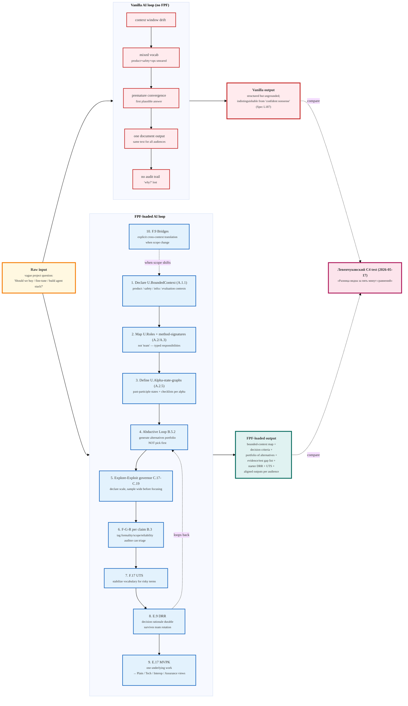

# Diagram 02 — FPF Intelligence Amplification Workflow

> «От raw input до improved decision, по шагам» — ответ на Левенчуковский C4 challenge.
> Контрастируем vanilla AI loop vs FPF-loaded AI loop.

**Note.** Steps F1-F10 not strict order — they are concurrent disciplines applied к
the SAME work. Diagram shows them sequentially for didactic clarity per FPF Pillar P-2.
Provenance: synthesized from FPF-Spec Readme one-minute-example (L97-114) + Part A/B/C
patterns referenced + Левенчуковский TG C4 quote.
