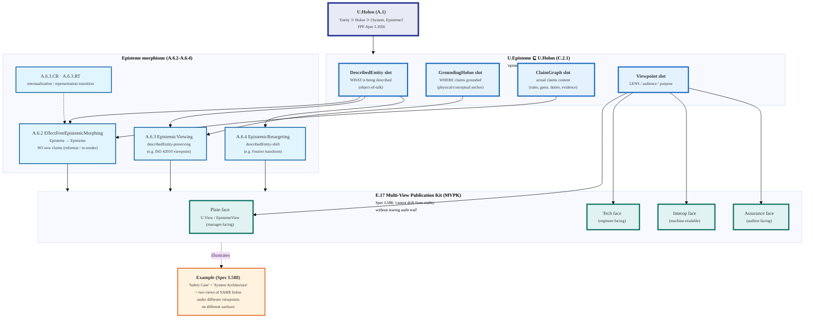

# Diagram 03 — U.Episteme structure (EpistemeSlotGraph C.2.1)

```mermaid
%%{init: {'theme':'base','themeVariables':{'fontFamily':'Inter, system-ui, sans-serif','fontSize':'13px'}}}%%
flowchart TB
    HOLON["<b>U.Holon (A.1)</b><br><small>'Entity ⊃ Holon ⊃ {System, Episteme}'<br>FPF-Spec L1056</small>"]:::holon

    subgraph EPISTEME["<b>U.Episteme ⊑ U.Holon (C.2.1)</b><br><small>'episteme as holon с EpistemeSlotGraph' (Spec L155)</small>"]
        direction TB

        SLOT1["<b>DescribedEntity slot</b><br><small>WHAT is being described<br>(object-of-talk)</small>"]:::slot
        SLOT2["<b>GroundingHolon slot</b><br><small>WHERE claims grounded<br>(physical/conceptual anchor)</small>"]:::slot
        SLOT3["<b>ClaimGraph slot</b><br><small>actual claims content<br>(rules, gates, duties, evidence)</small>"]:::slot
        SLOT4["<b>Viewpoint slot</b><br><small>LENS / audience / purpose</small>"]:::slot
    end

    subgraph MORPHISMS["<b>Episteme morphisms (A.6.2-A.6.4)</b>"]
        M1["A.6.2 EffectFreeEpistemicMorphing<br><small>Episteme → Episteme<br>NO new claims (reformat / re-render)</small>"]:::morph
        M2["A.6.3 EpistemicViewing<br><small>describedEntity-preserving<br>(e.g. ISO 42010 viewpoint)</small>"]:::morph
        M3["A.6.4 EpistemicRetargeting<br><small>describedEntity-shift<br>(e.g. Fourier transform)</small>"]:::morph
        M4["A.6.3.CR · A.6.3.RT<br><small>retextualization / representation transition</small>"]:::morph
    end

    subgraph PUBLICATION["<b>E.17 Multi-View Publication Kit (MVPK)</b><br><small>Spec L588: 'cannot drift from reality<br>without tearing audit trail'</small>"]
        P1["Plain face<br><small>U.View / EpistemeView<br>(manager-facing)</small>"]:::publish
        P2["Tech face<br><small>(engineer-facing)</small>"]:::publish
        P3["Interop face<br><small>(machine-readable)</small>"]:::publish
        P4["Assurance face<br><small>(auditor-facing)</small>"]:::publish
    end

    HOLON --> EPISTEME
    SLOT1 --> M1
    SLOT1 --> M2
    SLOT1 --> M3
    SLOT2 --> M2
    SLOT3 --> M1
    SLOT4 --> P1
    SLOT4 --> P2
    SLOT4 --> P3
    SLOT4 --> P4
    M1 --> PUBLICATION
    M2 --> PUBLICATION
    M3 --> PUBLICATION
    M4 -.-> M1

    EXAMPLE["<b>Example (Spec L588)</b><br><small>'Safety Case' + 'System Architecture'<br>= two views of SAME holon<br>under different viewpoints<br>on different surfaces</small>"]:::example
    PUBLICATION -.->|illustrates| EXAMPLE

    classDef holon fill:#e8eaf6,stroke:#283593,stroke-width:4px
    classDef slot fill:#e3f2fd,stroke:#1565c0,stroke-width:3px
    classDef morph fill:#e1f5fe,stroke:#01579b,stroke-width:2px
    classDef publish fill:#e0f2f1,stroke:#00695c,stroke-width:3px
    classDef example fill:#fff3e0,stroke:#e65100,stroke-width:2px
```

**Provenance.** FPF-Spec rows A.1 (L1056) + C.2.1 (L155) + A.6.2-A.6.4 (L64-72) +
E.17 (L250) + verbatim quote L588.
