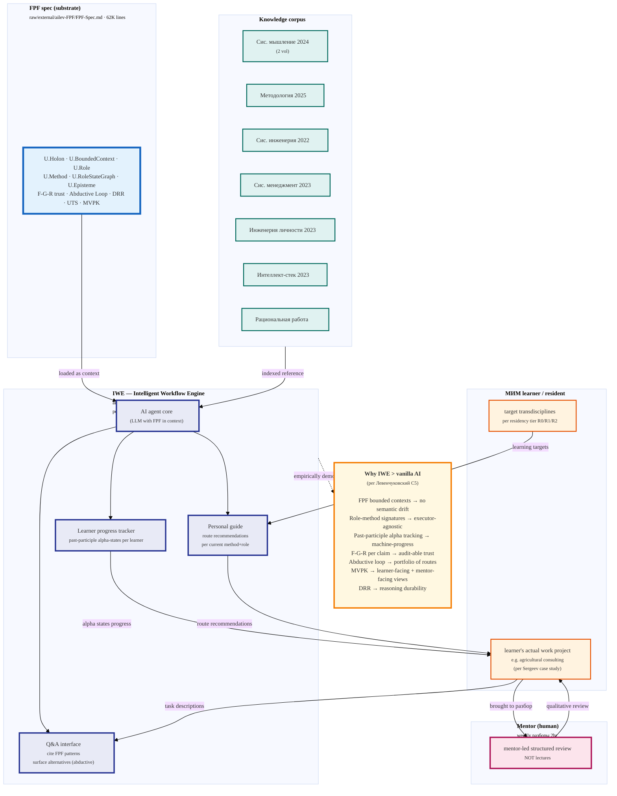

# Diagram 04 — IWE = Production-applied FPF

> Per Левенчуковский TG 2026-05-17 C5: «У Церена IWE … внутри там интеллект опирается
> на тот же FPF — и понятно, за счёт чего его IWE умнее конкурентов.»
>
> Empirical IWE behavior pending Ruslan subscription per blockers.md B2; this diagram
> = CONCEPTUAL layer based on R-A + LJ + Tseren corpus.

**Provenance.** Левенчуковский C5 verbatim (inbox/levenchuk-tg-2026-05-17.md:28) +
R-A §5.1 IWE description + 10th MIM conf 2026 talk list (LJ 1798285: Tserenov +
Sergeev IWE talks) + R-A §5.3 quality-control framing + Tseren TG corpus
analysis 2026-04-28 (Цэрэн personally building IWE).
