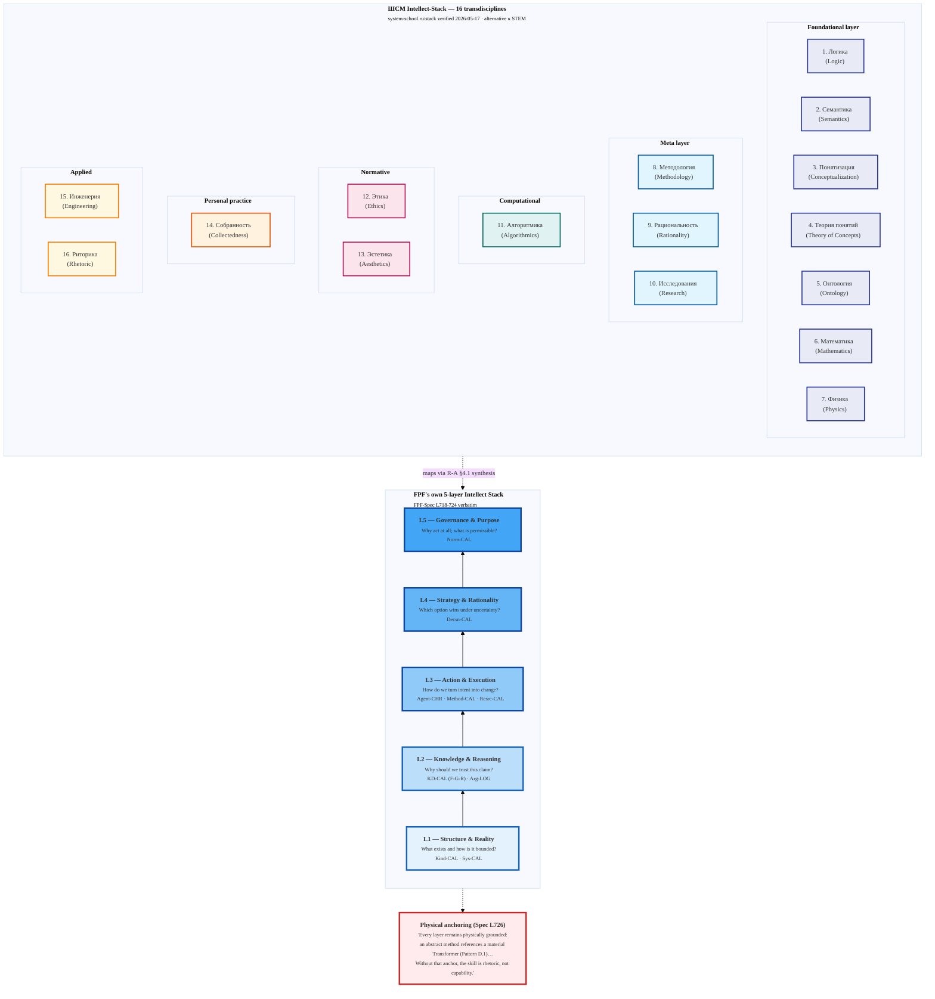

# Diagram 05 — Intellect-Stack (16 transdisciplines + FPF 5 layers)

**Note.** ШСМ 16-group framing (foundational/meta/computational/normative/personal/applied)
is synthetic для readability — not Левенчуковский authoritative. Original page lists
16 без grouping. 17 ↔ 16 resolved per `02-livejournal/key-posts-captured-2026-05-17.md §Post 9`.
