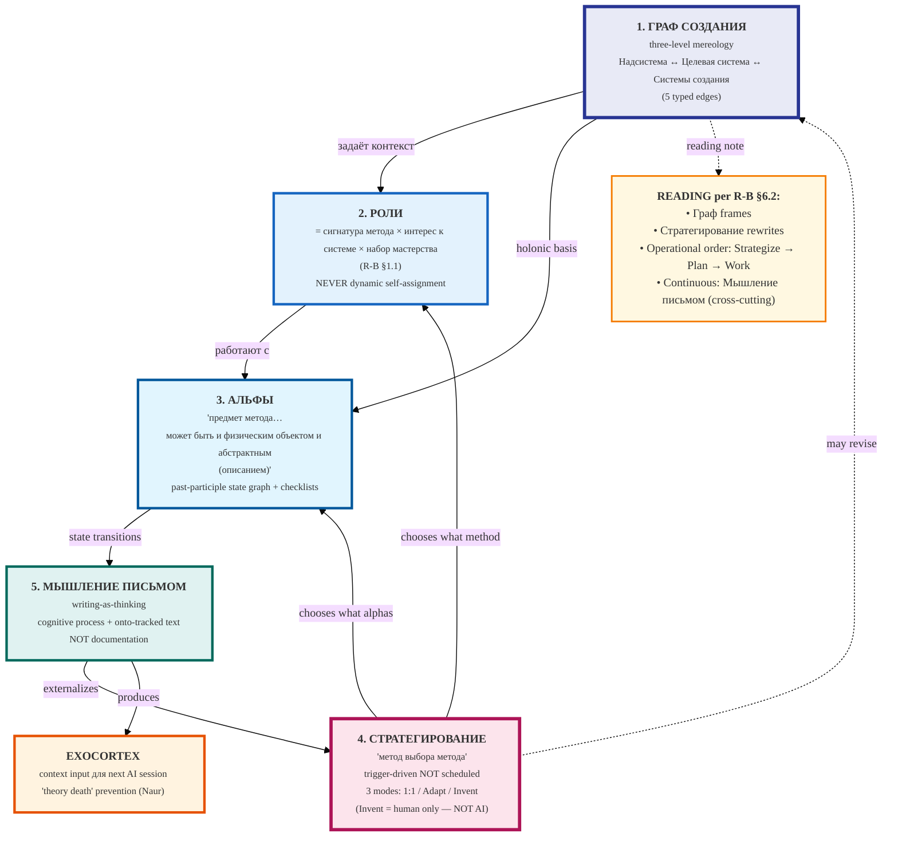

# Diagram 06 — ШСМ 5 primitives holon

> Per R-B §6.1 (verbatim graph):
> ГРАФ СОЗДАНИЯ → задаёт контекст → РОЛИ ↔ СТРАТЕГИРОВАНИЕ
> РОЛИ → работают с → АЛЬФЫ
> АЛЬФЫ → переходы фиксируются → МЫШЛЕНИЕ ПИСЬМОМ
> МЫШЛЕНИЕ ПИСЬМОМ → создаёт контекст → экзокортекс

**Provenance.** R-B §6.1 verbatim graph (L700-720) + §6.2 feed-direction table
(L724-736). Cross-cite: A-fpf-spec-5-primitives.md Part 2.
