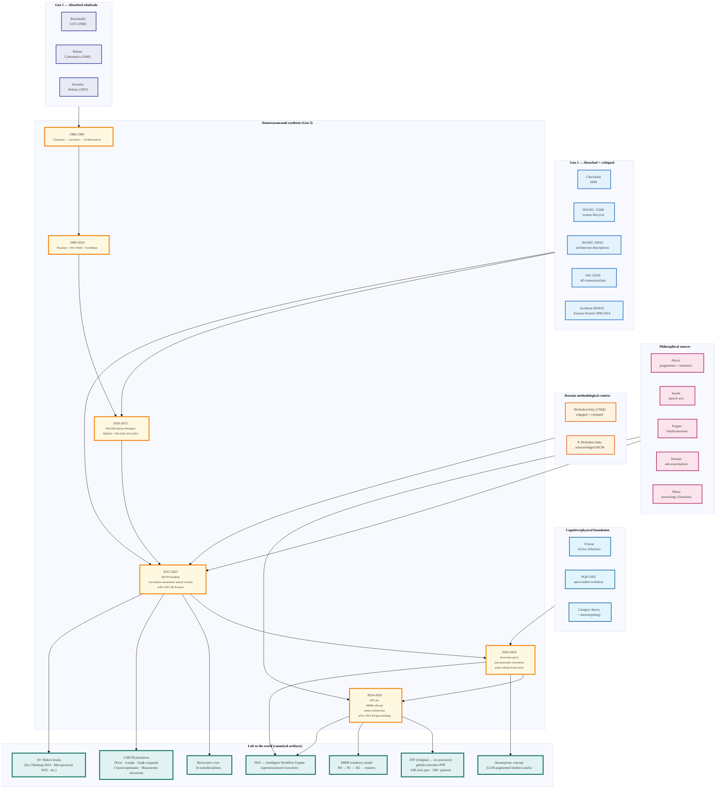

# Diagram 07 — Левенчуковский Intellectual Lineage Tree

```mermaid
%%{init: {'theme':'base','themeVariables':{'fontFamily':'Inter, system-ui, sans-serif','fontSize':'12px'}}}%%
flowchart TB
    subgraph GEN1["<b>Gen 1 — Absorbed wholesale</b>"]
        G1A["Bertalanffy<br>GST (1968)"]:::gen1
        G1B["Wiener<br>Cybernetics (1948)"]:::gen1
        G1C["Koestler<br>Holons (1967)"]:::gen1
    end

    subgraph GEN2["<b>Gen 2 — Absorbed + critiqued</b>"]
        G2A["Checkland<br>SSM"]:::gen2
        G2B["ISO/IEC 15288<br>system lifecycle"]:::gen2
        G2C["ISO/IEC 42010<br>architecture descriptions"]:::gen2
        G2D["ISO 15926<br>4D extensionalism"]:::gen2
        G2E["Jacobson SEMAT<br>Essence Kernel 2009-2014"]:::gen2
    end

    subgraph PHILO["<b>Philosophical sources</b>"]
        P1["Peirce<br>pragmatism + semiotics"]:::philo
        P2["Searle<br>speech acts"]:::philo
        P3["Popper<br>falsificationism"]:::philo
        P4["Dennett<br>anti-essentialism"]:::philo
        P5["Mises<br>praxeology (Austrian)"]:::philo
    end

    subgraph PHYSICS["<b>Cognitive/physical foundation</b>"]
        PH1["Friston<br>Active Inference"]:::physics
        PH2["NQD OEE<br>open-ended evolution"]:::physics
        PH3["Category theory<br>+ mereotopology"]:::physics
    end

    subgraph RUSSIAN["<b>Russian methodological context</b>"]
        R1["Shchedrovitsky (СМД)<br>engaged + critiqued"]:::russian
        R2["P. Shchedrovitsky<br>acknowledged ШСМ"]:::russian
    end

    subgraph LEV["<b>Левенчуковский synthesis (Gen 3)</b>"]
        L_FOUND["1980-1999<br><small>Chemistry → securities → TechInvestLab</small>"]:::lev
        L_INDUST["1999-2010<br><small>Rosatom + ISO 15926 + ArchiMate</small>"]:::lev
        L_INCOSE["2010-2015<br><small>INCOSE Russia President<br>SEMAT × INCOSE 2013-2014</small>"]:::lev
        L_SHSM["2015-2023<br><small>ШСМ founding<br>Системное мышление annual rewrites<br>arXiv 2015 SE Essence</small>"]:::lev
        L_AIPIVOT["2020-2024<br><small>Exocortex pivot<br>past-participle convention<br>multi-volume book series</small>"]:::lev
        L_FPF["2024-2026<br><small>FPF dev<br>МИМ rebrand<br>semio-architecture<br>arXiv 2023 3rd-gen ontology</small>"]:::lev
    end

    subgraph OUTPUT["<b>Left to the world (canonical artifacts)</b>"]
        O_FPF["FPF (Original — no precursor)<br>github.com/ailev/FPF<br>62K-line spec · 300+ patterns"]:::output
        O_INTSTACK["Интеллект-стек<br>16 transdisciplines"]:::output
        O_5PRIM["5 ШСМ primitives<br>(Роль · Альфа · Граф создания<br>Стратегирование · Мышление письмом)"]:::output
        O_EXO["Экзокортекс concept<br>(LLM-augmented intellect-stack)"]:::output
        O_BOOKS["10+ Ridero books<br>(Sys.Thinking 2024 · Методология 2025 · etc.)"]:::output
        O_МИМ["МИМ residency model<br>R0 → R1 → R2 → masters"]:::output
        O_IWE["IWE — Intelligent Workflow Engine<br>(operationalized exocortex)"]:::output
    end

    GEN1 --> L_FOUND
    GEN2 --> L_INCOSE
    GEN2 --> L_SHSM
    PHYSICS --> L_AIPIVOT
    PHILO --> L_SHSM
    PHILO --> L_FPF
    RUSSIAN --> L_SHSM

    L_FOUND --> L_INDUST
    L_INDUST --> L_INCOSE
    L_INCOSE --> L_SHSM
    L_SHSM --> L_AIPIVOT
    L_AIPIVOT --> L_FPF

    L_FPF --> O_FPF
    L_SHSM --> O_INTSTACK
    L_SHSM --> O_5PRIM
    L_AIPIVOT --> O_EXO
    L_SHSM --> O_BOOKS
    L_FPF --> O_МИМ
    L_AIPIVOT --> O_IWE
    L_FPF --> O_IWE

    classDef gen1 fill:#e8eaf6,stroke:#283593,stroke-width:2px
    classDef gen2 fill:#e3f2fd,stroke:#1565c0,stroke-width:2px
    classDef philo fill:#fce4ec,stroke:#ad1457,stroke-width:2px
    classDef physics fill:#e1f5fe,stroke:#01579b,stroke-width:2px
    classDef russian fill:#fff3e0,stroke:#e65100,stroke-width:2px
    classDef lev fill:#fff8e1,stroke:#f57c00,stroke-width:3px
    classDef output fill:#e0f2f1,stroke:#00695c,stroke-width:3px
```

**Provenance.** R-A §1.2 lineage (L52-66) + §3.1-3.4 timeline phases + §4.2
attribution table (L273-284).
