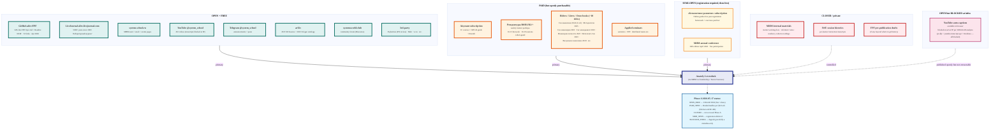

# Diagram 08 — Левенчуковский Corpus Map

```mermaid
%%{init: {'theme':'base','themeVariables':{'fontFamily':'Inter, system-ui, sans-serif','fontSize':'12px'}}}%%
flowchart TB
    subgraph OPEN_FREE["<b>OPEN + FREE</b>"]
        direction TB
        OF_FPF["<b>GitHub ailev/FPF</b><br><small>62K-line FPF-Spec.md + Readme<br>320 ★ · 52 forks · Apr 2026</small>"]:::open
        OF_LJ["<b>LiveJournal ailev.livejournal.com</b><br><small>5000+ posts since 2003<br>'Лабораторный журнал'</small>"]:::open
        OF_MIM["<b>system-school.ru</b><br><small>МИМ team + stack + events pages</small>"]:::open
        OF_YT["<b>YouTube @system_school</b><br><small>452 videos (transcripts blocked at IP)</small>"]:::open
        OF_TG["<b>Telegram @system_school</b><br><small>announcements + posts</small>"]:::open
        OF_ARXIV["<b>arXiv</b><br><small>2015 SE Essence + 2023 3rd-gen ontology</small>"]:::open
        OF_SW["<b>systemsworld.club</b><br><small>community forum (Discourse)</small>"]:::open
        OF_3RD["<b>3rd-party</b><br><small>Psybertron (EN review) · Habr · vc.ru · etc.</small>"]:::open
    end

    subgraph PAID_OPEN["<b>PAID (but openly purchasable)</b>"]
        direction TB
        PO_AISYS["<b>Aisystant subscription</b><br><small>8+ courses + IWE AI guide<br>~€/month</small>"]:::paid
        PO_RES["<b>Резидентуры R0/R1/R2/+</b><br><small>weekly mentor разборы<br>10-15 hrs/week · 10-19 sessions<br>cohort-gated</small>"]:::paid
        PO_BOOKS["<b>Ridero / Litres / Ozon books (~10 titles)</b><br><small>Сис.мышление 2024 (2 vol) · Методология 2025 ·<br>Сис.инженерия 2022 · Сис.менеджмент 2023 ·<br>Инженерия личности 2023 · Интеллект-стек 2023 ·<br>Визуальное мышление 2018 · etc.</small>"]:::paid
        PO_SEMINARS["<b>Applied seminars</b><br><small>semiotics · FPF · distributed teams etc.</small>"]:::paid
    end

    subgraph CLOSED["<b>CLOSED / private</b>"]
        direction TB
        C_INTERNAL["<b>МИМ internal materials</b><br><small>mentor working docs · reformers' notes ·<br>residency cohort recordings</small>"]:::closed
        C_IWE_PRIVATE["<b>IWE session histories</b><br><small>per-learner interaction transcripts</small>"]:::closed
        C_INTERNAL_DEV["<b>FPF pre-publication drafts</b><br><small>(if any beyond what's in git history)</small>"]:::closed
    end

    subgraph SEMI_OPEN["<b>SEMI-OPEN (registration required, then free)</b>"]
        SO_SUBS["<b>«Бесконечное развитие» subscription</b><br><small>Online guides free post-registration<br>homework + exercises paid tier</small>"]:::semi
        SO_CONF["<b>МИМ annual conference</b><br><small>10th edition April 2026 · free participation</small>"]:::semi
    end

    subgraph BLOCKED_INFRA["<b>OPEN but BLOCKED at infra</b>"]
        BI_YT_CAPS["<b>YouTube auto-captions</b><br><small>available in browser<br>blocked at server IP per 2026-04-28 analysis<br>(yt-dlp + youtube-transcript-api + Invidious — all blocked)</small>"]:::blocked
    end

    OPEN_FREE -->|primary| AUTHOR["<b>Anatoly Levenchuk</b><br><small>(via МИМ co-foundership с Tseren Tserenov)</small>"]:::author
    PAID_OPEN -->|primary| AUTHOR
    SEMI_OPEN -->|primary| AUTHOR
    CLOSED -.->|controlled| AUTHOR
    BLOCKED_INFRA -.->|published openly but not extractable| AUTHOR

    PHASE_A_STATUS["<b>Phase A 2026-05-17 status:</b><br><small>OPEN_FREE → COLLECTED (Tier 1 done)<br>PAID_OPEN → Ruslan handles per §0.0 ack (blockers.md B1-B3)<br>CLOSED → not accessed Phase A<br>SEMI_OPEN → registration deferred<br>BLOCKED_INFRA → degrade gracefully к metadata-only</small>"]:::status
    AUTHOR -.-> PHASE_A_STATUS

    classDef open fill:#e0f2f1,stroke:#00695c,stroke-width:3px
    classDef paid fill:#fff3e0,stroke:#e65100,stroke-width:3px
    classDef closed fill:#ffebee,stroke:#c62828,stroke-width:3px
    classDef semi fill:#fff8e1,stroke:#f57c00,stroke-width:2px
    classDef blocked fill:#fce4ec,stroke:#ad1457,stroke-width:2px
    classDef author fill:#e8eaf6,stroke:#283593,stroke-width:4px
    classDef status fill:#e1f5fe,stroke:#01579b,stroke-width:2px
```

**Provenance.** raw/external/levenchuk-corpus-2026-05-17/00-INVENTORY.md categories
01-09 + Category 10 (existing-in-repo) + blockers.md.
