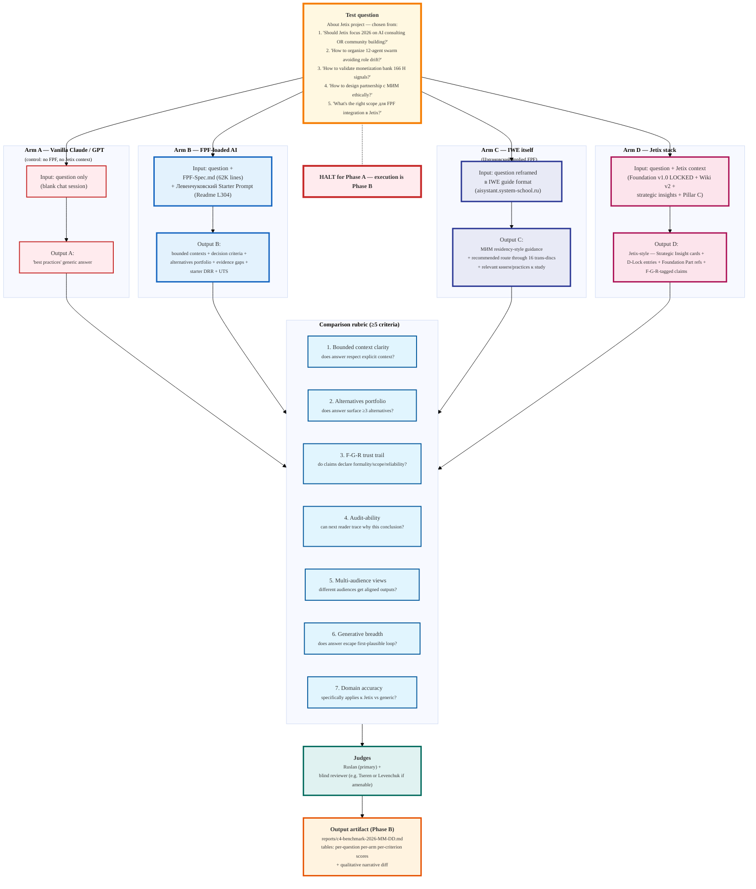

# Diagram 10 — C4 Benchmark Design (Левенчуковский test)

> Per Левенчуковский C4 (TG 2026-05-17):
> «грузите FPF AI-агенту и спрашиваете про ваш проект, или спрашиваете про ваш проект
> прямо у AI-агента без FPF. Разница видна за пять минут сравнений.»

**Phase A note.** Diagram designs the Phase B benchmark; per prompt §11 + §8 «НЕ
начинать Phase B в этой сессии». Phase B prerequisites: (1) Ruslan ack of Phase A
summary; (2) aisystant access for Arm C; (3) chosen test questions list; (4) blind
reviewer arrangement if external.
