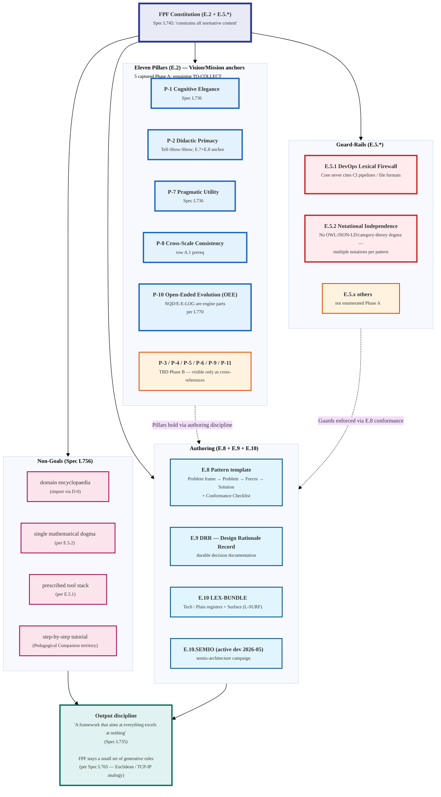

# Diagram 11 — FPF Constitution (Eleven Pillars + Guard-Rails)

**Provenance.** FPF-Spec L734-765 verbatim Constitution treatment + cross-refs к E.2,
E.5.1, E.5.2, E.7, E.8, E.9, E.10, E.10.SEMIO scattered across Part E. Pillar count
«11» per L745 anchor; partial enumeration Phase A — full sweep TO-COLLECT Phase B.
