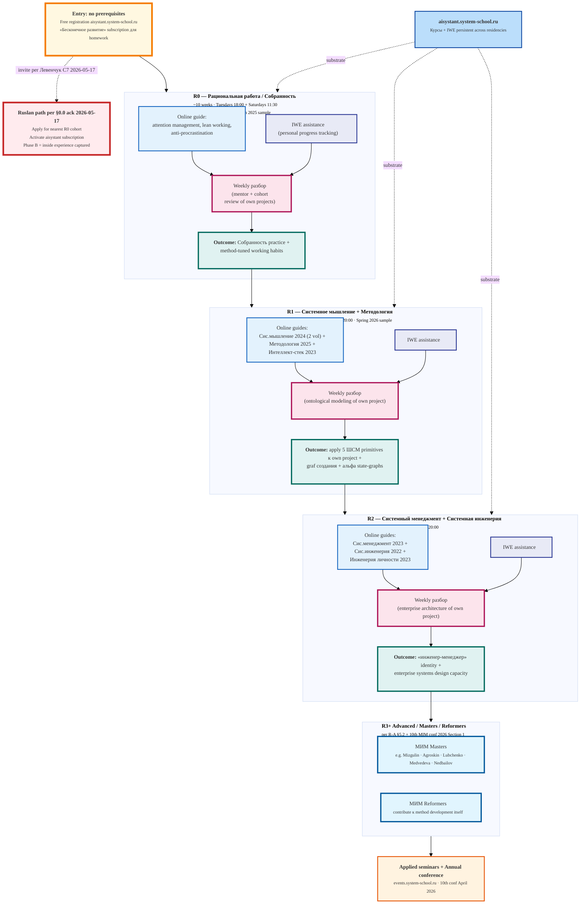

# Diagram 12 — МИМ Residency Flow

**Provenance.** R-A §2.2 residency tracks + LJ 1777145 Autumn 2025 cohort dates +
R-A §5.1 IWE role + R-A §5.2 advanced tracks + system-school.ru/team mentor list +
LJ 1798285 10th MIM conf Section 1 Левенчуковский talk title.
