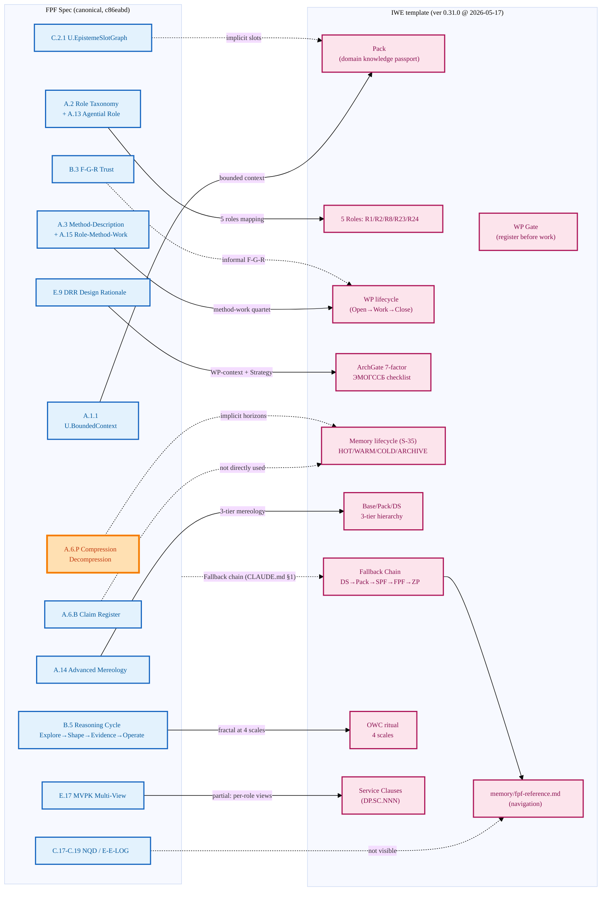

# IWE — FPF mechanism map

> What FPF mechanisms IWE structurally adopts. Solid line = explicit declared mapping;
> dashed line = used-but-not-named; gap = not visible in template.

**Legend.** Solid arrows = explicit mapping (verified in CLAUDE.md / docs/). Dashed arrows = used-but-not-named (functional similarity без declared discipline). Orange box (A.6.P) = active dev cluster May 2026, not yet stable in FPF Spec.

**Coverage.** 12 FPF mechanisms surveyed: 5 explicit, 5 implicit/partial, 2 not-visible-in-template.
