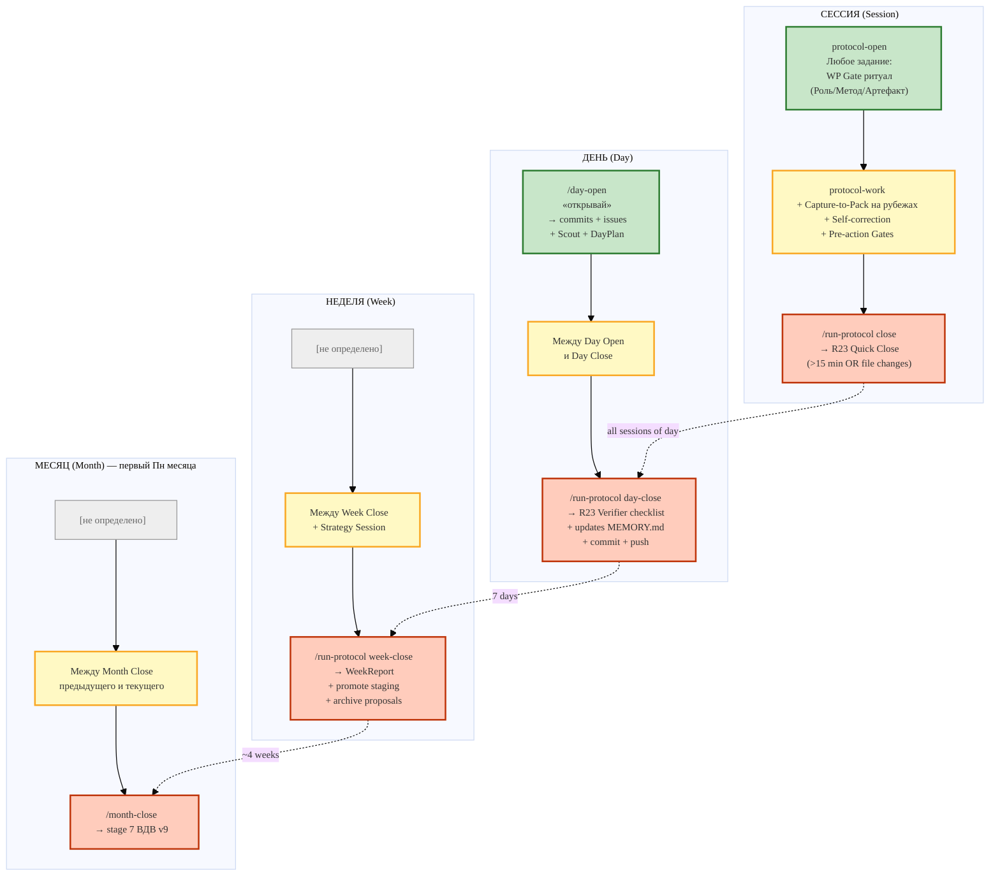

# IWE — user workflow (OWC fractal at 4 scales)

> Каждый scale: Открытие → Работа → Закрытие. Triggers + skills + persisted artefacts.

**Critical gates** (per CLAUDE.md §2):
- **WP Gate** (БЛОКИРУЮЩЕЕ): любое задание → register РП в 4 places (REGISTRY/WeekPlan/context/Linear)
- **Pull-on-Touch**: первое обращение к репо → `git pull --rebase` (lazy)
- **АрхГейт**: любое архитектурное решение → 7-factor ЭМОГССБ profile
- **IntegrationGate**: новый инструмент → 4 фазы (Обещание → Сценарии → Роль → Реализация)

**Artefacts produced per scale.**

| Scale | Artefacts |
|---|---|
| Session | WP-context/<NNN>.md, capture-reports, MEMORY.md updates |
| Day | DayPlan + DayReport + commits + Telegram notifications |
| Week | WeekPlan (next) + WeekReport (last) + staging promotions |
| Month | Month-Close report + Strategy session prep |
