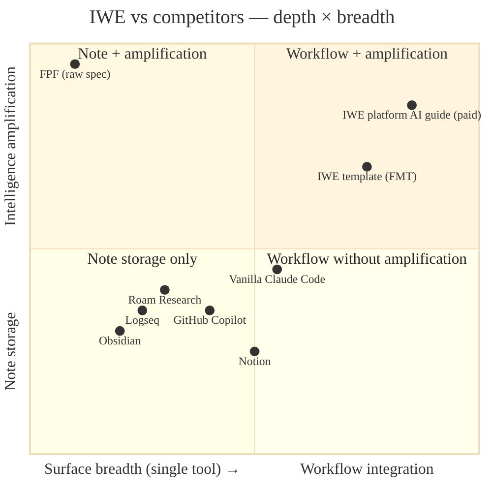
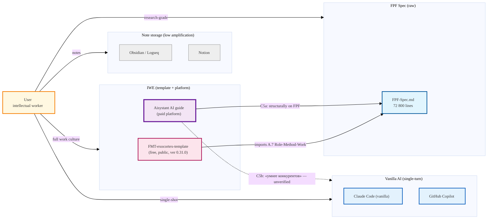

# IWE vs competitors — positioning landscape

> Reposition по 2 осям: (X) breadth of tool surface vs (Y) intelligence-amplification depth.
> «Exoskeleton vs prosthesis» distinction is FPF-derived; «work environment vs note storage» distinction is Tseren-canonical.

**Tseren's explicit anti-positioning** (`README.en.md:219-220`):
> «Obsidian is a note storage. IWE is a **work environment** with protocols, AI agents, and knowledge formalization. You can use Obsidian inside IWE for notes, but IWE provides structure, planning, and competence accumulation.»

**The exoskeleton claim** (`README.en.md:41`):
> «**Key principle: exoskeleton, not prosthesis.** IWE amplifies your thinking, not replaces it. After each session you become more competent, not just get a result.»

**Falsifier (per phil × critic).** «Exoskeleton ≠ prosthesis» — test: «можешь объяснить без «ИИ подсказал»?» Operational test, not yet validated comparatively against vanilla Claude Code.

**Critical reading.** Both diagrams reflect **C5a verified / C5b not-verifiable** decomposition from `02-iwe-deep-v2.md §2.1`. The «умнее конкурентов» claim positions IWE-platform against vanilla AI but no published benchmark; falsifier = C4 Arm comparison (Phase B blocked on Ruslan IWE subscription).
