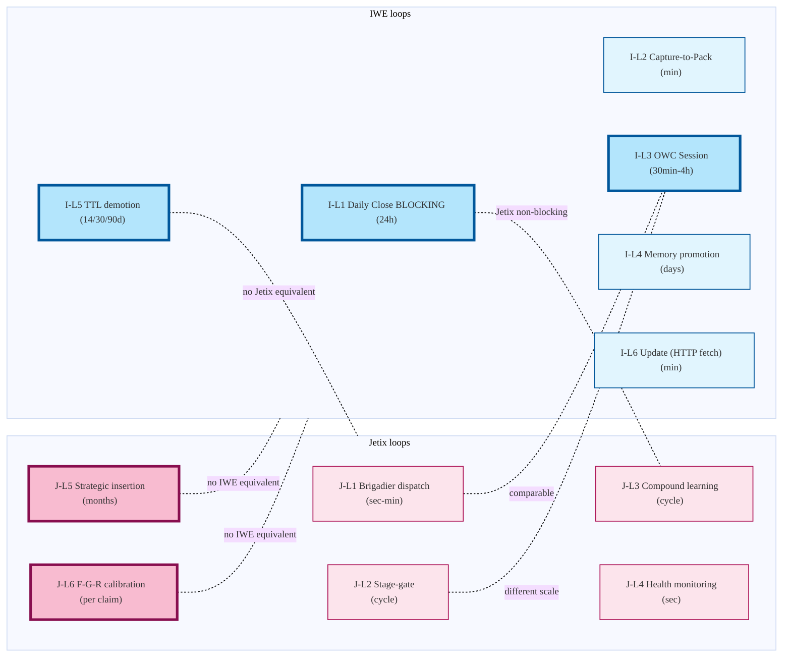

# Jetix vs IWE — overlap + uniques

```mermaid
%%{init: {'theme':'base','themeVariables':{'fontFamily':'Inter, system-ui, sans-serif','fontSize':'12px'}}}%%
graph TB
    subgraph Shared["Convergence (6 mechanisms)"]
        direction TB
        S1["Role ≠ Executor (FPF A.2+A.13)"]:::shared
        S2["Layered hierarchy (5-6 layers, FS-canonical)"]:::shared
        S3["Hard distinctions discipline"]:::shared
        S4["Filesystem = SoT"]:::shared
        S5["Append-only logs"]:::shared
        S6["HITL multi-gate"]:::shared
    end

    subgraph Jetix["Jetix UNIQUE-5"]
        direction TB
        J1["J-U1 Strategic Insights Hexagon<br>(6-cycle synthesis cadence)"]:::jetix
        J2["J-U2 R12 anti-extraction<br>(constitutional rule 12)"]:::jetixstrong
        J3["J-U3 5-layer per-agent memory<br>(Core/Strategies/Scratchpad/Niche/Mailbox)"]:::jetix
        J4["J-U4 B2 mini-swarm + de-morph reversibility"]:::jetix
        J5["J-U5 F2-F8 F-G-R per claim<br>+ Halt-Log-Alert grading"]:::jetixstrong
    end

    subgraph IWE["IWE UNIQUE-11"]
        direction TB
        I1["I-U1 Pack distribution format"]:::iwe
        I2["I-U2 OWC fractal at 4 scales<br>(blocking session-close)"]:::iwestrong
        I3["I-U3 ArchGate 7-factor ЭМОГССБ"]:::iwe
        I4["I-U4 Memory lifecycle S-35<br>(14/30/90d demotion)"]:::iwestrong
        I5["I-U5 OS-level scheduling"]:::iwe
        I6["I-U6 Creative Pipeline"]:::iwe
        I7["I-U7 Digital Twin"]:::iwe
        I8["I-U8 Harness"]:::iwe
        I9["I-U9 4-contour system"]:::iwe
        I10["I-U10 WP Gate (universal registration)"]:::iwestrong
        I11["I-U11 TTL on artefacts"]:::iwe
    end

    subgraph SharedGaps["Both lack vs Левенчуковский bar"]
        direction TB
        G1["U.Episteme slot graph enforcement"]:::gap
        G2["C.28 CausalUse-CAL as blocking rule"]:::gap
        G3["E-Constitution Eleven Pillars rule-set"]:::gap
        G4["E.17 MVPK full multi-view bundles"]:::gap
        G5["B.5.2 Abductive Loop formal NQD-CAL"]:::gap
    end

    Shared -.->|both adopt FPF A.2+A.13 etc| Jetix
    Shared -.->|both filesystem-canonical| IWE
    Jetix -.->|JETIX-FPF.md archived overreach| SharedGaps
    IWE -.->|memory/fpf-reference.md as navigation| SharedGaps

    classDef shared fill:#fff9c4,stroke:#f9a825,stroke-width:2px,color:#5d4037
    classDef jetix fill:#fce4ec,stroke:#ad1457,stroke-width:2px,color:#880e4f
    classDef jetixstrong fill:#f8bbd0,stroke:#880e4f,stroke-width:3px,color:#560027
    classDef iwe fill:#e1f5fe,stroke:#01579b,stroke-width:2px,color:#01579b
    classDef iwestrong fill:#b3e5fc,stroke:#01579b,stroke-width:3px,color:#0d47a1
    classDef gap fill:#eee,stroke:#999,stroke-width:1px,color:#666
```

**Strong (bold border) advantages.**
- **Jetix strong:** R12 anti-extraction (J-U2) — constitutional; F-G-R per claim + Halt-Log-Alert (J-U5) — runtime gating
- **IWE strong:** OWC fractal blocking session-close (I-U2); memory TTL demotion (I-U4); WP Gate universal registration (I-U10)

**Critical reading.** «Both lack» бокс — это **Левенчуковский bar** (per Phase A self-audit §5.4). Neither system has full FPF mechanism set. Both are FPF-adjacent tactical adoptions at different profiles.

**Feedback loops side-by-side** (per `reports/jetix-vs-iwe-audit-2026-05-17.md §6`):

**Asymmetries.** J-L5 (strategic insertion) + J-L6 (F-G-R) — no IWE equivalent. I-L1 (daily close blocking) + I-L5 (TTL demotion) — no Jetix equivalent. These are the structural differences L1 reader notices first.
