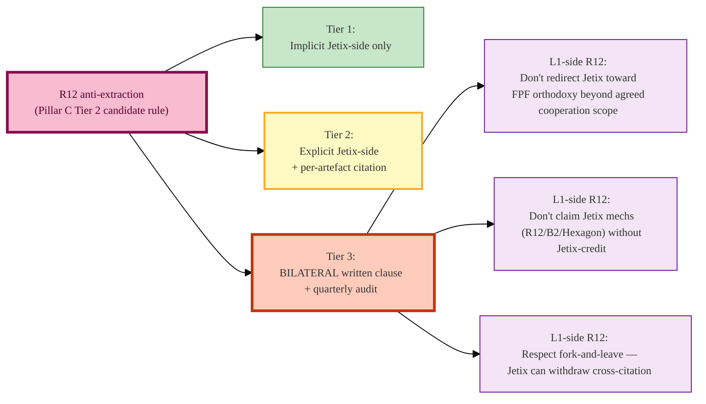

# Cooperation — 3 options visualized

> **R1 disclaimer.** Это **3 discrete options for Ruslan to choose**, не sequential ladder
> = AI-recommendation. Sequencing — Ruslan's strategic decision.

```mermaid
%%{init: {'theme':'base','themeVariables':{'fontFamily':'Inter, system-ui, sans-serif','fontSize':'12px'}}}%%
flowchart TB
    Start["Current baseline<br>2026-05-17<br>relationship 1-2/10"]:::start

    T1["Tier 1 LIGHT<br>1 month observation<br>€0-50/mo<br>No commitment"]:::t1
    T2["Tier 2 MEDIUM<br>3 months joint exercise<br>€0-1500/mo<br>AWAITING-APPROVAL if >€50/day"]:::t2
    T3["Tier 3 DEEP<br>6-12 months advisory<br>€5K-15K/mo<br>AWAITING-APPROVAL MANDATORY"]:::t3

    G1{"Tier 1 entry<br>(no gate)"}:::gate
    G2{"Tier 2 entry GATE:<br>1. C4 run + ≥1σ Arm D vs A<br>2. B2 unblocked<br>3. Tseren ≥3/10<br>4. Ruslan explicit ack"}:::gate
    G3{"Tier 3 entry GATE:<br>1. Tier 2 ≥3 cross-citations<br>2. Both L1 ack positive<br>3. Bilateral R12 written<br>4. Ruslan explicit ack<br>5. AWAITING-APPROVAL packet"}:::gate

    Start --> G1 --> T1
    T1 -.->|Ruslan decision (R1)| G2 --> T2
    T2 -.->|Ruslan decision (R1)| G3 --> T3

    J1["Janus S-A excess:<br>FPF orthodoxy capture<br>→ downgrade to Tier 2"]:::janus
    J2["Janus INT excess:<br>Isolation drift<br>→ downgrade to Tier 1"]:::janus

    T3 -.-> J1
    T3 -.-> J2

    CB1["Circuit breakers Tier 1:<br>• cost >€50/day → halt+ask<br>• attention burst → reflect"]:::cb
    CB2["Circuit breakers Tier 2:<br>• Arm D < Arm A → halt<br>• Tseren no-response 30d<br>• Levenchuk 'не интересно'<br>• cost >€1500/mo sustained"]:::cb
    CB3["Circuit breakers Tier 3:<br>• R12 bilateral violation → halt<br>• cost overrun >€15K/mo<br>• direction-drift (S-A)<br>• isolation (INT)"]:::cb

    T1 -.-> CB1
    T2 -.-> CB2
    T3 -.-> CB3

    classDef start fill:#fff8e1,stroke:#f57c00,stroke-width:2px
    classDef t1 fill:#c8e6c9,stroke:#2e7d32,stroke-width:2px
    classDef t2 fill:#fff9c4,stroke:#f9a825,stroke-width:2px
    classDef t3 fill:#ffccbc,stroke:#bf360c,stroke-width:3px
    classDef gate fill:#e1f5fe,stroke:#01579b,stroke-width:2px,color:#0d47a1
    classDef janus fill:#f3e5f5,stroke:#6a1b9a,stroke-width:2px,color:#4a148c
    classDef cb fill:#eee,stroke:#666,stroke-width:1px,color:#333
```

**R12 application across tiers.**



**Cost arithmetic by tier** (per investor × scalability §1):

| Tier | Floor (€/mo) | Ceiling (€/mo) | vs Phase A §0.0 cap (€10/day baseline; halt+ask €50) |
|---|---|---|---|
| Tier 1 | 0 | 50 | Inside cap |
| Tier 2 | 0 | 1500 | At boundary — AWAITING-APPROVAL if sustained >€50/day |
| Tier 3 | 5000 | 15000 | Well above cap — AWAITING-APPROVAL MANDATORY |

**Moat analysis (per investor × scalability §3):**
- **Moat A (FPF-derivation):** Low-medium durability; cooperation strengthens.
- **Moat B (R12 anti-extraction):** Structurally durable; independent of cooperation.
