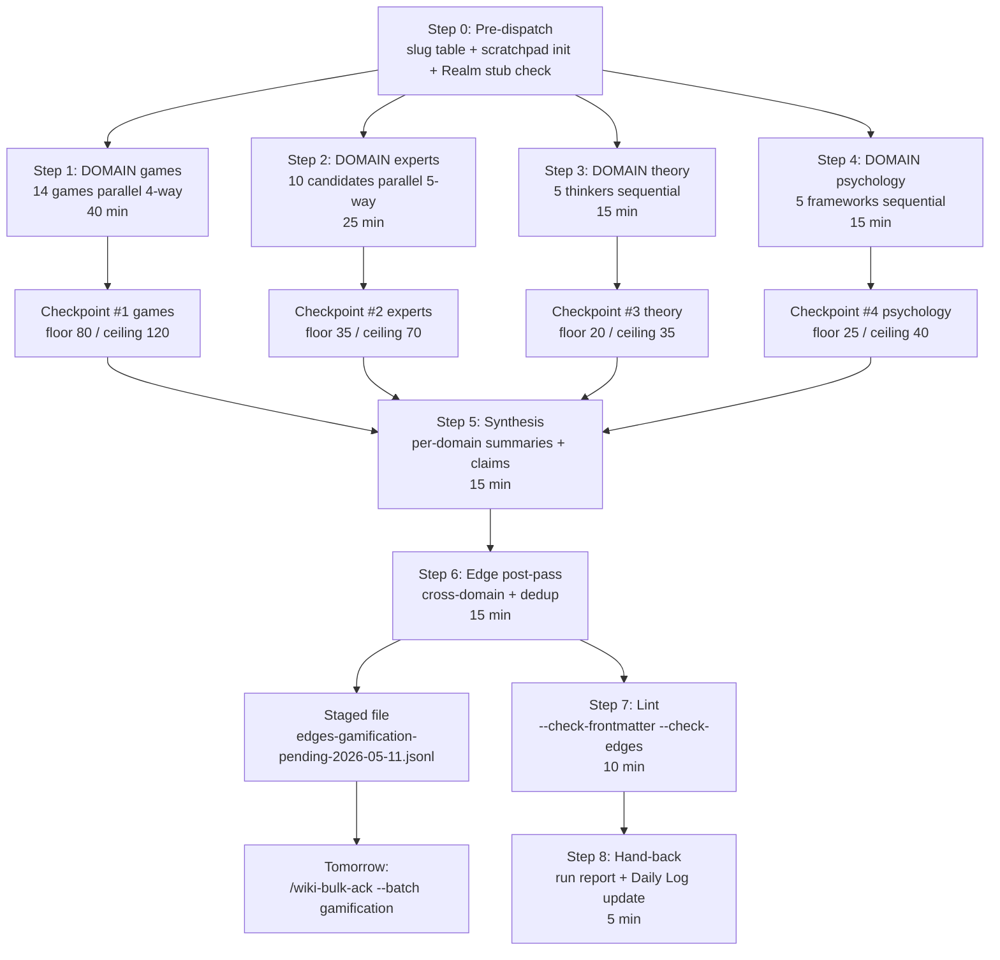
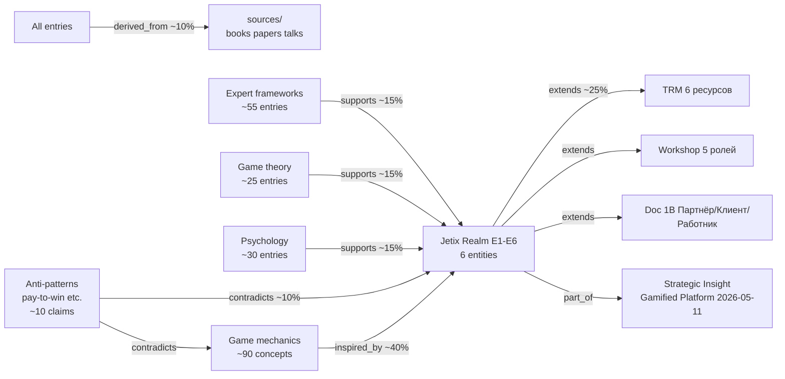

# 🎮 Gamification Deep-Wiki Mining Plan-Doc (Шаг B)

> **Шаг A** = Notion subpage 35d2496333bf814b978ad6159600447f (high-level structure, Ruslan-authored morning 2026-05-11).
> **Шаг B (этот документ)** = детальный execution-ready plan для wiki mining.
> **Шаг C** = autonomous brigadier execution per этот plan (~2h 10min target wall-clock, recommended TOMORROW для preservation Шаг 5 Tseren video commitment).

---

## §0 TL;DR (15 строк)

```
1. Шаг B mining plan-doc — детальный roadmap для gamification deep-wiki сборки (Шаг C execution).
2. Scope: 4 domains × ~120-180 wiki entries (games / experts / theory / psychology) targeting Jetix Realm 6-entity design.
3. Source anchors: Strategic Insight Gamified Platform 2026-05-11 (536 lines, 6 entities + 7 mechanics + 10 experts) + Doc 1B + TRM + Workshop.
4. Games: 10 mass (Roblox/Fortnite/Minecraft/Dota/LoL/CS2/HoK/PUBG/Candy/PokeGo) + 4 special focus (Torn/EVE/WoW/Civ) = 14 games × ~7 entries.
5. Economy experts: 10 candidates (Castronova primary ack); ~55 entries; Machinations.io = tool concept (light pass, 60% pre-covered в SI §6.4).
6. Game theory: Nash/Axelrod/Schelling/Maynard Smith/Camerer + mechanism design; ~25 entries.
7. Psychology: SDT (Ryan-Deci) / Hooked-Eyal / Flow-Csikszentmihalyi / Social proof / Neurochemistry; ~30 entries.
8. Brigadier model: single canonical orchestrating 4 parallel domain sub-tasks (NOT 4 mini-swarms); per-domain scratchpad segments для audit trail.
9. Output entity types: concepts/ ~90, entities/ ~30, sources/ ~40, ideas/ ~20, claims/ ~12 (incl anti-patterns polarity:negative), summaries/ ~6.
10. New edges: ~130-195 (hybrid inline+post-pass; soft cap 195, hard cap 225); inspired_by ~40% / extends ~25% / supports ~15% / contradicts ~10% / derived_from ~10%.
11. Edges staged → wiki/graph/edges-gamification-pending-2026-05-11.jsonl для tomorrow bulk-ack (NOT auto-merge to canonical edges.jsonl).
12. Budget: ~270-405k tokens, per-domain split (NOT pooled); 2h 10min wall-clock target / 2h 30min hard cap.
13. Constitutional: F2 blast-radius, append-only к wiki/, Tier 2 R2 compliant, voice-pipeline DRAFT-only pattern (state: draft, pipeline: ingested).
14. ETA execution: TODAY post-Шаг3 morning review (if budget permits before Шаг5 Tseren video) OR TOMORROW (RECOMMENDED — safer for video commitment + buffer).
15. Plan-doc path: reports/gamification-deep-wiki-mining-plan-2026-05-11.md; awaits Ruslan ack §10 (13 open questions) → commit + push.
```

---

## §1 Цель + Application

### §1.1 Цель mining-cycle (две оси)

**Long-term ось — Jetix Realm 6-entity full spec:**

Mining фундаментирует полную спецификацию 6 entities из Strategic Insight §4.2:

| # | Entity | Mining фокус |
|---|--------|--------------|
| E1 | **Persona** = Специалист (TRM 6 stats) | Психология motivation + game stat systems (HP/MP/XP patterns) |
| E2 | **Class** = Специализация (6 archetypes) | Class design pattern из WoW/Diablo/LoL + skill trees |
| E3 | **Clan** = Команда проекта (3-10 чел) | Faction mechanics: Torn / EVE corps / WoW guilds — economy, reputation, raids |
| E4 | **Quest** = Реальная бизнес-задача | Quest design: difficulty curves, reward structures, parametrization |
| E5 | **Resources** = Energy / Focus / AI credits / Audience reach | Resource management: sinks/faucets/regeneration, attention economy |
| E6 | **Seasons** = 3-month cycles | Battle pass mechanics (Fortnite), season finals (EVE/LoL), retention curves |

**Immediate ось — core seed для первых 10 человек клана:**

Per Strategic Insight §6 first cohort + §10.3 mid-term (30-60 days):
- Recruit 10 founding members per Phase 1 outreach pipeline
- Pilot clan-mechanics (E3) immediately — Faction Respect / Armoury / Organized Projects
- Use mined wiki как «system manual» — Ruslan описывает Jetix своими словами, wiki cross-verifies / fills gaps

### §1.2 Application loop (4 шага)

```
1. Mining (этот cycle Шаг C)
   → wiki/ +~150 entries + ~150 edges (staged)

2. Ruslan describes Jetix gamification своими словами
   → draft document (own voice, own framing)

3. Wiki cross-verifies / supports / fills gaps в Ruslan draft
   → identify: подтверждено / расходится с literature / новый pattern

4. Final spec ready для применения с первыми 10 человек клана
   → product pilot launch (per Strategic Insight HG.1)
```

### §1.3 Companion role to 6 Hexagon insights

Эта mining-cycle **extends, never contradicts** существующие insights:

| Hexagon insight | Gamification mining contribution |
|---|---|
| Foundation Model | Game UI/UX patterns как experience design layer над substrate |
| Partnership Model | Clans = partnerships в gamified form (Manifest pattern compatible) |
| R&D Flywheel | Reinvest into game design talent (per §10.4 talent recruitment) |
| Network State (Balaji) | Realm = digital nation substrate (clans/quests = governance) |
| Tyson Pattern | Mastership = game progression (Hunter→Architect class tree) |
| **Gamified Platform** (anchor) | Полностью расширяется этой mining (это его child) |

**Halt rule:** ANY proposed edge `contradicts` к 6 Hexagon insights → halt-log-alert + Ruslan ack (Tier 2 R7 — no autonomous contradiction).

---

## §2 Scope — 4 domains

### §2.1 GAMES domain (14 games)

**Mass games (10, baseline 1× depth):**

| # | Game | MAU | Mining фокус |
|---|------|-----|--------------|
| 1 | Roblox | 380M | UGC marketplace pattern; user-built mini-experiences; Robux economy |
| 2 | Fortnite | 247M | Battle pass 3-month seasons; crossovers; V-Bucks economy |
| 3 | Minecraft | 200M | Open sandbox tools; emergent gameplay; Realms server economy |
| 4 | Dota 2 | 130M | Skill ceiling progression; cosmetic-only monetization; The International |
| 5 | LoL | 130M | Simplified entry curve; global esports ladder; Riot Points dual-currency |
| 6 | CS2 | 40M | Multi-billion secondary skins market; competitive ranking system |
| 7 | Honor of Kings | 100M+ | Mobile-first short matches (10 min); regional dominance pattern |
| 8 | PUBG/Free Fire | 70M | Battle royale; emerging market mobile dominance |
| 9 | Candy Crush | 273M | 5-min sessions; daily streak retention; freemium funnel |
| 10 | Pokemon Go | 50M | Location-based AR; real-world tie; collection mechanic |

**Special focus games (4, 2-3× depth):**

| # | Game | Depth | Why critical |
|---|------|-------|--------------|
| 11 | **Torn** | 3× | Strategic Insight precedent — мать всех patterns (Faction/OC/Energy/Marketplace/Stocks). Realm E3 direct lift. |
| 12 | **EVE Online** | 3× | Player-run economy (Eyjólfur Guðmundsson reports). Realm E5 economy depth anchor. |
| 13 | **WoW** | 3× | 20-year retention design. Guild mechanics. PvE/PvP balance. Realm E3 + E6 retention. |
| 14 | **Civilization** | 2× | Strategy progression (Tech tree, eras, victory conditions). Realm E2 class+E4 quest progression. |

**Per-game output target:**
- 1 entity entry (`wiki/entities/games/{game-slug}.md`)
- 5-7 concept entries per game (core mechanics — battle-pass, ranked-ladder, season-pass, etc.) — special-focus 10-15 concepts
- 2-3 source entries per game (dev postmortems, GDC talks, primary wiki extracts)
- **Domain budget: ~100 entries (14 × ~7 avg)**

**Mining strategy:**
- Web search query template: `"{game} core loop GDC postmortem"`, `"{game} game economy design"`, `"{game} retention mechanics"`
- Preserve dev primary (GDC talks, developer interviews) > marketing material
- Reject: streamer reaction videos, hype articles, score reviews
- Cite: official wiki excerpt + dev postmortem URL minimum

### §2.2 ECONOMY EXPERTS domain (10 candidates + Machinations)

Per Strategic Insight §6.1-6.2.2. Castronova CONFIRMED primary mentor target.

| # | Expert | Depth | Output |
|---|--------|-------|--------|
| 1 | **Edward Castronova** ⭐ CONFIRMED | 3× | 1 entity + 4-5 sources (Synthetic Worlds, Exodus to the Virtual World, Wildcat Currency, GNP-of-game-worlds paper) + 5-7 concepts (synthetic-economies, virtual-currencies, virtual-GDP, real-money-trading, etc.) |
| 2 | Yanis Varoufakis | 2× | 1 entity + 2 sources (Technofeudalism, Talking to My Daughter) + 3-4 concepts (Valve-economist, technofeudalism, virtual-economy-as-real, progressive-economics-applied) |
| 3 | Joost van Dreunen | 2× | 1 entity + 2 sources (One Up book, SuperJoost newsletter) + 2-3 concepts (game-industry-economics, gaming-market-size, business-of-video-games) |
| 4 | Eyjólfur Guðmundsson | 2× | 1 entity + 1-2 sources (CCP quarterly reports archive) + 2-3 concepts (player-economy-monitoring, EVE-monthly-economic-reports, real-economist-in-game-studio) |
| 5 | Vili Lehdonvirta | 1× | 1 entity + 1 source (Virtual Economies: Design and Analysis, MIT Press) + 2-3 concepts (oxford-internet-institute-virtual-economy, modern-academic-foundation) |
| 6 | Daniel James | 1× | 1 entity + 1 source (Puzzle Pirates economy postmortem) + 1-2 concepts (game-as-economist, indie-econ-design) |
| 7 | Ramin Shokrizade | 1× | 1 entity + 1 source (whaling psychology articles) + 2-3 concepts (toxic-monetization-patterns, whaling, anti-pattern source) |
| 8 | Dmitri Williams | 1× | 1 entity + 1 source (USC Annenberg papers) + 1-2 concepts (Ninja-Metrics-game-analytics) |
| 9 | Noah Trudeau | 1× | 1 entity + 1 source (WVU livestream pedagogy) + 1-2 concepts (twitch-office-hours, accessible-economics-teaching) |
| 10 | Jeff Sarbaum | 1× | 1 entity + 1 source (Flash microecon game) + 1-2 concepts (hands-on-pedagogy) |

**Machinations.io** (TOOL, not expert) — light pass (60% covered в Strategic Insight §6.4):
- 1 entity entry (`wiki/entities/tools/machinations-io.md`)
- 3 concept entries: economic-systems-diagramming, resource-pools-sources-drains-converters, monte-carlo-game-balance-simulation
- 2 source entries: machinations.io articles ("What is game economy design", "Balancing solved!")

**Domain budget: ~55 entries (10 experts × ~5 avg + Machinations 6)**

**Mining strategy:**
- Web search: `"{expert} interview podcast"`, `"{expert} book key concepts"`, `"{expert} academic paper {topic}"`
- Castronova: deeper — Indiana University Media School page + multiple papers + interviews
- Cite-or-skip: no claim without source URL/title

### §2.3 GAME THEORY domain (5 thinkers + foundation)

| # | Thinker | Concepts | Output |
|---|---------|----------|--------|
| 1 | John Nash | Nash equilibrium, multi-player decisions, prisoner's dilemma | 1 entity + 3-4 concepts + 2 sources (Nash 1950 paper, Beautiful Mind biographical) |
| 2 | Robert Axelrod | Iterated PD, tit-for-tat, Evolution of Cooperation | 1 entity + 3-4 concepts + 2 sources (Evolution of Cooperation book, tournaments paper) |
| 3 | Thomas Schelling | Focal points, strategy of conflict, segregation models | 1 entity + 3-4 concepts + 2 sources (Strategy of Conflict, Micromotives) |
| 4 | John Maynard Smith | ESS, evolutionary game theory, biology-game-theory bridge | 1 entity + 2-3 concepts + 1 source (Evolution and the Theory of Games) |
| 5 | Colin Camerer | Behavioral game theory, experimental econ | 1 entity + 2-3 concepts + 1 source (Behavioral Game Theory book) |

**+ Mechanism design foundation:**
- Hurwicz / Maskin / Myerson (Nobel 2007) — implementation theory
- Alvin Roth — matching markets, kidney exchange
- Auction theory (Vickrey-Clarke-Groves)
- 3-4 cross-cutting concepts (incentive-compatibility, revelation-principle, second-price-auction)

**Domain budget: ~25 entries (5 entities + ~12 concepts + ~8 sources)**

**Mining strategy:**
- Foundational papers: Nash 1950 «Equilibrium Points in N-Person Games», Axelrod 1984 (book), Schelling 1960
- Textbook chapter summaries when primary inaccessible
- Cross-link to Realm E4 (quest design = mechanism design applied)

### §2.4 PSYCHOLOGY domain (5 frameworks)

| # | Framework | Output |
|---|-----------|--------|
| 1 | **Self-Determination Theory** (Ryan & Deci) ⭐ core | 2 entities (Ryan, Deci) + 5-6 concepts (autonomy, competence, relatedness, intrinsic-vs-extrinsic-motivation, OIT, CET) + 2 sources (Deci & Ryan 2000 paper, Why We Do What We Do book) |
| 2 | Variable rewards / operant conditioning | 2 entities (Skinner, Eyal) + 4-5 concepts (variable-ratio-schedule, intermittent-reinforcement, hook-model, trigger-action-reward-investment) + 2 sources (Hooked book, Skinner papers) |
| 3 | Flow state | 1 entity (Csikszentmihalyi) + 3-4 concepts (challenge-skill-balance, autotelic-experience, flow-channel, optimal-experience) + 1 source (Flow book) |
| 4 | Social proof / belonging | 1 entity (Cialdini) + 3-4 concepts (social-proof, commitment-consistency, belonging-as-motivation, in-group-identification) + 1 source (Influence book) |
| 5 | Neurochemistry of motivation | 1 entity (Lembke, optional) + 2-3 concepts (dopamine-reward-prediction-error, hedonic-treadmill, endorphin-cooperation-loops) + 1 source (Dopamine Nation, optional) |

**Domain budget: ~30 entries (5-7 entities + ~18 concepts + ~7 sources)**

**Mining strategy:**
- SDT primary: Deci & Ryan 2000 "The What and Why of Goal Pursuits" + selfdeterminationtheory.org
- Hooked: chapter summaries (book widely cited)
- Flow: Csikszentmihalyi 1990 + interviews
- Cross-link to Realm E1 (Persona stats reflect autonomy/competence/relatedness)

### §2.5 Cross-cut — Jetix Realm E1-E6 prerequisite check

**Risk R3 mitigation (Realm-entity backlink drift):**

PRE-DISPATCH check — verify Realm entity slugs exist:
- `wiki/concepts/jetix-realm/e1-persona.md`
- `wiki/concepts/jetix-realm/e2-class.md`
- `wiki/concepts/jetix-realm/e3-clan.md`
- `wiki/concepts/jetix-realm/e4-quest.md`
- `wiki/concepts/jetix-realm/e5-resources.md`
- `wiki/concepts/jetix-realm/e6-seasons.md`

**If absent → CREATE stubs FIRST в Step 0** (50-100 word stub each, derived from Strategic Insight §4.2). Mining links to existing slugs only — no broken edges allowed.

**Canonical slug table** написан в brigadier scratchpad pre-dispatch; ALL domain dispatches read from table.

---

## §3 Methodology

> **Addendum reference (Шаг B.1):** Source quality 3-tier classification (T1 anchor / T2 supportive / T3 DRAFT) + REJECT list — see [Source Quality Addendum §1](gamification-source-quality-addendum-2026-05-11.md#1-source-quality-policy--3-tier--reject).

### §3.1 Per-domain mining strategy

| Domain | Primary source pattern | Quality filter | Cite-format |
|--------|------------------------|----------------|-------------|
| GAMES | Dev postmortems (GDC, devblogs) > official wiki > academic > journalism | Reject streamer reactions, hype articles | URL + dev/studio attribution |
| EXPERTS | Books > academic papers > interviews/podcasts > newsletter | Reject AI-summarized content farm | Book title + ISBN OR paper DOI OR podcast episode URL |
| THEORY | Foundational papers > textbook chapters > Wikipedia (anchor only) | Reject pop-econ summary blogs | Paper title + year + author OR textbook chapter ref |
| PSYCHOLOGY | Primary academic papers > authoritative books > academic talks | Reject lifestyle blog interpretations | Paper DOI OR book + chapter |

### §3.2 Wiki entity-type mapping (per Wiki v2 9 entity types)

| Mined content | Wiki entity type | Frontmatter `type:` | Example |
|---------------|------------------|---------------------|---------|
| Game (Roblox, Torn, etc.) | `entities/games/` | entity | `entities/games/torn.md` |
| Game mechanic (battle-pass, faction-respect) | `concepts/` | concept | `concepts/battle-pass.md` |
| Expert/person (Castronova, Varoufakis) | `entities/people/` | entity | `entities/people/castronova.md` |
| Tool (Machinations.io) | `entities/tools/` | entity | `entities/tools/machinations-io.md` |
| Book/Paper/Talk | `sources/` | source | `sources/synthetic-worlds-castronova-2005.md` |
| Applied pattern (Torn-faction→Realm-E3) | `ideas/` | idea | `ideas/torn-faction-as-realm-clan.md` |
| Validated mechanism (proven ≥3 top games) | `claims/` polarity:positive | claim | `claims/variable-rewards-drive-retention.md` |
| Anti-pattern (pay-to-win) | `claims/` polarity:negative | claim | `claims/anti-pattern-pay-to-win.md` |
| Per-domain synthesis | `summaries/` | summary | `summaries/gamification-games-domain-2026-05-11.md` |

### §3.3 Edge generation strategy — HYBRID (per Plan agent recommendation)

**INLINE draft pass** (during entry write):
- Each entry emits 1-3 load-bearing edges to Realm entities OR canonical kernels (Workshop/TRM/Doc 1B)
- These edges justify the entry's existence в wiki — без них entry orphan
- Edge types inline: `inspired_by` (mechanic→Realm), `supports` (expert→Realm), `derived_from` (entry→source)

**POST-PASS synthesis** (after all 4 domains done):
- Cross-domain edges (e.g., Castronova → Torn → E5 Resources)
- `contradicts` edges for anti-patterns
- `supersedes` chains для overlapping concepts
- DEDUP against existing 609 edges

**Edge cardinality cap:**
- Soft cap: 1.3× entries (~195 edges)
- Hard cap: 1.5× entries (~225 edges)
- Above hard cap → ABORT post-pass, ask Ruslan

**Edge-type expected distribution:**

```
inspired_by   ~40%  (games → Realm)
extends       ~25%  (Realm → TRM/Workshop/Doc 1B canonical)
supports      ~15%  (experts/theory/psych → Realm)
contradicts   ~10%  (anti-patterns → Realm/mechanics)
derived_from  ~10%  (entries → sources)
─────────────
Total         100%  (~150-200 edges)
```

### §3.4 Brigadier dispatch model — SINGLE CANONICAL

Per Plan agent recommendation (Section 1 design memo):

**Architecture:**
- Single canonical brigadier orchestrates 4 parallel domain sub-tasks
- NOT 4 sub-brigadiers (agents = foundation-shaped artifacts; one-shot mining doesn't warrant new agent types)
- Reserve sub-brigadier pattern для domains repeating ≥3 times

**Audit trail:**
- Per-domain scratchpad segments: `agents/gamification-brigadier-scratchpad/scratchpad.md`
- Segmented as:
  - `## DOMAIN: games`
  - `## DOMAIN: experts`
  - `## DOMAIN: theory`
  - `## DOMAIN: psychology`
- Per-domain JSONL log lines: timestamp, action, entry_path, edges_drafted, tokens_used

**Existing experts inherited as helpers:**
- `knowledge-synth` — synthesis pass (summaries/, cross-domain claims)
- `sales-researcher` — expert profile entries (people entities)
- `crazy-agent` — cross-domain unexpected connections
- NO new agent types created

**Pre-dispatch slug table** (Risk R3 mitigation):
- Realm: `e1-persona`, `e2-class`, `e3-clan`, `e4-quest`, `e5-resources`, `e6-seasons`
- Workshop: `master`, `worker`, `machine`, `info`, `value`, `role-craftsman`, `role-manager`, `role-tool-researcher`, `role-info-filter`, `role-workflow-config`
- TRM: `capital-l0`...`capital-l5`, `time-leverage-l0`...`time-leverage-l5` (6 × 6 = 36 slugs), + base `capital`, `time-leverage`, `audience`, `knowledge`, `compute`, `network`
- Doc 1B: `partner-tier`, `client-tier`, `worker-tier`, `8-faces-{1..8}`, `meta-workshop`, `сеть-мастеров`, `куратор`, `авантюра`
- Strategic Insight 2026-05-11: anchor slug `strategic-insight-gamified-platform-2026-05-11`

**Slug table written to scratchpad → ALL dispatches read from it. Any slug-not-in-table reference = PAUSE.**

---

## §4 Budget & Time

### §4.1 Token budget (per-domain split, NOT pooled)

**Calculation:**
- 120-180 entries × 1.5k tokens each (generation + search) = 180-270k tokens
- +50% overhead для synthesis / edges / lint = 270-405k total
- Max sub — no real € cost but discipline required

**Per-domain allocation:**

| Domain | Tokens | % | Notes |
|--------|--------|---|-------|
| Games | 100k | 25% | 14 games × ~7 entries × 1k |
| Experts | 65k | 16% | 10 experts × ~5 entries × 1.3k (Castronova heavy) |
| Theory | 35k | 9% | 5 entities + 12 concepts + 8 sources |
| Psychology | 45k | 11% | 5 frameworks × ~6 entries × 1.5k (literature-heavy) |
| Synthesis + edges | 80k | 20% | Per-domain summaries + cross-domain + edge post-pass |
| Buffer (overruns) | 80k | 19% | 20% safety margin |
| **Total** | **405k** | **100%** | |

**Budget alert at 75% per domain → switch to cite-only mode** (no expansion prose, only citations).

### §4.2 Wall-clock estimate (target 1.5-2.5h)

| Step | Duration | Cumulative |
|------|----------|------------|
| 0 Pre-dispatch (slug table + scratchpad init + Realm stub check) | 10 min | 0:10 |
| 1 Games (parallel 4-way: 14 games) | 40 min | 0:50 |
| 2 Experts (parallel 5-way: 10 candidates) | 25 min | 1:15 |
| 3 Theory (sequential: 5 thinkers + mechanism design) | 15 min | 1:30 |
| 4 Psychology (sequential: 5 frameworks) | 15 min | 1:45 |
| 5 Synthesis (per-domain summaries + claims) | 15 min | 2:00 |
| 6 Edge post-pass (cross-domain + dedup) | 15 min | 2:15 |
| 7 Lint + run report | 10 min | 2:25 |
| 8 Hand-back (notify + Daily Log update) | 5 min | 2:30 |
| **Target** | **~2h 10min** | |
| **Hard cap** | **2h 30min** | |

### §4.3 Checkpoint cadence — PER-DOMAIN (not time-based)

> **Addendum reference (Шаг B.1):** Per-source + per-entry audit frontmatter + real-time halt thresholds (>20% low-confidence / >10% high hallucination / >15% cite-failure → PAUSE) + post-domain audit summary template — see [Source Quality Addendum §3](gamification-source-quality-addendum-2026-05-11.md#3-self-audit-hooks).

4 checkpoints (end of each domain), не 30-min wall-clock pulses. Cadence aligns с logical units.

Each checkpoint writes to brigadier scratchpad:
```
## CHECKPOINT #N — {domain}
- entries_created: N
- token_spent: T (% of domain budget)
- edges_drafted: E (inline pass)
- floor: <floor> / ceiling: <ceiling>
- blockers: [list]
- next: <next domain or synthesis>
```

Final hand-back: full report `reports/gamification-mining-run-2026-05-11.md` (separate file, post-execution).

---

## §5 Quality Filters + Preserve-List

> **Addendum reference (Шаг B.1):** Extends §5.1 REJECT with explicit content-farm / streamer / Wikipedia-cite / AI-gen / Reddit-primary list AND §5.3 cite-or-skip с audit-frontmatter contract (`source_classifier:` per-source + `audit:` per-entry) — see [Source Quality Addendum §1 + §3](gamification-source-quality-addendum-2026-05-11.md).

### §5.1 Garbage filter (REJECT)

❌ Content-farm listicles ("10 game mechanics you need to know!" без dev source)
❌ Marketing material from game studios (только stated facts, не interpretation)
❌ Outdated data (>5 years for market numbers; >10 years OK для theoretical works)
❌ AI-generated content без verifiable source
❌ Single-source claims без cross-validation (≥2 sources for non-trivial claims)
❌ Reddit threads as primary (only as pointer к primary source)
❌ Streamer reaction videos / Twitch clips (entertainment, не analysis)
❌ Score reviews / hype articles (subjective, не mechanical)

### §5.2 Preserve guaranteed (read-only anchors — NEVER edited, only linked-to)

Per Plan agent recommendation (Section 6 design memo):

1. **`decisions/STRATEGIC-INSIGHT-JETIX-AS-GAMIFIED-PLATFORM-2026-05-11.md`** (536 lines — main anchor)
2. **`decisions/JETIX-WORKSHOP-CONCEPT-2026-04-30.md`** (5 owner roles + мастер/работник/станок)
3. **`decisions/JETIX-TRM-MODEL-2026-04-30.md`** (6 ресурсов × L0-L5)
4. **`decisions/JETIX-CORPORATION-2026-05-05.md`** (Doc 1B — 8 faces + Партнёр/Клиент/Работник)
5. All 6 Hexagon insights (Foundation / Partnership / R&D / Balaji / Tyson / Gamified)
6. **Castronova primary works** (Synthetic Worlds 2005 — CONFIRMED Ruslan ack)
7. Voice item #1 `audio_631` (Torn-style Life OS precedent, score 0.809)
8. All dev postmortems / GDC talks (primary devs analyzing own games)

**Halt rule:** ANY proposed edit to read-only anchor → halt-log-alert + Default-Deny.

### §5.3 Cite-or-skip rule

**No claim без source URL/title.** Unverified content → `state: draft, confidence: low`.

Acceptable source formats:
- Book: `<title> <author> <year> ISBN <ISBN>`
- Paper: `<title> <author> <year> DOI <doi>` OR `<journal> <vol> <pp>`
- Podcast: `<show> <episode> <date> URL`
- Dev talk: `GDC <year> <speaker> <title> URL`
- Wiki: `<wiki-name> <page-slug> URL accessed-on:<date>`

Unacceptable: "common knowledge", "everyone agrees", "as widely reported".

---

## §6 Output

### §6.1 File path enumeration (per Plan agent — reviewers can't ack what they can't enumerate)

**`wiki/concepts/` ~80-100 new:**

Examples (illustrative, not exhaustive):
- `wiki/concepts/game-mechanics/battle-pass.md`
- `wiki/concepts/game-mechanics/variable-reward-schedule.md`
- `wiki/concepts/game-mechanics/season-pass.md`
- `wiki/concepts/game-mechanics/faction-respect.md`
- `wiki/concepts/game-mechanics/organized-crimes-revenue-split.md`
- `wiki/concepts/game-mechanics/energy-soft-constraint.md`
- `wiki/concepts/game-mechanics/marketplace-player-economy.md`
- `wiki/concepts/game-mechanics/raid-coop-mechanic.md`
- `wiki/concepts/game-economy/virtual-currency-design.md`
- `wiki/concepts/game-economy/sinks-faucets-balance.md`
- `wiki/concepts/game-economy/monte-carlo-simulation-balance.md`
- `wiki/concepts/game-theory/nash-equilibrium.md`
- `wiki/concepts/game-theory/iterated-prisoners-dilemma.md`
- `wiki/concepts/psychology/self-determination-autonomy.md`
- `wiki/concepts/psychology/flow-channel.md`
- `wiki/concepts/psychology/dopamine-prediction-error.md`
- ... etc.

**`wiki/entities/` ~25-35 new:**
- `wiki/entities/games/torn.md`, `roblox.md`, `fortnite.md`, ..., `civilization.md` (14)
- `wiki/entities/people/castronova.md`, `varoufakis.md`, `van-dreunen.md`, `gudmundsson.md`, `lehdonvirta.md`, `james.md`, `shokrizade.md`, `williams.md`, `trudeau.md`, `sarbaum.md` (10)
- `wiki/entities/people/nash.md`, `axelrod.md`, `schelling.md`, `maynard-smith.md`, `camerer.md` (5)
- `wiki/entities/people/ryan-deci.md`, `csikszentmihalyi.md`, `cialdini.md`, `eyal.md`, `skinner.md` (5)
- `wiki/entities/tools/machinations-io.md` (1)

**`wiki/sources/` ~30-50 new:**
- `wiki/sources/books/synthetic-worlds-castronova-2005.md`
- `wiki/sources/books/exodus-virtual-world-castronova-2007.md`
- `wiki/sources/books/wildcat-currency-castronova-2014.md`
- `wiki/sources/books/technofeudalism-varoufakis-2023.md`
- `wiki/sources/books/virtual-economies-lehdonvirta-2014.md`
- `wiki/sources/books/hooked-eyal-2014.md`
- `wiki/sources/books/theory-of-fun-koster-2004.md`
- `wiki/sources/books/flow-csikszentmihalyi-1990.md`
- `wiki/sources/books/influence-cialdini-1984.md`
- `wiki/sources/books/evolution-cooperation-axelrod-1984.md`
- `wiki/sources/papers/nash-equilibrium-1950.md`
- `wiki/sources/papers/deci-ryan-2000-sdt.md`
- `wiki/sources/talks/{game}-gdc-{year}.md` (per game postmortem)
- ...

**`wiki/ideas/` ~15-25 new** (applied patterns — game→Realm mapping):
- `wiki/ideas/torn-faction-as-realm-clan.md`
- `wiki/ideas/eve-economy-as-realm-resources.md`
- `wiki/ideas/wow-guild-progression-as-realm-clan-leveling.md`
- `wiki/ideas/fortnite-battle-pass-as-realm-season.md`
- `wiki/ideas/dota-skill-ceiling-as-realm-class-mastery.md`
- ...

**`wiki/claims/` ~10-15 new** (positive + negative split):
- Positive (validated mechanisms — proven ≥3 top games):
  - `wiki/claims/variable-rewards-drive-retention.md`
  - `wiki/claims/clan-mechanics-amplify-engagement.md`
  - `wiki/claims/visible-progress-bars-increase-completion.md`
  - `wiki/claims/seasonal-cycles-refresh-attention.md`
- Negative (anti-patterns, `polarity: negative`):
  - `wiki/claims/anti-pattern-pay-to-win.md`
  - `wiki/claims/anti-pattern-badges-only-corporate-gamification.md`
  - `wiki/claims/anti-pattern-isolated-solo-challenges.md`
  - `wiki/claims/anti-pattern-whaling-monetization.md`
  - `wiki/claims/anti-pattern-mandatory-grinding.md`

**`wiki/summaries/` ~5-8 new:**
- `wiki/summaries/gamification-games-domain-2026-05-11.md`
- `wiki/summaries/gamification-experts-domain-2026-05-11.md`
- `wiki/summaries/gamification-theory-domain-2026-05-11.md`
- `wiki/summaries/gamification-psychology-domain-2026-05-11.md`
- `wiki/summaries/gamification-cross-domain-synthesis-2026-05-11.md`
- `wiki/summaries/gamification-realm-entity-spec-derivation-2026-05-11.md`

**Total:** ~165-233 entries — target band **120-180** deep entries.
- Floor: 120 (PAUSE if <)
- Ceiling: 200 (PAUSE if >)
- Hard ceiling: 250 (ABORT if >)

### §6.2 Match-rate / overlap with existing 552 wiki entries

- **Estimated overlap:** ~10-15% (existing motivation / learning / AI agents concepts may cross-link, not duplicate)
- **Net new content:** 85-90% greenfield (per Area 2 survey — zero existing gamification entries)

### §6.3 New edges

- Internal gamification edges: ~80-120
- Cross-link to canonical (TRM / Workshop / Doc 1B / Foundation parts): ~40-60
- Anti-pattern `contradicts`: ~10-15
- **Total: ~130-195 new edges**
- Staged → `wiki/graph/edges-gamification-pending-2026-05-11.jsonl` (NOT auto-merged to canonical `edges.jsonl`)

**Distribution check** (post-pass):
- `inspired_by` ~40% (games → Realm)
- `extends` ~25% (Realm → TRM/Workshop/Doc 1B)
- `supports` ~15% (experts/theory/psych → Realm)
- `contradicts` ~10% (anti-patterns → Realm/mechanics)
- `derived_from` ~10% (entries → sources)
- **Hard cap: 1.5× entries (225). PAUSE if >**

### §6.4 Reports

- **`reports/gamification-mining-run-2026-05-11.md`** (post-execution summary — separate file written в Step 8):
  - Final counts: entries / edges / tokens spent / wall-clock
  - Blockers encountered
  - Anti-pattern claims surfaced
  - Cross-domain insights highlight
  - Questions for tomorrow bulk-ack review

---

## §7 Risks

### §7.1 Top-3 (Plan agent ranked, high-likelihood failure modes)

**R-high-1 — Edge explosion in post-pass synthesis** (most likely failure)
- **Description:** Cross-domain edges multiply combinatorially (14 games × 6 Realm = 84 trivial edges if uncontrolled). Synthesis pass can spiral.
- **Mitigation:**
  - Hard cap 1.5× entries (~225)
  - Dedup-first strategy (dedupe before adding new)
  - `contradicts` + `supersedes` capped at 15% of total edges
  - PAUSE если total edges >225 на post-pass entry
- **Detection:** Edge count check at synthesis step start + every 50 edges

**R-high-2 — Domain budget skew** (experts + theory swallow time, psychology gets thin)
- **Description:** Castronova depth + game-theory rigor can consume 60%+ time, leaving psychology with 20 thin entries.
- **Mitigation:**
  - Per-domain floor (min 25 entries) + ceiling (max 55)
  - Enforced at domain-close checkpoint — PAUSE if floor/ceiling violated
  - Per-domain token budget (NOT pooled) — domain hits 75% → cite-only mode for remainder
- **Detection:** Per-domain checkpoint reports (4 checkpoints)

**R-high-3 — Realm-entity backlink drift** (entries reference E1-E6 by name with inconsistent slugs)
- **Description:** "Persona" vs "e1-persona" vs "jetix-realm-persona" — multiple slug forms create broken edges.
- **Mitigation:**
  - Pre-dispatch canonical slug table (Step 0)
  - ALL dispatches read from scratchpad table
  - Any slug-not-in-table reference = PAUSE
  - Lint at end checks edges `to:` targets all exist
- **Detection:** Lint `--check-edges` final pass

### §7.2 Other risks (R4-R8)

**R4 — Wiki bloat (thin entries)**
- Mitigation: 200-word floor per entry + frontmatter completeness lint (`/lint --check-frontmatter`)
- Detection: Per-domain checkpoint — word count distribution

**R5 — Hallucination on niche details** (e.g., Eyjólfur Guðmundsson specific quarterly numbers)
- Mitigation: Cite-or-skip rule; unverified → `state: draft, confidence: low`
- Detection: Random sample 5 entries post-domain — verify cited URLs exist

**R6 — Contradiction with 6 Hexagon insights** (especially Gamified Platform 2026-05-11)
- Mitigation: ONLY `extends` / `supports` edges to 6 Hexagon insights; halt-log-alert if any `contradicts` proposed (Tier 2 R7)
- Detection: Edge type check at synthesis + Tier 2 R7 enforcement

**R7 — Voice memo provenance pollution** (mining drift includes voice items)
- Mitigation: Strict scope — gamification domain only; voice items routed through normal `tools/run_pipeline.sh`, NOT this mining cycle
- Detection: Scope check at pre-dispatch — `voice_pipeline_ref:` frontmatter forbidden in mining entries

**R8 — Wall-clock overrun blocks Шаг 5 Tseren video** (DAY MAIN GOAL ⭐)
- Mitigation:
  - Hard cap 2h 30min — auto-pause + checkpoint
  - **RECOMMENDATION:** execute TOMORROW, not today (preserve video commitment buffer)
- Detection: Wall-clock alert at 2h / 2h 15min / 2h 30min

### §7.3 Abort conditions per step

| Step | Abort condition |
|------|-----------------|
| 0 Pre-dispatch | Missing Realm entity slug table → ABORT |
| 1-4 Domains | <floor or >ceiling entries → PAUSE, ask Ruslan |
| 5 Synthesis | Total entries <120 or >200 → PAUSE |
| 6 Edge post-pass | Total edges >225 → PAUSE |
| 7 Lint | Any `extends` cycle or unresolved `to:` target → PAUSE; do not promote |
| 8 Hand-back | Any entry `state: published` → ABORT promote (must all be `state: draft`) |

---

## §8 Constitutional

### §8.1 Blast-radius classification

**F2** (subsystem addition — wiki entries) per `shared/schemas/blast-radius.json`.

- NOT F8 (foundation change — would require AWAITING-APPROVAL packet per Part 6b)
- NOT F4 (cross-agent protocol change — would require message v2.0.0 schema review)
- NOT F1 (single-file edit — too narrow for 150-entry batch)

**Classification rationale:** wiki/ is append-only by design; new entries don't touch foundations/, principles/, or schemas. Same risk class as voice-pipeline ingestion (precedent).

### §8.2 Tier 2 R2 compliance (no architectural changes без gate)

ZERO writes to:
- `swarm/wiki/foundations/`
- `principles/`
- `.claude/config/`
- `shared/schemas/`
- `CLAUDE.md`
- `decisions/` (read-only — anchor docs)

**Halt-log-alert** if any path outside `wiki/` proposed (Default-Deny per Part 6b §I.2 constitutional_never_list).

### §8.3 Foundation Part 3 admission predicates

Quoting from `swarm/wiki/foundations/part-3-knowledge-base-methodology-library/architecture.md`:

1. **Part 2 STOP-gate ack** + para_tier tag mandatory
2. **Methodology candidates** require ≥2 DRR-validated cycles + rule_slug + F5 promotion
3. **CRM edges from Part 10** validated by Part 3 `/lint`
4. **`/ask --save` default** enforced

**Mining-phase entries:** marked `state: draft, pipeline: ingested` per voice-pipeline DRAFT-only pattern.

**Promotion path:**
```
draft (mining cycle)
  → bulk-ack tomorrow via /wiki-bulk-ack --batch gamification
  → compiled (Part 6b human ack)
  → linted (after /lint pass)
  → ready (canonical, edges merged to graph/edges.jsonl)
```

**No mid-cycle Part 6b halt** — voice-pipeline DRAFT-only precedent (commit 1357396 Tier A 39-edges).

### §8.4 Voice-pipeline DRAFT-only pattern (per CLAUDE.md §4.2 RUSLAN-LAYER)

Same posture as voice-memo pipeline:
- All entries `state: draft, pipeline: ingested`
- No auto-overwrite to prod records (per RUSLAN-LAYER override)
- Bulk-ack tomorrow promotes (precedent: Tier A 39-edges ack)
- DRAFT entries CAN be read by `/ask --include-drafts` but excluded from default queries

### §8.5 F-G-R per entry (Part 6a §I.1 schema)

Per `shared/schemas/f-g-r.json`:

| Entry type | F (Formality) | G (Group-scope) | R (Reliability) |
|------------|---------------|-----------------|-----------------|
| Game entity | F2 | game-entity-applied-now | R-medium |
| Game mechanic concept | F2 | game-mechanic-applied-now | R-medium |
| Expert entity | F3 | expert-entity-applied-now | R-medium (or R-high if Castronova/confirmed) |
| Source (book/paper) | F4 | published-source-applied-now | R-high (primary literature) |
| Idea (applied pattern) | F3 | idea-applied-now | R-medium |
| Positive claim | F3 | validated-mechanism-applied-now | R-medium (proven ≥3 games) |
| Anti-pattern claim | F3 | anti-pattern-applied-now | R-high (well-documented mortal categories) |
| Summary | F3 | synthesis-applied-now | R-medium |

**Default for unverified:** F2 / R-low / `state: draft, confidence: low`.

### §8.6 Acting_as binding (IP-1 Role≠Executor)

- Brigadier `acting_as:` `gamification-curator-role` (U.Episteme abstract role-type, NOT executor)
- Executor binding RUSLAN-LAYER — set at dispatch time via `shared/schemas/executor-binding.yaml.template`:
  ```yaml
  role: gamification-curator-role
  executor: claude-opus-4-7
  scope: gamification-mining-2026-05-11
  blast_radius: F2
  ```

### §8.7 Provenance per entry (mandatory frontmatter)

```yaml
derived_from: [<source-list>]
produced_by: gamification-curator-role
sources: [<url-or-file-list>]
F: <F2|F3|F4>
G: <group-scope-string>
R: <reliability-string>
created: 2026-05-11
last_modified: 2026-05-11
state: draft
pipeline: ingested
confidence: <low|medium|high>
niche: business
secondary_niche: meta  # if Realm-as-OS aspect
parent_anchor: decisions/STRATEGIC-INSIGHT-JETIX-AS-GAMIFIED-PLATFORM-2026-05-11.md
```

---

## §9 Visual

### §9.1 Mermaid A — Brigadier dispatch flow



### §9.2 Mermaid B — Edge-type usage matrix



---

## §10 Open Questions (13 — для Ruslan ack)

### §10.1 Essential (Ruslan-decides BEFORE execution)

**Q1 — Niche assignment.**
- Recommend: `business` niche primary + `meta` secondary (Realm-as-OS aspect)
- Alternative: new `gamification` niche (taxonomy bloat — 6 → 7 niches)
- **Recommend B/M dual-niche. Confirm?**

**Q2 — Edge staging file location.**
- Recommend: `wiki/graph/edges-gamification-pending-2026-05-11.jsonl` → tomorrow `/wiki-bulk-ack --batch gamification` (Tier A precedent commit 1357396)
- Alternative: direct merge to `edges.jsonl` (riskier — pollutes canonical)
- **Recommend staged. Confirm?**

**Q3 — Wall-clock hard-cap behavior (2h 30min).**
- (a) abort-and-handback at 2h 30min (preserves Tseren video commitment)
- (b) accept-partial — write whatever's done
- **Recommend (a) abort-and-handback. Confirm?**

**Q4 — Castronova depth.**
- Recommend: dense — 1 entity + 4-5 source entries (Synthetic Worlds, Exodus, Wildcat Currency, key papers) + 5-7 concept entries (synthetic-economies, GNP-of-game-worlds, virtual-currencies, real-money-trading, etc.)
- Alternative: light — single deep entity entry only
- **Recommend dense. Confirm?**

**Q5 — Anti-pattern inclusion in entry budget.**
- Recommend: INCLUDED in claims/ count (~10-12 anti-pattern claims) — total budget covers them
- Alternative: separate budget — anti-patterns don't count toward 120-180 floor
- **Recommend included. Confirm?**

**Q6 — Books mandatory.**
- Castronova **Synthetic Worlds** CONFIRMED.
- Recommend ADD as mandatory:
  1. **Hooked** (Eyal) — operant conditioning applied to product design
  2. **Theory of Fun** (Koster) — pattern-recognition core of fun
  3. **Technofeudalism** (Varoufakis) — game→economy bridge
  4. **Virtual Economies** (Lehdonvirta) — modern academic foundation
- Optional/skim: Reality is Broken (McGonigal), One Up (Van Dreunen), Evolution of Cooperation (Axelrod)
- **Confirm 5 mandatory + 3 optional?**

**Q7 — Realm E1-E6 entry prerequisite.**
- Mining links to Realm entities by slug. If `wiki/concepts/jetix-realm/e1-persona.md` etc. don't exist yet:
- Recommend: mining creates 50-100 word stubs FIRST в pre-dispatch Step 0 (per Strategic Insight §4.2 source)
- Alternative: skip and link to nothing (broken edges)
- **Recommend create stubs first. Confirm?**

**Q8 — Language policy.**
- Wiki has bilingual entries. Default proposal:
  - Russian content sections (titles, definitions, prose)
  - English code/config/citations
  - Foreign-language sources cited in original (English papers stay English)
- **Confirm RU primary, EN code/citations?**

**Q9 — Source-entry policy.**
- Castronova's books: separate `sources/` entries (1 per book) + `entities/` entry (Castronova himself)?
- Recommend: BOTH (separate source entries enable book→concept edges via `derived_from`)
- Alternative: only entity entry + book metadata in frontmatter (lighter wiki)
- **Recommend separate. Confirm?**

**Q10 — Idempotency on re-run.**
- If mining partially completes (hard-cap pause) and re-runs:
- (a) Hash check on filename — skip existing entries (enables resume)
- (b) Refuse if any target file exists (safer но manual cleanup needed)
- **Recommend (a) hash-check skip. Confirm?**

### §10.2 Defaults-OK (Ruslan can override later — execution can proceed)

**Q11 — Entry count target.**
- Recommend: 120-180 deep entries (NOT 250-300 thin)
- Trade-off: depth > breadth per quality principle
- **Default 120-180 unless override.**

**Q12 — Special-focus games depth.**
- Recommend: 3× Torn/EVE/WoW (mechanics directly map to Realm clans/economy/retention)
- 2× Civilization (strategic progression pattern)
- 1× baseline для 10 mass games
- **Default 3×/2×/1× unless override.**

**Q13 — Out-of-scope explicit.**
- EXCLUDE: specific game tactics (LoL champion picks / Dota item builds) / lore (Skyrim plot / WoW lore) / platform-specific (PSN trophies / Xbox achievements)
- INCLUDE: cross-game mechanics, retention/monetization theory, social structures, progression systems
- **Default exclude/include lists unless override.**

---

## §11 Execution Sequence (когда Ruslan скажет «поехали gamification mining»)

> **Addendum gate (Шаг B.1):** Step 0 cannot complete until Pre-Execution Checklist passes (CORE 3 books manual-downloaded + Ruslan ack §6 Q1+Q2+Q5 + Addendum §1+§3 reviewed) — see [Source Quality Addendum §5](gamification-source-quality-addendum-2026-05-11.md#5-pre-execution-checklist).

### Step 0 — PRE-DISPATCH (10 min)

1. Read this plan-doc final version
2. Verify wiki state:
   - `wc -l wiki/graph/edges.jsonl` → record baseline edge count
   - `ls wiki/niches/business/` → verify niche exists
   - `ls wiki/concepts/jetix-realm/` → check Realm E1-E6 stubs
3. If Realm stubs absent → CREATE FIRST (per §2.5):
   - `wiki/concepts/jetix-realm/e1-persona.md` (50-100 word stub derived from Strategic Insight §4.2 E1)
   - `wiki/concepts/jetix-realm/e2-class.md`
   - `wiki/concepts/jetix-realm/e3-clan.md`
   - `wiki/concepts/jetix-realm/e4-quest.md`
   - `wiki/concepts/jetix-realm/e5-resources.md`
   - `wiki/concepts/jetix-realm/e6-seasons.md`
4. Write canonical slug table to `agents/gamification-brigadier-scratchpad/scratchpad.md`:
   ```yaml
   realm:
     - e1-persona
     - e2-class
     - e3-clan
     - e4-quest
     - e5-resources
     - e6-seasons
   workshop:
     - master, worker, machine, info, value
     - role-craftsman, role-manager, role-tool-researcher, role-info-filter, role-workflow-config
   trm:
     - capital, time-leverage, audience, knowledge, compute, network
     - {resource}-l0 ... {resource}-l5 (36 slugs)
   doc1b:
     - partner-tier, client-tier, worker-tier
     - 8-faces-1 ... 8-faces-8
     - meta-workshop, сеть-мастеров, куратор, авантюра
   anchor:
     - strategic-insight-gamified-platform-2026-05-11
   ```
5. **ABORT** if slug table incomplete or Realm stubs failed to create.

### Step 1 — DOMAIN: GAMES (40 min, parallel 4-way)

- 14 games (10 mass + 4 special-focus)
- Per-game tasks parallel:
  - Web search: `"{game} core loop GDC postmortem"`, `"{game} game economy design"`, `"{game} retention mechanics"`
  - Generate: 1 entity entry + 5-7 concept entries + 2-3 source entries (special-focus: 10-15 concepts)
  - Inline edges: 1-3 to Realm + Workshop/TRM kernels
- Append per-entry log to scratchpad `## DOMAIN: games` segment
- **Floor:** 80 entries; **Ceiling:** 120 entries
- **Checkpoint #1** end-of-domain: PAUSE if outside floor/ceiling

### Step 2 — DOMAIN: EXPERTS (25 min, parallel 5-way)

- 10 candidates (Castronova deeper depth)
- Per-expert:
  - Web search: `"{expert} interview"`, `"{expert} book concepts"`, `"{expert} academic paper"`
  - Generate: 1 entity + 2-5 concepts + 1-3 sources (Castronova 4-5 sources)
  - Inline edges to Realm E5/E3 (economy/clans)
- Append to scratchpad `## DOMAIN: experts` segment
- **Floor:** 35 entries; **Ceiling:** 70 entries
- **Checkpoint #2**

### Step 3 — DOMAIN: THEORY (15 min, sequential)

- 5 thinkers (Nash, Axelrod, Schelling, Maynard Smith, Camerer)
- + mechanism design foundation (Hurwicz/Maskin/Myerson, Roth)
- Generate: 5 entities + 10-15 concepts + 5-10 sources
- Inline edges to Realm E4 (quest = mechanism design applied)
- Append to scratchpad `## DOMAIN: theory` segment
- **Floor:** 20 entries; **Ceiling:** 35 entries
- **Checkpoint #3**

### Step 4 — DOMAIN: PSYCHOLOGY (15 min, sequential)

- 5 frameworks (SDT / Variable rewards / Flow / Social proof / Neurochemistry)
- Generate: 5-7 entities + 15-20 concepts + 5-10 sources
- Inline edges to Realm E1 (Persona stats reflect SDT autonomy/competence/relatedness)
- Append to scratchpad `## DOMAIN: psychology` segment
- **Floor:** 25 entries; **Ceiling:** 40 entries
- **Checkpoint #4**

### Step 5 — SYNTHESIS PASS (15 min)

- Per-domain summaries (4 files: games / experts / theory / psychology domain summary)
- Cross-domain insights summary (`wiki/summaries/gamification-cross-domain-synthesis-2026-05-11.md`)
- Realm entity spec derivation summary (`wiki/summaries/gamification-realm-entity-spec-derivation-2026-05-11.md`)
- Validated-mechanism claims (10-15): split positive / negative
  - Positive: validated mechanisms (proven ≥3 top games)
  - Negative: anti-patterns (pay-to-win, badges-only, isolated-challenges, whaling, mandatory-grinding)
- **PAUSE** if total entries <120 or >200

### Step 6 — EDGE POST-PASS (15 min)

- Cross-domain edges generated:
  - Castronova → Torn → Realm E5 (`supports` chain)
  - Varoufakis → game-economy-virtual-as-real concept → Realm E5 (`supports`)
  - SDT autonomy → Realm E1 (`supports`)
  - Variable rewards → Realm E4 quest rewards (`inspired_by`)
- Dedup against existing 609 edges:
  - Hash-check on `(from, to, type)` tuple
  - Skip if exists
- Anti-pattern `contradicts` edges:
  - pay-to-win → Realm E5 economy
  - badges-only → Realm E1 persona
- Write to staged file: `wiki/graph/edges-gamification-pending-2026-05-11.jsonl`
- **PAUSE** if total edges >225

### Step 7 — LINT (10 min)

```bash
/lint --check-frontmatter --check-edges --validate-predicate
```

Required:
- 0 `extends` cycles
- 0 unresolved `to:` targets in edges
- ALL entries `state: draft` (else ABORT promote)
- 0 missing-frontmatter / duplicate-slug / cross-client-global signals
- Fail-loud per FUNDAMENTAL §5.5

### Step 8 — HAND-BACK (5 min)

1. Write `reports/gamification-mining-run-2026-05-11.md` (run summary):
   - Counts: entries by type / edges by type / tokens spent / wall-clock
   - Blockers encountered
   - Surprising findings (cross-domain insights)
   - Anti-pattern claims list
   - Questions for tomorrow bulk-ack review
2. Notify Ruslan: "Mining run complete: N entries, E edges staged, report at <path>, bulk-ack pending tomorrow"
3. Update Daily Log Notion §Шаг 4 with execution stats

### Hard Stops (apply throughout)

- **Wall-clock 2h 30min** → auto-pause + checkpoint
- **Token budget 75% per domain** → cite-only mode for remainder
- **ANY Foundation/principles/.claude/config write attempted** → halt-log-alert + Default-Deny (Tier 2 R2 + Part 6b §I.2)
- **ANY entry `state: published`** → ABORT promote (must all be `state: draft`)
- **ANY `contradicts` edge proposed to 6 Hexagon insights** → halt-log-alert (R6, Tier 2 R7)
- **Slug-not-in-table reference** → PAUSE (R3 mitigation)

---

## §12 Hand-back Summary (для Ruslan after Шаг C execution)

After Ruslan ack §10 → commit + push этого plan-doc → next session execute Шаг C → produce:

1. **Wiki state delta:**
   - 552 → ~700-730 entries (+150)
   - 609 → ~750-800 edges (after tomorrow bulk-ack promotes staged edges)
   - 0 → ~10-12 anti-pattern claims explicit

2. **Reports:**
   - `reports/gamification-mining-run-2026-05-11.md` (post-execution summary)

3. **Application readiness:**
   - Wiki ready for Ruslan to write Jetix gamification spec в own words
   - Cross-verification via `/ask "<question>"` queries
   - Application loop step 2 (per §1.2) unblocked

---

**Brigadier signature.** AI scribe `acting_as: gamification-curator-role` (U.Episteme abstract type). Plan authored hybrid-with-ack-trail (AI structure + Ruslan vision + Plan agent design refinements). Constitutional posture preserved (F2 / Tier 2 R2 / append-only / DRAFT-only). Awaits Ruslan §10 ack (13 questions) → commit + push.
