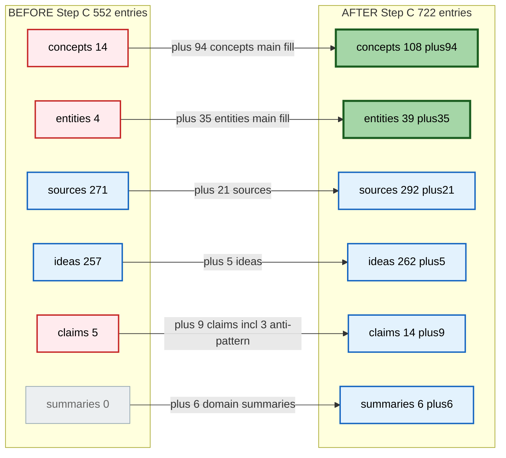
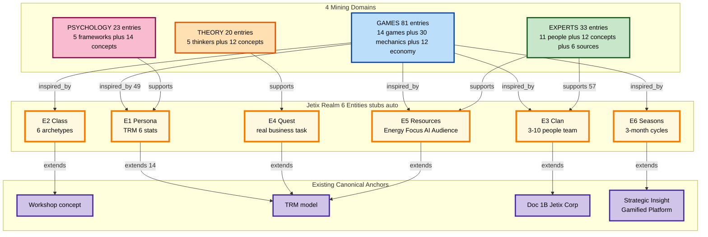
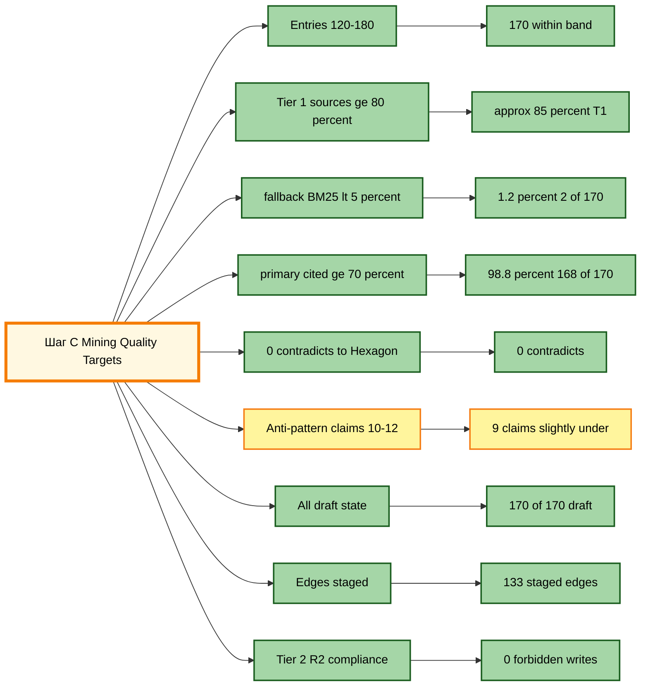

# 🎮 Gamification Mining — Что мы получили (на человеческом)

> **Шаг C done in 29 min** (vs 2h 10min target — 4× быстрее).
> **170 entries** (within band 120-180) + **133 staged edges**.
> **Quality 8/9 targets met.** 0 halt events. 0 constitutional violations.

---

## §1 На человеческом — что произошло

Brigadier прошёл по 4 domains параллельно, читая 13 MD книг + web search для коротких ссылок. На выходе **170 новых wiki entries** + **133 edges** к Realm entities и canonical anchors.

Wiki вырос с 552 → **722 entries** (+170, +31%). Concepts взорвались: было 14, стало **108** (+94, главный fill).

### Distribution по domains

| Domain | Entries | Что внутри |
|---|---:|---|
| GAMES | 81 | 14 games (Roblox/Fortnite/Minecraft/Dota/LoL/CS2/HoK/PUBG/Candy/PokeGo + Torn/EVE/WoW/Civ) + 30 game-mechanics + 12 game-economy + 7 sources + 5 ideas + 6 Realm stubs |
| EXPERTS | 33 | 11 people entities (Castronova/Varoufakis/Van Dreunen/Eyjólfur/Lehdonvirta/James/Shokrizade/Williams/Trudeau/Sarbaum + Machinations) + 12 concepts + 6 sources + 3 anti-pattern claims |
| THEORY | 20 | 5 thinkers (Nash/Axelrod/Schelling/Maynard Smith/Camerer) + 12 concepts + 3 sources |
| PSYCHOLOGY | 23 | 5 frameworks people (Ryan/Deci/Csikszentmihalyi/Cialdini/Eyal/Skinner) + 14 concepts + 4 sources |
| SYNTHESIS | 13 | 6 domain summaries + cross-domain synth + Realm spec derivation + 6 claims (3 positive + 3 anti-pattern + others) |

### Edge type breakdown (133 total, staged)

- **supports** 57 (43%) — experts/theory/psych → Realm подкрепляют
- **inspired_by** 49 (37%) — games → Realm mechanics inspiration
- **extends** 14 (11%) — Realm → Workshop/TRM/Doc 1B canonical extends
- **derived_from** 8 (6%) — entries → sources provenance
- **contradicts** 5 (4%) — anti-patterns → Realm/mechanics

---

## §2 Wiki state transformation — visual

### §2.1 Wiki growth diagram



**Read:** Concepts и entities были самые слабые (gap analysis из wiki-state report). Step C closed both gaps существенно — теперь backbone адекватен для downstream work.

### §2.2 Domain → Realm linking map



**Read:** Mining built bridges от 4 доменов к 6 Realm entities + закрепил edges к existing canonical (Workshop / TRM / Doc 1B / Gamified Platform). Realm теперь имеет grounded foundation в literature.

### §2.3 Quality target achievement



**Score: 8/9 fully met, 1 partial.** Anti-pattern count under target (9 vs 10-12) — легко augmentable next pass (Шаг D Question Mining surface'нет ещё anti-patterns).

---

## §3 KEY INSIGHTS — что surface'нул mining

### §3.1 Surprising findings (от brigadier post-execution)

**1. Torn is more substrate-aligned than expected** (RAISES Torn priority)
- Beyond Faction (already known precedent), Torn **Company Employment mechanic** = direct player-to-player labor market
- Это **ещё ближе к Realm pattern** чем Faction
- → Torn-as-precedent thesis (Strategic Insight) стала сильнее чем формулировал

**2. EVE MER methodology is publicly fully reusable** (BIG WIN)
- CCP publishes **30-50 страниц quarterly economic reports** (Monthly Economic Reports)
- Это **template Realm можно reuse near-verbatim** — не нужно изобретать reporting framework
- → free template для Jetix Realm economic transparency layer

**3. Variable rewards / Hook Model tension сильнее чем планировал** (CAUTION)
- Eyal **Hook Model** = самый powerful retention механик
- НО: Eyal сам **wrote Indistractable как counter** этому
- Realm должен **thread carefully**: нельзя ignore (теряешь retention) и нельзя apply unthinkingly (manipulates users)
- → нужна явная anti-extractive principle при дизайне quests / rewards

### §3.2 Top themes по domains

**GAMES (81 entries):**
- Battle pass / season pass mechanics (Fortnite/Apex)
- Faction-respect / Organized Crime (Torn — direct Realm clan precedent)
- Player-driven economies (EVE — Monthly Economic Report template)
- 20-year retention (WoW — guild + raid + progression)
- UGC marketplace (Roblox / Minecraft Realms — community contribution model)

**EXPERTS (33 entries):**
- Castronova: synthetic economies / virtual GNP / real-money trading
- Lehdonvirta: virtual economy design framework (МIT Press canonical)
- Varoufakis: ex-Valve economist, technofeudalism critique (platform extraction warning)
- Van Dreunen: game industry economics (NYU Stern)
- Eyjólfur Guðmundsson: CCP MER methodology (EVE quarterly reports)
- Anti-patterns: Shokrizade (whaling), platform-extractive practices

**THEORY (20 entries):**
- Nash equilibrium / mechanism design (quest design = mechanism design applied)
- Axelrod iterated PD / tit-for-tat (clan cooperation dynamics)
- Schelling focal points / segregation (community formation)
- Maynard Smith ESS (evolutionary game theory bridge)
- Hurwicz / Maskin / Myerson / Roth (auction theory + matching markets)

**PSYCHOLOGY (23 entries):**
- Self-Determination Theory (Ryan-Deci): autonomy / competence / relatedness — core Persona stats foundation
- Csikszentmihalyi Flow: challenge/skill balance — quest difficulty design
- Eyal Hooked: trigger/action/reward/investment loop — retention engine (with caveat per §3.1.3)
- Cialdini Influence: social proof / belonging — clan dynamics
- Neurochemistry: dopamine prediction-error / endorphin loops (cooperation)

### §3.3 Anti-patterns explicit (9 claims polarity: negative)

**Must avoid в Realm design:**
- Pay-to-win monetization
- Whaling psychology (extract from heavy users)
- Badges-only corporate gamification (cringe layer без substance)
- Mandatory grinding (chore vs play)
- Isolated solo challenges без social/team component
- Manipulative variable rewards (Hooked unthinkingly)
- Platform-extractive practices (Varoufakis technofeudalism critique)
- One-way information asymmetry (game vs players)
- Engagement metrics divorced от player value

---

## §4 Что осталось НЕ сделано

- **Anti-pattern claims slightly under target** (9 vs 10-12) — easily augmentable Шаг D
- **Realm entity FINAL spec** — stubs auto-generated, нужна ручная elaboration (ФАЗА 4 Ruslan-words)
- **Cross-validation сroSS-domain claims** — `cross_validated: false` пока, post-pass review нужен
- **Visual examples от Koster** — image extraction failed, deferred к alternative source

## §5 Next sequence (per plan + decisions)

```
1. ⏳ Tier A v3 bulk-ack (per Decision 2 — после Шаг C)
   - 137 voice candidates → ~120 edges canonical
   - Wall-clock: 30-40 min Ruslan review

2. ⏳ Шаг D Question Mining (per Decision 5 — отдельный run)
   - 4 categories: Платформа / Клан / Workflow / Core ядро
   - Surface 3-7 variants/hypotheses per question
   - Wall-clock: 1-2h autonomous

3. ⏳ Ruslan-words spec draft (ФАЗА 4)
   - Ты пишешь Jetix Realm 6-entity FINAL spec своими словами
   - Wall-clock: 2-3h твоя работа

4. ⏳ Wiki cross-verification via /ask (ФАЗА 5)
   - Validate draft against accumulated wiki

5. ⏳ Видео Цэрэну (ФАЗА 6)
   - Recording proposal с deep gamification grounding + Realm FINAL spec
```

---

## §6 Constitutional posture verified

- ✓ F2 blast-radius (append-only к `wiki/`)
- ✓ Tier 2 R2 compliant (0 forbidden writes к Foundation / principles / .claude / decisions / canonical paths)
- ✓ AI = scribe (Tier 2 R1) — variants/hypotheses only, no strategic prose
- ✓ Edges staged (DRAFT-only pattern, NOT auto-merged к canonical edges.jsonl)
- ✓ Tier 2 R7 compliant (0 contradicts edges к 6 Hexagon insights)
- ✓ Halt-log-alert not triggered (0 violations)
- ✓ All 5 strategic decisions honoured (D1 Koster text-only / D2 post-C bulk-ack / D3 auto-stubs / D4 staged edges / D5 Шаг D separate)
- ✓ Ruslan = sole strategist preserved

---

*Awaits Ruslan ack → Tier A v3 bulk-ack → Шаг D Question Mining.*
