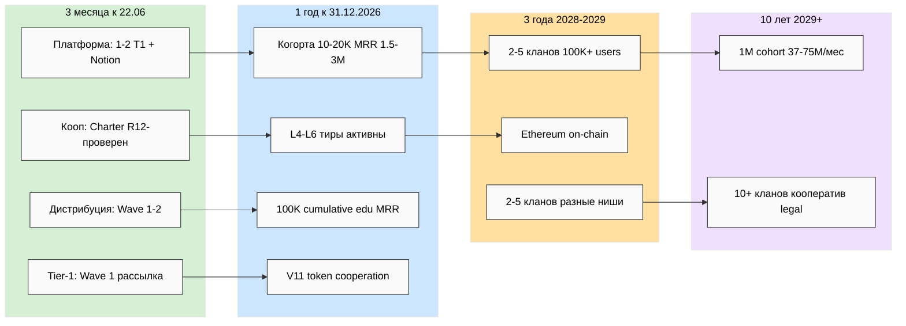
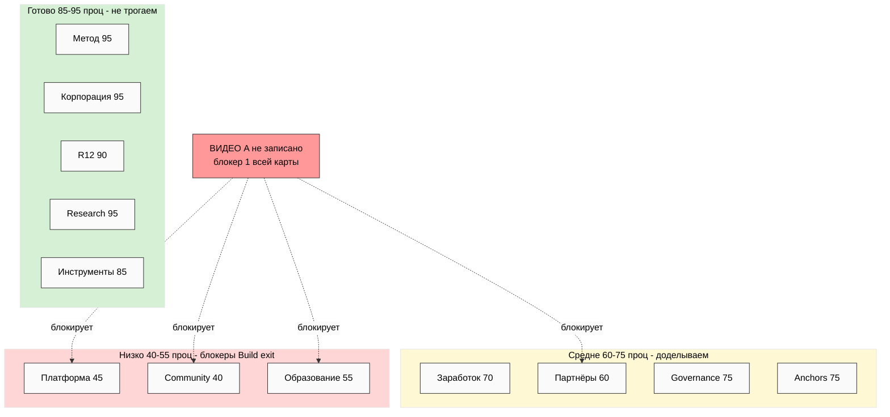

# 📐 Phase 5 — Карта Task A (схемы JE-1 / JE-2 / JE-3)

> Три схемы: дерево сущностей (≥15 узлов), направления × горизонты, тепловая карта
> готовности. Тема — светлый фон (style anchor); внутри узлов — простой текст без emoji.

---

## JE-1 — Дерево сущностей Jetix (entity tree, 12 + под-сущности)

```mermaid
%%{init: {'theme':'base','themeVariables':{'primaryTextColor':'#000','textColor':'#000','lineColor':'#333','primaryBorderColor':'#333','primaryColor':'#fafafa'}}}%%
graph TB
    JETIX[JETIX OS<br/>25.05.2026]

    JETIX --> MET[1 Метод]
    JETIX --> INS[2 Инструменты]
    JETIX --> KORP[3 Корпорация]
    JETIX --> ZAR[4 Заработок]
    JETIX --> PLAT[5 Платформа]
    JETIX --> EDU[6 Образование]
    JETIX --> PART[7 Партнёры]
    JETIX --> COMM[8 Community]
    JETIX --> R12[9 R12 anti-extraction]
    JETIX --> GOV[10 Governance]
    JETIX --> RES[11 Research substrate]
    JETIX --> ANCH[12 Strategic anchors]

    MET --> MET1[Мета-метод 8 компонент]
    MET --> MET2[Мета-контроль L0-L3]
    MET --> MET3[Внешняя система O-128]

    INS --> INS1[54 skills]
    INS --> INS2[17 ROY агентов]
    INS --> INS3[Voice pipeline + CRM]

    KORP --> KORP1[11 Foundation Parts]
    KORP --> KORP2[Pillar A/C principles]
    KORP --> KORP3[FPF + Charter]

    ZAR --> ZAR1[Worker share 75/25]
    ZAR --> ZAR2[Workshop 1500/мес]
    ZAR --> ZAR3[Tokenomics V10 Phase2]

    PLAT --> PLAT1[Build / Run / Scale]
    PLAT --> PLAT2[Personal OS L1-2]
    PLAT --> PLAT3[Team OS L3 + кланы]

    EDU --> EDU1[7 ступеней Bloom]
    EDU --> EDU2[Прошивка 5 элементов]

    PART --> PART1[T1-T4 типы]
    PART --> PART2[Wave 1 outreach]

    COMM --> COMM1[Cohort O-161/162]
    COMM --> COMM2[Charter fork-and-leave]

    R12 --> R121[4 action classes]
    R12 --> R122[Mondragon 5:1 cap]

    GOV --> GOV1[Stage Gates SG-1..4]
    GOV --> GOV2[DAO multi-clan Phase2]

    RES --> RES1[5 research deeps]
    RES --> RES2[80+ книг + wiki 750]

    ANCH --> ANCH1[29 D-LOCK]
    ANCH --> ANCH2[O-числа + JETIX-AS-X]

    style JETIX fill:#fff8d5,color:#000
    style MET fill:#cce6ff,color:#000
    style INS fill:#cce6ff,color:#000
    style KORP fill:#cce6ff,color:#000
    style ZAR fill:#d6f0d6,color:#000
    style PLAT fill:#d6f0d6,color:#000
    style EDU fill:#d6f0d6,color:#000
    style PART fill:#ffe0a0,color:#000
    style COMM fill:#ffe0a0,color:#000
    style R12 fill:#ffd6d6,color:#000
    style GOV fill:#ffd6d6,color:#000
    style RES fill:#f0e0ff,color:#000
    style ANCH fill:#f0e0ff,color:#000
```

**Узлов:** 13 верхнего уровня + 24 под-сущности = 37. Цвет-группы: синий = ядро
(метод/инструменты/корпорация), зелёный = рост (заработок/платформа/образование),
оранжевый = люди (партнёры/community), красный = защита (R12/governance), фиолетовый =
глубина (research/anchors).

---

## JE-2 — Направления × горизонты

---

## JE-3 — Тепловая карта готовности (status overlay)

**Читается так:** зелёная зона (внутренние сущности) saturated, накопление останавливаем;
жёлтая — доделать; красная (outward-слой) тащит Build readiness вниз, и большую часть
красной зоны держит один блокер — видео A.

---

*Phase 5 closure. 3 схемы Task A: JE-1 дерево сущностей (37 узлов) / JE-2 направления ×
горизонты / JE-3 тепловая карта готовности. Светлая тема per style anchor; узлы — простой
текст для надёжного рендера. R1 surface.*
