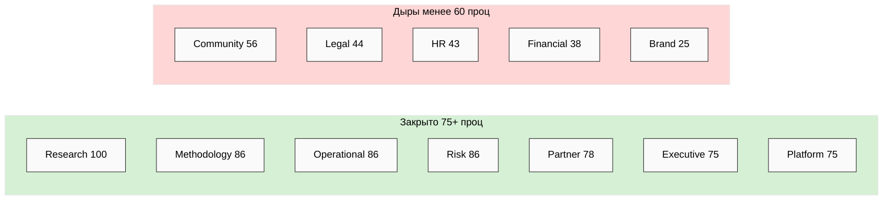
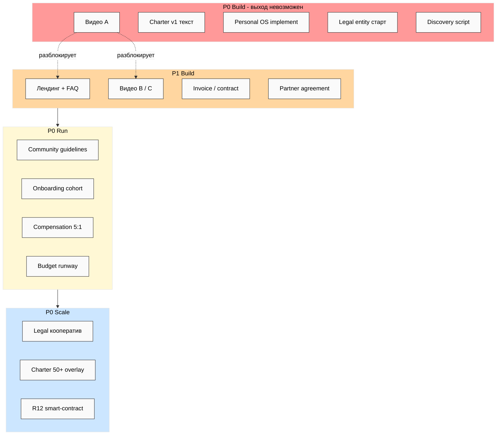
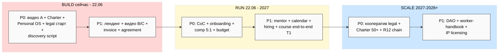

# 📐 Phase 12 — Карта Task B (схемы JE-4 / JE-5 / JE-6 / JE-7)

> Четыре схемы документов: таксономия / карта категорий с overlay есть-нет / тепловая
> карта GAP / таймлайн Build-Run-Scale с приоритетами.

---

## JE-4 — Таксономия документов (12 категорий + типы)

```mermaid
%%{init: {'theme':'base','themeVariables':{'primaryTextColor':'#000','textColor':'#000','lineColor':'#333','primaryBorderColor':'#333','primaryColor':'#fafafa'}}}%%
graph TB
    DOCS[Документы Jetix<br/>94 docs / 12 категорий]

    DOCS --> EX[Executive 8]
    DOCS --> ME[Methodology IP 7]
    DOCS --> PL[Platform Product 8]
    DOCS --> CO[Community Cohort 9]
    DOCS --> FI[Financial 8]
    DOCS --> LE[Legal Governance 9]
    DOCS --> BR[Brand Marketing 8]
    DOCS --> RE[Research Knowledge 7]
    DOCS --> PA[Partner-facing 9]
    DOCS --> OP[Operational 7]
    DOCS --> HR[HR People 7]
    DOCS --> RI[Risk Compliance 7]

    EX --> EXa[Vision / Strategy / Exec letter / OKR]
    ME --> MEa[Method canonical / FPF / SOPs / IP license]
    PL --> PLa[Personal OS / Team OS / Workshop / roadmap]
    CO --> COa[Charter / CoC / onboarding / mentor matrix]
    FI --> FIa[Economic model / budget / pricing / invoice]
    LE --> LEa[Legal entity / agreements / Stage Gates / DAO]
    BR --> BRa[Brand book / landing / pitch / FAQ / Telegram]
    RE --> REa[5 deeps / wiki / books / portfolio]
    PA --> PAa[Offering / discovery / onboarding / agreement]
    OP --> OPa[CRM / pipeline / support / cadence]
    HR --> HRa[Roles / hiring / comp 5:1 / handbook]
    RI --> RIa[Risk register / R12 log / default-deny / safety]

    style DOCS fill:#fff8d5,color:#000
    style EX fill:#d6f0d6,color:#000
    style BR fill:#d6f0d6,color:#000
    style PA fill:#d6f0d6,color:#000
    style PL fill:#cce6ff,color:#000
    style CO fill:#cce6ff,color:#000
    style OP fill:#cce6ff,color:#000
    style HR fill:#cce6ff,color:#000
    style ME fill:#f0e0ff,color:#000
    style RE fill:#f0e0ff,color:#000
    style FI fill:#f0e0ff,color:#000
    style LE fill:#ffd6d6,color:#000
    style RI fill:#ffd6d6,color:#000
```

---

## JE-5 — Карта категорий с overlay есть-нет

---

## JE-6 — Тепловая карта GAP (по приоритету × этап)

---

## JE-7 — Таймлайн Build-Run-Scale с очередью приоритетов

---

*Phase 12 closure. 4 схемы Task B: JE-4 таксономия (12 кат + типы) / JE-5 категории с
overlay есть-нет / JE-6 GAP heat по приоритету×этап / JE-7 таймлайн Build-Run-Scale.
Светлая тема, чистые узлы. R1 surface. Всего mermaid к этому моменту: 7 (JE-1..JE-7).*
