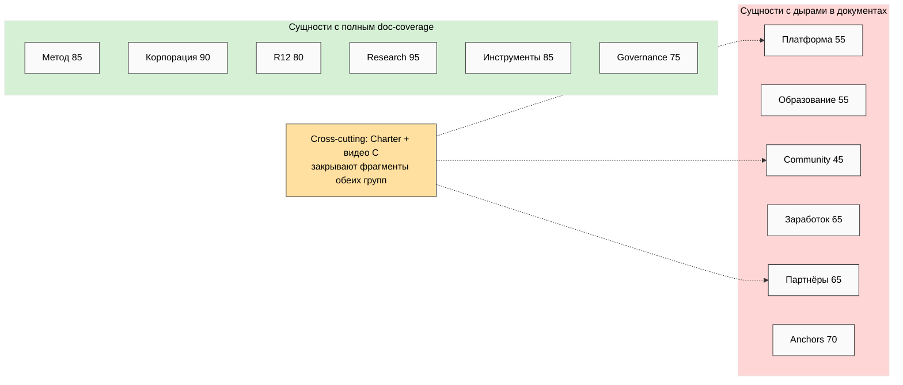
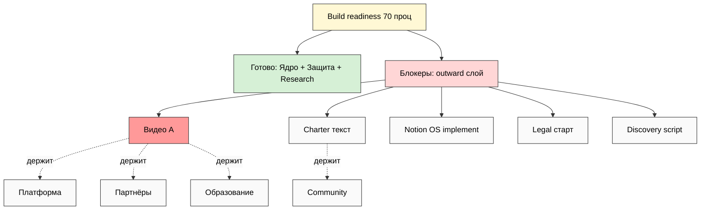

# 🔗 Phase 13 — Мастер-скелет (синтез сущности × документы)

> **Что это.** Центральная фаза. Берём 12 сущностей (Task A) × 12 категорий документов
> (Task B, 94 docs) и связываем в **ОДНУ структуру** — каркас, который Руслан зафиксирует
> как THE primary structure. После фиксации: «не добавляем новое — только подтягиваем
> существующее под скелет и заполняем дыры».
>
> Три схемы: JE-8 мастер-дерево / JE-9 матрица сущность×категория / JE-10 overlay
> готовности к Build.

---

## §0 TL;DR

- **Принцип скелета:** 12 сущностей = «ЧТО есть»; 12 категорий документов = «КАК это
  задокументировано»; мастер-скелет = **сетка**, где каждая ячейка = «эта сущность,
  описанная в этом жанре документа».
- **4 super-кластера** объединяют 12 сущностей: 🔵 Ядро / 🟢 Рост / 🟠 Люди / 🔴 Защита+Глубина.
- **5 cross-cutting документов** касаются почти каждой сущности: **Charter** (8/12),
  **видео C** (6/12), **R12 8-item checklist** (5/12), **Vision/FUNDAMENTAL** (12/12),
  **Economic V10** (5/12).
- **Главный insight синтеза:** дыры документов **точечно совпадают** с outward-сущностями
  (Платформа/Community/Партнёры), а внутренние сущности (Метод/Корпорация/R12/Research)
  имеют почти полный doc-coverage. Скелет показывает это одним взглядом.

---

## §1 Логика мастер-скелета (как читать сетку)

Master skeleton = 2D-карта:
- **Ось X** — 12 категорий документов (жанры: что за документ).
- **Ось Y** — 12 сущностей (объекты: про что документ).
- **Ячейка** — конкретный документ (или его отсутствие), который описывает данную сущность
  в данном жанре.

Например: сущность «R12» × категория «Risk/Compliance» = документ «default-deny-table +
R12 compliance log» (✅). Сущность «Community» × категория «Legal/Governance» = документ
«Charter legal version» (❌). Так каждая клетка либо заполнена (есть документ), либо пустая
(дыра), либо помечена «не применимо».

**Для фиксации Руслану нужен не голый 12×12 grid, а сгруппированное дерево** — оно ниже
(JE-8), организованное по 4 super-кластерам.

---

## §2 Сущность → её документы (какие жанры описывают каждую сущность)

| Сущность | Primary docs (жанры-категории) | Coverage |
|---|---|---|
| 🟦 Метод | Methodology/IP (canonical V2, FPF, SOPs) + Research (5 deeps) + Brand (видео A) | ✅ 85% |
| 🛠️ Инструменты | Platform/Product (API/template docs) + Operational (CRM/cadence) + Risk (default-deny) | ✅ 85% |
| 🏛️ Корпорация | Legal/Governance (Foundation, FPF, Stage Gates) + Executive (Vision) | ✅ 90% |
| 💰 Заработок | Financial (Economic V10, pricing, invoice) + Partner-facing (revenue share) | ⚠️ 65% |
| 🚀 Платформа | Platform/Product (Personal/Team OS, roadmap) + Executive (Point A/B) | ⚠️ 55% |
| 🎓 Образование | Methodology/IP (метод HL) + Community (workshop) + Brand (видео B) | ⚠️ 55% |
| 👥 Партнёры | Partner-facing (offering, discovery, agreement) + HR (roles) | ⚠️ 65% |
| 🌐 Community | Community/Cohort (Charter, CoC, onboarding) + Legal (Charter legal) | ⚠️ 45% |
| ⚖️ R12 | Risk/Compliance (default-deny, R12 log, checklist) + Legal (Charter) | ✅ 80% |
| 🎛️ Governance | Legal/Governance (Stage Gates, Steward log, DAO) + Risk (safety) | ✅ 75% |
| 📚 Research | Research/Knowledge (5 deeps, wiki, books, portfolio) | ✅ 95% |
| 🎯 Anchors | Executive (decisions log, D-LOCK) + Research (insights) | ⚠️ 70% |

---

## §3 Категория → её сущности (какие сущности покрывает каждый жанр)

| Категория документов | Главные сущности, которые она описывает |
|---|---|
| 📜 Executive | Anchors + Корпорация + все (Vision = 12/12) |
| 🧪 Methodology/IP | Метод + Образование |
| 🏗️ Platform/Product | Платформа + Инструменты |
| 👥 Community/Cohort | Community + Партнёры + Образование |
| 💰 Financial | Заработок |
| ⚖️ Legal/Governance | Корпорация + Governance + R12 + Community |
| 🎨 Brand/Marketing | Метод (видео A) + Образование (видео B) + Партнёры (видео C) |
| 🔬 Research/Knowledge | Research + Метод + Anchors |
| 🤝 Partner-facing | Партнёры + Заработок + Community |
| 📊 Operational | Инструменты + Партнёры |
| 🎯 HR/People | Партнёры + Community + Governance |
| 🚨 Risk/Compliance | R12 + Governance + Корпорация |

---

## §4 Cross-cutting документы (касаются многих сущностей)

Некоторые документы — **не про одну сущность, а сквозные**. Они в скелете = «соединительная
ткань»:

| Cross-cutting doc | Касается сущностей | Почему сквозной |
|---|---|---|
| **Vision / FUNDAMENTAL** | 12/12 | задаёт рамку для всего (35 UC × 12 кат) |
| **Charter** | 8/12 (Community, Партнёры, R12, Governance, Заработок, Корпорация, Образование, Платформа) | договор, в котором сходятся деньги + права + выход + правила |
| **Видео C (экосистема)** | 6/12 (Корпорация, Заработок, R12, Партнёры, Community, Governance) | оффер, объясняющий всю систему партнёру за 15-20 мин |
| **Economic V10** | 5/12 (Заработок, R12, Governance, Партнёры, Community) | модель денег пронизывает все «людские» сущности |
| **R12 8-item checklist** | 5/12 (Партнёры, Community, Brand, HR, R12) | gate перед любым влиянием/касанием |

**Следствие для фиксации:** Charter и видео C — **самые рычажные документы** (один Charter
закрывает фрагменты 8 сущностей). Их написание двигает карту сильнее, чем точечный документ.
*(Наблюдение рычага, не приоритет — выбирает Руслан.)*

---

## §5 Мастер-скелет: 4 super-кластера × сущности × primary docs

Структура для фиксации (organized tree):

### 🔵 КЛАСТЕР 1 — Ядро (что мы знаем и чем делаем)
- **Метод** → Method V2 ✅ + meta-method ref ✅ + FPF ✅ + видео A ❌
- **Инструменты** → skills/agents ✅ + Personal/Team OS spec ⚠️ + CRM ✅
- **Корпорация** → Foundation 11 Parts ✅ + Pillar A/C ✅ + legal entity ❌
- **Research** → 5 deeps ✅ + wiki ✅ + books ✅

### 🟢 КЛАСТЕР 2 — Рост (как масштабируемся и зарабатываем)
- **Платформа** → Platform Lifecycle ✅ + Personal OS implement ❌ + roadmap ⚠️
- **Заработок** → Economic V10 ✅ + pricing ⚠️ + invoice/contract ❌
- **Образование** → 7 ступеней ✅ + course skeleton ⚠️ + видео B ❌

### 🟠 КЛАСТЕР 3 — Люди (с кем и для кого)
- **Партнёры** → offering ✅ + discovery script ⚠️→❌ + agreement ❌
- **Community** → cohort ontology ✅ + Charter текст ❌ + onboarding ❌

### 🔴 КЛАСТЕР 4 — Защита + координаты
- **R12** → default-deny ✅ + R12 log ✅ + checklist template ⚠️
- **Governance** → Stage Gates ✅ + DAO docs ⚠️ + Steward log ⚠️
- **Anchors** → 29 D-LOCK ⚠️ + O-числа ✅ + JETIX-AS-X ✅

**Cross-cutting слой (поверх всех 4 кластеров):** Vision/FUNDAMENTAL · Charter · видео C ·
Economic V10 · R12 checklist.

---

## JE-8 — Мастер-дерево (Task A × Task B → THE primary structure)

```mermaid
%%{init: {'theme':'base','themeVariables':{'primaryTextColor':'#000','textColor':'#000','lineColor':'#333','primaryBorderColor':'#333','primaryColor':'#fafafa'}}}%%
graph TB
    ROOT[JETIX master skeleton<br/>12 сущностей x 12 категорий]

    ROOT --> X[Cross-cutting слой]
    X --> X1[Vision FUNDAMENTAL 12 из 12]
    X --> X2[Charter 8 из 12]
    X --> X3[Видео C 6 из 12]
    X --> X4[Economic V10 5 из 12]
    X --> X5[R12 checklist 5 из 12]

    ROOT --> K1[Кластер Ядро]
    K1 --> K1a[Метод: V2 + meta + FPF + видео A нет]
    K1 --> K1b[Инструменты: skills + OS spec + CRM]
    K1 --> K1c[Корпорация: Foundation + legal нет]
    K1 --> K1d[Research: 5 deeps + wiki + books]

    ROOT --> K2[Кластер Рост]
    K2 --> K2a[Платформа: lifecycle + OS implement нет]
    K2 --> K2b[Заработок: V10 + invoice нет]
    K2 --> K2c[Образование: 7 ступеней + видео B нет]

    ROOT --> K3[Кластер Люди]
    K3 --> K3a[Партнёры: offering + agreement нет]
    K3 --> K3b[Community: ontology + Charter текст нет]

    ROOT --> K4[Кластер Защита и координаты]
    K4 --> K4a[R12: default-deny + log]
    K4 --> K4b[Governance: Stage Gates + DAO Phase2]
    K4 --> K4c[Anchors: D-LOCK + O-числа]

    style ROOT fill:#fff8d5,color:#000
    style X fill:#ffe0a0,color:#000
    style K1 fill:#cce6ff,color:#000
    style K2 fill:#d6f0d6,color:#000
    style K3 fill:#ffe0a0,color:#000
    style K4 fill:#ffd6d6,color:#000
```

**Узлов: 1 root + 1 cross + 5 cross-docs + 4 кластера + 12 сущностей = 23.** (≥20 ✅)

---

## JE-9 — Матрица сущность × категория (где документы, где дыры)

---

## JE-10 — Overlay готовности к Build

---

## §5.5 Полная сетка 12×12 (сущность × категория документов)

> Это развёрнутая форма JE-9: каждая клетка = документ, описывающий данную сущность в
> данном жанре. `✅` = есть · `⚠️` = частично · `❌` = дыра · `·` = не применимо/слабая связь.
> Колонки: Ex=Executive · Me=Methodology · Pl=Platform · Co=Community · Fi=Financial ·
> Le=Legal · Br=Brand · Re=Research · Pa=Partner · Op=Operational · HR=HR · Ri=Risk.

| Сущность \ Категория | Ex | Me | Pl | Co | Fi | Le | Br | Re | Pa | Op | HR | Ri |
|---|---|---|---|---|---|---|---|---|---|---|---|---|
| 🟦 Метод | ✅ | ✅ | · | · | · | ✅ | ❌видеоA | ✅ | · | · | · | · |
| 🛠️ Инструменты | · | ⚠️ | ⚠️ | · | · | · | · | ✅ | · | ✅ | ✅ | ✅ |
| 🏛️ Корпорация | ✅ | ✅ | · | · | · | ✅ | · | · | · | · | ✅ | ✅ |
| 💰 Заработок | ✅ | · | · | ⚠️ | ✅ | ⚠️ | · | · | ✅ | · | ❌ | · |
| 🚀 Платформа | ✅ | · | ⚠️ | ⚠️ | · | · | ❌ | · | ✅ | ⚠️ | · | · |
| 🎓 Образование | · | ⚠️ | ⚠️ | ⚠️ | ⚠️ | · | ❌видеоB | ✅ | ⚠️ | · | · | · |
| 👥 Партнёры | ⚠️ | · | · | ⚠️ | ✅ | ❌agreement | ❌видеоC | · | ✅ | ⚠️ | ⚠️ | ⚠️ |
| 🌐 Community | · | · | ⚠️ | ❌Charter | ⚠️ | ❌legal | · | · | ⚠️ | · | ❌handbook | ⚠️ |
| ⚖️ R12 | · | · | · | ⚠️ | ✅5:1 | ✅ | ⚠️messaging | ✅ | ⚠️checklist | ⚠️ | ⚠️5:1 | ✅ |
| 🎛️ Governance | ✅ | · | · | · | · | ✅SG | · | · | · | · | ⚠️ | ✅ |
| 📚 Research | ⚠️ | ✅ | · | · | · | · | · | ✅ | · | · | · | · |
| 🎯 Anchors | ✅D-LOCK | · | · | ⚠️ | · | ✅ | · | ✅ | · | · | · | · |

**Чтение сетки:**
- **Самые «горячие» строки (много ⚠️/❌):** Партнёры (7 ячеек активны, 3 дыры), Community
  (4 дыры), Образование (5 ⚠️). Это outward-сущности — именно их недостаёт документально.
- **Самые «полные» строки:** Корпорация (6 ✅), R12 (5 ✅), Метод (4 ✅). Внутренние — закрыты.
- **Самые «горячие» колонки (где документов нет по многим сущностям):** Brand (3 ❌ — видео
  A/B/C + brand book), Financial (invoice/contract/budget), Legal (entity/agreements/Charter).
- **Cross-cutting клетки:** Charter одновременно живёт в Co + Le + Fi для сущностей Community/
  Партнёры/Заработок — одна ячейка-документ закрывает несколько строк (рычаг).

## §5.6 Развёрнутый инвентарь скелета по кластерам (документ → статус → сущность)

### 🔵 Ядро — 14 документов
Method V2 ✅ · meta-method ref ✅ · method HL+видео A ⚠️/❌ · FPF ✅ · SOPs ⚠️ · Hypothesis Arch
✅ · 54 skills docs ✅ · Personal OS spec ⚠️ · Team OS spec ⚠️ · CRM ✅ · architecture diagrams
✅ · Foundation 11 Parts ✅ · Pillar A/C ✅ · legal entity ❌. **Coverage ~80%.**

### 🟢 Рост — 16 документов
Platform roadmap ⚠️ · Personal OS implement ❌ · Workshop spec ⚠️ · feature specs ❌ ·
changelog ✅ · Economic V10 ✅ · revenue HL ✅ · budget/runway ❌ · pricing ⚠️ · invoice ❌ ·
contract ❌ · distribution policy ✅ · bookkeeping ❌ · 7 ступеней ✅ · course skeleton ⚠️ ·
видео B ❌. **Coverage ~45%.**

### 🟠 Люди — 18 документов
offering ✅ · discovery script ⚠️→❌ · partner onboarding ❌ · revenue share spec ✅ ·
triple-role ✅ · outreach package ✅ · per-tier matrix ✅ · call plan ✅ · видео C ❌ ·
Charter v1 ❌ · CoC ❌ · cohort onboarding ❌ · cohort ontology ✅ · mentor matrix ❌ ·
cohort calendar ❌ · membership terms ⚠️ · anti-cult doc ⚠️ · community cast ⚠️.
**Coverage ~50%.**

### 🔴 Защита + координаты — 23 документа
default-deny ✅ · R12 log ✅ · R12 checklist ⚠️ · safety framework ✅ · audit trail ✅ ·
privacy ❌ · risk register ⚠️ · Stage Gate records ✅ · Steward log ⚠️ · AWAITING-APPROVAL ✅ ·
DAO governance ⚠️ · legal entity docs ❌ · Charter legal ❌ · partner agreement ❌ · IP
licensing ❌ · Vision/FUNDAMENTAL ✅ · Strategic Plan ✅ · Execution Plan ✅ · Point A/B ✅ ·
decisions log/D-LOCK ⚠️ · 5 research deeps ✅ · wiki ✅ · canonical INDEX ✅. **Coverage ~70%.**

**Итог по кластерам:** Ядро 80% + Защита 70% (закрыты) vs Рост 45% + Люди 50% (дыры). Дыры
**не размазаны** — они в двух outward-кластерах. Это и есть «карта работы» после фиксации:
заполняем Рост + Люди, не трогаем Ядро + Защиту.

## §6 Что мастер-скелет говорит Руслану (R1 surface)

1. **Структура для фиксации = 4 кластера × 12 сущностей + cross-cutting слой.** Это не
   12×12 grid (слишком дробно для фиксации), а сгруппированное дерево JE-8.

2. **Документы организуются ПОД сущности, не наоборот.** «Что описываем» (сущность)
   первично; «в каком жанре» (категория) — вторично. Один документ может описывать сущность
   в нескольких жанрах (Charter = Community + Legal + Financial одновременно).

3. **5 cross-cutting документов = соединительная ткань.** Их фиксация даёт максимальный
   рычаг (Charter закрывает 8 сущностей).

4. **Дыры точечны и кластеризованы** — в кластере «Рост» + «Люди» (outward). Ядро + Защита +
   Глубина закрыты. После фиксации скелета: заполняем дыры кластеров 2-3, не трогаем 1 и 4.

5. **Решения для Руслана (выносятся в §12 main):** этот ли master skeleton? Какие сущности
   consolidate/split? Какие категории merge? Какие cross-cutting docs писать первыми?

---

## §7 Что разблокирует фиксация

После того как Руслан зафиксирует этот скелет:
- ✅ Любой новый документ имеет **место** в скелете (сущность × категория) — не плодим хаос.
- ✅ Любая дыра видна как пустая клетка — roadmap заполнения прозрачен.
- ✅ Cross-cutting docs (Charter, видео C) — приоритетные кандидаты (рычаг).
- ✅ «Не добавляем новое — подтягиваем под скелет» (режим O-160 dev→promotion).
- ✅ Следующие prompt'ы (заполнение docs, запрос для партнёров) строятся под этот скелет.

---

*Phase 13 closure. Мастер-скелет = 4 super-кластера × 12 сущностей + 5 cross-cutting docs;
2D-сетка сущность×категория; 3 схемы (JE-8 дерево 23 узла / JE-9 матрица / JE-10 Build
overlay). THE primary structure для фиксации Русланом. R1 surface. IP-1 STRICT. Mermaid
total: 10 (JE-1..JE-10).*
