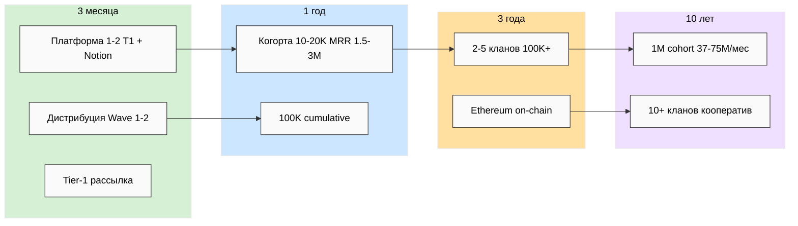
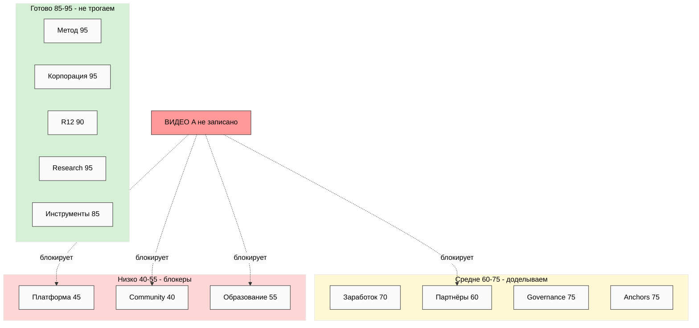
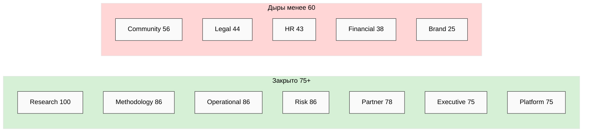
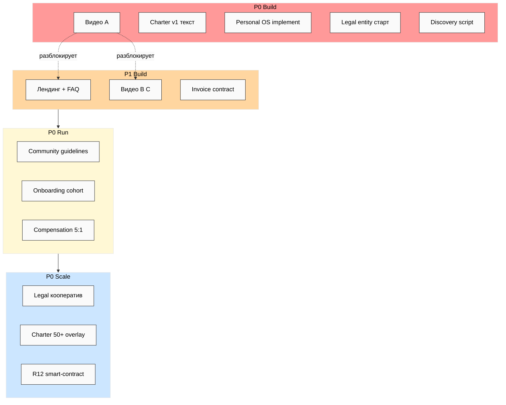
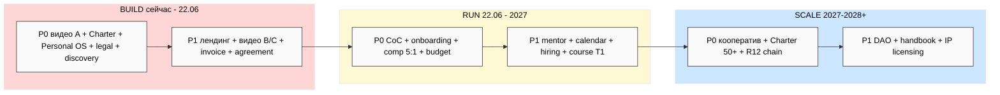
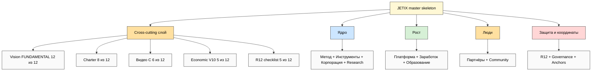
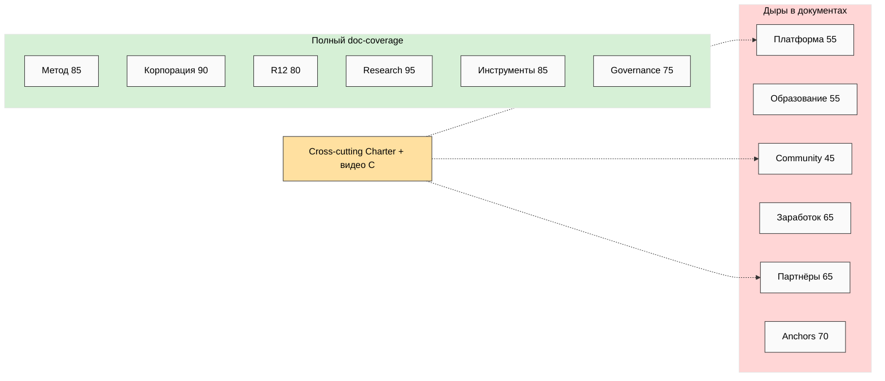
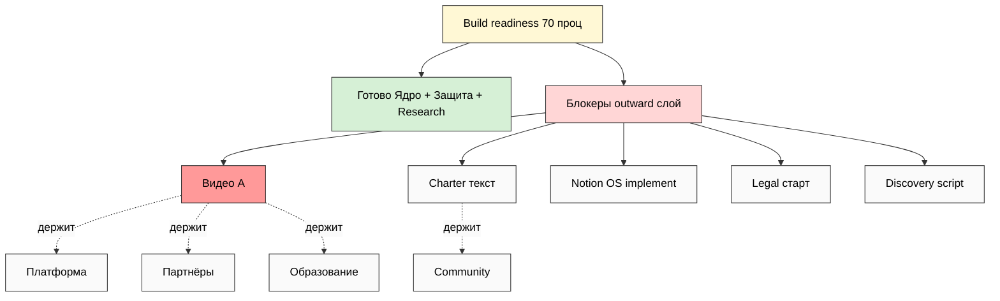

# 📐 Mermaid INDEX — 10 схем JE-1..JE-10

> Все схемы Full Map + Docs Skeleton в одном месте. Тема — светлый фон (style anchor); узлы —
> простой текст для надёжного рендера (per validated-mermaid lesson). Источники:
> Phase 5 (JE-1..3) / Phase 12 (JE-4..7) / Phase 13 (JE-8..10).

| # | Схема | Что показывает | Source phase |
|---|---|---|---|
| JE-1 | Дерево сущностей | 12 сущностей + 24 под-сущности (37 узлов) | Phase 5 / 06 |
| JE-2 | Направления × горизонты | 6 векторов × 4 горизонта | Phase 5 / 06 |
| JE-3 | Тепловая карта готовности | 12 сущностей × % Build readiness | Phase 5 / 06 |
| JE-4 | Таксономия документов | 12 категорий + типы (94 docs) | Phase 12 / 13 |
| JE-5 | Категории с overlay есть-нет | 7 закрыто / 5 дыр | Phase 12 / 13 |
| JE-6 | GAP heat (приоритет × этап) | P0 Build/Run/Scale + связи | Phase 12 / 13 |
| JE-7 | Таймлайн Build-Run-Scale | очередь приоритетов по этапам | Phase 12 / 13 |
| JE-8 | Мастер-дерево | 4 кластера × 12 сущностей + cross-cutting (23 узла) | Phase 13 / 14 |
| JE-9 | Матрица сущность × категория | где документы / где дыры | Phase 13 / 14 |
| JE-10 | Build readiness overlay | блокеры → какие сущности держат | Phase 13 / 14 |

---

## JE-1 — Дерево сущностей

```mermaid
%%{init: {'theme':'base','themeVariables':{'primaryTextColor':'#000','textColor':'#000','lineColor':'#333','primaryBorderColor':'#333','primaryColor':'#fafafa'}}}%%
graph TB
    JETIX[JETIX OS 25.05.2026]
    JETIX --> MET[1 Метод]
    JETIX --> INS[2 Инструменты]
    JETIX --> KORP[3 Корпорация]
    JETIX --> ZAR[4 Заработок]
    JETIX --> PLAT[5 Платформа]
    JETIX --> EDU[6 Образование]
    JETIX --> PART[7 Партнёры]
    JETIX --> COMM[8 Community]
    JETIX --> R12[9 R12]
    JETIX --> GOV[10 Governance]
    JETIX --> RES[11 Research]
    JETIX --> ANCH[12 Anchors]
    MET --> MET1[Мета-метод 8 компонент]
    MET --> MET2[Мета-контроль L0-L3]
    MET --> MET3[Внешняя система O-128]
    INS --> INS1[54 skills]
    INS --> INS2[17 ROY агентов]
    KORP --> KORP1[11 Foundation Parts]
    KORP --> KORP2[Pillar A/C]
    ZAR --> ZAR1[Worker 75/25]
    ZAR --> ZAR2[Workshop 1500/мес]
    PLAT --> PLAT1[Build Run Scale]
    PLAT --> PLAT2[Personal/Team OS]
    EDU --> EDU1[7 ступеней Bloom]
    PART --> PART1[T1-T4 типы]
    COMM --> COMM1[Cohort O-161/162]
    R12 --> R121[4 action classes]
    GOV --> GOV1[Stage Gates SG-1..4]
    RES --> RES1[5 deeps + 80+ книг]
    ANCH --> ANCH1[29 D-LOCK + O-числа]
    style JETIX fill:#fff8d5,color:#000
    style MET fill:#cce6ff,color:#000
    style INS fill:#cce6ff,color:#000
    style KORP fill:#cce6ff,color:#000
    style ZAR fill:#d6f0d6,color:#000
    style PLAT fill:#d6f0d6,color:#000
    style EDU fill:#d6f0d6,color:#000
    style PART fill:#ffe0a0,color:#000
    style COMM fill:#ffe0a0,color:#000
    style R12 fill:#ffd6d6,color:#000
    style GOV fill:#ffd6d6,color:#000
    style RES fill:#f0e0ff,color:#000
    style ANCH fill:#f0e0ff,color:#000
```

## JE-2 — Направления × горизонты

## JE-3 — Тепловая карта готовности

## JE-4 — Таксономия документов

```mermaid
%%{init: {'theme':'base','themeVariables':{'primaryTextColor':'#000','textColor':'#000','lineColor':'#333','primaryBorderColor':'#333','primaryColor':'#fafafa'}}}%%
graph TB
    DOCS[Документы Jetix 94 docs 12 категорий]
    DOCS --> EX[Executive 8]
    DOCS --> ME[Methodology IP 7]
    DOCS --> PL[Platform Product 8]
    DOCS --> CO[Community Cohort 9]
    DOCS --> FI[Financial 8]
    DOCS --> LE[Legal Governance 9]
    DOCS --> BR[Brand Marketing 8]
    DOCS --> RE[Research Knowledge 7]
    DOCS --> PA[Partner-facing 9]
    DOCS --> OP[Operational 7]
    DOCS --> HR[HR People 7]
    DOCS --> RI[Risk Compliance 7]
    style DOCS fill:#fff8d5,color:#000
    style EX fill:#d6f0d6,color:#000
    style BR fill:#d6f0d6,color:#000
    style PA fill:#d6f0d6,color:#000
    style PL fill:#cce6ff,color:#000
    style CO fill:#cce6ff,color:#000
    style OP fill:#cce6ff,color:#000
    style HR fill:#cce6ff,color:#000
    style ME fill:#f0e0ff,color:#000
    style RE fill:#f0e0ff,color:#000
    style FI fill:#f0e0ff,color:#000
    style LE fill:#ffd6d6,color:#000
    style RI fill:#ffd6d6,color:#000
```

## JE-5 — Категории с overlay есть-нет

## JE-6 — GAP heat (приоритет × этап)

## JE-7 — Таймлайн Build-Run-Scale

## JE-8 — Мастер-дерево

## JE-9 — Матрица сущность × категория

## JE-10 — Build readiness overlay

---

## 📋 Per-category matrix (quick reference, 94 docs)

| Категория | Docs | ✅ | ⚠️ | ❌ | Coverage | R12 |
|---|---|---|---|---|---|---|
| 📜 Executive / Strategic | 8 | 4 | 2 | 2 | 75% | — |
| 🧪 Methodology / IP | 7 | 3 | 3 | 1 | 86% | — |
| 🏗️ Platform / Product | 8 | 2 | 4 | 2 | 75% | — |
| 👥 Community / Cohort | 9 | 1 | 4 | 4 | 56% | ⚠️ STRICT |
| 💰 Financial | 8 | 2 | 1 | 5 | 38% | косв. |
| ⚖️ Legal / Governance | 9 | 2 | 2 | 5 | 44% | косв. |
| 🎨 Brand / Marketing | 8 | 0 | 2 | 6 | 25% | ⚠️ STRICT |
| 🔬 Research / Knowledge | 7 | 5 | 2 | 0 | 100% | — |
| 🤝 Partner-facing | 9 | 6 | 1 | 2 | 78% | ⚠️ STRICT |
| 📊 Operational | 7 | 4 | 2 | 1 | 86% | косв. |
| 🎯 HR / People | 7 | 2 | 1 | 4 | 43% | ⚠️ STRICT |
| 🚨 Risk / Compliance | 7 | 5 | 1 | 1 | 86% | ⚠️ сама R12 |
| **ИТОГО** | **94** | **36** | **25** | **33** | **65%** | 5 STRICT |

---

*INDEX closure. 10 схем JE-1..JE-10 (светлая тема, чистые узлы) + per-category matrix (94 docs,
36✅/25⚠️/33❌, 65% coverage). Источники: Phase 5/12/13. R1 surface.*
