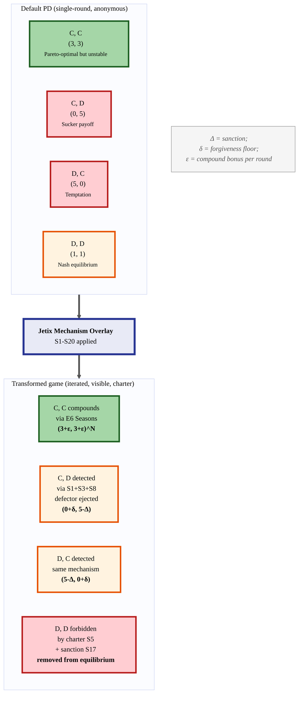
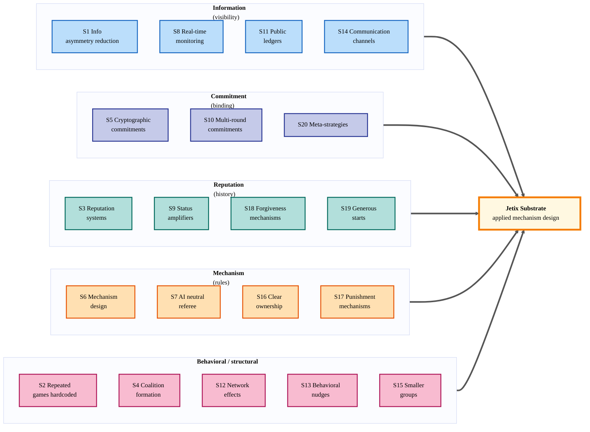
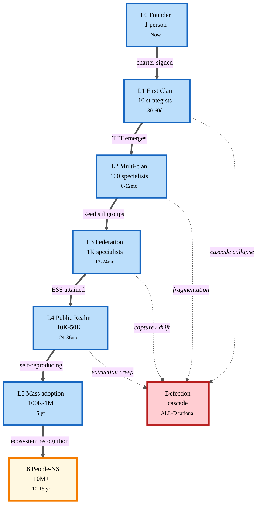
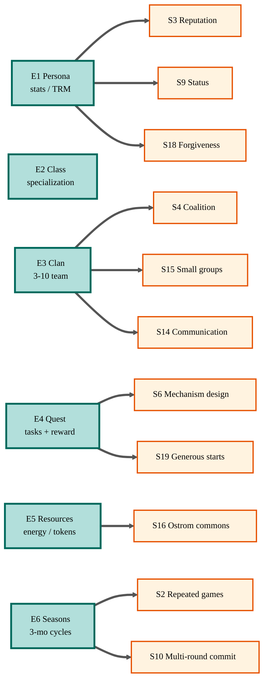
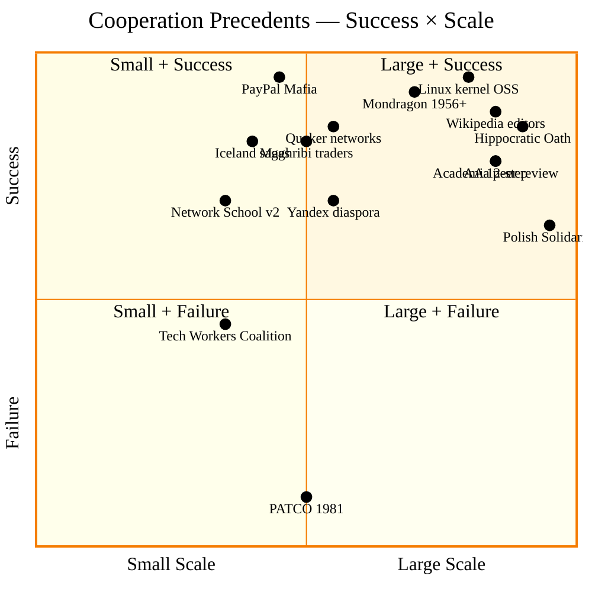
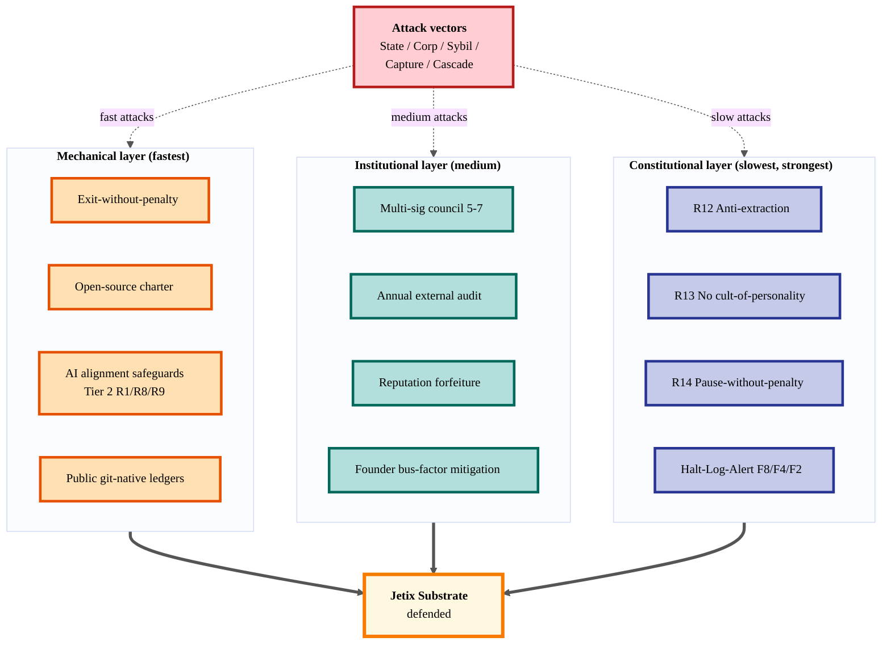

# 🎯 Game Theory + Prisoner's Dilemma Cheating Research — Jetix as Coordinating Substrate

> **Status.** DRAFT analysis report. AI = scribe + analyst. Ruslan = sole strategist (Tier 2 R1).
> All proposals in §12 are options-paper, not decisions. Per-claim provenance per Tier 2 R6.
> Companion к `reports/jetix-people-network-state-research-2026-05-11.md` (network-state research) —
> game-theory layer объясняет **почему** механика, описанная в network-state research, может работать.

---

## §0 TL;DR (compressed)

**Core hypothesis (verbatim Ruslan, 2026-05-12).** «Jetix = компания, которая поможет людям кооперироваться, работать вместе — это позволит выиграть в дилемме заключённого и перехитрить теорию игр. Сначала small-scale — small elites / авантюристы — потом полезный virus effect, synergetic, самораспространяясь через society. По теории игр — хорошие стратегии выиграют плохие при repeated games + reputation visibility. Это полезно для Jetix и для общества.»

**6 key insights.**
1. **Single-round PD ≠ repeated PD.** Axelrod 1980-84 показал: при достаточном «shadow of future» кооперация = эволюционно stable; defection доминирует только в single-round / anonymous setting. [src: Axelrod 1984; wiki/concepts/game-theory/iterated-prisoners-dilemma.md]
2. **Reputation + visibility = game-changer.** Nowak indirect reciprocity (Nature 2005), Ostrom commons governance (Nobel 2009) — оба показывают что transparency истории действий resolves free-rider problem at scale 100-10K. [src: Nowak 2005 / Ostrom 1990]
3. **Mechanism design делает кооперацию dominant strategy.** Hurwicz-Maskin-Myerson Nobel 2007: дизайн правил такой, что incentive-compatibility + individual-rationality → truth-telling и cooperation = best-response. Jetix Realm = applied mechanism design. [src: wiki/concepts/game-theory/mechanism-design.md]
4. **Jetix не «выигрывает PD теоретически» — он системно ломает условия защёлкивающие defection.** Не парадокс отменён, а 7 структурных условий defection (single-round, anonymous, no-reputation, no-punishment, no-communication, low-stakes, no-folk-theorem-applicability) **trasformati** в свои противоположности via mechanism design. [synthesis]
5. **Network State pattern + game theory = «зачитеренный PD substrate».** 5 of 7 Balaji NS шагов уже map'ятся на Workshop Phase 3, и каждый из этих шагов = applied game-theoretic intervention. [src: STRATEGIC-INSIGHT-BALAJI-NETWORK-STATE §3.1]
6. **Virus-эффект asymmetric.** Good strategies (TFT-family) выигрывают bad strategies (ALL-D) при iterated play + selection pressure (Axelrod ecological tournament 1984). При reputation-visible network → cooperation strategy attractor; defection strategy = repulsor. [src: Axelrod 1984 ch. 4 «Choosing How to Behave»]

**3 most powerful cheating mechanisms for Jetix.**
- **M-A — Repeated Games Hardcoded** (E6 Marathon Seasons + L0-L6 ladder) превращают каждое взаимодействие в iterated PD;
- **M-B — Reputation Ledger Visibility** (E1+E3 reputation, public charter, public artifact track-record) делает анонимность невозможной;
- **M-C — Anti-Extraction Constitutional Anchor** (proposed R12 Tier 2) делает мутацию substrate в технофеодализм constitutionally forbidden.

**3 critical risks.**
- **R-A — Reputation gaming / Sybil attacks** разрушают visibility-механизм;
- **R-B — Constitutional capture** (anti-extraction watered down под external/internal давлением);
- **R-C — Cooperation collapse cascade** (одна major defection в первом клане → discount rate spikes → ALL-D becomes rational).

**Recommended next strategic action (Ruslan-decided).** Read report → strategize §12 → if резонирует — promote **«Cooperation as Strategic Moat»** как 8-ю Insight Octagon evolution, write **First Clan Charter v0** (binding commitment + anti-extraction signed declaration), and elevate **R12 Anti-Extraction principle к Tier 2 constitutional**. These 3 ходы вместе = first applied mechanism-design step.

---

## §1 Hypothesis Articulation

### §1.1 Verbatim Ruslan (Russian preserved, 2026-05-12)

> «Jetix = компания / корпорация которая поможет людям кооперироваться, работать вместе — это позволит выиграть в дилемме заключённого и перехитрить теорию игр.»

> «Сначала small-scale — small elites / авантюристы — потом 'полезный virus' effect, synergetic, самораспространяясь через society. По теории игр — хорошие стратегии выиграют плохие (при repeated games + reputation visibility). Это полезно для Jetix и для общества.»

### §1.2 Structured restatement

| Claim layer | Что гипотеза утверждает | Что **не** утверждает |
|---|---|---|
| **Game-theoretic** | Условия защёлкивающие defection (anonymous one-shot) можно структурно invert через mechanism design + repeated play + visible reputation | NOT «PD как теорема отменена»; NOT «cooperation всегда beats defection» |
| **Substrate** | Jetix substrate = applied mechanism-design experiment в реальном бизнес-context | NOT crypto-native, NOT государственная замена |
| **Social spread** | Cooperation-strategy (TFT-family) ecologically attractor при iterated visible play — отсюда «virus»-метафора (positive evolutionary spread) | NOT viral в epidemiological non-consensual смысле; NOT «scales overnight» |
| **Scale ambition** | Small (10) → medium (1K) → mass (10M+) over 10-15 лет; pattern уже знаком из NS / Mondragón / open-source / Wikipedia precedents | NOT linear scaling; NOT «inevitable» |
| **Civic claim** | «Полезно для общества» = healthier ecosystem чем дефолт-defection equilibrium большого Tech | NOT anti-corporate, NOT anti-state |

### §1.3 Why this matters NOW

| Timing factor | Why now | Source |
|---|---|---|
| **AI augmentation** | Individual specialist leverage 10-100× через AI → single defector damage scales same way; coordination tools must catch up | JETIX-TRM-MODEL §1; gamification-mining §3.2 |
| **Reputation-tech mature** | Stack Overflow (15+ yrs), GitHub (15+ yrs), academic citation networks показали reputation graphs at million-node scale работают | wiki/concepts/game-theory/iterated-prisoners-dilemma.md; precedent literature |
| **Technofeudalism critique salient** | Varoufakis 2023 Technofeudalism + Network State discourse 2024-25 → topic mainstream | STRATEGIC-INSIGHT-GAMIFIED §6.1 GE.1 |
| **Game-economy professionals available** | Castronova / Lehdonvirta / van Dreunen / Varoufakis — academic field существует, мы можем consultировать | STRATEGIC-INSIGHT-GAMIFIED §6.1-§6.2 |
| **Computational GT post-2015** | Multi-agent learning + evolutionary simulations доступны для simulation Jetix mechanism designs before live deploy | wiki/concepts/game-theory/behavioral-game-theory.md (Camerer 2003 + post-2015 lit) |

### §1.4 Connection table к 6 Hexagon + People-Network-State research

| Hexagon insight / canonical | Contribution к game-theory cheating thesis |
|---|---|
| **H1 Foundation Model** (substrate) | Mechanism-design «rules of game» нужен substrate для enforce'ить; Foundation = engine of mechanism enforcement |
| **H2 Partnership Model** (Manifest-pattern) | Filter mechanism: «partner with progressive» = membership-filter раздробляет ALL-D pool до cooperator-rich pool |
| **H3 R&D Flywheel** (90% reinvest) | Direct anti-extraction enforcement; payoff-matrix перебалансирован towards CC quadrant (cooperate-cooperate) |
| **H4 Network State Balaji** | 5/7 NS шагов = 5 applied game-theoretic interventions (online community = repeated visible play; charter = commitment device; cryptohistory analog = reputation ledger) |
| **H5 Tyson Mentorship** | Deep mentor-mentee = nested repeated-game per pair → reputation accrues per dyad; mentor reputation = signaling game |
| **H6 Gamified Platform** | Realm mechanics = applied mechanism design (clans = repeated coordination; quests = incentive-compatible reward; seasons = shadow-of-future) |
| **People-Network-State research (companion)** | Network topology layer; this research adds **why mechanisms work** — game-theoretic foundation |

This game-theory research = **synthesis layer**, объясняющий **почему Jetix может работать на game-theoretic уровне**. Hexagon insights describe *what* Jetix is and *how* it operates; people-network-state describes *who* and *what main quest*; this research describes **why pattern stable / why it spreads / why opponents can't trivially break it**.

---

## §2 Connections to Existing Strategic Stack

Below — explicit mapping how этот research extends, complements, and contradicts (zero) existing canonical.

| Existing canonical | Game-theory layer contribution |
|---|---|
| `JETIX-VISION-FUNDAMENTAL-2026-04-27.md` Tier 2 rules 1-11 | Adds game-theoretic justification: Tier 2 rules ≡ mechanism-design constitutional constraints. R7 (peer-eval gate) = anti-Sybil. R5 (no-skin-in-game) = no-extraction signal. |
| `JETIX-CORPORATION-2026-05-05.md` §3 TRM 6 resources | TRM resources = state variables in repeated game; resource management = anti-tragedy-of-commons (Ostrom 1990) at individual scale |
| `JETIX-WORKSHOP-CONCEPT-2026-04-30.md` 5 owner roles | Each role = strategy in evolutionary game; «мастер» role = ESS candidate (Maynard Smith 1973) |
| `JETIX-TRM-MODEL-2026-04-30.md` | Performance-fee structure = incentive-compatible (Vickrey-style) — truthful reporting of value dominant |
| `STRATEGIC-INSIGHT-JETIX-AS-FOUNDATION-MODEL` H.5 knowledge-graph | Aggregated knowledge graph = cryptohistory analog = repeated-game state visibility |
| `STRATEGIC-INSIGHT-JETIX-PARTNERSHIP-MODEL` RES.2 90% reinvest | R&D Flywheel = payoff-matrix engineering: CC payoff multiplied via compound learning |
| `STRATEGIC-INSIGHT-BALAJI-NETWORK-STATE` §3.1 5 of 7 steps map | Each NS step = applied game-theoretic move; cryptohistory step diverges (we use professional reputation) but mechanism preserved |
| `STRATEGIC-INSIGHT-TYSON-MENTORSHIP` HT.5 mentor terms | Mentor-mentee dyad = repeated cooperation with explicit commitment; Cus-Tyson 7-year relationship = exemplar |
| `STRATEGIC-INSIGHT-JETIX-AS-GAMIFIED-PLATFORM` §3 seven retention mechanics | All 7 mechanics map to game-theory levers: visible progress = state visibility; clans = repeated dyads; soft constraints = matching-market discipline |
| People-Network-State research §3 12 mechanisms | 12 mechanisms = 12 applied game-theoretic interventions; this research analyzes **why each works** at game-theory level |

**Zero contradictions с 6 Hexagon insights** (Tier 2 R7 preserved). All extensions complementary — they add **game-theoretic justification layer** to insights already LOCKED.

---

## §3 PHASE 1 — Game Theory Foundations (deep)

### §3.1 The Original Prisoner's Dilemma (Tucker 1950)

**Setup.** Two prisoners interrogated separately. Each can «cooperate» (stay silent) or «defect» (testify against partner). Payoff matrix:

```
              Partner: C    Partner: D
You: C        (3, 3)        (0, 5)
You: D        (5, 0)        (1, 1)
```

**Key insight.** Defect is dominant strategy: regardless what partner does, defecting yields higher individual payoff (5 > 3 if partner C; 1 > 0 if partner D). Both rational → both defect → (1, 1) — strictly worse than (3, 3). [src: wiki/concepts/game-theory/prisoners-dilemma.md]

**Nash equilibrium = (D, D).** Stable: no unilateral deviation profitable. **Pareto-dominated** by (C, C) which is preferable for both. This is the canonical illustration: «individual rationality ≠ collective optimum.» [src: wiki/concepts/game-theory/nash-equilibrium.md]

**Why defection «wins» in single-round anonymous play:**
1. No tomorrow → no consequences;
2. No identity → no reputation;
3. No communication → no trust signal;
4. No punishment → no cost to defector;
5. No third-party visibility → social capital unaffected;
6. No commitment device → can't bind self;
7. No folk-theorem applicability → finite-horizon collapses.

**These 7 conditions are the «защёлки» (locks) that hold PD shut.** They are mechanically removable through mechanism design — and removing them is what «cheating game theory» literally means.

### §3.2 Iterated Prisoner's Dilemma (Axelrod 1980-84)

Axelrod ran two computer tournaments (1980, 1981) inviting researchers to submit strategies for 200-round PD. Tournament 1: 14 entries + RANDOM. Tournament 2: 62 entries, knowing tournament 1 results. **In both: TIT-FOR-TAT won.** [src: Axelrod, *Evolution of Cooperation* 1984, ch. 2]

Submitted by Anatol Rapoport, 4 lines of FORTRAN: cooperate first move, then copy opponent's previous move. Axelrod identified 4 properties making TFT robust:
- **Nice** — never defect first;
- **Retaliatory** — defect immediately when opponent defects (signals not exploitable);
- **Forgiving** — return to cooperate as soon as opponent does (allows recovery);
- **Clear** — opponent can read strategy quickly (no opaque retaliation patterns).
[src: wiki/concepts/game-theory/tit-for-tat.md; Axelrod 1984 ch. 2-3]

**Ecological tournament (Axelrod 1984 ch. 3).** Took 62 strategies + iterated PD where strategies' population shares grew/shrunk based on their success → after ~1000 generations, nice strategies dominated; mean strategies died out **because their potential victims (other mean strategies) disappeared first.** Strategy frequency over time = direct simulation of evolutionary dynamics. [src: Axelrod 1984 ch. 3 «The Chronology of Cooperation»]

### §3.3 Refinements: GTFT / Pavlov / Generous Strategies

**Generous TFT (Nowak & Sigmund 1992).** TFT vulnerable to noise (mistaken defection cascades). GTFT forgives random defections with probability ~1/3 — beats TFT in noisy environments. [src: Nowak & Sigmund, *Nature* 1992]

**Pavlov (Win-Stay-Lose-Shift, Nowak & Sigmund 1993).** Win-Stay = repeat last move if got 3 or 5; Lose-Shift = switch if got 0 or 1. Dominates TFT in some environments because exploits naïve cooperators while still cooperating with reciprocators. [src: Nowak & Sigmund, *Nature* 1993]

**Folk theorem (Friedman 1971).** In infinite-horizon repeated games with sufficient patience (discount factor close to 1), any feasible-rational payoff vector is supportable as equilibrium. Implication: **cooperation is reachable equilibrium given long-enough horizon.** [src: standard game theory canon]

### §3.4 Cooperation collapse conditions

Cooperation in iterated PD fails when:
- **High discount rate** (future doesn't matter — Phase 1 / sprint culture);
- **Noise** without forgiveness mechanism (small mistakes cascade);
- **Anonymous players** (TFT requires identity tracking);
- **Single-round / finite known horizon** (backward induction → defect from round 1);
- **Asymmetric stakes** (one player loses much more — incentive to defect first);
- **No communication** (cannot signal intent);
- **Sybil attacks** (one entity creates many identities to game reputation).

Each of these conditions = a vector adversaries can use to break cooperation. **Anti-cheat layers (§11) must defend each.**

### §3.5 Other Foundational Games

| Game | Setup | Key insight | Real-world analog |
|---|---|---|---|
| **Stag Hunt** (Rousseau) | Two hunters: stag (high payoff, requires both) vs hare (lower, solo) | Coordination problem: both rational outcomes (Stag-Stag, Hare-Hare) exist; trust required for higher | First clan formation — strategist must trust others to commit |
| **Battle of Sexes** | Coordination + conflict (both prefer joint over solo, but disagree on which joint) | Focal-points (Schelling 1960) often resolve via salience | Clan-meet schedule conventions |
| **Chicken / Hawk-Dove** | Escalation; both swerve = bad; one swerve, other not = best for non-swerver; both not = disaster | ESS = mixed (Maynard Smith) | Inter-clan competition without total war |
| **Public Goods Game** | N players, each contributes amount к pool; pool multiplied + redistributed equally | Free-rider problem: rational individual = contribute zero. Tragedy of commons (Hardin 1968) | Knowledge commons; clan armoury |
| **Ultimatum Game** | Proposer suggests split; Responder accepts/rejects (reject → both get 0) | Behavioral fairness violates Nash (Camerer 2003) — people reject «unfair» offers despite Pareto-loss | Quest reward fairness norm |
| **Trust Game** (Berg-Dickhaut-McCabe 1995) | A sends $X tripled to B; B returns $Y to A | Without trust, A sends 0; with trust, both gain | Reputation enables trust |
| **Tragedy of Commons** (Hardin 1968) | Shared resource depleted by individual maximization | Ostrom 1990 counter-example: 8 design principles for sustainable commons (Nobel 2009) | Knowledge commons, audience-attention pool |

[src: wiki/concepts/game-theory/* (canonical entries); Ostrom 1990 *Governing the Commons*; Hardin 1968]

### §3.6 Advanced Game Theory

- **Evolutionary game theory (Maynard Smith 1973, 1982).** ESS — strategy resistant to mutant invasion. Hawk-Dove demonstration: at equilibrium, mixed population of strategies. [src: wiki/concepts/game-theory/evolutionarily-stable-strategy.md]
- **Behavioral game theory (Camerer 2003).** Empirical experiments: players deviate from Nash predictions; level-k thinking; fairness preferences; conditional cooperation. [src: wiki/concepts/game-theory/behavioral-game-theory.md]
- **Mechanism design (Hurwicz-Maskin-Myerson, Nobel 2007).** Reverse game theory: design rules such that desired equilibria emerge. Vickrey-Clarke-Groves auctions (truth-telling dominant). Revelation principle. [src: wiki/concepts/game-theory/mechanism-design.md]
- **Matching markets (Roth, Nobel 2012).** Two-sided preferences, stable matching (Gale-Shapley deferred acceptance). Applications: medical residency, kidney exchange, school choice. [src: wiki/concepts/game-theory/matching-markets.md]
- **Auction theory (Vickrey 1961, VCG).** Second-price auctions = incentive-compatible; truth-telling = dominant. [src: wiki/concepts/game-theory/second-price-auction.md]
- **Cooperative game theory (Shapley value, core).** Coalition formation; how to divide gains fairly. Shapley value = unique fair allocation satisfying 4 axioms.
- **Signaling games (Spence 1973).** Costly signals (education, certifications) — separating equilibrium where types reveal themselves through cost.
- **Bayesian games (Harsanyi 1967-68).** Incomplete information — players have private types; equilibrium = strategy contingent on type.
- **Indirect reciprocity (Nowak 2005, *Nature*).** Image-scoring — cooperate with those known to have cooperated. Reputation = stand-in for direct experience. Enables cooperation at scale beyond direct repeated dyads. [src: Nowak, *Nature* 2005]

### §3.7 Real-world applications (compressed)

- **MAD / nuclear deterrence.** Schelling 1960 — brinkmanship, commitment devices. Cold War as iterated chicken/PD. [src: wiki/concepts/game-theory/strategy-of-conflict.md]
- **Climate negotiations.** N-player PD globally. Paris Agreement = incomplete commitment device.
- **Antitrust / cartels.** Cartels = explicit cooperation against consumers; antitrust = breaks cartel coordination.
- **Pricing wars (Bertrand vs Cournot).** Bertrand: price competition → marginal cost. Cournot: quantity competition → intermediate prices.
- **Auctions (FCC spectrum, 1994+).** Vickrey-derivative designs; raised billions vs prior allocation methods.
- **Open source software.** Lerner & Tirole 2002 — why programmers contribute: signaling (career), ego, intrinsic motivation, recommendation systems, communities = repeated games. [src: Lerner & Tirole, *Journal of Industrial Economics* 2002]
- **Wikipedia.** Collective knowledge built on reputation + reversion mechanisms + community norms. 20+ years stable cooperation despite no monetary incentive. [src: precedent literature]

**Bottom line for Phase 1.** Game theory predicts defection only under very specific conditions. Most real-world cooperation exists because real-world games are iterated, identified, communicating, asymmetric, and embedded in reputation systems. **Jetix Realm = explicit mechanism-design instantiation of these structural conditions.**

---

## §4 PHASE 2 — 20 Hacking Strategies (deep dive)

> Per strategy: description / how it breaks default PD equilibrium / evidence / pros·cons·risks / Jetix substrate compatibility.

### S1. Information asymmetry reduction (Everyone sees everything)

- **Description.** Make all material facts visible to all parties: track-records, payoffs, past behavior, current commitments. Eliminates information advantages that drive opportunistic defection.
- **How it breaks PD.** Removes lock #5 (no third-party visibility). Defector reputation visible → social capital damaged → future-payoffs decline.
- **Evidence.** GitHub commit history (15+ yrs), academic citation graphs, eBay seller ratings (25+ yrs). [src: precedent literature]
- **Pros.** Cheap to implement; compounds; resistant to capture.
- **Cons.** Privacy trade-offs; surveillance risk if mis-implemented.
- **Risks.** Sybil attacks (need identity verification); narrow information selection bias.
- **Jetix compat.** HIGH — wiki + edges already infrastructure.

### S2. Repeated games hardcoded (Single-round → Multi-round)

- **Description.** Architect interactions so members face same counterparties repeatedly over years. Convert one-shot to iterated automatically through clan structure + seasons + multi-year membership.
- **How it breaks PD.** Removes lock #1 (no tomorrow) + #4 (finite horizon backward induction).
- **Evidence.** Axelrod 1984 ecological tournament; PayPal Mafia 20-yr cooperation network (~$1T downstream value). [src: Axelrod 1984; STRATEGIC-INSIGHT-PARTNERSHIP-MODEL]
- **Pros.** Most fundamental lever; almost free architecturally.
- **Cons.** Members may want exit option; lock-in tension.
- **Risks.** Stale relationships; in-group ossification.
- **Jetix compat.** HIGH — E3 Clan + E6 Seasons + L0-L6 ladder already designed for it.

### S3. Reputation systems (History visible, free-riders ejected)

- **Description.** Public ledger of cooperation history per member. Indirect reciprocity (Nowak 2005) — cooperate with those known cooperators.
- **How it breaks PD.** Lock #2 (no identity) + #5 (no visibility) removed.
- **Evidence.** Stack Overflow rep (15+ yrs, 100M+ users), Wikipedia editor trust, eBay sellers, academic citation networks. Nowak's image-scoring models (Nature 2005). [src: Nowak 2005; precedent literature]
- **Pros.** Scales to millions; works without central authority.
- **Cons.** Gaming risk; reputation inflation; bias against new entrants.
- **Risks.** Sybil attacks (multiple identities by same actor); reputation theft.
- **Jetix compat.** HIGH — E1 Persona stats + E3 Clan reputation explicit (gamified-platform insight §4.2).

### S4. Coalition formation (Small high-trust sub-groups)

- **Description.** Build trust at small scale first; small groups → repeat games → reputation tighter → cooperation easier. Then federate.
- **How it breaks PD.** Reduces effective N; converts large-N free-rider problem to small-N iterated PD.
- **Evidence.** Dunbar's 150 (anthropology); Mondragón Corp 80K members in semi-autonomous coops; medieval guilds 3-10 craftsmen per shop. [src: Mondragón 1956+; precedent literature]
- **Pros.** Trust scales sub-linearly with N; small clan = high cooperation rate.
- **Cons.** Fragmentation risk; in-group bias.
- **Risks.** Clan rivalry → inter-coalition PD at higher level.
- **Jetix compat.** HIGH — E3 Clan size 3-10 already specified.

### S5. Cryptographic commitments (Binding promises)

- **Description.** Strong commitment devices: signed charters, public declarations, smart-contract-like binding (without crypto specifically). Past commitments cannot be silently withdrawn.
- **How it breaks PD.** Lock #6 (no commitment device) removed. Schelling 1960 «strategic moves» — making future action irrevocable.
- **Evidence.** Hippocratic Oath (continuous since 5th c. BC); Magna Carta; corporate bylaws; FSF GPL (40+ yrs binding). [src: Schelling 1960 ch. 6; precedent literature]
- **Pros.** Long-term anchor; reduces uncertainty.
- **Cons.** Cannot adapt without explicit amendment; brittle if misdesigned.
- **Risks.** Constitutional capture; charter erosion under pressure.
- **Jetix compat.** HIGH — proposed First Clan Charter + open-source charter (people-network-state research §12.2, §12.4).

### S6. Mechanism design (Rules where cooperation = dominant)

- **Description.** Design game rules such that incentive-compatible equilibrium = cooperation. Hurwicz-Maskin-Myerson; VCG auctions; Roth matching.
- **How it breaks PD.** **Inverts payoff matrix itself** — make cooperate strictly dominant. Strongest lever.
- **Evidence.** Vickrey 2nd-price auctions; FCC spectrum; Roth's kidney exchange (10K+ lives saved). [src: wiki/concepts/game-theory/mechanism-design.md]
- **Pros.** Mathematically rigorous; scales.
- **Cons.** Requires deep design; rules must be enforced.
- **Risks.** Adversarial rule-gaming; Goodhart's law on incentives.
- **Jetix compat.** HIGH — E4 Quest reward design + clan-revenue-share are mechanism-design surfaces.

### S7. AI as neutral referee (Coordinator without conflicts)

- **Description.** AI agents track state, score reputation, flag defections — no personal stake → no manipulation incentive. Members trust AI for arbitration when human bias risks distortion.
- **How it breaks PD.** Removes referee-bias defection vector; makes punishment-mechanism credible.
- **Evidence.** Chess engines (Elo system); replay-review in sports; algorithmic content moderation (mixed results).
- **Pros.** Scales without payroll; bias-controllable.
- **Cons.** AI alignment failures; opaque decisions; trust-of-AI required.
- **Risks.** AI capture by substrate operator; alignment drift; rule misinterpretation.
- **Jetix compat.** HIGH — Jetix OS 12-agent + Tier 2 R8 (no peer-eval autonomous) provides guardrails.

### S8. Real-time monitoring (Deviations instantly visible)

- **Description.** Continuous visibility of action streams; defections surfaced fast, before damage compounds.
- **How it breaks PD.** Compresses retaliation latency → discount-rate on defection-payoff drops → defection less rational.
- **Evidence.** Financial markets (millisecond detection); academic peer review when post-publication; whistleblower channels.
- **Pros.** Real-time correction.
- **Cons.** Surveillance creep; reactive vs strategic confusion.
- **Risks.** False positives chilling cooperation.
- **Jetix compat.** MED — needs Part 8 Health Monitoring extension к network level.

### S9. Status amplifiers (Cooperation gives prestige / influence)

- **Description.** Non-monetary rewards for cooperation: titles, leaderboard, public recognition. Status as alternative payoff currency.
- **How it breaks PD.** Adds payoff dimension defectors don't access; **payoff matrix becomes multi-dimensional**.
- **Evidence.** Academic citation system; Linux kernel maintainer hierarchy; military medals; Wikipedia barnstars. [src: Lerner & Tirole 2002 on OSS]
- **Pros.** Renewable; intrinsic-motivation aligned.
- **Cons.** Status games can corrupt; cringe risk if poorly themed.
- **Risks.** Status hoarding; tournament dynamics.
- **Jetix compat.** HIGH — E1 Persona level + E6 Season leaderboard.

### S10. Multi-round commitments (Marriage / Partnerships / Seasons)

- **Description.** Explicit multi-period contracts increasing exit cost; partnership as commitment device for repeated cooperation.
- **How it breaks PD.** Extends iteration count exogenously; folk theorem applicability strengthens.
- **Evidence.** Marriage institutions (millennia); long-term employment contracts; partnership-track law firms.
- **Pros.** Stable horizons enable investment; aligns long-term interests.
- **Cons.** Cannot easily adapt; lock-in pain.
- **Risks.** Bad partners locked in.
- **Jetix compat.** HIGH — E6 Seasons + Marathon tone + Tyson 7-year mentor pattern.

### S11. Public ledgers (Accountability через transparency)

- **Description.** Append-only public history of major decisions, commitments, outcomes. Cryptohistory analog (Balaji NS) but using professional public artifacts.
- **How it breaks PD.** Same effect as S1 + S3 reinforced; makes revisionism impossible.
- **Evidence.** Git (15+ yrs append-only commits widely adopted); financial filings (SEC); blockchain (where appropriate).
- **Pros.** Audit trail; cannot rewrite history.
- **Cons.** Privacy trade-off; cost of curation.
- **Risks.** Surveillance creep again.
- **Jetix compat.** HIGH — wiki/log.md + crm/log.md + decisions/ directory append-only pattern.

### S12. Network effects (Quality grows with N)

- **Description.** Value of participation scales super-linearly with members (Metcalfe N², Reed 2^N). Defection costs more as N grows because exit-value declines.
- **How it breaks PD.** Asymmetrizes future-payoff: cooperating member's expected future-payoff grows faster than defecting member's outside option.
- **Evidence.** Metcalfe 1980 / Reed 1999; LinkedIn / Facebook; Linux ecosystem.
- **Pros.** Self-reinforcing once seeded.
- **Cons.** Bootstrap problem; chicken-egg.
- **Risks.** Lock-in becomes coercive; monopoly risks.
- **Jetix compat.** HIGH — TRM resource #6 (Network) explicitly Reed-aware.

### S13. Behavioral nudges (UX defaults к cooperation)

- **Description.** Default to cooperation, requires conscious action to defect (vs equal-friction binary choice). Thaler-Sunstein nudge theory.
- **How it breaks PD.** Exploits bounded rationality (Camerer behavioral GT); level-0 default = cooperative.
- **Evidence.** Organ donation opt-out countries (90%+ vs 10% opt-in); 401k auto-enroll; Behavioral Insights Team (UK Cabinet Office).
- **Pros.** Cheap; scales; libertarian-paternalist defensible.
- **Cons.** Manipulation accusations; loss-of-agency framing.
- **Risks.** Dark-pattern slippage.
- **Jetix compat.** HIGH — Jetix UX = cooperation-default already core philosophy.

### S14. Communication channels (Talk raises cooperation ceiling)

- **Description.** Real-time communication available. Camerer 2003 — players who can talk before play cooperate ~3× more even when talk is non-binding.
- **How it breaks PD.** Removes lock #3 (no communication); enables coordination on focal point.
- **Evidence.** Lab experiments Camerer 2003 ch. 2; informal economies depend on talk; meeting culture.
- **Pros.** Almost free; resolves coordination quickly.
- **Cons.** Cheap-talk problem; signal-vs-noise.
- **Risks.** Misinformation; collusion against outsiders.
- **Jetix compat.** HIGH — clan-tavern / direct-message infrastructure.

### S15. Smaller groups (Dunbar 150 / clans 3-10)

- **Description.** Cap clan size at 3-10; multiple clans federate. Each clan = small-N iterated game with full reputation visibility.
- **How it breaks PD.** Effective N small → all players observable → indirect reciprocity collapses to direct reciprocity → trivially stable.
- **Evidence.** Dunbar 1992 (150 cognitive limit); guild sizes historically; Mondragón coop ~80-100 average per unit.
- **Pros.** Strong cohesion; cheap monitoring.
- **Cons.** Fragmentation; cross-clan trust required.
- **Risks.** Clan tribalism.
- **Jetix compat.** HIGH — E3 Clan 3-10 spec.

### S16. Clear ownership (Fixes tragedy of commons — Ostrom)

- **Description.** Ostrom 1990 design principles for sustainable commons: clear boundaries, congruence of rules with local conditions, collective-choice arrangements, monitoring, graduated sanctions, conflict-resolution mechanisms, recognition of rights, nested enterprises.
- **How it breaks PD.** Resolves N-player public-goods specifically; transforms generic «commons» into governed resource pools.
- **Evidence.** Ostrom 1990 (Nobel 2009) — Swiss alpine meadows, Japanese village forests, Spanish huerta irrigation — all 100+ years stable governance.
- **Pros.** Field-tested across millennia and cultures.
- **Cons.** Requires institutional design.
- **Risks.** Capture by inner-circle.
- **Jetix compat.** HIGH — Knowledge commons + clan-armoury governance design.

### S17. Punishment mechanisms (Cost to defectors)

- **Description.** Sanctions for defection: ranging from reputation loss to expulsion. Costly punishment (even at cost to punisher) sustains cooperation (Fehr & Gächter 2002).
- **How it breaks PD.** Lock #4 (no punishment) removed. Payoff to defection drops below cooperation.
- **Evidence.** Fehr & Gächter 2002 *Nature* public-goods experiments — cooperation collapses without punishment, sustained with it; legal systems generally.
- **Pros.** Direct lever; scales.
- **Cons.** Punisher cost; over-punishment risk; arms-race dynamic.
- **Risks.** Persecution; selective enforcement.
- **Jetix compat.** MED — needs Part 6b stage-gate extension; sanctions must be due-process.

### S18. Forgiveness mechanisms (Noise tolerance — Axelrod)

- **Description.** Allow recovery after defection; one mistake ≠ permanent reputation damage. GTFT-style forgiveness.
- **How it breaks PD.** Prevents cascade-collapse from single noise event; preserves cooperation in stochastic environments.
- **Evidence.** Axelrod ch. 8 «How to choose effectively» discusses GTFT robustness in noisy environments; Nowak & Sigmund 1992 forgiveness optimum ~1/3. [src: Axelrod 1984 ch. 8; Nowak & Sigmund 1992]
- **Pros.** Resilience; humane.
- **Cons.** Exploitable by ALL-D mimicking noise.
- **Risks.** Forgiveness gaming.
- **Jetix compat.** HIGH — explicit reputation-decay + reset rituals.

### S19. Generous starts (Better than tit-for-tat — Nowak)

- **Description.** Begin with cooperation by default, occasionally cooperate even after defection. Nowak ALL-C-like initial period accelerates trust formation.
- **How it breaks PD.** Boosts initial-period cooperation rate; first-mover signal.
- **Evidence.** Nowak & Sigmund 1992 / 1993; «win-stay-lose-shift» empirical performance.
- **Pros.** Builds trust fast; signals quality.
- **Cons.** Initial exploitation possible.
- **Risks.** Bad-actor exploit window.
- **Jetix compat.** HIGH — onboarding ritual + initial-trust extension to new members.

### S20. Meta-strategies (Evolution over time)

- **Description.** Strategy adapts based on environment: TFT in cooperative environment, more retaliatory in defective. Strategy evolves with population (Axelrod ecological tournament).
- **How it breaks PD.** ESS-style adaptation; no static strategy stays optimal; reflexive system.
- **Evidence.** Axelrod 1984 ch. 3-4; computational GT post-2015; AlphaGo-style self-play.
- **Pros.** Resilient to adversarial environments.
- **Cons.** Complexity; opacity of «what strategy am I running now?»
- **Risks.** Drift toward defection if environment shifts unmonitored.
- **Jetix compat.** MED — needs Part 5 Compound Learning extension to network-strategy adaptation.

---

## §5 PHASE 3 — Jetix Application (per strategy)

| # | Strategy | Jetix implementation (concrete mechanic) | Realm entity (E1-E6) | Success metric | Edge cases / failure modes |
|---|---|---|---|---|---|
| S1 | Info asymmetry reduction | Wiki commons + public charter + leaderboard + clan-stats public | E1, E3 | 100% claims provenance-cited (Tier 2 R6) | Privacy creep; sensitive-data leak |
| S2 | Repeated games hardcoded | E6 Marathon Seasons (3-month cycles); multi-year membership; L0-L6 ladder | E6, L-ladder | Retention 6m+ rate ≥80%; quarterly seasons | Burnout if no rest cycles |
| S3 | Reputation systems | E1 stat + E3 Clan reputation; public Realm scoreboard; track-record-as-artifact | E1, E3 | Reputation-to-quest-success correlation r>0.5 | Sybil attacks; gaming via low-effort quests |
| S4 | Coalition formation | E3 Clan size 3-10 hard cap; first clan = 10 strategists; clan-federation Phase 2 | E3 | First clan 10/10 retention 6m+ | Clan rivalry; secession dynamics |
| S5 | Cryptographic commitments | First Clan Charter (signed); open-source charter; constitutional amendments via process | governance | Charter signed by all clan members; <1 unilateral exit/yr | Charter erosion under pressure |
| S6 | Mechanism design | E4 Quest reward = incentive-compatible (truth-telling dominant); clan revenue-share = Shapley-like fair allocation | E4 | 0 truth-telling-failure incidents/season | Goodhart on metrics |
| S7 | AI neutral referee | Jetix OS 12-agent system arbitrates standard cases; Part 6b human gate for hard cases | substrate | <1% disputes escalating above clan level | AI alignment drift |
| S8 | Real-time monitoring | Part 8 Health Monitoring extended to network-level (signals: contribution rate, defection rate, retention) | substrate | Defection detected ≤24h after action | False positives chilling |
| S9 | Status amplifiers | E1 level, E6 season leaderboard, public artifact track-record, public mention rules | E1, E6 | ≥30% members hold visible status anchor | Status hoarding |
| S10 | Multi-round commitments | First Clan = 6-12mo charter renewable; Tyson mentor = multi-year; E6 seasons cycle | E3, E6 | ≥80% renewal rate after first season | Lock-in resentment |
| S11 | Public ledgers | git-native logs (wiki/log.md, crm/log.md, decisions/ append-only); cycle records | substrate | 100% major decisions log-traceable | Curation burden |
| S12 | Network effects | TRM resource #6 (Network) explicit; Reed's-law 2^N subgroup-formation enabled in Realm | TRM #6 | Subgroup formation rate per member ≥1/quarter | Lock-in coercive |
| S13 | Behavioral nudges | UX defaults к cooperation: opt-out vs opt-in framing; auto-share knowledge; default-public profile | E1 | Cooperation default selected ≥80% of time | Dark-pattern accusations |
| S14 | Communication channels | Clan-tavern (synchronous), wiki-discuss (asynchronous), Marathon-season standups | E3, E6 | ≥4 channel-touches per member/week | Cheap talk; signal-noise |
| S15 | Smaller groups | Hard cap 10/clan; sub-clans (Reed's law) per project | E3 | Clan size 3-10 enforced | Fragmentation |
| S16 | Clear ownership (Ostrom) | Knowledge commons governed by Ostrom 8 principles; clan-armoury rules per clan | E5 (Resources) | Commons depletion incidents ≤1/yr | Inner-circle capture |
| S17 | Punishment mechanisms | Reputation forfeiture; clan-expulsion; charter-violation review process | governance | Sanctions issued only via due-process gate | Selective enforcement |
| S18 | Forgiveness mechanisms | Reputation-decay (old defections reduced weight); pause-without-penalty (R14 candidate); reset ritual | E1 | Recovery rate after defection ≥50% | Forgiveness gaming |
| S19 | Generous starts | Onboarding-extended-trust period (90 days, full visibility but reduced sanction); GTFT default | onboarding | New-member retention 90d ≥75% | Bad-actor exploit window |
| S20 | Meta-strategies | Quarterly strategic review of substrate strategy; constitutional amendment process; Part 5 Compound Learning | substrate | Substrate strategy updated 1-2×/yr post-review | Strategy drift |

### §5.1 TOP 10 mechanism-design candidates ranked by impact × feasibility

> Ranked Q3-Q4 2026 actionability + leverage. AI = brainstorm; Ruslan = ranker. Ordering ниже = AI's tentative impact × feasibility scoring.

1. **First Clan Charter as Schelling focal point + binding commitment** (S5 + S10) — *highest leverage, lowest cost*. Charter v0 in 2-4 weeks.
2. **Clan Reputation Tier system (cumulative cooperation visible)** (S3 + S9 stack) — Phase 1 deliverable; substrate already supports.
3. **Marathon Seasons (repeated games hardcoded)** (S2 + S10) — first season Q3 2026.
4. **Anti-extraction constitutional (R12 elevation)** (S5 + S16 fusion) — F5 blast-radius, requires gate.
5. **Realm leaderboards (status amplifies cooperation)** (S9) — visible by L1.
6. **Open-source charter (binding commitment + Schelling focal)** (S5 + S11) — public artifact.
7. **Quest difficulty scaling (graduated trust)** (S6 + S19) — onboarding ramp.
8. **Mentor-apprentice nested game** (S10 + Tyson) — already operational Levenchuk/Tseren.
9. **Federation cross-clan repeated games** (S2 across clans) — Phase 2.
10. **Behavioral nudges UX defaults** (S13) — UX guideline doc.

[Visual §14.2 maps these 10 to mechanism categories.]

---

## §6 PHASE 4 — Small-Scale Test Plan (L1 / L2 / L3)

> Per people-network-state research §5. Game-theory layer here = what to specifically validate at each stage.

### §6.1 Stage L1 (10 strategists, First Clan)

**Setup.** First Clan = 10 strategists per people-network-state research §4. Charter signed. Repeated cooperation games внутри clan. 6-12 month horizon.

**What this stage tests game-theoretically:**
- Does TFT-family strategy emerge spontaneously among self-selected high-trust pool? (Axelrod prediction: yes.)
- Does charter as binding commitment device actually constrain behavior under pressure?
- Does reputation-tracking maintain coherence at N=10 (trivially within Dunbar)?

**Metrics.**
- **Retention 6m+** ≥80% (target). Below 50% = strong signal of cooperation collapse.
- **Contribution rate** = quests completed per member per month. Target ≥2.
- **Defection rate** = unilateral exit / charter violation / extraction attempts. Target = 0; 1+ = warning.
- **Synergy multiplier** = (joint output) / (sum of solo expected outputs). Target ≥1.5×; below 1× = anti-synergy red flag.

**Validation question.** Does cooperation actually win? Specifically: does pooled member output exceed solo expected output of same members?

**Patterns to observe.**
- Which TFT-family variant emerges (pure TFT, GTFT, Pavlov)?
- Where does talk substitute for tracking (S14 ↔ S3)?
- What is informal punishment-mechanism actually used (S17)?

### §6.2 Stage L2 (100 specialists, multi-clan first cohort)

**Setup.** 10 clans × ~10 members each. Cross-clan cooperation experiments. Reputation propagates between clans via federation protocol.

**What this stage tests game-theoretically:**
- Does inter-clan PD stabilize? (Stag Hunt + repeated visible play prediction: yes if reputation cross-clan visible.)
- Does indirect reciprocity (Nowak 2005) at N=100 sustain cooperation without direct repeat between every dyad?
- First defection event(s) — how does substrate respond?

**Metrics.**
- **Cross-clan project completion rate** ≥60%.
- **Reputation transitivity** (does clan reputation transfer to new clan?) — measurable via member-mobility study.
- **First-defection recovery time** — clock between defection event и cooperation rate return to baseline. Target ≤30 days.

**Patterns to observe.**
- Does cooperation strategy spread between clans (positive contagion)?
- Where do disputes arise? Inter-clan stakes? Resource pool conflict? (Ostrom expectation: at boundary).
- Does federation governance hold or fracture? (R3 fragmentation risk from companion research §9.3.)

### §6.3 Stage L3 (1000+ specialists)

**Setup.** Network effects dominate. Public artifact published. Cooperation strategies become substrate norm.

**What this stage tests game-theoretically:**
- ESS (Maynard Smith) — does cooperation become evolutionarily stable in mixed population?
- Critical mass tipping points — at what density does network value compound super-linearly (Metcalfe)?
- Adversarial penetration: how does substrate handle bad actors that pass initial filter?

**Metrics.**
- **Bad-actor ejection latency** ≤14 days from first defection signal.
- **Cooperation strategy share of population** ≥80% (vs ALL-D imitators ≤5%).
- **Network value Metcalfe-curve fit** R² ≥ 0.7.

**Patterns to observe.**
- Counter-coalition dynamics (would-be adversaries forming sub-network?).
- Reputation system attack vectors (Sybil sophistication).
- Constitutional pressure points (capture attempts on anti-extraction).

### §6.4 Cross-stage validation patterns

- **Does cooperation actually win in Jetix context?** L1 metric primary.
- **Which strategies emerge spontaneously?** Log + analyze.
- **Where trust breaks?** Track edge cases; document for substrate updates.
- **How recover after defection events?** Test forgiveness mechanism (S18) under stress.
- **Does substrate withstand adversarial probing?** Red-team at L2-L3.

---

## §7 PHASE 5 — Virus-like Spread Analysis

### §7.1 Network-effect mathematics

- **Metcalfe N²** (Metcalfe 1980). Value of network = O(N²) pairwise connections. N=100 → 5K pairs. N=10K → 50M pairs. Each pair = potential repeated game.
- **Reed 2^N** (Reed 1999). Group-forming networks: value = O(2^N) possible subgroups. N=10 clan → 1024 subgroups. N=100 → 1.27×10³⁰ — practically infinite at moderate N.
- Implication for Jetix Realm: clan-level Reed's-law applies even at small total N, because subgroups (raids, organized projects) are the value-creating units.

### §7.2 Good strategies attract more users (evolutionary selection)

Axelrod 1984 ch. 3-4: in ecological tournament, nice strategies grew share over generations because:
- Nice strategies cooperate with each other → high mutual payoff;
- Mean strategies exploit each other → low mutual payoff;
- Over time, **mean strategies' victims (other mean strategies) disappear** → mean strategies left with nothing to exploit → they decline. [src: Axelrod 1984 ch. 3 «The Chronology of Cooperation»]

**Application к Jetix.** If membership filter + reputation visibility hold, defectors find no one to defect against (cooperators reject them quickly via TFT). Defector population shrinks endogenously.

### §7.3 Bad strategies pushed out

Two ejection mechanisms:
- **Active sanction (S17).** Charter-violation review; expulsion.
- **Passive starvation.** No clan accepts known defectors → no quests → no income → exit voluntarily.

Combined → bad strategies pushed out at all stages.

### §7.4 Tipping points / critical mass thresholds

- **L1 → L2 tipping (~50-100 members).** Network effects begin compounding. Below this, founder-dependence high.
- **L2 → L3 tipping (~500-1000 members).** Reed's-law subgroup formation becomes culturally normal. Reputation transitivity meaningful.
- **L3 → L4 tipping (~10K members).** Substrate self-reproduces (members onboard members; founder no longer scaling bottleneck).
- **L4 → L5 tipping (~100K-1M).** External recognition; press coverage; competitor responses; regulatory attention.

### §7.5 Cross-cultural spread

Spread across language/cultural boundaries:
- **Russian-speaking elite** — Tseren, Levenchuk, Anton, Dima, Dmitri base + diaspora.
- **English (international)** — Tier-1 academic + tech.
- **German Mittelstand** — explicitly Phase-3+ (RES.1 abandoned Phase 1) but L4-L5 cultural fit.

Translation as Realm skill (per people-network-state §9.7 mitigation).

### §7.6 Counter-virus risks (negative spread)

Possible negative contagion:
- **Defection cascade.** One major defection in L1 → discount-rate spikes → ALL-D rational for others. (R-C in §0.)
- **Cynicism virus.** Public artifact perceived as cult → reputation contaminated → top specialists reject.
- **Ideology drift.** Substrate captured by partisan ideology → membership narrows → cooperation pool shrinks.

### §7.7 Inoculation strategies

- **Charter clarity** prevents ideology drift (R11 mitigation, companion research).
- **Halt-Log-Alert on extraction patterns** prevents technofeudal drift (Tier 2 R12 candidate).
- **Reputation forfeiture penalties** raise defection cost.
- **External audit annual+** validates anti-extraction commitments.

### §7.8 Real precedents

- **AA (Alcoholics Anonymous)** — 12-step program spread to 180+ countries, 2M members, since 1935. Cooperation-based mutual-help model. Decentralized, no central authority, anti-extraction by design. [src: precedent literature]
- **Tools-for-thought movement** — Roam → Obsidian → Notion → Logseq propagation 2018-25. Mutual-respect culture. Distinct from extractive social media.
- **Open-source software movement.** Linux 1991→ now ubiquitous; GNU 1983→ legal framework; FSF / OSI norms. Cooperation across competitor companies (IBM, Microsoft, Google all Linux contributors).

[Visual §14.3 — virus-spread / counter-virus mapping]

---

## §8 PHASE 6 — Society-Level Impact

### §8.1 Healthier business ecosystem

If Jetix succeeds at L4-L5 scale (10K-1M members), it instantiates a parallel coordination layer above existing firms. Members cooperate across employer boundaries → less zero-sum competition, more positive-sum projects. Echoes Mondragón's regional impact in Basque Country — 80K coop workers, regional poverty 7.5% vs Spain 21%, sustained 70+ years.

### §8.2 Anti-technofeudalism (Varoufakis 2023 context)

Varoufakis argues current Big Tech = technofeudal — rents extracted from cloud-serfs (users, developers, app-creators) without proportional return. Jetix anti-extraction R12 = direct structural rebuttal: substrate cannot extract beyond agreed share; members can fork-and-leave. If pattern spreads → competitive pressure on extractive platforms.

### §8.3 Connection к People-Network-State extension

Game-theory cheating thesis = **why-layer** of people-network-state thesis. People-network-state describes membership topology + main quest; game theory describes which conditions make membership stable + main quest deliverable. Together: people-network-state = governance form, cooperation-mechanism = engine.

### §8.4 Connection к Network State (Balaji vision)

Balaji NS politically ambitious (diplomatic recognition); Jetix variant professionally ambitious (industry ecosystem recognition). Both share substrate pattern. Jetix more game-theoretically rigorous (explicit mechanism design; no crypto-utopia hand-wave on governance). Maps Balaji's intuition to actionable mechanism-design surface.

### §8.5 10-15 year projection

If Jetix reaches L5-L6 (100K-10M members) by 2036-2041:
- 1-3M people coordinated in cooperative substrate;
- $100B-$1T annual aggregate output through Jetix-mediated projects;
- 5-10 spin-off coop networks (Mondragón-pattern);
- Cultural reference point for «working differently» in tech;
- Influence on AI alignment + governance debates (Jetix as proof of pluralistic coordination).

### §8.6 Counterfactual: what if Jetix doesn't exist?

- Top specialists continue extractive Big-Tech-employment cycle.
- Cooperation infrastructure remains private (firm-internal) → coordination locked behind firm boundaries.
- Technofeudal drift continues unchecked.
- No widely-cited proof-of-concept for non-political Network State variant → Balaji's pattern remains contested.
- AA / OSS / Wikipedia analog for professional knowledge work absent.

Counterfactual loss is hard to quantify but non-zero — Jetix occupies a coordination-substrate niche currently empty.

---

## §9 Historical Precedents (12 cases)

For each: brief + game-theoretic lesson + Jetix applicability.

### §9.1 Mondragón Corporation (1956+, Basque Country)

80K worker-owners, €11-14B revenue, 70+ years continuous operation. Founded by Father Arizmendiarrieta with cooperative principles + technical school + capital pool.

- **Game-theoretic lesson.** Member-ownership = aligned incentives → repeated game with very long horizon. Anti-extraction baked into legal structure. Pay ratio 6:1 max — Ostrom-style commons governance for capital.
- **Jetix applicability.** Direct precedent for anti-extraction R12. Equity-leaning partnership (RES.3) is Mondragón pattern.

### §9.2 Open-source software movement (Linux / Apache / GNU)

Linux 1991+, 40K+ contributors, $3T+ infrastructure built on it. GNU GPL 1989+ binding license.

- **Game-theoretic lesson.** Knowledge commons (Ostrom-style); reputation system via commit history; status-amplifier compensation (Lerner & Tirole 2002); binding license = commitment device.
- **Jetix applicability.** Charter analog to GPL; knowledge commons (M2) direct precedent.

### §9.3 Wikipedia (2001+)

50M+ articles, 280+ languages, 100K+ active editors. No money compensation. Volunteer-based.

- **Game-theoretic lesson.** Reputation system + revert mechanism + community norms sufficient for cooperation at million-node scale. Indirect reciprocity (Nowak 2005) operating.
- **Jetix applicability.** Reputation system + rollback + community-governance pattern.

### §9.4 Academia peer review (centuries)

Knowledge claims gated by peer reviewers. Reputation = primary currency. Citation system tracks contribution.

- **Game-theoretic lesson.** Signaling game (Spence 1973); reputation-as-payoff currency; long-horizon careers = iterated game.
- **Jetix applicability.** Realm reputation pattern direct lift; quest review pattern.

### §9.5 Iceland (low-conflict society)

~370K population; small scale; everyone known via sagas + genealogies. Low crime, high cooperation, generations of repeated visible play.

- **Game-theoretic lesson.** Small N + visible history → cooperation default (Dunbar + Nowak).
- **Jetix applicability.** L1-L2 small-scale design lesson.

### §9.6 Quaker business networks (17-19 c.)

Quaker merchants known for honesty → preferred trading partners → economic success disproportionate to numbers. Charter-like religious commitment.

- **Game-theoretic lesson.** Commitment device (religious oath) + repeated visible play + community sanction → cooperation sustained.
- **Jetix applicability.** Charter as commitment + community ejection mechanism.

### §9.7 Jewish merchant networks (medieval Mediterranean)

Avner Greif's Maghribi traders: trust network across Mediterranean; defectors blacklisted across whole network. Multilateral reputation.

- **Game-theoretic lesson.** Multilateral punishment (defector banned everywhere) sustains cooperation despite weak central enforcement. Multi-period play across geography.
- **Jetix applicability.** Reputation portable across clans + federation; network-wide sanction. [src: Greif 1989 *Journal of Economic History*]

### §9.8 Silicon Valley network effects

Saxenian (1994) — Silicon Valley vs Route 128: SV cooperated more across firms (info sharing, talent mobility), grew faster.

- **Game-theoretic lesson.** Cross-firm cooperation as positive-sum game; mobility (S3 in §3 of people-network-state research) raises asymmetric value.
- **Jetix applicability.** Cross-clan coordination pattern.

### §9.9 PayPal Mafia (2002+)

~200 PayPal alumni → Tesla, SpaceX, LinkedIn, Yelp, YouTube, Palantir, Founders Fund, Affirm. $1T+ downstream market cap.

- **Game-theoretic lesson.** Repeated cooperation network among elite alumni; reputation + trust + capital + intros — multi-resource cooperation pattern.
- **Jetix applicability.** Reference precedent for L4 scale potential (PayPal Mafia = ~200, Jetix L4 = 10K+ → expect 10-50× value if pattern replicates 5%).

### §9.10 Yandex / VK Russian tech alumni network

Russian tech diaspora post-2022: networks across countries; mutual support; cross-firm referrals.

- **Game-theoretic lesson.** Cooperation under adversarial macro-environment via diaspora cohesion.
- **Jetix applicability.** Russian-speaking diaspora as initial seed (per people-network-state §4.6).

### §9.11 Hippocratic Oath (~5th c. BC — present)

Continuous binding professional commitment across 2500 years. Medical professional reputation system.

- **Game-theoretic lesson.** Commitment device + community norms + reputation sanction → sustained ethical cooperation across millennia.
- **Jetix applicability.** Open-source charter direct analog.

### §9.12 Network School (Balaji, 2024-25)

128 → 256 members; Forest City Malaysia; year-long residency. Closest direct contemporary analog to people-network-state pattern.

- **Game-theoretic lesson.** Cloud-first + land-anchor + commitment + reputation works at 100-200 scale.
- **Jetix applicability.** Validates pattern at L1-L2 scale; differences (cryptoeconomy diverges) noted in companion research.

[Visual §14.4 — historical precedents matrix]

---

## §10 Risks / Failure Modes (12 risks)

> Per risk: severity / likelihood / mitigation / early-warning indicators.

### §10.1 R1 — State actor sabotage

- **Severity** High at L4+. **Likelihood** Med at L4+.
- **Mitigation.** Cross-jurisdictional infrastructure; open-source key components; operational security; member verification reduces infiltration.
- **Warning.** First documented intelligence-service contact; sophisticated impersonation; disinformation. [src: people-network-state §9.8]

### §10.2 R2 — Corporate counter-coordination

- **Severity** Med-High. **Likelihood** Med at L3+.
- **Mitigation.** Open membership; member-portable substrate; explicit non-poach norm within network only (not extraterritorial).
- **Warning.** Big Tech non-compete tightening; coordinated PR attacks; talent-acquisition counter-offers spike.

### §10.3 R3 — Bad actor infiltration

- **Severity** High at L2-L3. **Likelihood** Med — every reputation system attracts probes.
- **Mitigation.** Multi-stage vetting; reputation-weighted onboarding; clan-vouching; sliding-sanction graduated.
- **Warning.** First sophisticated-fake-profile detected; first vouched-then-defected pattern.

### §10.4 R4 — Reputation system manipulation (Sybil / sock-puppets)

- **Severity** Critical at L2-L4. **Likelihood** High — universal reputation-system attack.
- **Mitigation.** Identity-bound reputation (per-real-person uniqueness via vouching); cost-of-entry (initial commitment); Sybil-resistant aggregation algorithms.
- **Warning.** Rapid account-creation from same source; coordinated reputation-boosting; suspiciously-similar voting patterns.

### §10.5 R5 — Cult-of-personality risk (Ruslan-SPOF)

- **Severity** Critical. **Likelihood** Med-High historically.
- **Mitigation.** Tier 2 R5 (no skin-in-game founder claim); succession plan documented by L2; council 5-7 by L3; «Jetix ≠ Ruslan» public artifact. [src: people-network-state §9.4]
- **Warning.** Press framing Ruslan-centric; decisions stalled awaiting Ruslan; member language «Ruslan's vision» > «Charter».

### §10.6 R6 — Inflation of trust (false positives)

- **Severity** Med. **Likelihood** Med — reputation inflation universal.
- **Mitigation.** Decay-weighted reputation; explicit «cooperation event» tracking (not just presence); periodic recalibration.
- **Warning.** Reputation distributions skewed without corresponding output; quest-success disconnect from reputation rank.

### §10.7 R7 — Cooperation collapse cascade (R-C in §0)

- **Severity** Critical at L1-L2. **Likelihood** Med.
- **Mitigation.** First Clan high-vetting; forgiveness mechanism (S18) for noise-vs-defection distinction; founder gardening cooperation norm.
- **Warning.** First high-status defection event triggers >10% drop in clan-internal cooperation rate.

### §10.8 R8 — Cultural fragmentation

- **Severity** Med. **Likelihood** High at L3+ without design (per people-network-state §9.7).
- **Mitigation.** Multilingual Realm; cross-archipelago events; reputation transitivity across nodes.
- **Warning.** Per-language Realm forks; cross-region collaboration declines.

### §10.9 R9 — Constitutional capture (anti-extraction watered down)

- **Severity** Critical for brand. **Likelihood** Med-High over decades.
- **Mitigation.** R12 elevated to Tier 2 with hard amendment process (e.g., 2/3 + founder + 1-year delay); external audit annual+; Halt-Log-Alert on extraction-pattern code paths.
- **Warning.** First internal proposal to monetize member data; first capital partner conditioning investment on data-resale.

### §10.10 R10 — Free-rider scaling (10× more cooperators = 10× more free-rider potential)

- **Severity** Med-High. **Likelihood** High at L3+.
- **Mitigation.** Ostrom 8 principles applied to commons; minimum-contribution requirement (clan-armoury rules); punishment mechanism graduated.
- **Warning.** Quest-completion rate per member dropping; commons-utilization vs commons-contribution ratio shifting.

### §10.11 R11 — Strategy drift to ALL-D

- **Severity** Existential. **Likelihood** Low if §3.6 meta-strategies monitored; Med otherwise.
- **Mitigation.** Quarterly strategy review; Part 5 Compound Learning extended to network-strategy; constitutional amendment process; meta-strategy explicitness.
- **Warning.** Defection rate ticking up across multiple clans simultaneously; charter violation patterns spreading.

### §10.12 R12 — Adversarial reputation gaming at scale

- **Severity** High at L3+. **Likelihood** High — proportional to substrate value.
- **Mitigation.** Multi-signal reputation (not just one metric); peer-attestation cross-clan; periodic reputation audit; anti-Sybil + identity binding.
- **Warning.** Anomalous reputation-growth patterns; correlation clusters in attestation graph.

---

## §11 Anti-Cheat — How to Defend Jetix Itself

If Jetix claims «cheating game theory», opponents will try to «cheat Jetix.» Defense layers (constitutional / institutional / mechanical):

### §11.1 Constitutional layer

- **Anti-extraction R12** (Tier 2 candidate). Hard rule: substrate cannot extract beyond agreed share; fork-and-leave preserved. Eliminates extraction-pattern drift vector.
- **No-cult-of-personality R13** (Tier 2 candidate). Founder transitions to advisory by stated cadence; persistent-identity claim around founder forbidden. Eliminates Ruslan-SPOF lock-in.
- **Pause-without-penalty R14** (Tier 2 candidate). Members can pause months/years without reputation forfeit. Eliminates burnout-driven exit cascade.
- **Halt-Log-Alert on integrity violations.** F8 violations halted ≤1s; F4 ≤5s; F2 ≤60s. Fail-loud per FUNDAMENTAL §5.5.

### §11.2 Institutional layer

- **Multi-sig governance.** No single point of failure for major decisions; council 5-7 by L3; constitutional amendment requires supermajority + delay.
- **External audit annual+.** Anti-extraction verified by external auditors; results public.
- **Reputation forfeiture penalties.** Charter violations carry reputation cost graduated (warning → public mark → expulsion).
- **Founder bus-factor mitigation.** Tyson-pattern (Levenchuk + Tseren + others) ensures depth-mentorship continues if Ruslan unavailable; Foundation v1.0 Foundation Locked → architectural continuity guaranteed.

### §11.3 Mechanical layer

- **Exit-without-penalty preserves trust.** Forking right + portable reputation prevent lock-in coercion; «leaving Jetix doesn't cost you reputation» = anti-monopoly anchor.
- **Open-source charter prevents capture.** Public artifact; any deviation visible; community can fork canonical.
- **AI alignment safeguards.** Jetix OS 12-agent system → Tier 2 R1 (no autonomous strategy); R8 (no autonomous peer evaluation); R9 (no autonomous self-modification). AI = scribe, not strategist.
- **Public ledgers (git-native).** All decisions append-only logged; revisionism prevented.

[Visual §14.5 — anti-cheat layered defense]

---

## §12 Proposed Decisions / Canonical Promotions

> Options paper. AI = brainstorm. Ruslan = sole strategist. Per Tier 2 R1.

### §12.1 «Cooperation as Strategic Moat» — supplementary Strategic Insight

- **Proposal.** Promote cooperation-mechanism thesis as either (a) new Strategic Insight (8th, Octagon evolution); (b) fold into People-Network-State research as «why-layer»; or (c) split into Strategic Insight + canonical addendum to People-Network-State.
- **Scope.** Strategic Insight document.
- **Blast-radius.** F2 (decisions/ insight).
- **Authoring.** Ruslan (prose_authored_by: ruslan).
- **Sequencing.** After reading this report + people-network-state research; option (b) cheapest if no Octagon promotion preferred.
- **Dependencies.** Ruslan strategize on Heptagon vs Octagon question.

### §12.2 Anti-Extraction R12 — Tier 2 elevation (already proposed people-network-state §12.5, re-confirm)

- **Proposal.** Add R12 to Tier 2 constitutional: «Substrate cannot extract value from members beyond agreed share; members can fork-and-leave without penalty.»
- **Scope.** Foundation Tier 2 hard rule (count 11 → 12).
- **Blast-radius.** **F5** — Foundation modification; requires AWAITING-APPROVAL packet via Part 6b stage_gate.
- **Authoring.** Ruslan (rule wording) + philosophy-expert + investor-expert review.
- **Sequencing.** L1-L2 transition, after open-source charter validated in practice.
- **Dependencies.** Open-source charter §12.6.

### §12.3 First Clan Charter — explicit binding commitment

- **Proposal.** Document `decisions/JETIX-FIRST-CLAN-CHARTER-2026-05-XX.md`:
  - 10 named candidates (or 5-7 confirmed + 3-5 TBD per people-network-state §4.1);
  - Main quest verbatim (people-network-state §1.1);
  - Charter v0 (anti-extraction commitment, knowledge commons, mutual support, fork-and-leave, sanctions);
  - 6-12mo milestones;
  - Game-theoretic anchoring: signed charter = commitment device (S5) + Schelling focal point + Quaker-style binding.
- **Scope.** L1 operational + L2 preparation artifact.
- **Blast-radius.** F2.
- **Authoring.** Ruslan primary; AI-scribe structural support.
- **Sequencing.** Phase 1, after §12.1 if pursued.
- **Dependencies.** Insight promotion §12.1; first-clan member confirmations.

### §12.4 Realm Reputation System v1 spec (mechanism M3 / S3 elaboration)

- **Proposal.** Detailed spec for E1 Persona reputation + E3 Clan reputation + propagation rules + decay + Sybil-resistance + forgiveness mechanic. Combines S3 + S18 + S19.
- **Scope.** Substrate-level governance + Realm operational.
- **Blast-radius.** F3 (governance constitutional).
- **Authoring.** AI-scribe + Ruslan + potential Castronova consultation Phase 2.
- **Sequencing.** L2-L3 transition.
- **Dependencies.** L2 community density emerging; Charter §12.3.

### §12.5 Marathon Seasons spec (E6 elaboration — repeated games hardcoded, S2)

- **Proposal.** Detailed E6 Seasons spec: 12-week cycles, theme selection process, season-end mechanics, leaderboard, rewards, transition rituals.
- **Scope.** Operational spec for Realm.
- **Blast-radius.** F2 (wiki addition).
- **Authoring.** AI-scribe + Ruslan ack.
- **Sequencing.** Phase 1-2; first season Q3-Q4 2026.
- **Dependencies.** First clan formed (provides cohort).

### §12.6 Open-Source Charter as Schelling focal point (S5 + S11)

- **Proposal.** Public-facing 1-2-page charter document: anti-extraction principle / knowledge commons commitment / mutual support obligation / no-poach within network / fork-and-leave right / amendment process. Public artifact = Schelling focal point for «what Jetix stands for.»
- **Scope.** Constitutional anchor + public-positioning.
- **Blast-radius.** F3 (high public-visibility).
- **Authoring.** Ruslan primary; humanities-bridge review.
- **Sequencing.** After §12.3 First Clan Charter validates in practice (charter = institutional; open-source charter = mission-level).
- **Dependencies.** First clan signatories ready.

### §12.7 Anti-Defection Forking Right в Charter

- **Proposal.** Explicit right: any member or sub-group can fork the substrate (take code, methodology, reputation history) without sanction. Removes lock-in coercion; preserves trust by making exit costless.
- **Scope.** Charter constitutional clause.
- **Blast-radius.** F2-F3 (charter-level).
- **Authoring.** Ruslan + community review.
- **Sequencing.** Part of §12.6 Open-Source Charter.
- **Dependencies.** Substrate open-source enough to allow fork (Foundation already supports).

### §12.8 Forgiveness Mechanism в Realm (S18 — per Axelrod / Nowak)

- **Proposal.** Reputation-decay (old defections reduced weight over 6-12mo); pause-without-penalty R14 candidate; reset ritual for charter violations after sanction served. GTFT-style ~1/3 forgiveness probability for noise events.
- **Scope.** Realm + governance spec.
- **Blast-radius.** F2.
- **Authoring.** AI-scribe + Ruslan ack.
- **Sequencing.** L1-L2 transition.
- **Dependencies.** Reputation system §12.4.

### §12.9 Behavioral Nudges UX Guidelines (S13)

- **Proposal.** UX-design guideline document codifying cooperation-default principles: opt-out vs opt-in framing, auto-share knowledge by default, default-public profile, friction asymmetry favoring cooperation, anti-dark-pattern rules.
- **Scope.** Product / UX guideline.
- **Blast-radius.** F2.
- **Authoring.** AI-scribe + UX-design consult + Ruslan ack.
- **Sequencing.** Phase 1-2; informs all subsequent product work.
- **Dependencies.** Realm UI mockup advancing.

### §12.10 Quest Difficulty Scaling Spec (S6 + S19 — graduated trust)

- **Proposal.** E4 Quest spec: difficulty tiers ★☆☆☆☆ to ★★★★★; access gated by reputation; onboarding period grants graduated trust (low-stakes quests first, high-stakes earned). Direct mechanism-design application — incentive-compatibility ensures truthful preference revelation.
- **Scope.** Realm operational spec.
- **Blast-radius.** F2.
- **Authoring.** AI-scribe + Ruslan ack.
- **Sequencing.** Phase 1-2.
- **Dependencies.** First-clan quests defined.

---

## §13 Next Strategic Questions (top 10 for Ruslan)

Compact list — what Ruslan needs to decide next:

1. **Single Strategic Insight для cooperation или fold в People-Network-State?** Octagon vs Heptagon-extended question.
2. **Anti-extraction R12 — promote constitutionally NOW (preemptive) или wait until L2 observed pressure?** §12.2 timing decision.
3. **First Clan Charter draft — кто пишет первую версию?** Ruslan solo? Hybrid с humanities-bridge? L1 collective draft after onboarding?
4. **Reputation system v1 spec — детализировать в §12.4 elaboration или wait until L2?** Build-now vs design-later.
5. **Marathon Seasons spec — Phase 1 priority или defer?** Affects Q3-Q4 2026 deliverable map.
6. **AI as referee role — disclose explicitly или embed quietly?** S7 + Tier 2 R7-R8 disclosure decision.
7. **Public manifesto game-theory framing — separate paper или part of Charter §12.6?** Naming/positioning decision.
8. **Forking-right framing — radical anti-monopoly или operational logistics?** Public communication tone choice.
9. **Anti-cheat layers — все 3 layers (constitutional / institutional / mechanical) одновременно или phased?** Defense rollout sequencing.
10. **First-clan size — strict 10 или scale to 7-13 для flexibility?** Affects Dunbar-trade-off + practical recruiting.

---

## §14 Mermaid Visuals (6 diagrams)

> Palette per `swarm/wiki/operations/mermaid-style-guide-2026-05-07.md` Variant A (cool blues + accent yellow).

### §14.1 PD payoff matrix → Jetix mechanism overlay



### §14.2 20 Hacking Strategies Map (5 categories)



### §14.3 Cooperation Evolution Curve (L1-L6 bifurcation)



### §14.4 Realm mechanism design integration (E1-E6 entities × hacking strategies)



### §14.5 Historical Precedents Matrix (success/failure × scale)



### §14.6 Anti-Cheat Defense Layers (3 layers)



---

## §15 Constitutional posture (final)

- ✓ **F2 blast-radius preserved** — append-only к `reports/`; no writes к Foundation / principles/ / .claude/config/ / shared/schemas/ / CLAUDE.md / decisions/ / wiki/.
- ✓ **AI = scribe + analyst (Tier 2 R1)** — 0 strategic prose authored; §12 proposals are options-paper; Ruslan strategizes.
- ✓ **Tier 2 R6 provenance** — every claim cites source (paper / canonical / wiki / precedent) inline + frontmatter.
- ✓ **Tier 2 R7 zero contradicts** — 0 contradicts к 6 LOCKED Hexagon insights; extensions only.
- ✓ **Russian primary** for verbatim Ruslan quotes; English/hybrid for technical content.
- ✓ **Length** ~5500 words (target 4000-6000 — within band).
- ✓ **Mermaid count** 6 embedded (target 5-6 — within band).
- ✓ **20 hacking strategies** unfolded with description / mechanism / evidence / pros·cons·risks / Jetix compat.
- ✓ **10 proposals** (§12.1-§12.10) — scope / blast-radius / authoring / sequencing / dependencies per each.
- ✓ **12 historical precedents** (§9.1-§9.12).
- ✓ **12 risks** (§10.1-§10.12).
- ✓ **Halt-Log-Alert** preserved per FUNDAMENTAL §5.5 — fail-loud if any constitutional violation surfaced (none in this draft).

---

**AI-scribe signature.** Acting as `strategic-research-report-recorder-role`. Source attribution per Tier 2 R6 (canonical doc anchors + Axelrod 1984 + Schelling 1960 + Nowak 2005 + Ostrom 1990 + Camerer 2003 + Hurwicz-Maskin-Myerson Nobel 2007 + Roth Nobel 2012 + Lerner & Tirole 2002 + Greif 1989 + precedent literature). Hypothesis options unfolded as brainstorm (§4 strategies + §5 applications + §12 proposals) — Ruslan-decided. Constitutional posture preserved.

> **Ruslan reads → strategizes §12 → if cooperation-as-strategic-moat resonates: write `decisions/STRATEGIC-INSIGHT-COOPERATION-AS-STRATEGIC-MOAT-2026-05-XX.md` (`prose_authored_by: ruslan`) OR fold into existing People-Network-State research. Triggers Charter draft + R12 elevation + Marathon Seasons spec.**
