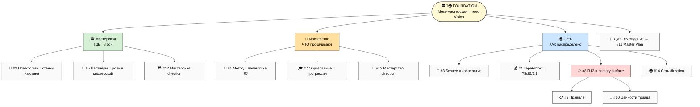
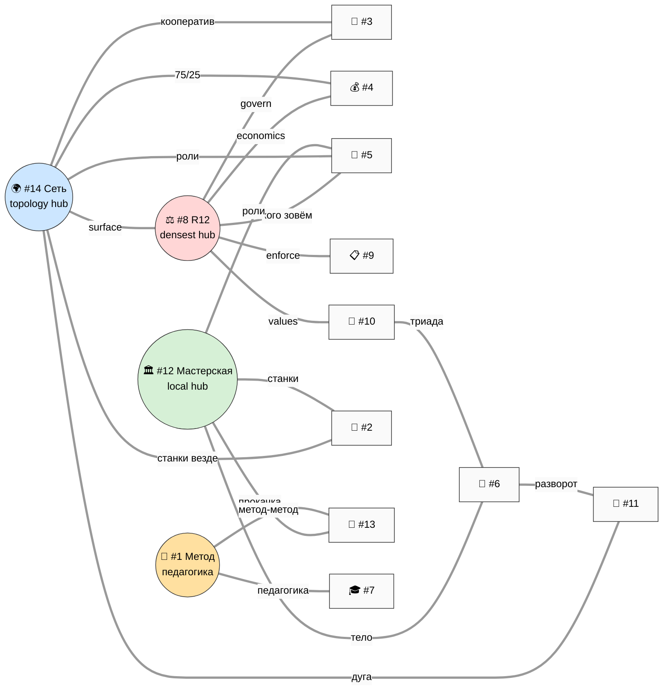

# 🧭 Phase 1 — 14 Directions + Foundation Embedding + Cross-Direction Relations

> **Назначение фазы.** Зафиксировать 14 directions как canonical, показать **как Workshop+Mastery+Network
> permeate все 14** (Foundation, не direction), построить cross-direction relations matrix 14×14, выделить
> cross-cutting docs. 2 mermaid: V3-1 (Foundation embedding) + V3-2 (relations heat map).

---

## §0 Ключевой принцип: Foundation ≠ direction

**Workshop + Mastery + Network — это НЕ 12-е/13-е/14-е направление в одном ряду с остальными.** Это
**root frame** — тело, через которое все 14 directions обретают смысл. Различие принципиальное:

- **direction** = полка с документами под конкретную тему (Метод / Заработок / Правила…).
- **Foundation** = метафора, которая объясняет, **зачем существует каждая полка** и **как они складываются
  в один объект** — мега-мастерскую.

При этом — тонкость — **#12 Мастерская / #13 Мастерство / #14 Сеть существуют ОДНОВРЕМЕННО и как
directions** (полки с портфелями документов), **и как грани Foundation** (метафоры). Это не
противоречие: Foundation = абстрактный root metaphor; directions #12/#13/#14 = его операционализация в
конкретные artefacts. Так Tesla одновременно «electric future» (frame) и «Model S/3/X/Y» (продукты).

> **Проверка R6 (честность):** если убрать Foundation-метафору — 14 directions остаются валидным
> списком тем, но теряют **связность** (зачем они вместе?). Foundation = ответ на «зачем вместе».

---

## §1 14 directions canonical (подтверждены)

### Foundation (root metaphor)

🏛️🎯🌍 **Workshop + Mastery + Network** — мега-мастерская мирового уровня + концепт мастерства +
распределённая сеть. Body of Vision.

### 14 directions

| # | Direction | Грань Foundation | Substrate | GAP | Wave | R12 |
|---|---|---|---|---|---|---|
| 1 | 🧪 Метод | Мастерство (педагогика §J) | METHOD-V2 §J + Extended 8-step + prep-stage | ⚠️ | 2 | мягкий |
| 2 | 🚀 Платформа | Мастерская (станки на стене) | PLATFORM-LIFECYCLE + AI Tools + ROY | ⚠️ | 2 | fork |
| 3 | 💼 Бизнес | Сеть (кооператив) | FULL-MAP §1 + Stage Gates | ❌ | 3 | govern |
| 4 | 💰 Заработок | Сеть (экономика) | ECONOMIC V10 + PARTNER-OFFERING ✅ | ✅ | 1 | STRICT |
| 5 | 👥 Партнёры | Мастерская/Сеть (роли) | EXECUTION §5 (4 типа) ✅ | ✅ | 1 | STRICT |
| 6 | 📜 Видение | Foundation = тело Vision | FULL-MAP §2 + workshop §4 | ⚠️ | 1 | мягкий |
| 7 | 🎓 Образование | Мастерство (прогрессия) | METHOD 7 ступ + O-176..185 | ⚠️ | 3 | uplift |
| 8 | ⚖️ R12/Обещание | Сеть (primary R12 surface) | EXECUTION §4 + Mondragón | ⚠️ | 1 | объект |
| 9 | 📋 Правила | операционка всех граней | Pillar C + CLAUDE | ⚠️ | 3 | углы 3/4 |
| 10 | 💎 Ценности | направление Сети + триада | O-числа + триада O-138 | ⚠️ | 1→3 | A1-3/7 |
| 11 | 📜 Master Plan | дуга Сети online→offline | STRATEGIC-PLAN + Tesla | ❌ | 2→4 | won't |
| **12** | 🏛️ **Мастерская** | **Foundation грань: место** | Phase 1 spec + Method §4 tacit | ❌ | 2 | fork |
| **13** | 🎯 **Мастерство** | **Foundation грань: прокачка** | O-176..185 + Method §J + prep | ⚠️ | 3 | uplift |
| **14** | 🌍 **Сеть** | **Foundation грань: распределение** | Phase 3 spec + экономика | ❌ | 3→4 | PRIMARY |

**Решение по слиянию (R1 для Ruslan):** #12 Мастерская и #14 Сеть тематически близки. Рекомендация роя —
**держать раздельно**: Мастерская = *локальный опыт* (что внутри одного пространства); Сеть = *топология*
(как пространства связаны). Слияние потеряло бы различие «локальное vs распределённое». Финал — Ruslan.

---

## §2 Foundation embedding — как Workshop+Mastery+Network permeate все 14

*(V3-1 — Foundation embedding: 3 грани Foundation × 14 directions. Мастерская держит #2/#5/#12;
Мастерство держит #1/#7/#13; Сеть держит #3/#4/#8/#14; дуга #6→#11 обнимает всё.)*

**Как читать V3-1.** Каждая из 3 граней Foundation «усыновляет» группу directions:

- **Мастерская (ГДЕ)** → directions про *пространство и инструменты*: #2 Платформа (инструменты = станки
  на стене, которые можно улучшать и ставить новые), #5 Партнёры (типы = роли, в которые встаёшь в
  мастерской), #12 сама Мастерская.
- **Мастерство (ЧТО прокачивают)** → directions про *развитие человека*: #1 Метод (метод-метод = педагогика
  мастерства), #7 Образование (7 ступеней = прогрессия мастера), #13 само Мастерство.
- **Сеть (КАК распределено)** → directions про *структуру и этику распределения*: #3 Бизнес (кооператив =
  правовая форма сети), #4 Заработок (75/25/5:1 = экономика сети), #8 R12 (primary surface — где масса+рост
  максимальный соблазн extraction), #14 сама Сеть.
- **Дуга Vision** (#6 Видение → #11 Master Plan) **обнимает все три грани** — это рассказ о том, как
  Foundation разворачивается во времени (Build→Run→Scale→Mature).

**3 хаба навигации** (наружу): #1 Метод (педагогика) · #8 R12 (этика) · **#12 Мастерская (тело)**. Через
эти три точки партнёр заходит в карту: «вот метод», «вот обещание», «вот место».

---

## §3 Cross-direction relations matrix (14×14)

Каждая ячейка = **сила связи** direction-строки → direction-столбца: 🔴 сильная (один питает другой
напрямую) · 🟡 средняя (cross-cite / общий substrate) · ⚪ слабая/нет. Матрица **асимметрична** (Метод
питает Образование сильнее, чем наоборот).

| ↓питает→ | 1Мет | 2Пла | 3Биз | 4Зар | 5Пар | 6Вид | 7Обр | 8R12 | 9Пра | 10Цен | 11MP | 12Маст | 13Мстр | 14Сеть |
|---|---|---|---|---|---|---|---|---|---|---|---|---|---|---|
| **1 Метод** | — | 🟡 | ⚪ | ⚪ | 🟡 | 🟡 | 🔴 | ⚪ | 🟡 | 🟡 | ⚪ | 🟡 | 🔴 | ⚪ |
| **2 Платформа** | 🟡 | — | 🟡 | 🟡 | 🟡 | 🟡 | 🟡 | 🟡 | 🟡 | ⚪ | 🟡 | 🔴 | 🟡 | 🔴 |
| **3 Бизнес** | ⚪ | 🟡 | — | 🔴 | 🟡 | 🟡 | ⚪ | 🔴 | 🔴 | 🟡 | 🔴 | ⚪ | ⚪ | 🔴 |
| **4 Заработок** | ⚪ | 🟡 | 🔴 | — | 🔴 | 🟡 | 🟡 | 🔴 | 🟡 | 🟡 | 🟡 | 🟡 | ⚪ | 🔴 |
| **5 Партнёры** | 🟡 | 🟡 | 🟡 | 🔴 | — | 🟡 | 🟡 | 🔴 | 🟡 | 🟡 | 🟡 | 🔴 | 🟡 | 🔴 |
| **6 Видение** | 🟡 | 🟡 | 🟡 | 🟡 | 🟡 | — | 🟡 | 🟡 | ⚪ | 🔴 | 🔴 | 🔴 | 🔴 | 🔴 |
| **7 Образование** | 🔴 | 🟡 | ⚪ | 🟡 | 🟡 | 🟡 | — | 🟡 | 🟡 | 🟡 | ⚪ | 🟡 | 🔴 | 🟡 |
| **8 R12** | ⚪ | 🟡 | 🔴 | 🔴 | 🔴 | 🟡 | 🟡 | — | 🔴 | 🔴 | 🟡 | 🟡 | 🟡 | 🔴 |
| **9 Правила** | 🟡 | 🟡 | 🔴 | 🟡 | 🟡 | ⚪ | 🟡 | 🔴 | — | 🔴 | ⚪ | 🟡 | 🟡 | 🟡 |
| **10 Ценности** | 🟡 | ⚪ | 🟡 | 🟡 | 🟡 | 🔴 | 🟡 | 🔴 | 🔴 | — | 🔴 | 🟡 | 🔴 | 🟡 |
| **11 Master Plan** | ⚪ | 🟡 | 🔴 | 🟡 | 🟡 | 🔴 | ⚪ | 🟡 | ⚪ | 🔴 | — | 🟡 | ⚪ | 🔴 |
| **12 Мастерская** | 🟡 | 🔴 | ⚪ | 🟡 | 🔴 | 🔴 | 🟡 | 🟡 | 🟡 | 🟡 | 🟡 | — | 🔴 | 🔴 |
| **13 Мастерство** | 🔴 | 🟡 | ⚪ | ⚪ | 🟡 | 🔴 | 🔴 | 🟡 | 🟡 | 🔴 | ⚪ | 🔴 | — | 🟡 |
| **14 Сеть** | ⚪ | 🔴 | 🔴 | 🔴 | 🔴 | 🔴 | 🟡 | 🔴 | 🟡 | 🟡 | 🔴 | 🔴 | 🟡 | — |

### Чтение матрицы — главные паттерны

- **#8 R12 = densest hub** (8 сильных связей: 3/4/5/9/10/14 + входящие). Подтверждает «R12 = primary
  surface» и «якорь виден из любой двери».
- **#14 Сеть = второй hub** (9 исходящих сильных): сеть «тянет» почти всё — она и есть распределённое
  тело Foundation. Логично: Сеть = топология, на которой висят кооператив(#3), экономика(#4), роли(#5),
  обещание(#8).
- **#6 Видение → #11 Master Plan = терминальная дуга** (Видение питает Master Plan сильно; обратно слабо).
- **#1 Метод ↔ #13 Мастерство ↔ #7 Образование = педагогический треугольник** (взаимно сильные): метод-метод
  → мастерство → образование как доставка.
- **#12 Мастерская = новый локальный hub** (6 сильных): держит #2 Платформа (станки), #5 Партнёры (роли),
  #6 Видение (тело), #13 Мастерство, #14 Сеть.

*(V3-2 — cross-direction relations heat map: 4 hub'а (R12 / Сеть / Мастерская / Метод) и их сильные связи.)*

---

## §4 Cross-cutting docs (выделены — feed Phase 16)

Документы, которые **касаются нескольких directions сразу** (per FULL-MAP Phase 13 master skeleton):

| Cross-cutting doc | Сколько directions touch | Какие directions |
|---|---|---|
| **Vision** | 12/14 | все, кроме чисто операционных #9 Правила / отчасти #3 |
| **Charter** (членский) | 8/14 | #3/#4/#5/#8/#9/#10/#14 + #12 |
| **Видео C** (экосистема/партнёры/R12) | 6/14 | #4/#5/#6/#8/#11/#14 |
| **Economic V10** | 5/14 | #3/#4/#5/#8/#14 |
| **R12 checklist** (8 вопросов) | 6/14 | #4/#5/#7/#8/#10 + partner-extension |

Эти 5 разворачиваются в Phase 16 — per doc: spec + как embed в каждое direction it touches + cross-cite map.

---

## §5 Что Phase 1 разблокирует

- **14 directions подтверждены canonical** — Phases 2-15 наполняют по одному portfolio each.
- **Foundation embedding (V3-1)** — каждый per-direction portfolio в Phase 2-15 открывается секцией
  «грань Foundation, к которой принадлежу».
- **Relations matrix (§3)** — каждый portfolio знает свои сильные связи (cross-cite дисциплина).
- **Cross-cutting docs (§4)** — Phase 16 разворачивает 5 docs.
- **4 hub'а** (R12 / Сеть / Мастерская / Метод) — навигационный каркас для master matrix Phase 19.

**Phase 1 complete.** 14 directions canonical; Foundation embedding показан (V3-1); relations matrix
14×14 построена (V3-2); cross-cutting docs выделены; 4 hub'а идентифицированы.

---

*Phase 1 closure. 14 directions confirmed canonical (11 v2 + 3 new: #12 Мастерская / #13 Мастерство /
#14 Сеть). Foundation (Workshop+Mastery+Network) embedding через 3 грани (ГДЕ/ЧТО/КАК) показан — V3-1.
Cross-direction relations matrix 14×14 (асимметричная, сила связей) — V3-2. 4 hub'а: #8 R12 (densest) /
#14 Сеть (topology) / #12 Мастерская (local) / #1 Метод (педагогика). 5 cross-cutting docs выделены для
Phase 16. R12 paired-frame STRICT. IP-1 STRICT.*
