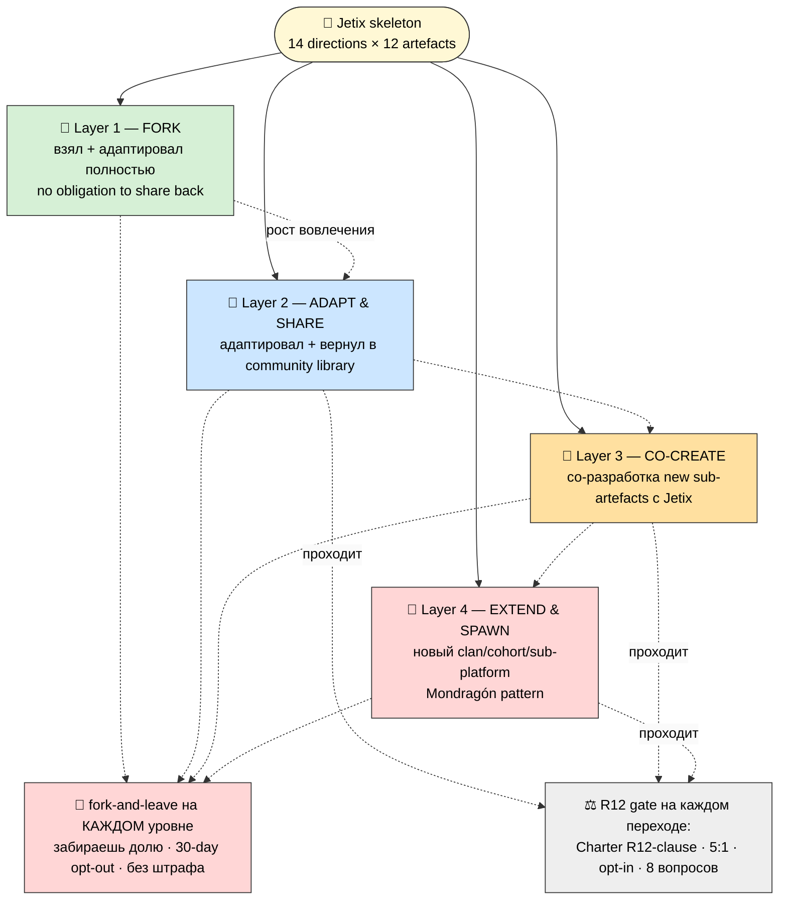

# 🔱 Phase 18 — Partner-Extension Protocol (fork-friendly mechanic)

> **Назначение фазы.** Если 14 directions × 12 artefacts наполняет только Jetix-команда — система не
> масштабируется (упирается в bandwidth основателя). Главная Ruslan-директива 26.05: «масштабируется
> бесконечно» — **партнёры добавляют свои документы под предложенный skeleton**. Phase 18 = протокол,
> как это происходит **без потери R12** (fork-friendly, не extraction; partner contributions сохраняют
> anti-extraction). 4 уровня вовлечения. Это **fundamental для cohort scaling** (Run→Scale).
>
> **R12 STRICT AUTO-FIRE** на всю фазу: influence-ethics + recruitment-dynamics experts. Partner-extension
> = primary R12 surface (рост через партнёров = max соблазн пирамиды / lock-in / выжимания).

---

## §0 Принцип: extension должен делать выход ЛЕГЧЕ, не сложнее

**Контр-интуитивно, но это ядро R12.** Обычная платформа делает partner-extension механизмом lock-in
(чем больше ты вложил, тем дороже уйти → WeChat/Pinduoduo). Jetix делает **наоборот**: каждый уровень
вовлечения **сохраняет fork-and-leave** и **не наказывает за выход**. Extension = приглашение строить
вместе, не сеть, из которой не выпутаться.

**Тест R12 (применяется к каждому layer):** *убери возможность выхода — protocol всё ещё привлекателен?*
Если привлекательность держится на lock-in → это extraction. Если на ценности совместного строительства →
authentic. **Fork-and-leave = опция на каждом уровне, не штрафуется.**

---

## §1 4 уровня partner-extension (обзор) — V3-3

*(V3-3 — 4 layers partner-extension. Вовлечение растёт L1→L4, но fork-and-leave сохраняется на каждом;
R12-gate на переходах L2/L3/L4.)*

| Layer | Что делает партнёр | Обязательство вернуть | R12-gate | Recognition |
|---|---|---|---|---|
| 🍴 **L1 Fork** | берёт direction + адаптирует под себя | ❌ нет (полная свобода) | минимальный (атрибуция) | — (private fork) |
| 🔄 **L2 Adapt & Share** | адаптирует + делится в community library | ✅ да (добровольно) | Charter-lite + R12-check | контрибьютор (имя в library) |
| 🤝 **L3 Co-Create** | со-разрабатывает new sub-artefacts с командой | ✅ совместно | Charter L4-L6 + 8 вопросов | Founding Council / co-author |
| 🌱 **L4 Extend & Spawn** | создаёт свой clan/cohort/cell | ✅ Charter-binding | полный R12-clause + 5:1 + смарт-контракт (Scale) | clan founder / Network Steward |

---

## §2 Layer 1 — FORK (взял и ушёл строить своё)

- **Что:** партнёр берёт любое из 14 directions (skeleton + artefact-specs) и адаптирует **полностью**
  под свой бизнес / cohort / personal use. Может ничего не возвращать.
- **Entry criteria:** ничего — open (как open-source MIT). Skeleton публичен (GitHub формат, Phase 17).
- **Exit:** не applicable (он уже «вне» — это его форк).
- **Contribution guidelines:** ❌ нет обязательств. Просьба (не требование) — **атрибуция** («основано на
  Jetix skeleton»).
- **R12 compliance:** L1 = **доказательство anti-lock-in.** То, что можно форкнуть и уйти без спросу —
  это и есть «не запираем». **R12-positive по определению.** Единственная граница: партнёр не может
  выдавать форк за «официальный Jetix» (нет impersonation — Tier 2 rule 10).
- **Recognition:** private fork — никакого формального признания (и не нужно).
- **Revenue share:** партнёр забирает 100% своего форка (это его бизнес). Jetix не претендует.

**Почему L1 важен:** большинство «партнёров» на самом деле просто хотят инструмент. L1 даёт им его без
трения. Это снимает страх «затянут в секту» (Founder-as-Exhibit: «хотите пользуйтесь, нет — удачи, чус»).

---

## §3 Layer 2 — ADAPT & SHARE (вернул в общую библиотеку)

- **Что:** партнёр адаптирует direction под свой кейс и **возвращает** адаптацию в community library
  (например: «discovery script для SaaS-ниши» под #5 Партнёры).
- **Entry criteria:** желание делиться + прохождение R12-check + Charter-lite (согласие с базовыми
  правилами библиотеки).
- **Exit:** fork-and-leave сохранён — может забрать свой вклад / уйти; уже расшаренное остаётся под его
  атрибуцией (как open-source — нельзя «отозвать» то, чем уже пользуются, но новое не обязан давать).
- **Contribution guidelines (что accept / что нет):**
  - ✅ Accept: артефакты, проходящие R12-check + дополняющие skeleton + с честной атрибуцией.
  - ❌ Reject: артефакты с extraction-механиками (lock-in / манипулятивные hooks / fake-метрики /
    5-ссылочный спам) — даже если технически хороши.
- **R12 compliance:** каждый contribution проходит **R12-checklist (8 вопросов)** перед попаданием в
  library. Главный №7 — нет манипуляции? Anti-pattern: партнёр шарит «email drip sequence» (Phase 17 формат
  14, 🔴 риск) → reject или переработка в honest-onboarding.
- **Recognition:** имя в community library; контрибьютор-статус.
- **Revenue share:** если вклад используется в платном cohort — 75/25 на использование (per Economic V10).

---

## §4 Layer 3 — CO-CREATE (строим новое вместе)

- **Что:** партнёр (обычно T1-методолог: Maxim/Oleg/Левенчук-тип per IP-1) **со-разрабатывает** новые
  sub-artefacts напрямую с Jetix-командой — например, новый курс под #7 Образование или новый метод под
  #1. Это уже не адаптация существующего, а совместное создание.
- **Entry criteria:** доверие (прошли discovery + несколько L2-вкладов) + Charter L4-L6 + 8 вопросов R12.
- **Exit:** fork-and-leave с **долей** в созданном (co-author rights). Уход не отменяет уже созданное; доля
  по Economic V10 (75/25 + 5:1).
- **Contribution guidelines:** совместное авторство; решения по co-created артефактам — через governance
  (Ruslan = sole strategist на стратегию; операционка — совместно). Spec, не sample (R11 даже для co-create).
- **R12 compliance:** Charter L4-L6 + полные 8 вопросов. Особая зона — **кого co-creator приводит** (если
  начинает рекрутить под себя → recruitment-dynamics AUTO-FIRE: приглашение не пирамида).
- **Recognition:** Founding Council / co-author credit / Master-роль в Мастерской.
- **Revenue share:** 75/25 + treasury stake; 5:1 cap соблюдается; вклад в общий капитал.

---

## §5 Layer 4 — EXTEND & SPAWN (свой clan — Mondragón pattern)

- **Что:** партнёр создаёт **свой clan / cohort / cell** — фактически новую мастерскую в сети (#14 Сеть).
  Это max вовлечение: партнёр становится Local Master / clan founder. Mondragón-паттерн (81 кооператив,
  каждый автономен, связаны принципами + внутр. банком).
- **Entry criteria:** Master-уровень + доказанный R12-track-record + Charter-binding (полный) + готовность
  нести R12-ответственность за свой cell.
- **Exit:** **cell может форкнуться из сети** (mesh, не star — нет центра, который держит). Fork-and-leave
  на уровне целого clan'а: забирает свою cell + долю; сеть продолжается. Это топологическое требование
  (Phase 1 — Сеть = topology hub).
- **Contribution guidelines:** cell обязан сохранить **mandatory** правила (Phase «Правила» #9: R12 +
  ethical) при полной автономии в operational/cultural. Cell Charter = R12-clause обязателен.
- **R12 compliance:** 🔴 **высший escalation.** На Scale-этапе — смарт-контракт (Programmable Ethereum
  Phase 2+: Mondragón cap + QF revenue + fork-and-leave exit tokens). Анти-секта чек-лист обязателен для
  cell. **Founder cell = 1 из многих, не глава вечно** (анти-культ проверка). Все 5 influence experts
  AUTO-FIRE: founder cell не должен стать локальной сектой.
- **Recognition:** clan founder / Network Steward (но Steward сам под R12).
- **Revenue share:** internal pool + cross-cell revenue-share (75/25 + 5:1 + QF); cell автономна
  экономически, но связана принципами + внутренним банком (Mondragón).

---

## §6 Partner-extension per direction (14 — explicit)

Как extension работает в каждом direction (что добавляется / где extension points):

| Direction | Что партнёр расширяет | Extension point | Типичный layer |
|---|---|---|---|
| 1 Метод | свои методы в метод-библиотеку | §K AI-workflows + §F templates | L2 |
| 2 Платформа | новый «станок» (инструмент) на стену | §L hook («предложил→оценили→полка») | L2-L3 |
| 3 Бизнес | governance-модель под свой clan | §L (Mondragón spawn) | L4 |
| 4 Заработок | revenue-модель под свою нишу | §L (5:1 сохраняется) | L1-L4 |
| 5 Партнёры | discovery-скрипты под ниши; recursive recruiting (R12!) | §L | L2-L3 |
| 6 Видение | Vision-нарратив под clan (won't-compromise сохранён) | §L | L4 |
| 7 Образование | свой курс под skeleton (T1-методолог) | §C + §L | L3 |
| 8 R12 | — (R12 = mandatory, не расширяется, только применяется) | Charter R12-clause | все (gate) |
| 9 Правила | operational/content правила (R12/ethical = mandatory) | §L (mandatory vs adaptable) | L2-L4 |
| 10 Ценности | свои values поверх триады (триада mandatory) | §L | L4 |
| 11 Master Plan | свой Master Plan под clan (4 части skeleton) | §F template | L4 |
| 12 Мастерская | своя cell-мастерская (zone template + role canon) | §L | L4 |
| 13 Мастерство | своя тема/метод-библиотека (темы vs уровни = открыто) | §F + §L | L2-L3 |
| 14 Сеть | новый cell в mesh (Mondragón spawn) | §L (Charter + mesh обязателен) | L4 |

**Паттерн:** L1-L2 fit'ят все directions (форк/шеринг универсальны); L3 концентрируется на #1/#2/#5/#7/#13
(где co-creation осмысленна); L4 концентрируется на #3/#6/#10/#11/#12/#14 (где спавнится целый clan).

---

## §7 Anti-patterns (R12 STRICT — partner extensions which violate)

| Anti-pattern | Какой R12 action class | Защита |
|---|---|---|
| Партнёр-форк добавляет lock-in clause | `fork_prevention_attempt` | L1 = open MIT-style; lock-in отклоняется |
| Contribution с manipulation-hooks (drip/FOMO) | (нарушение R12-7) | R12-checklist reject (Phase 17 email 🔴) |
| Партнёр выжимает свою аудиторию через extension | `extraction_beyond_share` | 8 вопросов перед T2-касанием |
| Recursive recruiting → пирамида | `non_consensual_distribution` | promoter-бонус за качество не объём (anti-Pinduoduo) |
| Cell founder становится локальным гуру | (анти-секта) | founder = 1 из многих; mesh не star; выход звучит первым |
| Партнёр нарушает 5:1 в своём clan | `wage_ratio_violation` | Charter R12-clause + смарт-контракт (Scale) |
| Форк выдаётся за «официальный Jetix» | (Tier 2 rule 10 impersonation) | атрибуция обязательна; нет impersonation |
| Extension отменяет fork-and-leave для членов clan'а | `fork_prevention_attempt` | mandatory: членский fork-and-leave сохранён на всех уровнях |

**Сквозной закон (lifecycle):** защита partner-extension должна **расти быстрее**, чем растёт количество
партнёров. Build 🟢 (ручной R12-check каждого) → Run 🟡 (Steward review) → Scale 🔴 (смарт-контракт
автоматизирует Charter R12-clause). Иначе на Scale — пирамида под видом «сети».

---

## §8 Что Phase 18 разблокирует

- **«Масштабируется бесконечно»** (Ruslan 26.05) операционализирован: 4 layers + per-direction extension points.
- Каждый direction-portfolio §L (partner-extension hook) теперь имеет общий протокол-каркас.
- Phase 19 master matrix добавляет layer-измерение (какие артефакты open для L1-L4).
- R12-checklist (Phase 16 cross-cutting) = gate каждого contribution.
- Готовность к first partner contributions после ack (pool result — не auto).

**Phase 18 complete.** 4 layers (Fork / Adapt&Share / Co-Create / Extend&Spawn) с entry/exit/guidelines/
R12-compliance/recognition/revenue-share each. Per-direction extension map (14). 8 anti-patterns ↔ 4 R12
action classes. Fork-and-leave сохранён на каждом уровне. V3-3 inline. R12 STRICT AUTO-FIRE.

---

*Phase 18 closure. Partner-extension protocol: 4 fork-friendly layers (L1 Fork no-obligation / L2
Adapt&Share community-library / L3 Co-Create Founding-Council / L4 Extend&Spawn Mondragón-clan). Принцип:
extension делает выход ЛЕГЧЕ не сложнее (R12-тест). Per-direction extension points (14). 8 anti-patterns
↔ 4 RUSLAN-LAYER action classes (extraction/wage-ratio/non-consensual/fork-prevention). Защита растёт
быстрее партнёрской базы. V3-3 inline + V3-10 (Phase 20). R12 paired-frame STRICT AUTO-FIRE.*
