# 📐 Phase 20 — Mermaid Suite V3-1..V3-12

> **Назначение фазы.** 12 схем, визуализирующих всю V3-архитектуру. Все light-bg theme, ≥10 узлов dense.
> V3-1/2/3 встречались inline ранее (Phase 1 / Phase 18) — здесь собраны в каталог. Каталог дублируется
> в `diagrams/_INDEX.md`. Схемы встраиваются в main doc §9 inline references.

---

## V3-1 — 14 directions × Foundation embedding

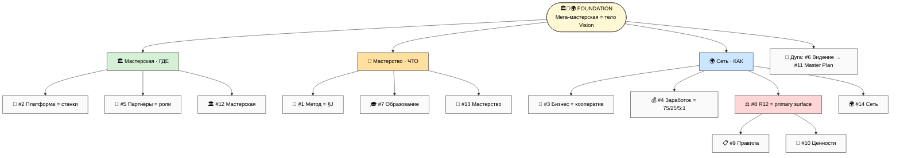
*3 грани Foundation усыновляют группы directions; дуга #6→#11 обнимает всё. 3 хаба: #1/#8/#12.*

---

## V3-2 — Cross-direction relations heat map

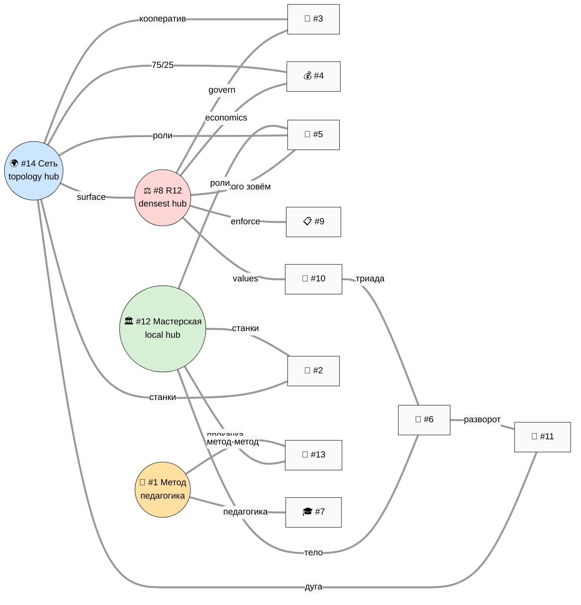
*4 hub'а (R12 densest / Сеть topology / Мастерская local / Метод педагогика) и сильные связи.*

---

## V3-3 — 4 layers partner-extension protocol

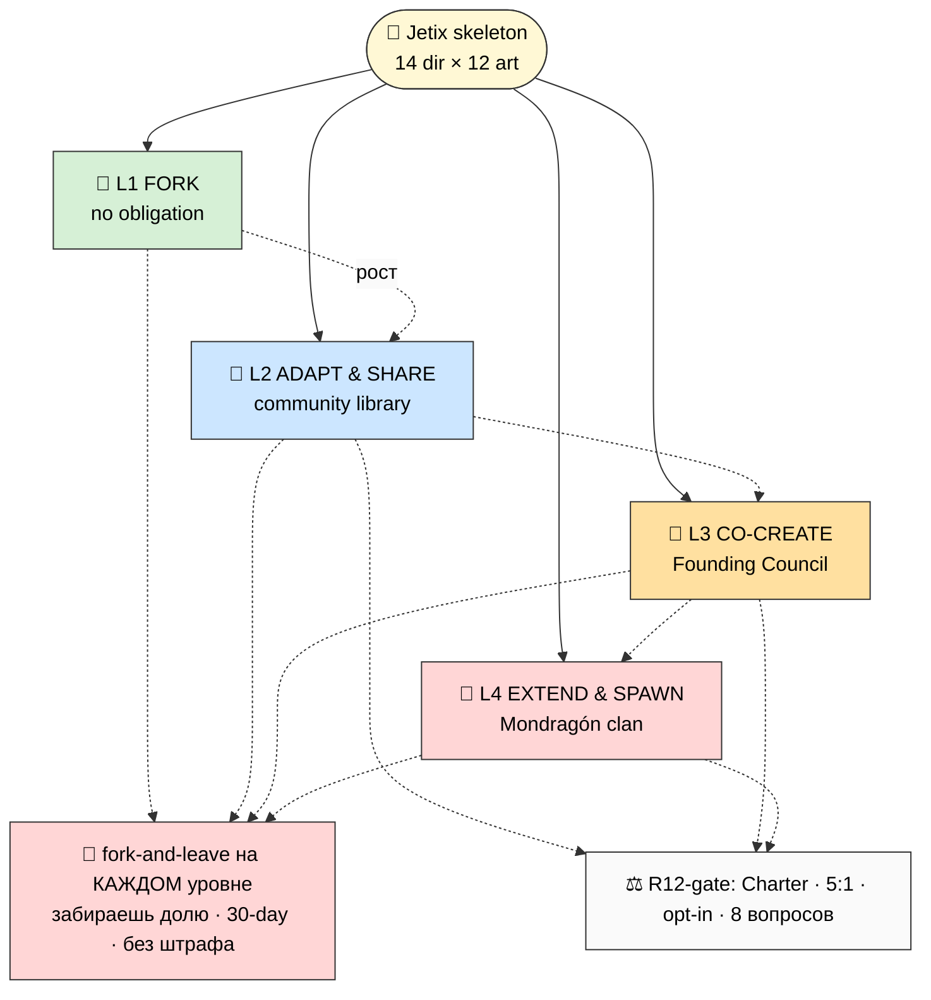
*Вовлечение растёт L1→L4, fork-and-leave сохранён на каждом; R12-gate на переходах.*

---

## V3-4 — Format × direction matrix

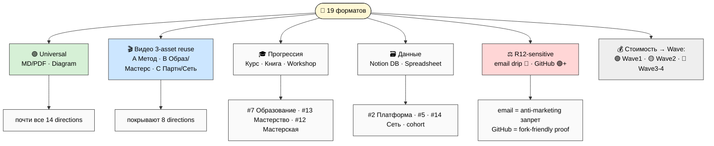
*MD/PDF+Diagram = universal; 3 видео-asset покрывают 8 dirs; курс/книга/workshop = прогрессия (Scale).*

---

## V3-5 — Per-direction portfolio template (12 artefacts)

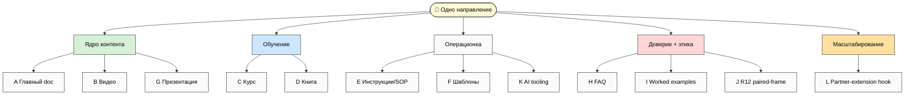
*12 artefacts в 5 кластеров: ядро (A/B/G) · обучение (C/D) · операционка (E/F/K) · доверие (H/I/J) · масштаб (L).*

---

## V3-6 — Master synthesis tree (14 × 12 × audiences)

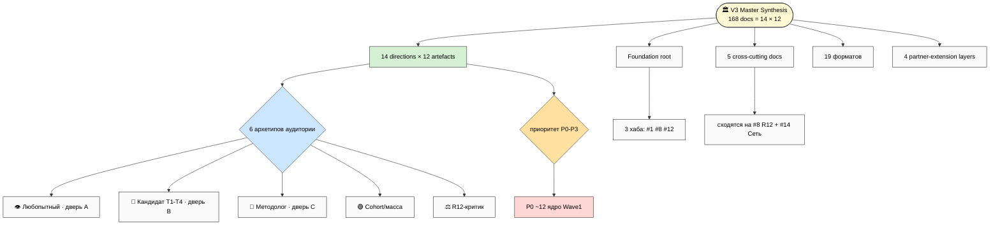
*Полная синтез-карта: Foundation + 14×12 directions × 6 архетипов × приоритет; cross-cutting + форматы + partner-extension.*

---

## V3-7 — Implementation roadmap timeline (4 waves × Build/Run/Scale)

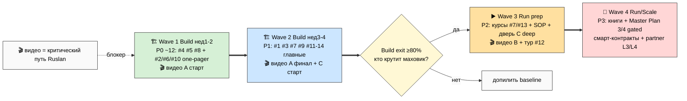
*4 волны привязаны к Build/Run/Scale; gate = «кто крутит маховик» (≥80% Build выходов).*

---

## V3-8 — 5 cross-cutting docs × multi-direction embed

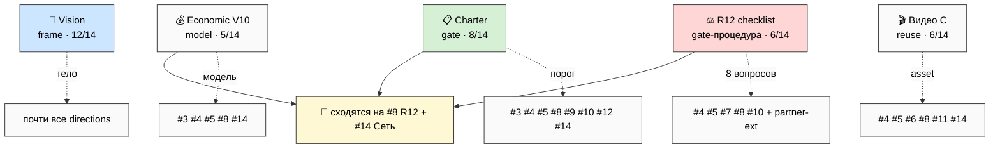
*Single-source-of-truth + per-direction projection; cross-cutting layer = этико-экономический клей.*

---

## V3-9 — R12 paired-frame application per direction (heat map)

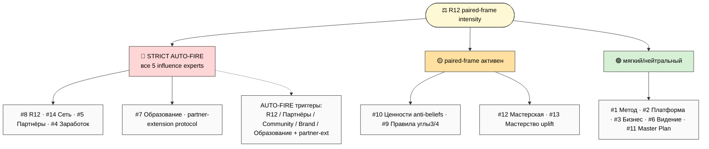
*R12-интенсивность per direction: STRICT (#4/#5/#7/#8/#14 + partner-ext) → mid → soft.*

---

## V3-10 — Partner-extension lifecycle (fork → adapt → co-create → extend-spawn)

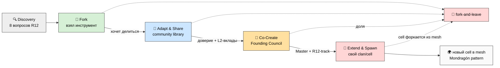
*Партнёрский путь discovery→L1→L4; выход на каждом шаге; L4 рождает новый cell (сеть растёт через спавн).*

---

## V3-11 — Foundation triad embedding в каждое direction

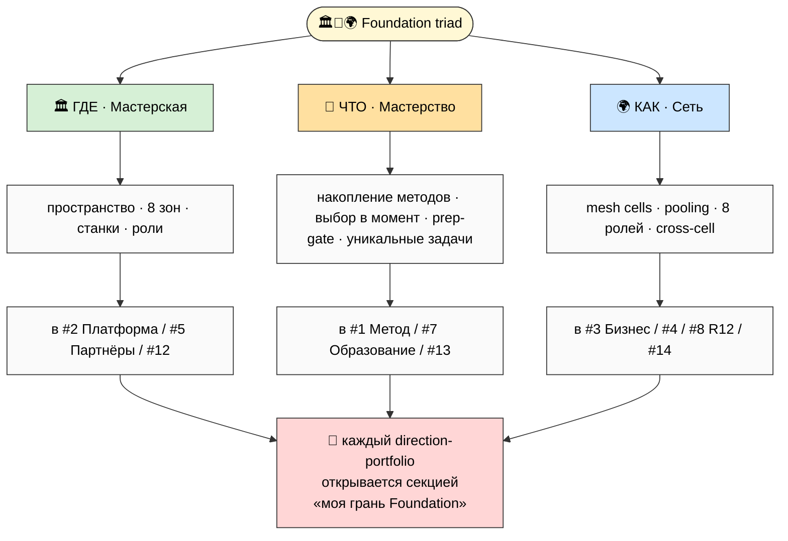
*Триада Foundation (ГДЕ/ЧТО/КАК) встроена в каждое направление через intro-секцию «моя грань».*

---

## V3-12 — Build readiness assessment (per direction × current state)

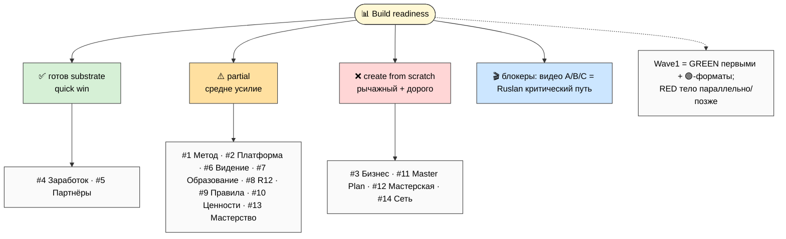
*Готовность per direction: ✅ #4/#5 (quick win) · ⚠️ 8 partial · ❌ #3/#11/#12/#14 (рычажное тело); видео = блокер.*

---

## §Каталог — 12 схем V3-1..V3-12

| # | Показывает | Где inline |
|---|---|---|
| V3-1 | 14 directions × Foundation embedding | Phase 1 + main §1 |
| V3-2 | Cross-direction relations heat map | Phase 1 + main §2 |
| V3-3 | 4 layers partner-extension | Phase 18 + main §6 |
| V3-4 | Format × direction matrix | main §5 |
| V3-5 | Per-direction portfolio template (12 artefacts) | main §3 |
| V3-6 | Master synthesis tree (14×12×audiences) | main §7 |
| V3-7 | Implementation roadmap timeline (4 waves) | main §8 |
| V3-8 | 5 cross-cutting docs × multi-direction embed | main §4 |
| V3-9 | R12 paired-frame per direction heat map | main §3/§6 |
| V3-10 | Partner-extension lifecycle | main §6 |
| V3-11 | Foundation triad embedding | main §1 |
| V3-12 | Build readiness assessment | main §8 |

**Phase 20 complete.** 12 схем V3-1..V3-12, все light-bg ≥10 узлов. Каталог + main inline references.

---

*Phase 20 closure. Mermaid suite V3-1..V3-12 (12 схем): Foundation embedding · relations heat map ·
partner-extension layers · format matrix · portfolio template · master synthesis tree · roadmap timeline ·
cross-cutting embed · R12 heat map · extension lifecycle · triad embedding · build readiness. Light-bg,
≥10 узлов dense. Каталог → diagrams/_INDEX.md.*
