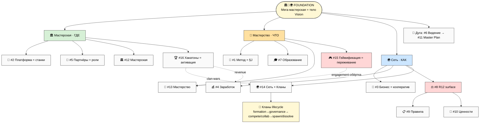
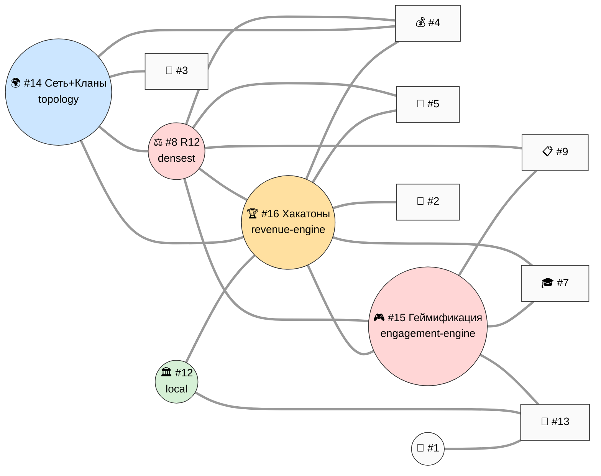

# 🧭 Phase 1 — 16 Directions + Foundation Embedding + Relations + Кланы Overview

> **Назначение фазы.** Зафиксировать 16 directions canonical (V3 14 + 2 NEW), показать Foundation
> embedding (V4-1), построить relations matrix 16×16 (V4-2), дать Кланы lifecycle overview (full в Phase
> 15). Те же принципы, что V3 Phase 1 (Foundation ≠ direction), расширенные на 2 новых направления +
> Кланы как living entities внутри Сети.

---

## §0 Принцип (preserved из V3): Foundation ≠ direction

**Workshop + Mastery + Network = root frame** (тело Vision'а), НЕ направление в одном ряду. 3 грани: 🏛️
Мастерская (ГДЕ) · 🎯 Мастерство (ЧТО прокачивают) · 🌍 Сеть (КАК распределено). Все 16 directions resonate
вокруг этой метафоры. V4 добавляет 2 новых направления, которые **усиливают живость метафоры**:

- 🎮 **Геймификация (#15)** — делает «стать мастером естественно» **ощутимым каждый день** (статистика,
  прогрессия, vызов интереса). Это слой, который превращает абстрактную «прокачку» (Мастерство) в видимое
  переживание. Грань Foundation: Мастерство (engagement-обёртка) + Сеть (social coordination).
- 🏆 **Хакатоны (#16)** — делает мастерскую **операциональной и самоокупаемой** (events = revenue + community
  engine). Это активационный режим Мастерской (Workshop = static substrate; hackathon = operational pattern).
  Грань Foundation: Мастерская (активация) + Сеть (clan-wars).

> **Важно (R6 честность):** #15 и #16 — НЕ просто «ещё 2 темы». Геймификация = **primary R12 surface V4**
> (максимальный соблазн манипуляции), Хакатоны = **primary revenue engine** (где экономика Foundation
> материализуется). Они меняют центр тяжести карты: V3 был про *структуру*, V4 добавляет *движок* (events)
> и *переживание* (gamification).

---

## §1 16 directions canonical

### Foundation (root metaphor)
🏛️🎯🌍 **Workshop + Mastery + Network** — мега-мастерская мирового уровня. Body of Vision.

### 16 directions

| # | Direction | Грань Foundation | Substrate | GAP | Wave | R12 |
|---|---|---|---|---|---|---|
| 1 | 🧪 Метод | Мастерство (педагогика §J) | METHOD-V2 §J + Extended 8-step | ⚠️ | 2 | мягкий |
| 2 | 🚀 Платформа | Мастерская (станки) | PLATFORM-LIFECYCLE + AI Tools + ROY | ⚠️ | 2 | fork |
| 3 | 💼 Бизнес | Сеть (кооператив) | FULL-MAP §1 + Stage Gates | ❌ | 3 | govern |
| 4 | 💰 Заработок | Сеть (экономика) | ECONOMIC V10 + PARTNER-OFFERING ✅ | ✅ | 1 | STRICT |
| 5 | 👥 Партнёры | Мастерская/Сеть (роли) | EXECUTION §5 ✅ | ✅ | 1 | STRICT |
| 6 | 📜 Видение | тело Vision | FULL-MAP §2 + workshop §4 | ⚠️ | 1 | мягкий |
| 7 | 🎓 Образование | Мастерство (прогрессия) | METHOD 7 ступ + O-176..185 | ⚠️ | 3 | uplift |
| 8 | ⚖️ R12/Обещание | Сеть (R12 surface) | EXECUTION §4 + Mondragón | ⚠️ | 1 | объект |
| 9 | 📋 Правила | операционка всех граней | Pillar C + CLAUDE | ⚠️ | 3 | углы 3/4 |
| 10 | 💎 Ценности | направление Сети + триада | O-числа + триада O-138 | ⚠️ | 1→3 | A1-3/7 |
| 11 | 📜 Master Plan | дуга Сети online→offline | STRATEGIC-PLAN + Tesla | ❌ | 2→4 | won't |
| 12 | 🏛️ Мастерская | Foundation: место | workshop §1 + Method §4 tacit | ❌ | 2 | fork |
| 13 | 🎯 Мастерство | Foundation: прокачка | O-176..185 + §J + prep | ⚠️ | 3 | uplift |
| 14 | 🌍 Сеть **+ Кланы** | Foundation: распределение | workshop §3 + Mondragón + **Кланы §K** | ❌ | 3→4 | PRIMARY |
| **15** | 🎮 **Геймификация** | **Мастерство engagement + Сеть coord** | H6 LOCKED + gamification-expert + Notion Life Pulse | ❌ | 2→3 | **HIGHEST** |
| **16** | 🏆 **Хакатоны/Events** | **Мастерская активация + Сеть clan-wars** | JETIX-AS-HACKATHON-PLATFORM ✅ | ⚠️ | 1→2 | STRICT |

**Решения по слиянию (R1):** #15 Геймификация и #13 Мастерство близки — рекомендация **раздельно**:
Мастерство = *что прокачивается* (содержание); Геймификация = *как это переживается* (engagement-слой,
R12-чувствительный). #16 Хакатоны и #14 Сеть/Кланы близки (clan-wars = hackathons) — раздельно: Сеть =
*топология+кланы* (структура); Хакатоны = *events движок* (revenue+community mechanic). Финал — Ruslan.

---

## §2 Foundation embedding — V4-1

*(V4-1 — 16 directions × Foundation embedding. 2 новых: #15 Геймификация (engagement-обёртка Мастерства,
R12 HIGHEST) + #16 Хакатоны (активация Мастерской + revenue + clan-wars). Кланы — living entities в Сети.)*

**Как читать V4-1:** Мастерская усыновляет #2/#5/#12 + **#16 Хакатоны** (события = активация пространства).
Мастерство усыновляет #1/#7/#13 + **#15 Геймификация** (переживание прокачки). Сеть усыновляет #3/#4/#8/#14
+ **Кланы lifecycle** (живые сущности внутри). Кросс-связи: #15 оборачивает #13 (engagement), #16 питает #4
(revenue) и #14 (clan-wars). Дуга #6→#11 обнимает всё.

**3 хаба навигации (preserved):** #1 Метод · #8 R12 · #12 Мастерская. **+ V4 добавляет 2 «движка»:**
**#16 Хакатоны** (revenue+community engine — операционный двигатель) и **#15 Геймификация** (engagement
engine — мотивационный двигатель). Хабы = *навигация*; движки = *что приводит систему в движение*.

---

## §3 Cross-direction relations matrix (16×16)

Сила связи строка→столбец: 🔴 сильная · 🟡 средняя · ⚪ слабая/нет. Асимметрична.

| ↓→ | 1М | 2П | 3Б | 4З | 5Пр | 6В | 7О | 8R | 9Пв | 10Ц | 11МП | 12Мс | 13Мт | 14С | 15Гм | 16Хк |
|---|---|---|---|---|---|---|---|---|---|---|---|---|---|---|---|---|
| **1 Метод** | — | 🟡 | ⚪ | ⚪ | 🟡 | 🟡 | 🔴 | ⚪ | 🟡 | 🟡 | ⚪ | 🟡 | 🔴 | ⚪ | 🟡 | 🟡 |
| **2 Платформа** | 🟡 | — | 🟡 | 🟡 | 🟡 | 🟡 | 🟡 | 🟡 | 🟡 | ⚪ | 🟡 | 🔴 | 🟡 | 🔴 | 🔴 | 🔴 |
| **3 Бизнес** | ⚪ | 🟡 | — | 🔴 | 🟡 | 🟡 | ⚪ | 🔴 | 🔴 | 🟡 | 🔴 | ⚪ | ⚪ | 🔴 | ⚪ | 🟡 |
| **4 Заработок** | ⚪ | 🟡 | 🔴 | — | 🔴 | 🟡 | 🟡 | 🔴 | 🟡 | 🟡 | 🟡 | 🟡 | ⚪ | 🔴 | 🟡 | 🔴 |
| **5 Партнёры** | 🟡 | 🟡 | 🟡 | 🔴 | — | 🟡 | 🟡 | 🔴 | 🟡 | 🟡 | 🟡 | 🔴 | 🟡 | 🔴 | 🟡 | 🔴 |
| **6 Видение** | 🟡 | 🟡 | 🟡 | 🟡 | 🟡 | — | 🟡 | 🟡 | ⚪ | 🔴 | 🔴 | 🔴 | 🔴 | 🔴 | 🟡 | 🟡 |
| **7 Образование** | 🔴 | 🟡 | ⚪ | 🟡 | 🟡 | 🟡 | — | 🟡 | 🟡 | 🟡 | ⚪ | 🟡 | 🔴 | 🟡 | 🔴 | 🔴 |
| **8 R12** | ⚪ | 🟡 | 🔴 | 🔴 | 🔴 | 🟡 | 🟡 | — | 🔴 | 🔴 | 🟡 | 🟡 | 🟡 | 🔴 | 🔴 | 🔴 |
| **9 Правила** | 🟡 | 🟡 | 🔴 | 🟡 | 🟡 | ⚪ | 🟡 | 🔴 | — | 🔴 | ⚪ | 🟡 | 🟡 | 🟡 | 🔴 | 🟡 |
| **10 Ценности** | 🟡 | ⚪ | 🟡 | 🟡 | 🟡 | 🔴 | 🟡 | 🔴 | 🔴 | — | 🔴 | 🟡 | 🔴 | 🟡 | 🟡 | 🟡 |
| **11 Master Plan** | ⚪ | 🟡 | 🔴 | 🟡 | 🟡 | 🔴 | ⚪ | 🟡 | ⚪ | 🔴 | — | 🟡 | ⚪ | 🔴 | ⚪ | 🟡 |
| **12 Мастерская** | 🟡 | 🔴 | ⚪ | 🟡 | 🔴 | 🔴 | 🟡 | 🟡 | 🟡 | 🟡 | 🟡 | — | 🔴 | 🔴 | 🟡 | 🔴 |
| **13 Мастерство** | 🔴 | 🟡 | ⚪ | ⚪ | 🟡 | 🔴 | 🔴 | 🟡 | 🟡 | 🔴 | ⚪ | 🔴 | — | 🟡 | 🔴 | 🟡 |
| **14 Сеть+Кланы** | ⚪ | 🔴 | 🔴 | 🔴 | 🔴 | 🔴 | 🟡 | 🔴 | 🟡 | 🟡 | 🔴 | 🔴 | 🟡 | — | 🟡 | 🔴 |
| **15 Геймификация** | 🟡 | 🔴 | ⚪ | 🟡 | 🟡 | 🟡 | 🔴 | 🔴 | 🔴 | 🟡 | ⚪ | 🟡 | 🔴 | 🟡 | — | 🔴 |
| **16 Хакатоны** | 🟡 | 🔴 | 🟡 | 🔴 | 🔴 | 🟡 | 🔴 | 🔴 | 🟡 | 🟡 | 🟡 | 🔴 | 🟡 | 🔴 | 🔴 | — |

### Главные паттерны (обновлены для 16)

- **#8 R12 = densest hub** (теперь 10 сильных — добавились #15/#16: оба = R12-чувствительные движки).
- **#14 Сеть+Кланы = topology hub** (10 сильных — Кланы добавляют вес).
- **#16 Хакатоны = новый «движок-hub»** (8 сильных исходящих: #2 stack / #4 revenue / #5 sponsors / #7 / #8 /
  #12 активация / #14 clan-wars / #15 геймификация событий). Хакатоны «тянут» почти всё операционное.
- **#15 Геймификация = engagement-hub** (#2 платформа-tracking / #7 образование / #8 R12 / #9 правила /
  #13 Мастерство / #16 события). Сильно связана с #8 (R12) и #9 (правила) — потому что dark-pattern риск.
- **Педагогический треугольник усилен:** #1↔#13↔#7 + теперь **#15** (геймификация обучения) + **#16**
  (хакатоны как deep learning sprints).

*(V4-2 — relations heat map. 5 центров: R12 (densest) · Сеть+Кланы (topology) · Хакатоны (revenue-engine) ·
Геймификация (engagement-engine, R12 HIGHEST) · Мастерская (local). Хакатоны+Геймификация = новые «движки».)*

---

## §4 Кланы lifecycle overview (full в Phase 15)

Кланы = **основная часть платформы** (Ruslan). В V3 это были mesh cells; V4 раскрывает их как living
entities. Платформа Jetix = **«качалка / склад»** (infrastructure + Charter floor + events), НЕ контролёр.

**7 фаз жизни клана** (full spec — Phase 15 §K + Phase 20 spawn protocol):
1. **Formation** — founding members + Charter signing + Mondragón allocation + first project.
2. **Governance** — Steward + consensus/voting/RACI (per-клан Charter; внутри = свобода).
3. **Внутри-клана свобода** — methods/topics/management = inner-clan; ТОЛЬКО R12 + ценностной floor enforced.
4. **Соревнование** — inter-clan хакатоны/mastery tournaments; «уважение между соревнующимися»; R12: no
   poaching/sabotage/anti-clan extraction.
5. **Сотрудничество** — cross-clan projects/expeditions/shared research/talent exchange.
6. **Fork-and-spawn** — split / spawn sub-clan (Mondragón: cooperatives spawning cooperatives).
7. **Dissolution** — graceful unwind (asset distribution / member migration).

+ **Inter-clan governance:** Stewards across clans (peer-check ротация) + Foundation dispute resolution.

**Ценностной floor (единственное, что enforced platform-wide):** триада O-138 (тяга к жизни) + R12
(anti-extraction + fork-and-leave) + уважение к соревнующимся. Всё остальное — свобода клана.

---

## §5 Cross-cutting docs (7 — feed Phase 18)

| Cross-cutting doc | Touch (из 16) | Тип |
|---|---|---|
| **Vision** | 16/16 | frame (тело) |
| **Charter** (членский) | ~10/16 (+Кланы/Геймификация) | gate (порог) |
| **Видео C** (экосистема) | ~8/16 (+кланы+хакатоны) | reuse-asset |
| **Economic V10** | ~7/16 (+хакатоны revenue) | модель |
| **R12 checklist** | ~9/16 (+Геймификация PRIMARY) | gate-процедура |
| **NEW: Klan Charter template** | #14 + #12 + #16 + Кланы lifecycle | per-клан shell |
| **NEW: Anti-Dark-Patterns audit** | #15 + #5 + #7 + Brand + #16 | R12 enforcement |

---

## §6 Что Phase 1 разблокирует

- 16 directions canonical; Foundation embedding (V4-1) с 2 новыми движками; relations 16×16 (V4-2).
- Кланы lifecycle overview → Phase 15 разворачивает full §K.
- 7 cross-cutting (2 new) → Phase 18.
- 5 центров (R12/Сеть+Кланы/Хакатоны/Геймификация/Мастерская) → master matrix Phase 21.
- Phases 2-15 расширяют V3-портфели; 16-17 строят #15/#16 fresh.

**Phase 1 complete.** 16 directions canonical (V3 14 + Геймификация #15 R12-HIGHEST + Хакатоны #16). Foundation
embedding V4-1 (2 движка + Кланы). Relations 16×16 V4-2 (5 центров). Кланы lifecycle overview (7 фаз). 7
cross-cutting выделены.

---

*Phase 1 closure (v4). 16 directions confirmed (14 V3 + #15 Геймификация + #16 Хакатоны). Foundation
embedding V4-1 (#15 engagement-обёртка Мастерства R12-HIGHEST; #16 активация Мастерской + revenue + clan-wars;
Кланы living entities в Сети). Relations matrix 16×16 V4-2 (5 центров: R12 densest / Сеть+Кланы topology /
Хакатоны revenue-engine / Геймификация engagement-engine / Мастерская local). Кланы lifecycle overview 7 фаз
+ ценностной floor. 7 cross-cutting (2 new: Klan Charter template + Anti-Dark-Patterns audit). R12 STRICT.*
