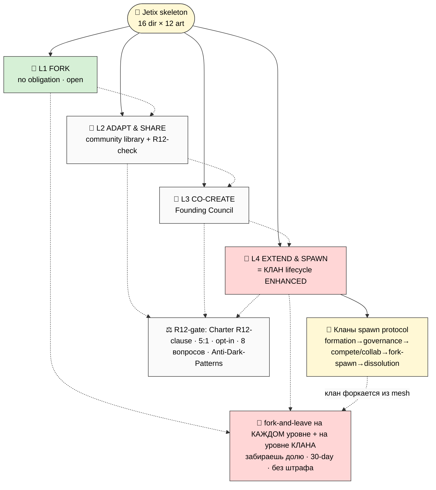

# 🔱 Phase 20 — Partner-Extension Protocol + Кланы Spawn/Dissolution

> **Назначение фазы.** V3 дал 4 fork-friendly layers (Fork / Adapt&Share / Co-Create / Extend&Spawn). V4
> **углубляет Layer 4** до полного **Кланы spawning protocol** (клан = living entity, не просто «extension»)
> + добавляет inter-clan partnership protocols (collaboration/competition) + klan dissolution graceful
> unwind + member migration. Принцип неизменен: **extension делает выход ЛЕГЧЕ, не сложнее** (ядро R12).
> R12 STRICT AUTO-FIRE (influence-ethics + recruitment-dynamics).

---

## §0 Принцип (preserved): extension = выход легче, не lock-in

Каждый layer сохраняет fork-and-leave. Тест R12: убери возможность выхода — protocol всё ещё привлекателен?
Да → authentic; нет → extraction. V4 усиливает это на уровне **целого клана**: клан может форкнуться из
сети, забрав свою долю; сеть продолжается (mesh не star).

---

## §1 4 layers (V3 preserved) — V4-3

*(V4-3 — 4 layers + Layer 4 = полный Кланы lifecycle. Fork-and-leave на каждом уровне И на уровне клана.)*

- **🍴 L1 Fork** — взял direction + адаптировал полностью; no obligation; open (MIT-style = anti-lock-in proof).
- **🔄 L2 Adapt & Share** — вернул в community library; R12-check + Anti-Dark-Patterns audit (для game-mechanic).
- **🤝 L3 Co-Create** — со-разработка с командой; Founding Council; Charter L4-L6.
- **🌱 L4 Extend & Spawn** — **= полный Кланы lifecycle** (см. §2-§5). Mondragón: cooperatives spawning cooperatives.

---

## §2 Layer 4 ENHANCED — Кланы spawning protocol

Клан = не просто «партнёр с форком», а **living organizational entity** внутри сети. Spawn protocol:

### §2.1 Клан formation (как рождается)
- **Entry:** founding members (мин. кворум) + Klan Charter signing (Phase 18 §7) + initial Mondragón
  allocation (5:1 cap mandatory) + first project commitment.
- **Platform role:** Jetix даёт «качалку/склад» — Notion templates + AI tooling + Workshop space +
  Network coordination + Charter floor. НЕ диктует методы/темы.
- **R12:** ценностной floor (триада O-138 + R12 + уважение) = mandatory; всё остальное = inner-clan freedom.

### §2.2 Клан spawn (клан рождает суб-клан — Mondragón)
- Зрелый клан может **spawn sub-clan** (cooperatives spawning cooperatives — Mondragón pattern; 81
  кооператив, внутр. банк, каждый автономен).
- **Entry для sub-clan:** наследует Charter floor + получает свою автономию; initial allocation от родителя
  (gift, не долг — R12).
- **R12:** sub-clan НЕ подчинён родителю (mesh не star); fork-and-leave preserved; no parent-extraction.

### §2.3 Клан split (клан делится на два)
- Если внутри клана 2 направления расходятся — клан может **split** (как клеточное деление).
- Asset distribution per Klan Charter; обе половины наследуют floor; члены выбирают сторону (fork-and-leave).
- **R12:** split без штрафа; никто не «теряет» при разделении (доля сохраняется).

---

## §3 Inter-clan partnership protocols

### §3.1 Сотрудничество (collaboration)
- Cross-clan projects (big collaborations) · cross-clan expeditions (#16) · shared research outputs ·
  talent exchange (member movement, добровольно).
- **Revenue:** shared outputs → revenue-share per Mondragón (75/25 + 5:1 + QF); атрибуция вкладов.
- **R12:** opt-in; no forced collaboration; вклад добровольный (gift + consent).

### §3.2 Соревнование (competition)
- Inter-clan хакатоны (#16 clan-wars) · mastery tournaments (#13 темы — но anti-ranking между темами) ·
  challenges. Spirit = «дух соревнования + уважение между соревнующимися» (Ruslan voice).
- **R12 STRICT (inter-clan rules — Phase 19 формат 25):** ❌ member poaching (переманивание) · ❌ resource
  sabotage · ❌ anti-clan extraction · ❌ destructive competition. ✅ healthy: соревнование поднимает планку,
  проигравших нет (workshop-concept §B — соревнования развивающие не токсичные).

### §3.3 Inter-clan governance
- **Stewards across clans** (peer-check ротация — анти-культ механика из Network direction).
- **Foundation-level dispute resolution** — конфликты между кланами эскалируются к Foundation (Steward
  council); R12 enforcement (если клан нарушает floor — escalation).

---

## §4 Клан dissolution (graceful unwind)

Если клан кончается (consensus / natural decay / member exodus):
- **Asset distribution** per Klan Charter (что накоплено — делится по долям; 5:1 preserved).
- **Member migration** — члены мигрируют к другим кланам (Network member movement); их доля/репутация
  переносятся (portfolio>diploma — мастерство принадлежит человеку, не клану).
- **Knowledge preservation** — наработки клана → community library (L2) — не теряются.
- **R12:** dissolution graceful, не наказывает; член не «застревает» в умирающем клане (fork-and-leave).

---

## §5 Member migration (между кланами)

- Член может перейти из клана в клан (или быть в нескольких — роли не взаимоисключающие, Workshop §D).
- **Что переносится:** мастерство (skill tree #15 — принадлежит человеку), репутация (portfolio), доля
  (по Charter).
- **R12:** добровольно; принимающий клан = opt-in (consent обеих сторон); НЕ poaching (инициатива члена,
  не вербовка клана).

---

## §6 8 anti-patterns ↔ 4 R12 action classes (V4 расширены)

| Anti-pattern | R12 action class | Защита |
|---|---|---|
| Клан добавляет lock-in clause | `fork_prevention_attempt` | Klan Charter floor запрещает; fork preserved |
| Клан переманивает членов другого | `non_consensual_distribution` | inter-clan rules: no poaching (член-инициатива only) |
| Клан выжимает суб-клан (parent-extraction) | `extraction_beyond_share` | Mondragón mesh: sub-clan автономен |
| Клан нарушает 5:1 внутри | `wage_ratio_violation` | Klan Charter 5:1 mandatory + смарт-контракт (Scale) |
| Sponsor captures event (#16) | `extraction_beyond_share` | sponsorship transparency; sponsor не диктует |
| Game-mechanic с dark-pattern (#15) | (R12-7 манипуляция) | Anti-Dark-Patterns audit gate |
| Destructive inter-clan competition | (анти-уважение) | inter-clan rules: no sabotage; «уважение» |
| Dissolution штрафует уходящих | `fork_prevention_attempt` | graceful unwind; доля сохраняется |

**Сквозной закон:** защита partner/clan-extension растёт быстрее, чем растёт количество кланов. Build
🟢 (ручной R12-check + Klan Charter review) → Run 🟡 (Steward council review) → Scale 🔴 (смарт-контракт
автоматизирует Charter R12-clause + QF + inter-clan rules).

---

## §7 Что Phase 20 разблокирует

- Layer 4 = полный Кланы lifecycle spawn/split/dissolution → готов для first клан formation pilot.
- Inter-clan protocols (collaboration/competition/governance) → events platform (#16 clan-wars).
- Member migration → mastery принадлежит человеку (portfolio), не клану.
- Klan Charter template (Phase 18 §7) = инструмент формирования.
- Phase 21 master matrix: Кланы overlay (per artefact — clan-formation/internal/inter-clan/dissolution relevance).

**Phase 20 complete.** 4 layers (V3) + Layer 4 ENHANCED = полный Кланы lifecycle (formation / spawn /
split / dissolution / member migration) + inter-clan protocols (collaboration / competition STRICT /
governance). 8 anti-patterns ↔ 4 R12 action classes. Fork-and-leave на уровне члена И клана. R12 STRICT AUTO-FIRE.

---

*Phase 20 closure (v4). Partner-extension 4 layers + Layer 4 = Кланы spawning protocol (Mondragón
cooperatives-spawning-cooperatives: formation/spawn/split/dissolution + member migration). Inter-clan
protocols: collaboration (opt-in revenue-share) / competition (STRICT no poaching/sabotage/extraction;
«уважение») / governance (Stewards peer-check + Foundation dispute resolution). 8 anti-patterns ↔ 4 RUSLAN-
LAYER action classes. Защита растёт быстрее клан-базы. V4-3 inline + V4-13 (Phase 22). R12 STRICT AUTO-FIRE.*
