# 📐 Phase 22 — Mermaid Suite V4-1..V4-14

> 14 схем всей V4-архитектуры. Light-bg, ≥10 узлов dense. V4-1/2/3 встречались ранее (Phase 1/20) —
> собраны в каталог. 3 NEW (V4-11 gamification dynamics · V4-12 hackathon engine · V4-13 Кланы lifecycle).
> Каталог → `diagrams/_INDEX.md`.

---

## V4-1 — 16 directions × Foundation embedding

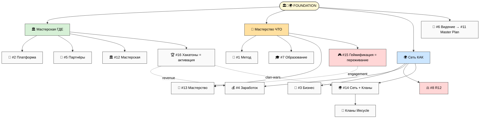

## V4-2 — Cross-direction relations heat map (5 центров)

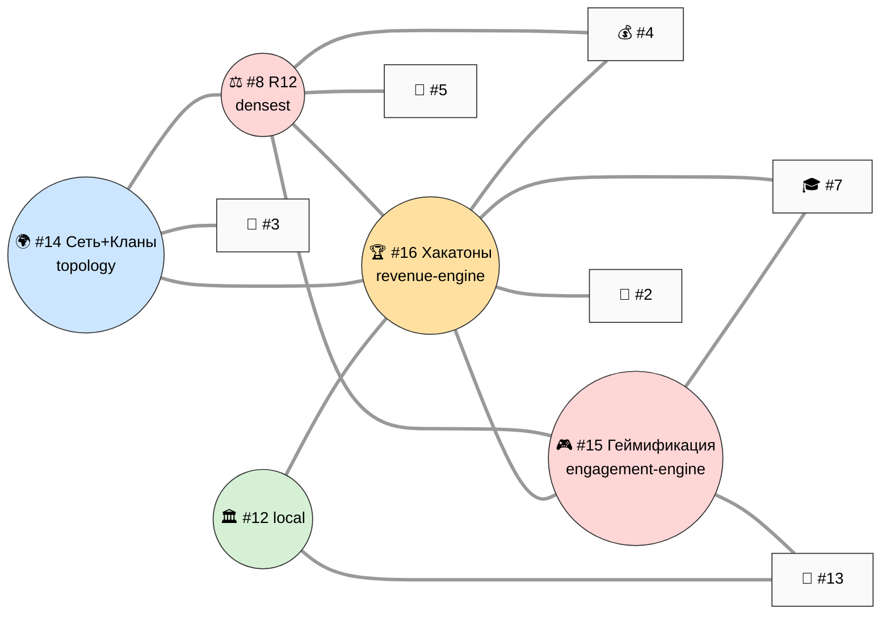

## V4-3 — 4 layers partner-extension + Кланы spawn

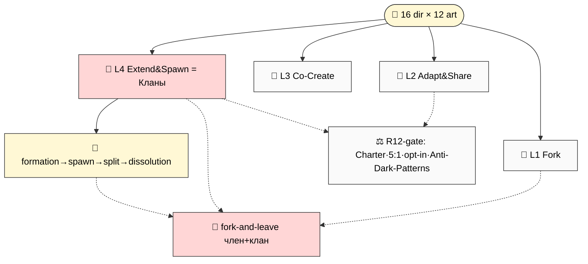

## V4-4 — Format × direction matrix (26 forms)

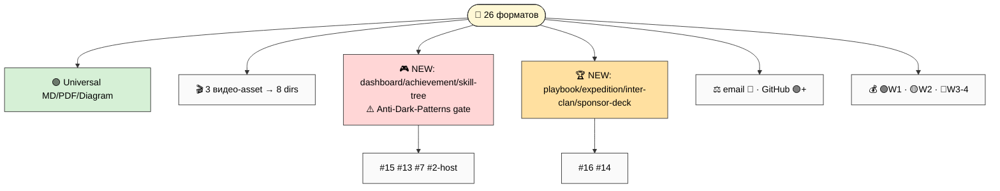

## V4-5 — Per-direction portfolio template (12 artefacts)

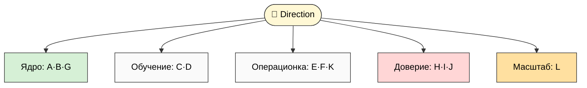

## V4-6 — Master synthesis tree (16×12×audiences×stages + Кланы overlay)

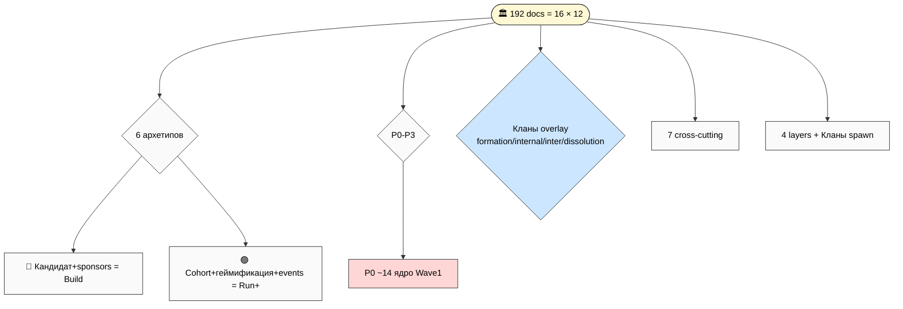

## V4-7 — Implementation roadmap timeline (4 waves)

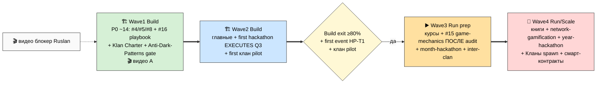

## V4-8 — 7 cross-cutting docs × multi-direction embed

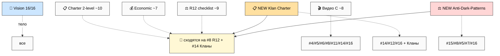

## V4-9 — R12 paired-frame per direction (heat map — #15 RED HOT)

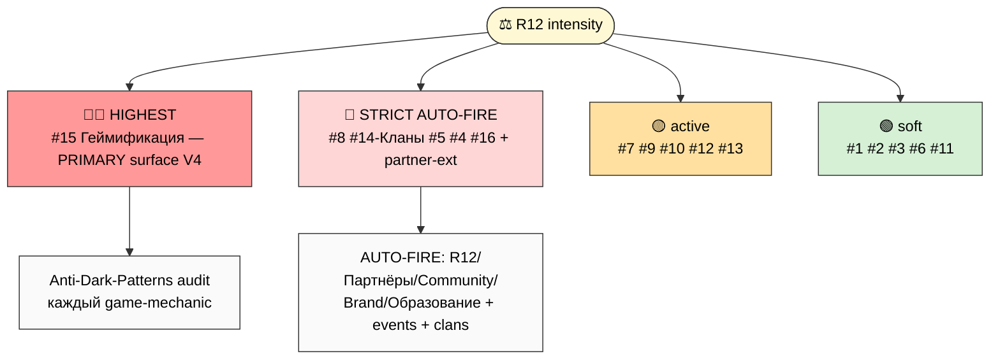

## V4-10 — Foundation triad embedding

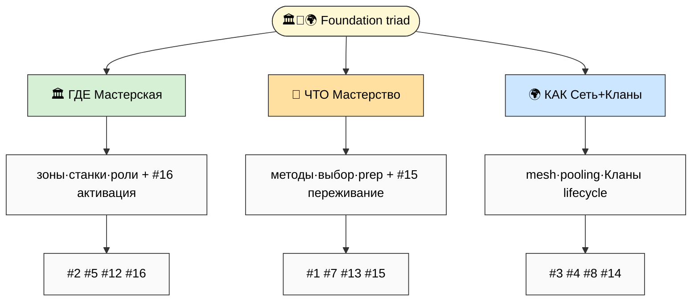

## V4-11 — NEW: Gamification dynamics (Schelling + virtual economy + R12 enforcement)

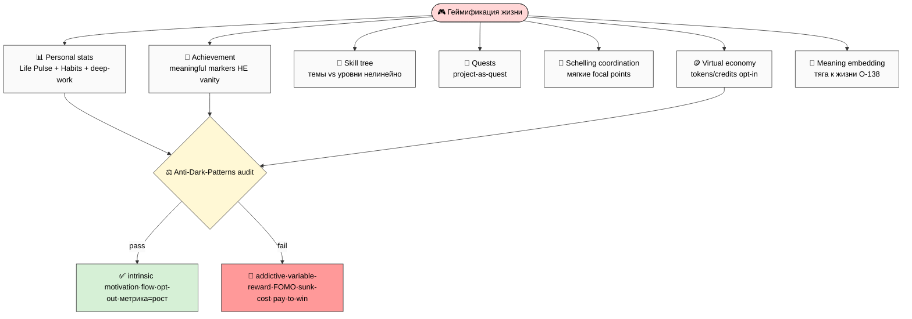

## V4-12 — NEW: Hackathon revenue + community engine

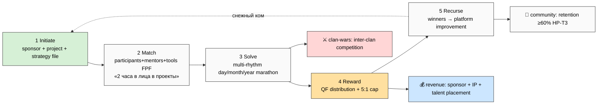

## V4-13 — NEW: Кланы lifecycle

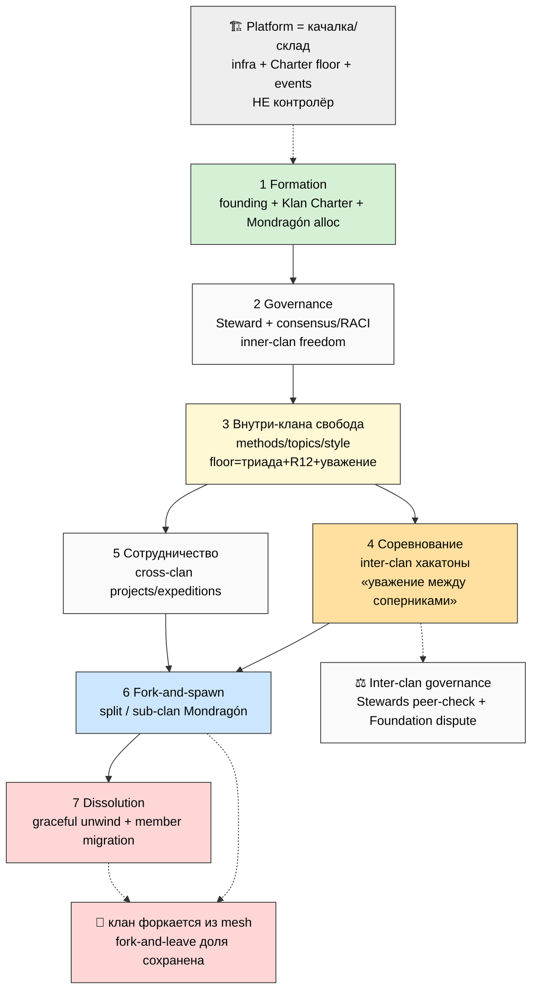

## V4-14 — Build readiness assessment

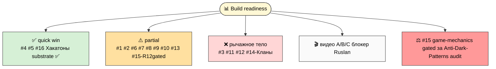

---

## §Каталог — 14 схем V4-1..V4-14

| # | Показывает | Main inline § |
|---|---|---|
| V4-1 | 16 directions × Foundation embedding | §1 |
| V4-2 | Cross-direction relations (5 центров) | §2 |
| V4-3 | 4 layers partner-extension + Кланы spawn | §9 |
| V4-4 | Format × direction matrix (26 forms) | §8 |
| V4-5 | Portfolio template 12 artefacts | §3 |
| V4-6 | Master synthesis tree + Кланы overlay | §10 |
| V4-7 | Roadmap timeline 4 волны | §11 |
| V4-8 | 7 cross-cutting docs embed | §7 |
| V4-9 | R12 heat map (#15 RED HOT) | §5 |
| V4-10 | Foundation triad embedding | §1 |
| V4-11 | **NEW Gamification dynamics** | §5 |
| V4-12 | **NEW Hackathon revenue+community engine** | §6 |
| V4-13 | **NEW Кланы lifecycle** | §4 |
| V4-14 | Build readiness assessment | §11 |

**Phase 22 complete.** 14 схем V4-1..V4-14 (3 NEW: gamification dynamics / hackathon engine / Кланы lifecycle).

---

*Phase 22 closure (v4). Mermaid suite V4-1..V4-14 (14 схем; V3 had 12). 3 NEW: V4-11 gamification dynamics
(7 sub-areas → Anti-Dark-Patterns gate → pass/fail), V4-12 hackathon engine (Initiate→Match→Solve→Reward
QF→Recurse + revenue + clan-wars + community), V4-13 Кланы lifecycle (7 фаз + Platform качалка/склад +
inter-clan governance + fork-and-leave). Light-bg, ≥10 узлов. Каталог → diagrams/_INDEX.md.*
