# Diagram 1 — 22 People Categories × 5 Super-Clusters × Q3 2026 Tier

```mermaid
%%{init: {'theme':'base', 'themeVariables': {'primaryTextColor':'#000000','textColor':'#000000','lineColor':'#333333','primaryBorderColor':'#333333','primaryColor':'#fafafa','noteTextColor':'#000000','noteBkgColor':'#fff8d5','edgeLabelBackground':'#ffffff'}}}%%
graph TD
    JETIX[Jetix Substrate v2<br/>22 people categories]

    JETIX --> SC1[I. Builders & Specialists]
    JETIX --> SC2[II. Coordination & Strategic]
    JETIX --> SC3[III. Capital & Governance]
    JETIX --> SC4[IV. Reach & Influence]
    JETIX --> SC5[V. Institutional]

    SC1 --> C1[Cat 1 Domain Experts<br/>T1]
    SC1 --> C2[Cat 2 Methodology<br/>T1]
    SC1 --> C3[Cat 3 Builders<br/>T1]

    SC2 --> C4[Cat 4 Managers<br/>T1]
    SC2 --> C5[Cat 5 Strategic<br/>T2]
    SC2 --> C6[Cat 6 Researchers<br/>T1]
    SC2 --> C7[Cat 7 Mentors<br/>T2]

    SC3 --> C8[Cat 8 Investors<br/>T1-T2]
    SC3 --> C9[Cat 9 Legal<br/>T2]
    SC3 --> C10[Cat 10 Financial<br/>T2-T3]

    SC4 --> C11[Cat 11 Communicators<br/>T2]
    SC4 --> C12[Cat 12 Luminaries<br/>T3]
    SC4 --> C13[Cat 13 Cultural<br/>T3]
    SC4 --> C14[Cat 14 Connectors<br/>T1]
    SC4 --> C15[Cat 15 Audience-Cohort<br/>T2]

    SC5 --> C16[Cat 16 Corporate<br/>T2]
    SC5 --> C17[Cat 17 Governments<br/>T2-T3]
    SC5 --> C18[Cat 18 Universities<br/>T2]
    SC5 --> C19[Cat 19 Foundations<br/>T2-T3]
    SC5 --> C20[Cat 20 Communities<br/>T1]
    SC5 --> C21[Cat 21 Open-source<br/>T2]
    SC5 --> C22[Cat 22 Faith Embodiment<br/>T3]

    classDef tier1 fill:#90EE90,stroke:#006400
    classDef tier2 fill:#FFD700,stroke:#B8860B
    classDef tier3 fill:#FFB6C1,stroke:#8B0000

    class C1,C2,C3,C4,C6,C14,C20 tier1
    class C5,C7,C9,C10,C11,C15,C16,C18,C21 tier2
    class C12,C13,C17,C19,C22 tier3
```

## Legend

- 🟢 **T1 (Tier-1 priority)** — immediate engagement (0-3 months Q3 2026 substrate)
- 🟡 **T2 (Tier-2 priority)** — 3-12 months engagement
- 🔴 **T3 (Tier-3 priority)** — 12-24 months long-game institutional

**Total: 22 categories × 5 super-clusters.** Breadth NOT selection — surface всё; humans (Ruslan + cohort governance) decide priorities.

**Cross-link:** Phase 1 §0-§9 detailed breakdown; Phase 7 monetization variants × category × Tier alignment; Phase 8 outreach script templates.

---

*Mermaid Diagram 1 of 7. Phase 1 visualisation. Tier classification Q3 2026.*
