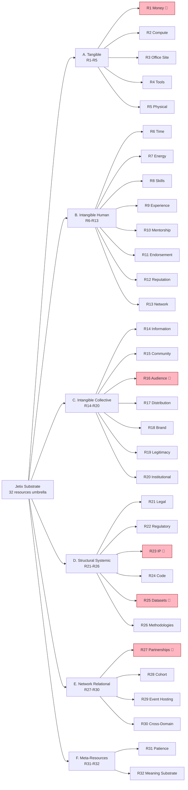

# Diagram 2 — 32 Resources × 6 Super-Classes × R12 Flag

## Legend

- 🚨 **R12-flagged-high-risk** (R1 / R16 / R23 / R25 / R27): require explicit R12 audit before acquisition
- All 32 resources MUST pass R12 alignment check: voluntary contribution + fork-and-leave preserved + transparent attribution + no extraction beyond agreed share + reciprocal value visible

## Q3 2026 Top-10 priority (Phase 2 §7 leverage)

| Rank | Resource | Provider categories |
|------|----------|----------------------|
| 1 | R6 Time | ALL |
| 2 | R8 Skills | Cat 1-22 |
| 3 | R12 Reputation | Cat 1-3, 7, 16-19 |
| 4 | R26 Methodologies | Cat 2, 7, 18 |
| 5 | R15 Community | Cat 14, 20 |
| 6 | R1 Money | Cat 8, 16, 17, 19 |
| 7 | R13 Network | Cat 14, 8, 12 |
| 8 | R10 Mentorship | Cat 7, 1-3, 22 |
| 9 | R19 Legitimacy | Cat 18, 20, 21 |
| 10 | R31 Patience | Cat 8 (patient), 19 |

**Cross-link:** Phase 2 §1-§6 detailed breakdown; Phase 1 categories providers; Phase 7 monetization × resource flow.

---

*Mermaid Diagram 2 of 7. Phase 2 visualisation. R12 flag highlighting + Top-10 priority.*
