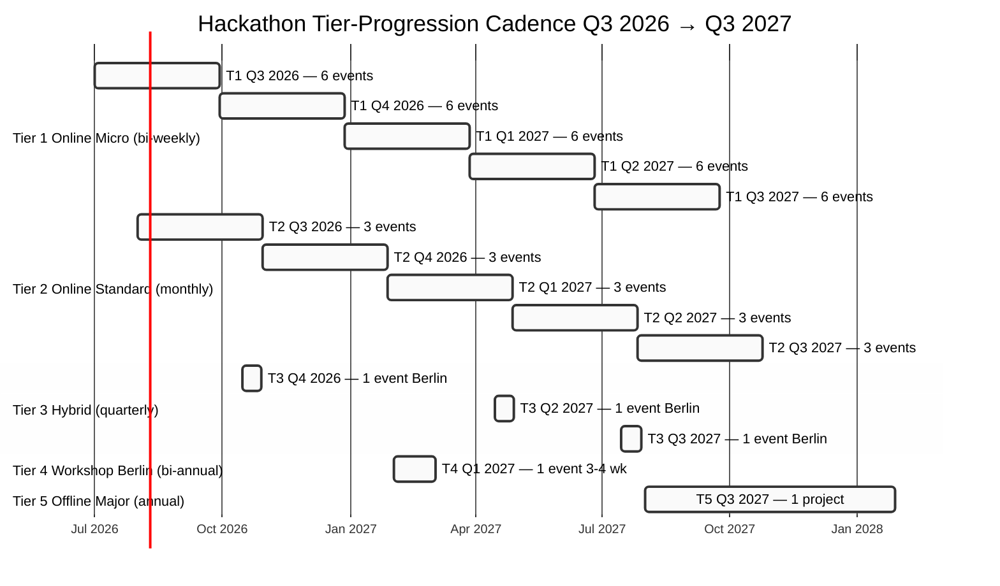
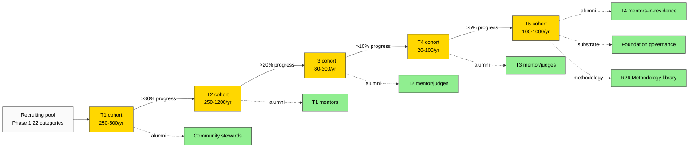

# Diagram 3 — Hackathon Tier 1-5 Progression Gantt (Q3 2026 → Q3 2027)

## Compound annual throughput

| Tier | Events / year | Participants / year |
|------|---------------|----------------------|
| T1 | 25-30 | 250-500 |
| T2 | 12-15 | 250-1200 |
| T3 | 3-4 | 80-300 |
| T4 | 1-2 | 20-100 |
| T5 | 1 | 100-1000+ |

**Cumulative: ~1000+ unique humans engaged annually.**

## Cohort flow (compound effect)

## Per-Tier P&L baseline (Phase 3 §8)

| Tier | Sponsor revenue / event | Cost / event | Annual margin |
|------|--------------------------|---------------|---------------|
| T1 | €1K-5K | €0.5K-2K | €15K-90K |
| T2 | €10K-50K | €5K-20K | €60K-360K |
| T3 | €50K-250K | €30K-150K | €80K-400K |
| T4 | €250K-1M | €150K-700K | €200K-600K |
| T5 | €1M-10M | €500K-5M (mlti-yr) | strategic |

**Q3 2026 → Q3 2027 net positive substrate** if Tier T2-T4 sponsorship hits mid-range (~€1-3M revenue / ~€0.5-2M cost / margin €0.5-1M).

**Cross-link:** Phase 3 §0-§11 detailed; Phase 7 V1 sponsorship variant.

---

*Mermaid Diagram 3 of 7. Phase 3 visualisation. Gantt cadence Q3 2026 → Q3 2027 + cohort flow compound + per-Tier P&L.*
