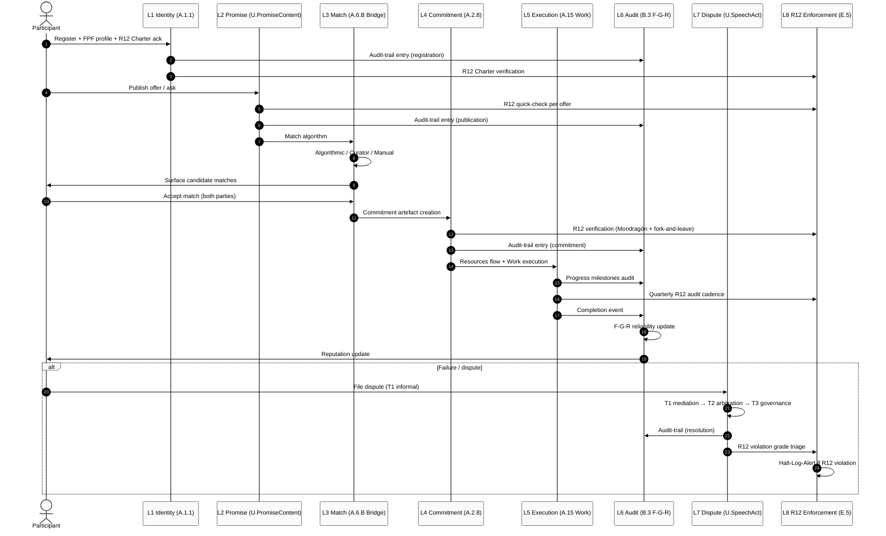
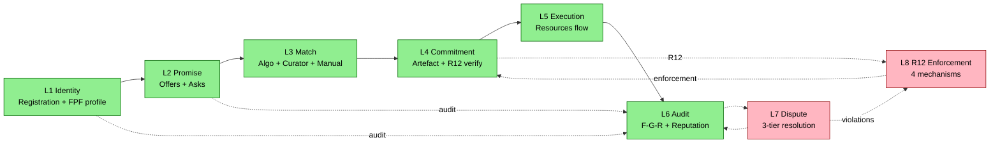
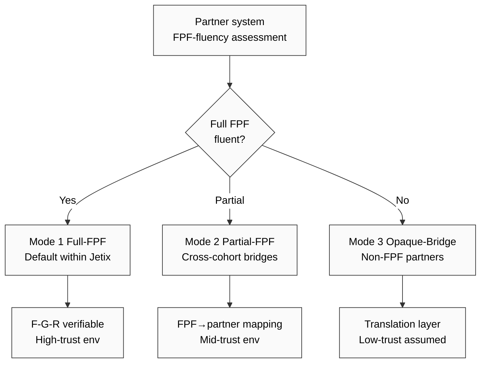

# Diagram 4 — FPF Interaction Protocol Flow

## Layer flow (linear simplified)

## Mode negotiation (System Merger Protocol cross-ref)

**R12 enforcement constant across all modes:**
- Mondragón wage-ratio cap
- Quadratic Funding revenue distribution
- Fork-and-leave exit tokens
- Default-Deny constitutional_never_list (4 RUSLAN-LAYER entries)

**Cross-link:** Phase 4 §1-§13 detailed; Phase 5 IP-1 28-entry boundary mapping (per layer substrate-auto vs human-decision).

---

*Mermaid Diagram 4 of 7. Phase 4 visualisation. 8-layer protocol sequence + linear flow + mode negotiation.*
