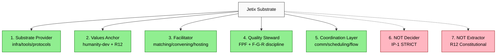
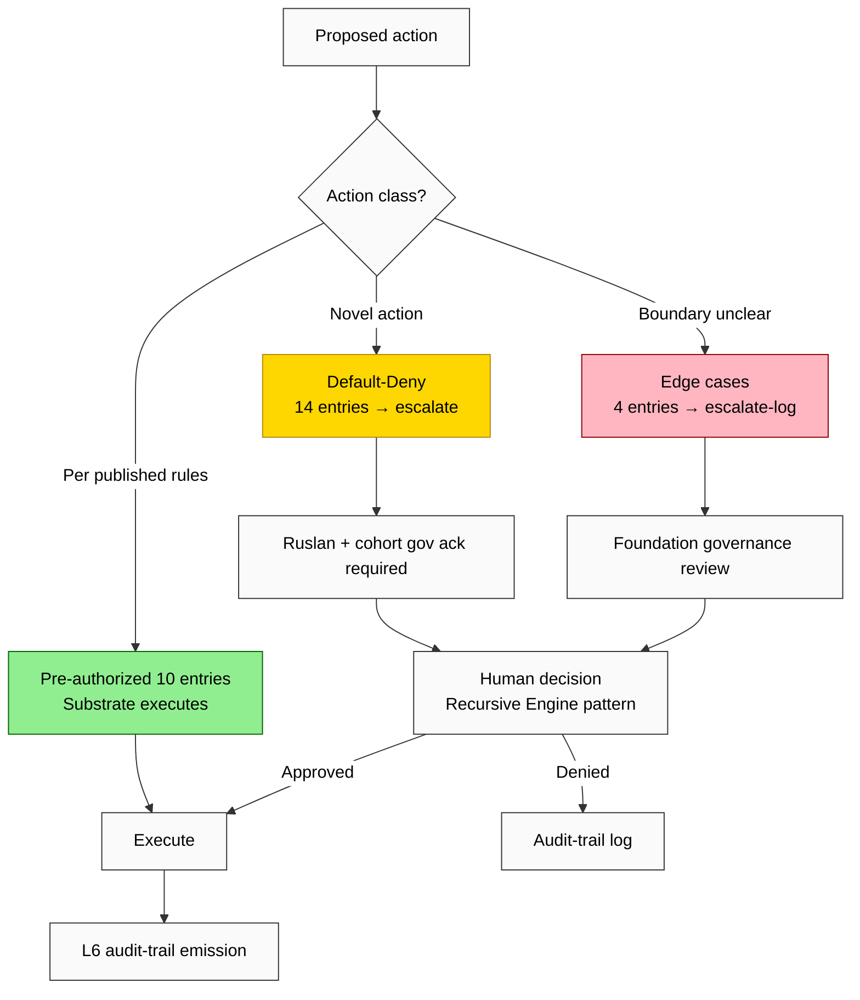

# Diagram 5 — Jetix Organisational Role (Substrate + IP-1 STRICT)

## 7-role substrate spec

## IP-1 28-Entry Boundary — decision-tree

## Pre-authorized examples (10 entries — substrate decisions OK)

1. Provision compute / hosting per published quota
2. Register new participant per L1 protocol
3. Publish offer / ask per L2 protocol
4. Execute matching algorithm per L3 protocol
5. Emit audit-trail entry per L6 protocol
6. Trigger Halt-Log-Alert per Pillar C Tier 2 R11
7. Send communication per published templates
8. Schedule Tier-1/2 hackathon per cohort governance pre-approval
9. Issue commitment-completion-receipt per L4
10. Update reputation per L6 audit per published rules

## Default-Deny examples (14 entries — Ruslan + cohort gov ack)

11. Add new participant category to taxonomy
12. Add new resource type to taxonomy
13. Modify Tier-progression criteria
14. Accept new corporate sponsor (Cat 16)
15. Accept government partnership (Cat 17)
16. Select Tier-1 hackathon theme
17. Select Tier-4/5 cohort participants
18. Allocate prize-pool per hackathon
19. Modify matching algorithm logic
20. Add new R12 enforcement mechanism
21. Adjust Mondragón ratio cap
22. Spend Foundation endowment
23. Engage M&A target (System Merger Protocol)
24. Issue SBT (Phase 7 variant)

## Edge cases (4 entries — escalate-and-log)

25. Resource-allocation conflict between cohorts
26. Mode negotiation (full-FPF / partial / opaque)
27. Saturation control (outreach quality cap)
28. Goal-divergence handling (partner values diverge)

## Decision rights compact matrix

| Decision class | Substrate | Cohort gov | Foundation gov | Ruslan |
|----------------|-----------|------------|-----------------|--------|
| Infrastructure | ✓ | — | — | (override) |
| Matching | ✓ | (acceptance) | (algo changes) | (override) |
| Audit trail | ✓ | (interpretation) | — | — |
| R12 enforcement | ✓ | (audit) | (parameter tuning) | (severe) |
| Strategic direction | — | (input) | (input) | ✓ |
| Values articulation | — | (input) | (input) | ✓ |
| Monetization mix | — | (input) | (input) | ✓ |
| Partner selection | (R12 check) | (input) | (Tier 4-5) | ✓ |

**Cross-link:** Phase 5 §0-§14 detailed; Phase 4 protocol layer IP-1 mapping; Phase 6 values + framing handled by Ruslan strategic prose.

---

*Mermaid Diagram 5 of 7. Phase 5 visualisation. 7-role substrate + IP-1 decision tree + 28-entry boundary + decision-rights matrix.*
